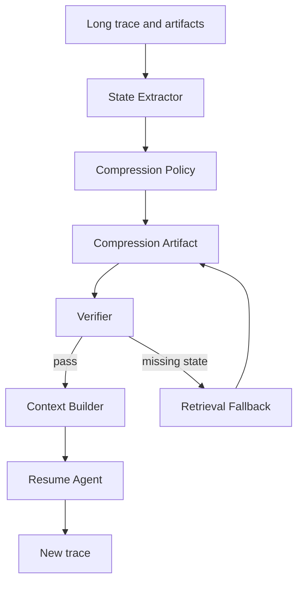

# 上下文压缩与保真

## 一句话定义

上下文压缩是在 context window 不够时，把长任务历史投影成可继续执行的 compression artifact。它要保留目标、约束、状态、证据引用和未完成动作，并用 loss budget、verifier 和 retrieval fallback 控制信息损失。

## 面试定位

这不是“把聊天摘要一下”。面试官真正想看的是你能否判断哪些信息可以有损压缩，哪些必须无损引用，以及压缩后如何证明 Agent 还能继续完成任务。

回答要自然覆盖架构、数据流、指标、取舍和追问。尤其要区分自然语言摘要、state projection、artifact reference 和 trace replay。

## 为什么需要它

长任务会不断积累用户约束、工具 observation、代码 diff、检索证据和失败经验。全部塞进 context window 会带来成本、延迟和噪声，直接截断又会丢关键状态。

上下文压缩的目标不是更短，而是“足够短且可恢复”。一个好的压缩结果要能让下一个模型实例知道任务目标、已完成什么、不能做什么、证据在哪里、下一步是什么。

## 核心架构

| 对象 | 保真要求 | 压缩方式 | 风险 |
| :--- | :--- | :--- | :--- |
| 用户目标 | 高 | 原文摘录加状态字段 | 目标漂移 |
| 约束和禁区 | 很高 | 无损保留或强结构化 | 违反用户要求 |
| 工具输出 | 中到高 | 摘要加 artifact refs | 误读结果 |
| RAG 证据 | 高 | citation id 和 evidence span | unsupported claim |
| 推理草稿 | 低 | 可丢弃或概括 | 噪声残留 |

## 架构与运行机制

压缩流程要从 trace 中抽取状态，而不是只对聊天做摘要。State Extractor 读取目标、任务列表、关键决策、外部证据、工具结果、风险和下一步动作。Compression Policy 决定哪些字段无损保留，哪些字段允许概括。

compression artifact 最好是结构化对象，例如 goal、constraints、completed_steps、open_questions、state_projection、evidence_refs、artifact_refs、risk_notes 和 next_actions。这样 Context Builder 可以稳定恢复任务，而不是靠模型猜摘要含义。

## 运行机制

1. 当 token 使用率、步骤数或 trace 长度超过阈值时触发压缩。
2. 从 trace 和 artifacts 抽取任务状态，不把模型草稿当作事实源。
3. 根据 loss budget 判定哪些字段必须无损，哪些字段可以摘要。
4. Verifier 检查压缩结果是否覆盖目标、约束、证据、未完成事项和风险。
5. 缺失内容通过 retrieval fallback 从原始 trace 或 artifact store 取回。
6. Resume Agent 只接收压缩产物和必要引用，继续执行并写入新 trace。

## 关键设计取舍

| 取舍点 | 更保守方案 | 更激进方案 | 建议 |
| --- | --- | --- | --- |
| 保留粒度 | 证据和约束无损 | 大段自然语言摘要 | 高风险任务保守 |
| 触发时机 | 接近窗口上限再压 | 定期滚动压缩 | 长任务用滚动策略 |
| 验证方式 | schema + verifier | 模型自评 | 生产要有外部检查 |
| 恢复策略 | artifact refs | 只依赖摘要 | 必须保留 retrieval fallback |

## 生产落地细节

- compression artifact 要有 version、source trace range、createdAt 和 verifier verdict。
- loss budget 应按字段设置，用户约束和安全策略不能有损。
- evidence refs 必须能回到原文、页码、URL、tool output 或 diff。
- 压缩前后要跑 resume eval，检查任务是否能继续、约束是否保留。
- 指标包括 compression_ratio、constraint_retention_rate、resume_success_rate、lost_state_rate 和 retrieval_fallback_rate。

## 系统设计案例

设计一个长时间 coding agent 时，压缩不能只说“已经修改了代码”。它要保留目标、已编辑文件、测试命令、失败日志、当前 diff、未解决报错和用户限制。

数据流是：执行若干步后生成 state projection，artifact store 保留 diff 和日志，verifier 检查是否缺少测试状态。下次恢复时，Context Builder 注入压缩产物和 artifact refs，模型需要查看细节时再从原始文件或 trace 取回。

## 真实问题与排障

如果恢复后 Agent 忘记用户限制，先看 compression artifact 是否保留该约束，再看 Context Builder 是否按优先级注入。如果模型引用了不存在的证据，检查 evidence_refs 是否丢失或指向旧版本。

排障时不要只调摘要 prompt。更可靠的修复是补 schema 字段、增强 verifier、降低 loss budget，或让 retrieval fallback 自动拉回关键 artifact。

## 常见误区与排障

- 把压缩等同于聊天摘要。
- 压缩后没有验证，直接继续执行。
- 丢掉工具输出和证据引用，只保留结论。
- 没有版本和 trace range，无法定位丢失发生在哪一段。
- 只优化 token 节省，不看 resume_success_rate。

## 面试追问

- 哪些内容必须无损保留？
- 如何证明压缩后没有丢关键状态？
- 压缩产物和长期记忆有什么区别？
- 如果 verifier 发现缺失，系统怎么恢复？
- context window 扩大后还需要压缩吗？

## 项目化表达

项目里可以说：“我把上下文压缩做成 state projection，而不是普通摘要。每次压缩都会生成 compression artifact，保留 evidence refs 和 artifact refs，并通过 verifier 检查约束、状态和下一步动作是否完整。”

## 深入技术细节

压缩产物要把“事实源”和“工作视图”分开。Trace、tool output、diff、截图、PDF span 是事实源；compression artifact 是从事实源投影出来的工作视图。artifact 中可以摘要日志，但必须保留 `artifact_ref`、hash、时间和关键 verdict，否则恢复后无法确认摘要是否可信。

Loss budget 应按字段配置。用户硬约束、安全策略、当前状态和未完成动作应接近无损；模型草稿、重复讨论和已否定方案可以高损压缩或丢弃。对代码任务，`changed_files`、`test_command`、`exit_code`、`rollback_ref` 属于高保真字段；对 RAG，`evidence_id` 和 citation span 属于高保真字段。

## 关键数据结构与协议

| 字段 | 保真等级 | 原因 |
| :--- | :--- | :--- |
| `hard_constraints` | 无损 | 丢失会违反用户要求 |
| `state_projection` | 高 | 决定恢复行为 |
| `evidence_refs` | 高 | 支持事实复查 |
| `artifact_refs` | 高 | 支持日志/diff 回看 |
| `risk_notes` | 高 | 控制安全边界 |
| `discarded_context` | 可摘要 | 降低噪声 |

协议上 compression artifact 应包含 version、source trace range、created_at、verifier verdict 和 fallback query。Verifier 发现缺约束或证据时，不应该发布摘要，而应从原 trace 拉回缺失内容。

## 深问准备

被问“context window 变大还要不要压缩”时，可以回答需要。窗口变大降低频率，但不解决噪声、冲突、优先级和恢复问题。压缩同时是状态治理，不只是省 token。

被问“如何发现压缩丢失”，用 resume eval：给定长任务和压缩产物，检查 Agent 是否保留硬约束、能找到证据、不会重复旧步骤、能继续完成任务。指标看 `constraint_retention_rate` 和 `post_resume_regression_rate`。

## 来源与延伸阅读

- [Anthropic: Context engineering for agents](https://www.anthropic.com/engineering/context-engineering-for-agents)
- [Anthropic: Building effective agents](https://www.anthropic.com/engineering/building-effective-agents)
- [OpenAI Agents SDK Tracing](https://openai.github.io/openai-agents-python/tracing/)
- [Model Context Protocol 文档](https://modelcontextprotocol.io/docs)
