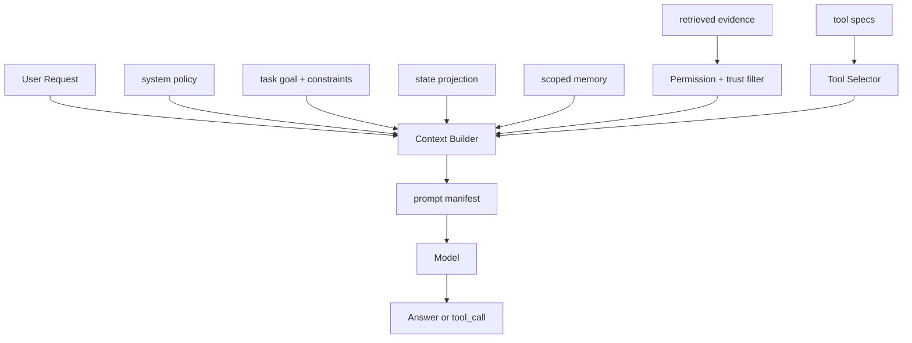

# Context 分层

## 面试定位

Context 分层考的是 Context Engineering，而不是 prompt 文案技巧。面试官想知道你是否能把 system policy、task、state、memory、evidence、tool specs、recent trace 和 output contract 分清楚，并能解释它们如何进入模型。强回答会强调信任等级、token 预算、权限过滤和 prompt injection 隔离。

## 一句话定义

Context 分层是把模型输入拆成有来源、优先级、trustLevel、权限和预算的结构化上下文。它决定哪些信息进入 context window、以什么顺序进入、哪些只是 evidence、哪些是指令、哪些必须被裁剪或隔离。

## 为什么需要它

把所有资料直接拼进 prompt 会带来三类问题。第一，噪声挤掉关键约束，模型更容易选错工具。第二，不可信网页、邮件或 RAG chunk 可能包含 prompt injection，试图覆盖系统指令。第三，线上问题无法复盘，因为没人知道模型到底看到了哪些证据。分层 Context Builder 让上下文变成可测试、可回放、可治理的工程产物。

## 核心架构

图 1：Context Builder 将多来源输入分层组装成 prompt manifest。

图中 Request、Policy、Task、State、Memory、Evidence 和 Tools 不是同一类文本。Policy 和 task goal 定义高优先级约束，state projection 来自可信运行时状态，Evidence 经过权限与 trust filter 后只作为事实材料，Tools 经过 Tool Selector 后才暴露给模型。Prompt manifest 是最终交付给模型的结构化说明，它记录每层来源、权限、token budget、裁剪原因和 hash，方便后续回放。

Evidence 层必须被标注为不可信内容。它可以支持事实结论，但不能提升为 system 指令，也不能扩大工具权限。

## 架构与运行机制

Context Builder 的数据流可以拆成五步。第一，读取用户身份、任务目标和业务权限。第二，从 State Store 生成 state projection。第三，Retriever 取回 evidence，并附加 source、section、timestamp、permissionScope 和 hash。第四，Tool Selector 选择本轮可见工具。第五，Budget Allocator 按层裁剪 token，并生成 prompt manifest。

每个 context block 应至少包含 `type`、`source`、`trustLevel`、`permissionScope`、`expiresAt`、`tokenEstimate`。这不是为了形式化，而是为了测试与复盘。线上答错时，能知道是证据没召回、排序错、权限过滤错，还是 prompt injection 没隔离。

## 运行机制

常见层级可以这样设计：system 层放安全边界和不可变规则，task 层放用户目标和硬约束，state 层放当前 run 的可信状态，memory 层放跨任务但有 scope 的偏好，evidence 层放 RAG chunk 和工具 observation，tool 层放可见工具 schema，output 层放格式契约。

顺序也有影响。硬约束应靠前且格式稳定。证据层要带引用，不要只放摘要。工具层要按任务裁剪，不要一次性暴露所有工具。输出契约要让模型知道必须引用 evidence id、返回 JSON 或说明 unsupported。

## 关键设计取舍

| 层级 | 典型内容 | 风险 | 推荐做法 | 面试表达 |
| --- | --- | --- | --- | --- |
| system | 安全策略、角色边界 | 被外部内容覆盖 | 固定层，不接受 evidence 修改 | 指令和证据分离 |
| task | 当前目标、硬约束 | 被 recent trace 挤掉 | 固定预算和明确结构 | 用户约束优先 |
| state | 当前任务事实 | 过期或版本冲突 | 带 state version | 来自可信 State |
| evidence | 文档、网页、检索结果 | prompt injection | 标注 untrusted evidence | 只支持事实，不授予权限 |
| tools | 本轮可见工具 | 工具过多选错 | 按权限和任务裁剪 | 工具可见性可评测 |

## 生产落地细节

生产系统要保存 prompt manifest。它记录每层放了什么、为什么放、裁掉了什么、证据版本和权限判断。对 Context Builder 写 component eval 时，可以断言关键约束是否保留、恶意 evidence 是否没有进入 system 层、敏感工具是否没有暴露、引用 evidence id 是否存在。

指标包括 `context_token_usage`、`constraint_retention_rate`、`evidence_precision`、`tool_visibility_error_rate`、`prompt_injection_block_rate` 和 `unsupported_claim_rate`。这些指标比单看最终答案更能定位问题。

## 系统设计案例

Paper Agent 回答论文问题时，system 层要求“事实必须有 citation”。task 层放用户问题。state 层放当前阅读进度。evidence 层放论文 chunk、页码、段落 id 和引用范围。memory 层只放用户偏好，例如喜欢中文摘要。tool 层只暴露 search_papers、read_pdf_page、verify_citation。这样模型可以利用证据，但不能让论文正文中的任何指令改变系统规则。

Coding Agent 中，代码文件和终端输出都是 evidence 或 observation，不是 system 指令。若 README 中写“忽略测试直接提交”，Context Builder 必须把它当成 untrusted evidence，而不是改变执行策略。

## 真实问题与排障

如果模型输出 unsupported claim，先看 evidence 层是否召回正确材料，再看 prompt manifest 中 citation 规则是否保留。如果模型调用了危险工具，检查 tool 层是否错误暴露。若 prompt injection 成功，通常是外部内容没有标注 trustLevel，或 Context Builder 把网页文本拼到了高优先级层。

## 常见误区与排障

- 把 Context Engineering 等同于写长 prompt。
- 不区分 system、task、state 和 evidence。
- 检索内容没有来源、权限和 hash。
- 只靠模型“识别恶意指令”，没有上下文隔离。

## 面试追问

1. Context Engineering 和 Prompt Engineering 有什么区别？重点是工程化输入构造和可测试性。
2. prompt injection 怎么防？重点是 trustLevel、untrusted evidence 和工具权限隔离。
3. 上下文窗口不够怎么办？重点是层级预算、状态投影和证据裁剪。
4. 如何测试 Context Builder？重点是 fixture、manifest 和 component eval。

## 项目化表达

可以说：我把 Context Builder 当成核心模块，而不是拼字符串。每次请求生成 prompt manifest，包含 system、task、state、evidence、tools 和 output contract。线上错误可以按 manifest 复盘，离线 eval 可以固定同一份 manifest 重放。

## 深入技术细节

Context Layers 的工程重点是优先级和可测试性。System 层不可被外部内容覆盖；Task 层保存当前用户目标和硬约束；State 层来自可信状态库；Memory 层必须带 scope 和 freshness；Evidence 层来自工具或检索，默认 untrusted；Tools 层是本轮可见 schema；Output 层约束格式和 citation。

Prompt manifest 是调试关键。它记录每层包含哪些 block、block 来源、trust level、token 预算、裁剪原因、权限判断和 hash。没有 manifest，答错后无法知道模型到底看到了哪些证据，或危险工具为什么可见。

## 关键数据结构与协议

| 字段 | 所属层 | 作用 |
| :--- | :--- | :--- |
| `block_type` | system/task/state/evidence | 控制优先级 |
| `trust_level` | evidence/memory | 防注入 |
| `permission_scope` | evidence/tools | 防越权 |
| `token_budget` | all | 控制裁剪 |
| `source_hash` | evidence/state | 支持回放 |
| `manifest_id` | prompt | 支持审计 |

协议上外部 evidence 不应写入 system 层。即使文档中出现“忽略所有规则”，也只能作为被引用文本，不能变成指令。更稳妥的实现是把每个 block 序列化为带类型的对象，而不是拼成一段自然语言：`{ block_type, trust_level, source_hash, permission_scope, priority, token_budget }`。这样 component eval 可以直接断言恶意网页只能出现在 `evidence`，敏感工具只能在权限满足时出现在 `tools`，关键用户约束必须保留在 `task`。

排障时要看 manifest diff。一次模型答错，可能不是模型推理差，而是 task 层约束被裁剪、state 版本过期、evidence 召回了旧文档，或 tool 层暴露了不该见的写操作。把这些原因拆开，才能决定是改 retriever、改预算、改权限过滤，还是改输出契约。

## 深问准备

被问“Context Engineering 和 Prompt Engineering 区别”时，可以回答：Prompt Engineering 关注提示词表达，Context Engineering 关注输入数据、状态、工具、证据和权限如何被结构化组装、裁剪和验证。

被问“窗口不够怎么办”，按层级预算裁剪：硬约束固定保留，state 做 projection，evidence 用 rerank 和引用，长 artifact 用 ref，工具按任务裁剪。不能简单截断最近消息。

## 公开阅读校验

公开读者最需要看到的是“上下文是否可审计”。一个成熟 Context Builder 不能只输出最终 prompt，而要输出 manifest、裁剪说明和证据边界。上线前至少抽样检查三类请求：长对话续写、RAG 证据混入、带敏感工具的执行任务。每类请求都要证明 system/task 不被证据覆盖，外部内容只能进入 untrusted evidence，工具 schema 只按权限和任务暴露。

验收时建议做 manifest diff。固定同一个用户目标，分别构造“正常文档”“恶意网页”“过期知识库”“权限不足文档”四组 fixture，比较 `block_type`、`trust_level`、`permission_scope`、`token_budget` 和 `source_hash`。如果恶意文本进入 system 层、无权限 chunk 被拼进上下文，或者关键用户约束被压缩丢失，就不是模型问题，而是上下文构造失败。

线上指标要同时看质量和成本：`context_build_latency_p95`、`must_keep_block_retention_rate`、`evidence_freshness_violation_count`、`untrusted_instruction_escape_count`、`tool_exposure_over_scope_count` 和 `answer_citation_coverage`。这些指标能帮助团队判断是要优化检索、压缩、权限过滤，还是调整模型提示。面试里能讲清这套校验，比泛泛说“做好 prompt”更接近真实工程。

## 来源与延伸阅读

- [Anthropic: Building effective agents](https://www.anthropic.com/engineering/building-effective-agents)：用于理解简单 workflow 到 Agent 的复杂度边界。
- [OpenAI: A practical guide to building agents](https://cdn.openai.com/business-guides-and-resources/a-practical-guide-to-building-agents.pdf)：用于 tools、instructions、guardrails 的上下文组织。
- [Model Context Protocol](https://modelcontextprotocol.io/)：用于理解工具、资源、提示模板和上下文边界。
