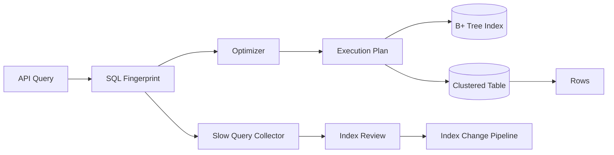

# 数据库索引、执行计划与慢查询治理

## 面试定位

数据库索引题不是考你会不会背 B+ 树，而是看你能否从业务查询、数据分布、索引结构、执行计划、慢查询指标和上线回滚完整分析。一个工程师式回答应该先问 SQL 的访问模式：等值条件是什么，范围条件是什么，是否排序，是否分页，返回哪些字段，QPS 和数据量多大，数据是否倾斜。

反例是看到字段就建索引，或者只说“遵守最左前缀”。最左前缀只是联合索引使用规则的一部分，真正的索引设计要服务业务查询和执行计划。MySQL InnoDB 官方文档用于确认 B+ 树索引和聚簇索引语义，但生产答案还要补上 explain 证据、指标和回滚。

## 一句话定义

索引是数据库为了降低查询访问成本维护的数据结构。执行计划是优化器为 SQL 选择的访问路径。慢查询治理是围绕 SQL、索引、数据分布、锁等待、连接池和业务分页方式持续降低延迟与资源消耗。

## 架构与运行机制

图 1 展示了数据库查询治理的数据流：应用提交 SQL，优化器根据统计信息和索引选择执行计划，执行过程访问索引和表，慢查询样本再进入评审和索引变更流程。图中 Review 和 Change Pipeline 是工程化关键点，因为索引不是本地随手加一个字段，而是会影响写入、锁、复制延迟和回滚。

这张图用于说明官方数据库文档只定义索引结构和隔离语义，工程系统还要保存 SQL fingerprint、plan hash、rows examined、release id 和指标变化。

## 架构与运行机制细化

InnoDB 聚簇索引把主键索引和数据行组织在一起，二级索引叶子节点通常保存主键值。通过二级索引查询非索引列时，需要先在二级索引找到主键，再回表到聚簇索引取完整行。覆盖索引的价值就在于查询需要的列都在二级索引里，可以减少回表。

联合索引的字段顺序要服务查询谓词。等值条件通常可以放在前面，范围条件会影响后续字段继续利用索引有序性，排序字段是否能利用索引要看前面的条件是否固定。低选择性字段不是天然不能建索引，但如果它不能显著减少扫描行数，就要结合组合字段、覆盖索引、分区或读模型重新设计。

执行计划要看 `type`、`key`、`rows`、`filtered`、`Extra`，但不能迷信单次 explain。`rows` 是估算，统计信息陈旧、数据倾斜、参数不典型都会误导优化器。生产要结合慢查询日志、真实参数、只读副本上的 explain analyze 或压测结果判断。

执行计划治理还要区分“计划看起来合理”和“线上成本真的下降”。前者来自 EXPLAIN 的访问类型、命中索引和估算行数，后者来自真实的 `rows_examined`、buffer pool 命中、临时表、排序、锁等待、CPU 和磁盘 IO。公开文章里如果只写“建联合索引”会显得像口诀；更专业的表达是把索引设计、计划证据、上线指标和回滚动作放在同一个闭环里。

## 常见设计对比

| 设计点 | 推荐思路 | 收益 | 风险 |
| --- | --- | --- | --- |
| 单列索引 | 适合独立高选择性条件 | 简单、维护成本低 | 多条件组合时可能扫描多 |
| 联合索引 | 按查询条件、排序和选择性设计 | 降低扫描和排序成本 | 字段顺序错误会失效 |
| 覆盖索引 | 返回列全在索引里 | 减少回表 | 索引变宽，写入成本上升 |
| 深分页 | keyset pagination | 避免大 offset 扫描 | 需要业务支持游标 |
| 函数查询 | 避免函数包列或用生成列 | 保持索引可用 | 改造 SQL 和 schema |
| 读模型 | Redis/ES 承接高频读 | 降低 DB 压力 | 引入一致性和同步链路 |

这张表的取舍是面试重点：加索引是局部优化，不是所有慢查询的最终答案。

## 深入技术细节

联合索引设计可以按四步走。第一步收集高频 SQL 和样本参数，区分在线接口、后台运营、批量任务和报表。第二步分析条件类型：等值、范围、排序、分组、返回列。第三步结合数据分布和选择性选择字段顺序。第四步用真实数据执行 explain，比较 rows examined、filesort、temporary table、回表次数和延迟。

慢查询不一定来自索引缺失。它可能来自深分页、返回列过多、隐式类型转换、函数包列、like 前缀通配、统计信息陈旧、锁等待、连接池耗尽、buffer pool 命中下降，或者业务突然查了一个极端大租户。一个严谨的排查链路要把 SQL 执行、事务锁、连接池、CPU、磁盘和业务参数串起来。

索引上线也要有灰度和回滚。大表加索引可能带来元数据锁、复制延迟、磁盘膨胀和写入 p95 上升。上线前要确认变更窗口、DDL 策略、回滚方式、只读副本验证和观察指标。回滚不一定是删除索引，也可能是回滚 SQL、关掉新筛选项、切到读模型或临时限制查询范围。

多租户系统还要单独看数据倾斜。一个联合索引在平均租户上很快，不代表在头部租户上也快；后台导出、运营筛选和分页接口尤其容易被大租户拖垮。排查时要把样本参数分层：普通租户、头部租户、极端时间范围、空结果和超大结果集都要 explain 或压测，否则上线后的 plan regression 很难提前发现。

## 关键数据结构与协议

| 字段 | 所属对象 | 作用 | 排障价值 |
| --- | --- | --- | --- |
| `sql_fingerprint` | 慢查询样本 | 聚合同类 SQL | 避免参数噪声 |
| `sample_params` | SQL Review | 代表性参数 | 复现生产计划 |
| `plan_hash` | 执行计划 | 识别计划变化 | 发现 plan regression |
| `rows_examined` | 执行指标 | 实际扫描行数 | 判断索引是否有效 |
| `index_name` | 执行计划 | 命中索引 | 校验优化器选择 |
| `extra_flags` | Explain Extra | filesort/temporary/using index | 定位额外成本 |
| `release_id` | 发布记录 | 关联版本 | 支持回滚复盘 |
| `lock_wait_ms` | 事务指标 | 是否被锁拖慢 | 区分 SQL 慢和锁慢 |

这些字段组成了索引治理协议。没有这些字段，慢查询复盘很容易变成“感觉这个索引有用”。

## 系统设计案例

设计一个订单后台查询系统，需求是按商家、订单状态、创建时间倒序分页，支持运营筛选和导出。架构上，在线查询走 MySQL 主库或只读副本，热点查询结果可进入 Redis，复杂搜索可同步到 ES。数据流是：API 生成 SQL fingerprint，数据库执行查询，慢查询进入 Collector，Review 生成索引建议，Index Pipeline 灰度变更，Dashboard 对比上线前后 p95、rows examined 和写入延迟。

关键取舍是：联合索引 `(merchant_id, status, created_at, id)` 能服务商家维度的状态筛选和时间排序，但会增加订单写入维护成本；覆盖索引能减少回表，但如果返回字段太多会让索引变宽；深分页改 keyset 能显著降低扫描，但前端需要保存游标。面试追问通常会问字段顺序、范围条件、回表和深分页，这些都要回到执行计划证据。

## 真实问题与排障

线上慢查询事故先看影响面：哪些接口、哪些 SQL fingerprint、哪些租户、是否只有大商家、是否刚发布筛选条件、DB CPU 和锁等待是否升高。止血可以限制时间范围、关闭导出、切只读副本、临时加缓存、降级非核心排序或回滚新筛选项。隔离要避免导出任务和在线查询共用同一连接池。

根因定位按链路走：SQL 是否命中预期索引；rows examined 是否异常；是否 filesort 或 temporary；是否有隐式转换；是否深分页；是否锁等待；是否统计信息过期；是否索引变更导致写入延迟上升。回归要保存事故 SQL、参数、执行计划、数据量和压测脚本，确保类似查询不会再次绕过索引。

## 项目化表达

项目里可以说：我为订单后台建立了 SQL Review 流程，核心 SQL 必须保存 explain plan、样本参数和预期 QPS。上线后监控 `query_latency_p95`、`rows_examined`、`slow_query_count`、`lock_wait_time` 和 `plan_hash`。一次慢查询事故中，我们发现新增筛选条件导致联合索引后半段失效，先限制导出范围止血，再调整索引和分页方式，最后用回归压测验证 rows examined 从百万级降到千级。

这个表达能迁移到 AI 系统：Agent run、trace、RAG 文档状态、embedding job 都有大量状态查询，如果没有索引和执行计划治理，任务列表和检索元数据会成为瓶颈。

项目证据还可以更具体：把一次索引变更写成 before/after。上线前接口 p95、rows examined、DB CPU、锁等待和慢查询条数是什么；上线后这些指标如何变化；期间有没有写入 p95 上升、复制延迟或 plan regression。这样回答会从“我知道索引”变成“我能运营索引变更”。如果面试官继续追问“为什么不用 ES”，可以回答 ES 适合搜索读模型，但订单事实源、事务更新和后台对账仍需要数据库索引治理。

## 边界条件与反例

反例一：每个 where 字段都建单列索引。优化器未必能有效合并，写入成本和存储成本会持续上升。

反例二：所有慢查询都加缓存。缓存能止血，但如果 SQL 本身用于后台导出、对账或事实源校验，根因仍然要回到索引和分页。

反例三：用测试库小数据 explain 证明生产没问题。数据分布和统计信息不同，计划可能完全不同。

反例四：为了覆盖索引把大字段放进索引。宽索引会降低 buffer pool 命中，拖慢写入和 DDL。

## 深问准备

1. 联合索引字段顺序怎么定？答查询模式、等值、范围、排序、选择性和覆盖。
2. EXPLAIN 的 rows 准不准？答是估算，要结合统计信息、真实参数和执行指标。
3. 为什么深分页慢？答 offset 会扫描并丢弃大量行，keyset 更可控。
4. 什么时候用 ES/Redis？答读模型和搜索场景可以迁移，但要承担一致性。
5. 索引上线怎么回滚？答变更窗口、灰度、指标对比、删除索引或回滚 SQL。

补充一个常见追问：如果新增索引后查询仍然慢怎么办？回答要回到证据链，检查统计信息、参数分布、是否走错索引、是否锁等待、是否连接池耗尽、是否返回列过多、是否需要拆查询或迁移读模型。这样能避免把所有慢查询都归因于“索引没建好”。

## 公开阅读校验

公开读者读这一篇，应该带走一个判断框架：索引不是“where 字段加一个索引”，而是业务访问路径、数据分布、执行计划和上线指标共同决定的工程变更。文章需要让读者知道怎样从 SQL fingerprint、样本参数、EXPLAIN、rows examined、filesort、temporary table、回表次数和锁等待一步步定位问题。

专业表达还要强调索引变更的副作用。新增索引会增加写入维护成本、磁盘占用、buffer pool 压力、DDL 风险和复制延迟；覆盖索引减少回表，但如果把大字段塞进去，可能让整体更慢。好的文章应该告诉读者什么时候加索引、什么时候改分页、什么时候拆查询、什么时候引入读模型，而不是把索引当成唯一答案。

验收样例可以是一条慢订单列表 SQL：上线前记录 p95、rows_examined、plan_hash 和 DB CPU；调整联合索引和 keyset pagination 后再记录同一批参数；若只在测试库 explain 通过，不足以说明生产可用。只有把 before/after 指标和回滚方案写清，才算公开可读的严谨内容。

## 来源与延伸阅读

- [MySQL InnoDB Index Types](https://docs.oracle.com/cd/E17952_01/mysql-8.0-en/innodb-index-types.html)：官方文档，用于确认聚簇索引、二级索引和 InnoDB 索引语义边界。
- [MySQL EXPLAIN Output Format](https://docs.oracle.com/cd/E17952_01/mysql-8.0-en/explain-output.html)：官方文档，用于说明执行计划字段、访问类型和优化器估算口径。
- [PostgreSQL Using EXPLAIN](https://www.postgresql.org/docs/current/using-explain.html)：官方文档，用于补充 EXPLAIN / ANALYZE 如何结合真实执行成本分析查询。
- [Redis Cache Aside](https://redis.io/docs/latest/develop/use-cases/cache-aside/)：官方文档，用于说明缓存作为读模型时不能替代数据库事实源。
