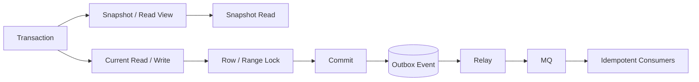

# MVCC、事务隔离与锁冲突治理

## 面试定位

MVCC 和事务隔离题最怕答成概念列表：ACID、四个隔离级别、脏读、不可重复读、幻读，然后结束。工程化回答要说明 MVCC 解决了什么并发问题，哪些读仍然会加锁，事务为什么要短，死锁如何定位，跨系统一致性为什么不能靠一个数据库事务解决。

PostgreSQL MVCC 官方文档用于确认多版本并发控制的语义边界，MySQL/InnoDB 文档用于确认索引和锁范围对事务的影响。面试中要把这些官方语义翻译成系统设计：订单、库存、Outbox、MQ、Redis 缓存失效和补偿如何组合。

## 一句话定义

MVCC 是通过多版本和快照读提升并发读写能力的机制。事务隔离级别定义并发事务之间能看到哪些变化。锁冲突治理是围绕当前读、写冲突、范围锁、死锁、超时、重试和补偿构建的生产稳定性能力。

反例是把 MVCC 理解成“数据库没有锁”。快照读可以减少读写阻塞，但 `select for update`、`update`、`delete`、唯一约束检查、外键检查和范围更新仍可能产生锁等待。

## 架构与运行机制

图 1 展示了本地事务和跨系统事件的边界：事务内部通过 MVCC 快照读和锁保护本地状态，提交后由 Outbox/Relay 把状态变化发布到 MQ。图中 Outbox 不是可选装饰，它用于避免“数据库提交成功但消息没发出去”或“消息发出但事务回滚”的不一致窗口。

这张图用于说明官方数据库事务文档只定义本地一致性，工程系统还需要 MQ、幂等消费者和补偿来完成跨系统最终一致性。

## 架构与运行机制细化

MVCC 的核心是让读事务看到一个一致快照，而不是被写事务直接阻塞。不同数据库实现细节不同，但工程上可以抓住两点：快照读读取某个时间点可见的版本；当前读要读取最新可修改版本，因此可能需要锁。读写冲突减少了，不代表写写冲突消失了。

隔离级别的选择是取舍。读已提交减少长快照带来的压力，但同一事务内多次读取可能看到不同提交版本；可重复读提供更稳定的事务视图，但长事务可能让旧版本保留更久；更高隔离能减少异常，但锁等待、死锁和吞吐成本会增加。业务要先定义正确性边界：展示列表、库存扣减、余额更新、权限变更的隔离需求不同。

索引会影响锁范围。当前读如果不能命中合适索引，数据库可能扫描更多行，进而锁住更多范围或产生更高锁等待。很多死锁表面上是事务问题，根因却是访问顺序不一致或索引缺失。

## 事务方案对比

| 方案 | 解决问题 | 适合场景 | 风险 |
| --- | --- | --- | --- |
| 快照读 | 稳定读取历史版本 | 查询、报表、展示 | 不能保护最新写入 |
| 当前读 | 读取并锁定最新行 | 库存扣减、状态流转 | 锁等待和死锁 |
| 乐观锁 | 用 version/CAS 控制冲突 | 低冲突更新 | 高冲突下重试多 |
| 悲观锁 | 提前锁住资源 | 强约束资源 | 吞吐低、等待高 |
| Outbox | 本地事务和消息发布一致 | 订单事件、状态同步 | 需要 relay 和清理 |
| 补偿任务 | 修复异步不一致 | 最终一致性系统 | 需要幂等和审计 |

这张表的取舍要讲清：隔离越强，不代表系统越好；事务越大，不代表一致性越高。

## 深入技术细节

事务设计第一原则是短事务。事务内不要调用远程 HTTP、MQ、模型 API、文件服务，也不要做大范围查询和用户交互等待。远程调用会拉长锁持有时间，失败后还会留下难以回滚的外部副作用。正确做法是事务内只写本地事实源和 outbox，提交后异步发布事件。

库存扣减常见两类做法。低冲突可以用条件更新：`update inventory set stock = stock - 1 where sku_id = ? and stock > 0`，再根据 affected rows 判断成功。高风险资源可以用悲观锁或分桶库存，但要控制锁范围和事务时长。无论哪种方式，重试必须幂等，否则死锁重试可能生成重复订单。

死锁定位要看等待图，而不是只说“数据库会自动回滚一个事务”。需要拿死锁日志，识别两个事务的 SQL、索引、锁对象、访问顺序、事务时长和重试结果。修复方向包括统一访问顺序、补索引缩小锁范围、减少批量大小、拆分事务、降低隔离级别或改成异步补偿。

## 关键数据结构与协议

| 字段 | 所属对象 | 作用 | 排障价值 |
| --- | --- | --- | --- |
| `transaction_id` | 事务日志 | 标识事务 | 串联 SQL 与锁等待 |
| `isolation_level` | 连接/事务 | 定义可见性 | 判断并发异常 |
| `lock_object` | 锁日志 | 被锁的表/行/索引范围 | 定位冲突资源 |
| `lock_wait_ms` | 指标 | 等待时间 | 区分慢 SQL 和锁慢 |
| `deadlock_count` | 指标 | 死锁次数 | 判断访问顺序问题 |
| `retry_count` | 应用 | 重试次数 | 防重试风暴 |
| `event_id` | Outbox | 事件幂等 | 支持重复发布 |
| `outbox_status` | Outbox | pending/sent/failed | 补偿和告警 |

这些字段构成了事务排障协议。没有 `lock_object` 和 `transaction_id`，死锁复盘只能停在猜测。

## 系统设计案例

设计订单创建和库存扣减系统，需求是不能超卖，同时订单创建后要异步发券、通知和同步 ES。架构上，Order Service 在本地事务中扣库存、创建订单、写 outbox；提交后 Relay 发布 OrderCreated 到 MQ；消费者按 `event_id` 幂等处理后置流程。数据流是 request -> idempotency check -> inventory update -> order insert -> outbox insert -> commit -> MQ publish -> consumers。

关键取舍是：把发券和 ES 同步放进事务能看似强一致，但会拉长锁持有时间并引入远程失败；Outbox 让本地事务短而可靠，但引入 eventual consistency、relay、重复发布和补偿治理。面试追问通常会问事务消息和 Outbox 区别、死锁怎么修、最终一致性如何向用户表达。

## 真实问题与排障

库存扣减接口突然 p95 升高时，先看影响面：是否单个 SKU、是否大促流量、是否锁等待、是否死锁、是否 DB CPU、是否 MQ outbox 堆积。止血可以限流热点 SKU、开启排队、降级非核心后置流程、暂停大批量后台任务或切换库存预留策略。隔离要把热点商品和普通商品分开，避免一个行锁拖垮全局。

根因定位看 SQL 是否命中索引、事务是否过长、访问顺序是否一致、是否事务内调用远程服务、死锁日志里锁对象是什么、重试是否幂等。回滚可能是回滚新库存策略、关闭新消费者、恢复旧索引或清理异常 outbox。回归要模拟并发扣减、死锁重试、MQ 发布失败和消费者重复处理。

## 项目化表达

项目里可以说：我在订单链路里把“本地正确”和“跨系统最终一致”分层。本地事务只扣库存、写订单、写 outbox；后置发券、通知、ES 同步通过 MQ 异步处理。监控 `transaction_duration_p95`、`lock_wait_time`、`deadlock_count`、`outbox_pending_count`、`event_publish_lag` 和 `compensation_success_rate`。一次死锁事故中，我们发现批量更新访问顺序不一致，统一排序并缩短事务后，死锁计数归零。

这个项目表达可以迁移到 Agent 系统：Agent state checkpoint 是事实源，run event 可以用 outbox 发布，工具执行结果由消费者幂等写回。数据库事务和 MQ 最终一致性仍然是底层能力。

如果要把项目讲得更像生产复盘，可以补充一条事故线：某次大促热点 SKU 锁等待升高，我们先按 SKU 限流和排队止血，再从死锁日志看到两个批量任务访问库存和订单表顺序相反；修复后统一访问顺序、补充必要索引、把远程通知移出事务，并用并发扣减压测回归。这样既讲 MVCC 和锁，也讲影响面、降级、隔离、根因和回滚。

## 边界条件与反例

反例一：事务里调用远程服务。远程超时会拉长锁持有时间，远程副作用也无法跟 DB 一起回滚。

反例二：所有并发问题都提高隔离级别。更高隔离可能带来更大锁范围和更低吞吐，未必解决业务建模问题。

反例三：死锁只做无限重试。重试要有限、退避、幂等，并修复访问顺序或索引根因。

反例四：把 Outbox 当成“发完就行”。Relay 发布成功但标记 sent 失败会重复发布，所以消费者仍要幂等。

## 深问准备

1. MVCC 是否无锁？答快照读减少阻塞，当前读和写仍会锁。
2. 幻读怎么理解？答同一事务范围查询看到新插入行的问题，不同数据库实现有不同策略。
3. 死锁如何修？答日志、锁对象、访问顺序、索引、事务长度、有限重试。
4. 为什么要 Outbox？答本地事务和远程 MQ 不原子，Outbox 缩小一致性窗口。
5. 事务隔离怎么选？答按业务正确性、吞吐、锁等待和用户风险取舍。

补充一个常见追问：如果业务要求“写后立刻读到最新”，是否一定要提高隔离级别？更稳的回答是先看读的是同一事实源还是缓存/读模型。写后读同一 DB 可以走当前读或版本校验；读 Redis/ES 这类异步读模型时，要用同步回源、版本检查或短期绕缓存，而不是把问题推给数据库隔离级别。

这也能帮助你在系统设计题里避免把所有一致性问题都塞进数据库事务，而是按事实源、读模型、事件和补偿分层。

## 来源与延伸阅读

- PostgreSQL MVCC 官方文档：用于确认多版本并发控制和快照语义。
- MySQL InnoDB Index Types 官方文档：用于说明索引选择如何影响锁范围和执行路径。
- RocketMQ Transaction Message 官方文档：用于支持事务消息和 Outbox 对比。
