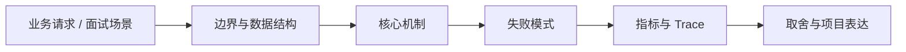

# DESIGN.md 与 AI 可读设计资产

## 面试定位

DESIGN.md 与 AI 可读设计资产 属于 AI 工程趋势与实战方案 / Tool / Protocol / Skill 生态。面试里它不是背概念题，而是用来判断你是否能把知识落到架构、数据流、指标和取舍上。
一句话定位：AI 编程质量越来越依赖可被模型读取的设计资产，例如 DESIGN.md、组件规范、视觉参考、交互规则和品牌约束。

**必须讲清楚**
- AI 编程质量越来越依赖可被模型读取的设计资产，例如 DESIGN.md、组件规范、视觉参考、交互规则和品牌约束。
- 设计资产要机器可读
- 审美要变成约束和示例
- 输出要能被视觉 QA 验证

**常见追问方向**
- 为什么 AI 编程需要 DESIGN.md。
- 如何把审美要求转成可执行约束。
- 如何用视觉 QA 验证 AI 生成的界面质量。
- 如果这个点落到 Web Agent：公开网页任务自动化与评测，架构如何设计？
- 线上失败时看哪些 trace、日志、指标，怎么回滚或补偿？

## 架构与运行机制

### 核心机制

- awesome-design-md 和 taste-skill 类项目说明前端 AI 生成正在从组件库转向设计说明和风格约束。
- 高质量设计资产能减少默认模板味和返工。

### 通用数据流

可以按用户目标、模型、上下文、状态、工具、执行循环、评测、安全和可观测性来讲。数据流是用户任务进入编排层，Context Builder 汇总系统指令、用户约束、RAG 证据、短期状态和工具结果，模型输出结构化动作，宿主程序执行工具并把 observation 写回 State 和 Trace。

### 工程落点

- 记录颜色、字体、间距、栅格、组件状态、交互规则和禁用模式。
- 提供正例截图、负例说明、常见误区和页面级验收清单。
- 让 Agent 修改前先读取 DESIGN.md，再生成或调整组件。
- 用 Playwright 截图、移动端宽度、文本溢出和交互状态做 QA。
- DESIGN.md 应包含颜色、字体、间距、组件状态、布局规则、禁用模式、示例截图和 QA checklist。
- 验证要结合截图、移动端宽度、溢出检查和视觉回归。
- 把每个关键步骤都映射到可观测指标，避免只描述功能。
- 回答时主动说明哪些信息是强一致状态，哪些只是上下文或缓存视图。

## 可画图

图 1：DESIGN.md 与 AI 可读设计资产 的回答要从业务入口进入，先讲边界和数据结构，再讲机制、失败模式、指标和取舍。

## 系统设计案例

### DESIGN.md 与 AI 可读设计资产 的面试级设计题

典型设计题是企业内部 Agent、Coding Agent、Paper Agent 或 Web Agent：外层 deterministic workflow 管理权限、预算、审批和最终提交，内层 Agent loop 处理开放探索，Eval Gate 根据 golden case、轨迹评分、工具结果和人工反馈决定是否继续。

**可画架构**
- 入口层校验用户请求、权限、租户、参数和幂等键。
- 业务服务层决定同步处理、异步处理、缓存读写、数据库回源或降级返回。
- 状态层保存业务状态、缓存版本、事件状态和恢复点。
- 执行层处理存储访问、下游调用、异步任务和补偿动作，并把结构化结果写入 trace。
- 观测层用指标、日志和链路追踪证明系统可运行、可排障、可复盘。

**数据流**
- 请求进入入口层后生成 request_id/run_id。
- 业务服务读取缓存、数据库或异步事件状态，选择执行路径。
- 执行结果写回状态存储，并向监控系统上报延迟、错误和业务结果。
- 保护策略根据成功标准、失败次数、SLA 和风险等级决定继续、降级、补偿或停止。

## 真实问题与排障

真实线上问题一般从任务成功率、工具调用成功率、invalid args、上下文漂移、幻觉率、引用准确率、token 成本、延迟、guardrail block rate 和 human handoff rate 看起。回答时要把模型问题、检索问题、工具问题、状态问题和权限问题分开归因。

**排查顺序**
- 先确认用户可感知问题：错误率、延迟、成功率、数据一致性或结果质量是否异常。
- 再沿数据流定位是哪一段出了问题：入口、状态、缓存、数据库、异步事件、外部依赖或消费端。
- 对比最近发布、配置变更、流量变化、数据倾斜和下游限流。
- 先止血：限流、降级、回滚、暂停消费、隔离高风险工具或切换只读模式。
- 最后把失败样例进入 regression/eval，避免同类问题复发。

**重点指标**
- visual_regression_count
- mobile_overflow_count
- design_token_violation_count
- revision_rounds
- qa_pass_rate

**常见误区**
- 只给审美形容词
- 没有负例
- 缺少移动端和状态约束

## 业界方案与技术取舍

AI Agent 的取舍是开放任务能力换来了不确定性、成本、延迟和治理复杂度。面试追问通常会围绕 workflow 与 agent 边界、memory 与 RAG 区别、function calling 是否等于 agent、eval 怎么证明不是 demo、如何做安全边界展开。

**方案对比**
- AI 生成 UI 的瓶颈常常不是代码能力，而是缺少可读的设计约束。
- DESIGN.md 把品牌、布局、组件状态、间距、交互和负例变成模型可加载资产。
- 设计资产必须可验证：截图、响应式、溢出、状态和视觉回归都要检查。

**复习时要能讲出的细节**
- 这个知识点解决什么问题，不解决什么问题。
- 关键数据结构、状态变化、失败边界和可观测指标是什么。
- 面试官继续追问时，能从架构图、数据流、线上排障和项目证据四个角度展开。
- 能说明为什么这个取舍适合当前业务，而不是只背业界名词。

## 深入技术细节

AI 编程质量越来越依赖可被模型读取的设计资产，例如 DESIGN.md、组件规范、视觉参考、交互规则和品牌约束。

面试深挖时要把对象、状态、协议、执行顺序和失败分支讲出来。不要只说“可以用 Redis/数据库/MQ 解决”，而要说明 key、字段、版本、超时、重试、幂等、降级和观测指标如何共同工作。

## 关键数据结构与协议

| 字段 | 所属对象 | 作用 | 排障价值 |
| :--- | :--- | :--- | :--- |
| `request_id` | 请求 | 串联入口、缓存、DB 和下游调用 | 定位单次异常 |
| `key_schema` | Redis/存储 | 固定业务域、实体和版本 | 排查误删、串租户和旧版本 |
| `source_version` | value/event | 标识事实源版本 | 防止旧值覆盖新值 |
| `ttl_policy` | 缓存策略 | 控制过期、抖动和刷新 | 排查击穿、雪崩和旧值窗口 |
| `trace_id` | 观测链路 | 串联服务、存储和异步任务 | 复盘慢请求和失败分支 |

## 深问准备

被追问边界时，先说这个方案适合什么、不适合什么，再给反例。被追问线上故障时，按影响面、止血、根因、修复、回归五段回答。被追问项目时，把回答落到你做过的接口、缓存、队列、数据库、监控或 Agent 工程链路。

- 反例要明确，例如强事务事实源不能交给缓存或搜索读模型。
- 指标要可执行，例如 p95、error_rate、retry_rate、lag、miss_rate、stale_rate。
- 回归要可复现，例如固定输入、故障注入、压测脚本或 golden case。

## 趋势落地补充

这类趋势内容不能只写成工具推荐，真正要沉淀的是“如何让 Agent 稳定复用设计判断”。落地时可以把设计资产分成三层：团队级 DESIGN.md 记录品牌、排版、组件状态和禁用模式；项目级参考图记录页面结构、密度和交互边界；任务级 checklist 记录本次改动必须验证的响应式、溢出、键盘焦点、空态和错误态。

动手实验可以从一个小页面开始：先写 DESIGN.md，再让 Agent 按它生成或重构页面，最后用 Playwright 截图比较桌面和移动端。复盘时不要只问“好不好看”，而要记录 revision_rounds、mobile_overflow_count、design_token_violation_count 和 qa_pass_rate，这样审美要求才会变成可验证工程约束。

## 生产验收清单

- DESIGN.md 要把颜色、字体、间距、密度、组件状态、禁用模式、页面布局和内容语气写成可执行规则。
- 每个参考图要说明提取哪些视觉要素，哪些只是内容样例，避免 Agent 盲目 1:1 复制无关部分。
- 视觉 QA 要覆盖桌面、移动端、长文本、空态、错误态、加载态、键盘焦点和截图差异。
- 设计资产更新要有版本和适用范围，否则旧风格会污染新页面，多个产品线也会互相串味。
- 面试里可以用 `mobile_overflow_count`、`design_token_violation_count`、`revision_rounds` 和 `qa_pass_rate` 证明它不是审美口号。
- 反例也要写进资产：例如不要用营销式 hero、不要卡片套卡片、不要让按钮文字溢出、不要把所有页面做成同色系渐变。负例越具体，Agent 越容易避开默认模板味。
- 如果团队已有设计系统，AI 可读资产应引用真实 token、组件状态和截图，而不是另起一套审美词表。
- 一个可落地的验收样例是：Agent 生成页面后自动打开 1440、1024、390 三个视口截图，检查主按钮、导航、表格、空态和错误态是否符合 DESIGN.md，并把失败截图作为下一轮修改输入。
- 这样设计资产既能指导生成，也能进入持续回归，而不是只在第一次建站时被读一次并失效。

## 来源与延伸阅读

- [awesome-design-md](https://github.com/VoltAgent/awesome-design-md)：用于确认官方语义边界、命令行为和工程约束。
- [taste-skill](https://github.com/Leonxlnx/taste-skill)：用于确认官方语义边界、命令行为和工程约束。
