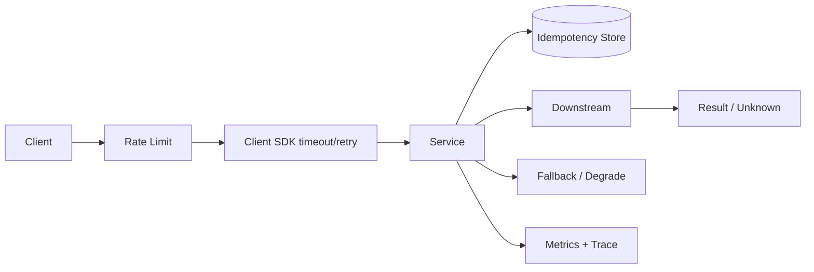

# 幂等、重试、超时与限流降级

## 面试定位

分布式韧性题考的是你是否默认网络会失败、请求会重复、状态会未知、下游会过载。成熟回答要把幂等、重试、超时、限流、熔断、降级和观测一起设计。只说“失败就重试”是反例，因为没有幂等和退避的重试会放大故障。

这类题可以连接 Web API、MQ 消费、Redis 回源、模型 API 调用和 Agent 工具执行。RabbitMQ/Kafka 的确认语义用于支持“重复是常态”，Prometheus 指标用于证明保护机制是否触发。

## 一句话定义

幂等是同一业务意图重复执行不会产生额外副作用。重试是对可恢复失败的再次尝试。超时是为调用设置等待上限。限流、熔断和降级是在系统超过承载能力时保护核心链路的机制。它们必须组合使用，不能单独理解。

## 架构与运行机制

图 1 展示了跨服务调用的数据流：入口先限流，SDK 控制超时和重试，服务端用幂等存储保护写操作，下游失败时进入降级或补偿。图中 Result/Unknown 很关键，超时不等于失败，可能是“已成功但响应丢失”。

## 深入技术细节

幂等键要对应业务意图，而不是随机请求。支付创建可以用 `user_id + order_id + operation`，任务执行可以用 `run_id + tool_call_id`。幂等记录应保存 `processing/succeeded/failed` 状态、`request_hash`、结果摘要和过期时间。同一 key 但 request_hash 不同应返回冲突，避免客户端误复用。

重试要按错误分类。网络抖动、临时 5xx、rate limit 可能可重试；参数错误、权限拒绝、余额不足不可重试。重试要有指数退避、jitter、最大次数和全局预算。所有客户端同步重试会形成重试风暴，把下游从慢打到死。

超时要从端到端 SLA 分解。如果用户接口 SLA 是 2 秒，下游 A、B、C 的超时不能各自 2 秒。超时后状态未知，需要查询接口、幂等重试、补偿或后台确认，不能简单当失败回滚。

## 关键数据结构与协议

| 字段 | 所属对象 | 作用 | 排障价值 |
| --- | --- | --- | --- |
| `idempotency_key` | 请求 | 标识业务意图 | 防重复副作用 |
| `request_hash` | 幂等记录 | 防 key 误用 | 检测参数冲突 |
| `status` | 幂等记录 | processing/succeeded/failed | 处理未知结果 |
| `timeout_ms` | 调用策略 | 等待上限 | SLA 预算 |
| `retry_count` | 调用记录 | 重试次数 | 识别风暴 |
| `error_code` | 响应 | 错误分类 | 决定是否重试 |
| `fallback_reason` | 降级 | 降级原因 | 事故复盘 |

这些字段构成了分布式调用协议。没有 error_code 和 request_hash，重试和幂等都会变得含糊。

## 系统设计案例

设计支付创建 API，架构上 Gateway 限流，API 接收 `Idempotency-Key`，服务端写幂等记录并执行业务，调用支付渠道设置超时和重试，结果写状态机。数据流是 request -> rate limit -> idempotency check -> business tx -> downstream -> status/result -> audit。

取舍是：幂等存储增加一次读写，但能防止重复扣款；短超时保护用户体验，但可能增加未知结果；重试提升成功率，但会放大下游故障。面试追问通常会问幂等键粒度、超时未知结果和重试风暴。

## 真实问题与排障

线上外部支付超时升高时，先看影响面：哪个渠道、哪些接口、timeout_rate、retry_rate、idempotency_conflict、下游 p95 和用户状态。止血可以降低重试次数、打开熔断、切备用渠道、返回处理中、限制新请求或暂停低优业务。

根因定位看下游状态、网络、错误码、客户端重试策略、幂等冲突和线程池队列。回滚可能是恢复旧超时、关闭新 SDK、切回旧渠道或停止自动重试。回归要模拟超时、重复请求、未知结果和下游 rate limit。

## 项目化表达

项目里可以说：我为支付创建和 Agent 工具执行都设计了幂等键。支付用 order_id + operation，Agent 工具用 run_id + tool_call_id。幂等表保存 request_hash、status、result_hash 和过期时间。指标看 `retry_rate`、`timeout_rate`、`idempotency_conflict_count`、`rate_limited_count` 和 `degrade_count`。

## 边界条件与反例

反例一：没有幂等就重试写操作，可能重复扣款、重复发券。

反例二：所有错误都重试，权限错误和参数错误会被放大。

反例三：超时时间层层叠加，用户早已超时，下游还在执行。

反例四：降级没有用户可见状态，用户不知道任务是否成功。

## 深问准备

1. 幂等键怎么选？
2. 超时后结果未知怎么办？
3. 重试风暴怎么避免？
4. 限流和熔断区别是什么？
5. Agent 工具调用如何幂等？

## 面试加固与追问链路

如果追问“幂等记录什么时候写”，可以回答：写操作进入业务事务前先尝试创建幂等记录，状态为 processing；业务成功后写 result 和 succeeded；业务失败要区分可重试失败和确定失败。对于支付、发券、工具执行这类副作用，幂等记录和业务状态最好在同一个本地事务内更新，避免结果成功但幂等状态丢失。

如果追问“超时后是否应该取消下游”，要说明取消不是总能生效。HTTP 客户端超时只代表调用方不等了，下游可能仍在执行。因此接口要提供状态查询，幂等重试要能拿到同一个结果，后台补偿要能修复悬挂状态。用户界面也要表达“处理中”而不是简单失败。

事故场景可以这样说：某次模型 API rate limit，客户端同步重试导致线程池打满。止血是降低重试次数、加 jitter、打开熔断和返回降级；根因是 SDK 把 rate_limited 当普通 5xx；回归是故障注入 rate limit，验证 retry_rate、timeout_rate、queue_size 和 degrade_count 都在阈值内。

再补一个面试常见分支：幂等不是只在 API 层做，MQ 消费、定时任务、补偿任务、回调接口和 Agent tool execution 都要做。幂等存储可以是数据库唯一键、状态机版本、Redis 短期去重或业务表约束。选择哪种方式要看副作用风险、去重窗口和是否需要保存结果。资金和权益类副作用优先用数据库持久幂等，日志和通知类可以更轻。

再补一条超时预算模板：用户 SLA 如果是 2 秒，网关、服务、DB、Redis、外部 API 和重试总时间都必须在这个预算内。不能每层都设置 2 秒再叠加重试。服务端要把 timeout_ms、retry_count、fallback_reason 写进日志和指标，事故时才能判断到底是下游慢、重试过多还是预算设计错误。Agent 工具调用也一样，模型等待工具结果的时间必须纳入总 run budget。

如果追问“重试应该放在哪一层”，可以回答：底层 SDK 可以做网络级短重试，但业务级重试必须在知道幂等和错误语义的服务层做。网关、客户端、服务端、MQ 消费者如果都重试，会叠加成指数级放大。生产里要统一 retry policy，并在日志里记录 retry_source。

最后补充监控闭环：幂等、重试和降级都要能被量化。`duplicate_skip_count` 说明幂等在生效，`retry_success_rate` 说明重试是否真的有收益，`fallback_success_rate` 说明降级是否保护了用户路径，`unknown_result_count` 则暴露超时后状态查询是否不足。没有这些指标，策略是否有效只能靠猜。

面试最后可以补一句：这些机制要在 SDK、网关、服务端和 MQ 消费者之间统一口径，否则每层各自为政会让一次故障被多层重试同时放大。

## 生产验收清单

真正落地时，要把重试分层写清楚。传输层短重试只处理连接重置、短暂 DNS 或连接池抖动；业务层重试要知道错误码、幂等键和副作用语义；MQ redelivery 要依赖 message_id、消费状态表和 DLQ；人工 replay 要有审批、限速和审计。任何一层都不能假设“上游已经处理好了”，否则网关、SDK、服务端、消费者同时重试时会把一个下游慢故障放大成全链路雪崩。

超时预算也要有验收口径：入口 SLA、网关 idle timeout、服务端 deadline、DB/Redis/socket timeout、外部 API timeout 和后台任务 run budget 必须能串成一张表。每个下游调用记录 `deadline_ms`、`remaining_budget_ms`、`retry_source` 和 `attempt`，事故时才能判断是预算分配错误、下游慢、连接池饱和还是重试策略错误。对于 Agent 工具执行，还要把模型等待工具 observation 的时间计入同一个 run budget。

幂等验收可以用四组用例压住：同 key 同请求重复提交返回同一结果；同 key 不同请求返回 conflict；超时后查询状态再重试能收敛；处理中状态重复请求不会并发执行两次。再配合故障注入：下游 429、5xx、半成功、响应丢失、服务重启、MQ 重投，验证 `retry_rate`、`timeout_rate`、`unknown_result_count`、`duplicate_skip_count` 和 `idempotency_conflict_count` 都能解释系统行为。

## 来源与延伸阅读

- [AWS Builders Library: Timeouts, retries, and backoff with jitter](https://aws.amazon.com/builders-library/timeouts-retries-and-backoff-with-jitter/)：官方工程文章，用于支持超时、退避、jitter 和重试放大风险。
- [Stripe API: Idempotent requests](https://docs.stripe.com/api/idempotent_requests)：官方文档，用于说明幂等键、参数一致性和重复请求结果复用。
- [gRPC Deadlines](https://grpc.io/docs/guides/deadlines/)：官方文档，用于确认 deadline/timeout 在跨服务调用中的语义边界。
- [Prometheus Documentation](https://prometheus.io/docs/introduction/overview/)：官方文档，用于支持 retry、timeout、degrade 等保护机制的指标化验证。
