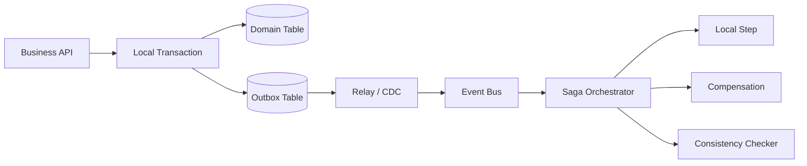

# 分布式事务、Saga 与 Outbox

## 面试定位

分布式事务题的重点不是背 2PC、TCC、Saga、Outbox 名词，而是说明跨服务状态如何在失败、重复、超时和部分成功下最终收敛。成熟回答要先划边界：数据库本地事务只能保护本地资源，远程 MQ、HTTP、外部支付和搜索索引都不在同一个事务里。

反例是“先写库再发 MQ 就行”或“失败就补偿”。消息可能重复，补偿可能失败，外部动作可能不可逆，用户还需要看到可理解的状态。

## 一句话定义

分布式事务是跨多个资源或服务维护一致性的机制。Outbox 是把业务状态和待发布事件写入同一本地事务，再异步发布事件。Saga 是把长事务拆成多个本地事务，每一步成功后推进，失败后执行补偿或人工处理。

## 架构与运行机制

图 1 展示了 Outbox 和 Saga 的组合数据流：本地事务保证业务表和 outbox 一起提交，Relay 发布事件，Saga 推进跨服务步骤，失败时进入补偿或对账。图中 Checker 是生产关键，因为补偿和发布都可能失败。

## 深入技术细节

Outbox 解决的是本地事务和消息发送之间的不一致窗口。业务事务成功但消息发送失败，下游不知道状态变化；消息先发出但事务回滚，会出现幽灵事件。Outbox 把事件写入数据库本地事务，再由 Relay 或 CDC 发布。Relay 发布成功但标记 sent 失败会重复发布，因此消费者必须幂等。

Saga 解决的是多服务长事务。每一步都是一个本地事务，状态机记录 step、status、attempts、last_error 和补偿状态。补偿不是简单反向操作，有些动作不可逆，比如真实扣款、发出短信、外部权益开通。不可逆动作要放在尽量靠后的位置，或设计确认/撤销协议。

事务消息介于两者之间，依赖 MQ 的半消息和事务回查。它可以减少 outbox 表治理，但绑定 MQ 能力，回查接口也要能根据本地事务最终状态返回 commit/rollback/unknown。

## 关键数据结构与协议

| 字段 | 所属对象 | 作用 | 风险 |
| --- | --- | --- | --- |
| `event_id` | Outbox/Event | 事件幂等 | 重复发布必须去重 |
| `aggregate_id` | Outbox | 业务实体 | 对账和补偿 |
| `outbox_status` | Outbox | pending/sent/failed | 监控发布延迟 |
| `saga_id` | Saga | 跨服务事务 | 串联步骤 |
| `step_status` | Saga Step | pending/succeeded/failed/compensated | 定位悬挂 |
| `compensation_id` | Compensation | 补偿幂等 | 防重复补偿 |
| `last_error` | Step/Outbox | 错误上下文 | 复盘和人工处理 |

这些字段让分布式一致性从口头承诺变成可观测状态机。

## 系统设计案例

设计支付成功发券系统。支付服务本地事务更新订单状态并写 outbox，Relay 发布 `PaymentSucceeded`，Saga 编排发券、通知、ES 同步。发券失败进入重试，长期失败进入人工补偿。数据流是 payment tx -> outbox -> MQ -> saga step -> idempotent consumer -> checker。

取舍是：Outbox 通用可靠，但增加表、Relay 和清理；事务消息减少表治理，但绑定 MQ；Saga 灵活，但补偿复杂且用户要看到“处理中”。面试追问通常会问 Outbox 重复发布、补偿失败和 TCC 适用场景。

## 真实问题与排障

如果用户支付成功但权益未到账，先看影响面：哪些订单、哪些事件、outbox pending、MQ lag、Saga step 状态、消费者错误、补偿队列。止血可以手动补发、暂停异常消费者、限速 replay、把用户状态显示为处理中。

根因定位看本地事务是否提交、outbox 是否写入、Relay 是否发布、事件是否重复、消费者是否幂等、补偿是否失败。回滚可能是回滚新 Saga step、关闭新消费者或恢复旧补偿策略。回归要模拟消息重复、发布失败、补偿失败和消费者超时。

## 项目化表达

项目里可以说：我用 Outbox 保证订单状态和事件发布最终一致，Saga 状态机记录每个后置步骤。监控 `outbox_pending_count`、`event_publish_lag`、`saga_pending_count`、`compensation_success_rate` 和 `inconsistent_count`。一次权益延迟事故中，我们先限速 replay 止血，再修复消费者幂等 bug，并补充对账任务。

## 边界条件与反例

反例一：MQ 发送成功就等于事务成功。MQ 不知道数据库事务是否提交。

反例二：补偿动作不可逆还用 Saga。不可逆动作要谨慎放置或人工确认。

反例三：没有对账任务。只靠事件链路，悬挂状态可能长期存在。

反例四：用户看不到处理中状态。最终一致性不是让用户无感等待。

## 深问准备

1. Outbox 为什么需要消费者幂等？
2. 事务消息和 Outbox 怎么选？
3. Saga 补偿失败怎么办？
4. TCC 适合什么场景？
5. 如何做一致性对账？

## 面试加固与追问链路

如果面试官问“Outbox 会不会拖慢主库”，要承认成本：多写一张表、Relay 扫描、历史归档和索引维护都会增加负担。工程取舍是 outbox 表按时间分区或归档，Relay 批量读取 pending 事件并限速，历史 sent 事件转冷存储。指标要看 outbox_pending_count、oldest_pending_age、relay_error_rate 和 event_publish_lag。

如果追问 Saga 补偿，可以强调补偿不是回滚数据库那么简单。发券可以撤销，短信不能撤回，外部支付要走退款或冲正。设计 Saga 时要把不可逆步骤放后面，给用户明确状态，并准备人工处理入口。补偿动作本身也要有幂等键和审计。

事故复盘可以这样讲：支付成功但权益未到账，先按订单维度查 outbox、MQ、Saga step 和消费者结果；止血是手动补发并限速 replay；根因是消费者幂等表唯一键设计错误；修复是调整幂等键、补对账任务和 replay 回归。

还可以补充用户体验边界：最终一致性不是让用户看不到状态。用户支付成功后可以显示“权益发放中”，超过 SLA 后给出重试、客服或补偿入口。后台要有一致性巡检，把 paid 但未发券、event sent 但未消费、Saga pending 超时这些状态自动捞出来。这样回答能把技术一致性和产品可解释性连起来。

再补一条选型模板：单服务内用本地事务，跨服务事件用 Outbox，MQ 原生支持且团队熟悉时可以考虑事务消息，复杂长流程用 Saga，强预留/确认语义且业务能改造时才考虑 TCC。每种方案都必须回答幂等、补偿、对账、用户状态和监控指标。这样选型不是背名词，而是按约束做工程判断。

如果追问“最终一致多久算可接受”，要回到业务 SLA。发券可能允许几十秒，搜索索引可能允许分钟级，支付状态和权限变更则需要更短窗口或同步校验。系统要记录 oldest_pending_age 和 inconsistent_count，并在超过 SLA 时告警、补偿或人工介入。这样最终一致性才不是一句空话。

最后补充一个排障闭环：分布式一致性事故不能只查一个服务。要从用户订单状态、业务表、outbox 表、MQ offset、消费者处理表、下游结果表和补偿日志逐层对账。每层都要能用同一个 business_key 或 event_id 关联，否则事故发生时只能靠人工猜测链路断点。

面试收束可以说：分布式一致性设计不是选一个框架名，而是定义状态机、事件、幂等、补偿、对账、告警和用户可见状态，并在压测和故障演练里证明它们能工作。

## 生产验收清单

Outbox 的验收重点是“重复发布可接受，丢事件不可接受”。业务事务写入领域表和 outbox 表后，Relay 可以用轮询、CDC 或数据库逻辑复制读取 pending 事件。Relay 发布成功但更新 outbox 状态失败时，事件会再次发布；因此消费者要以 `event_id` 或业务唯一键做幂等。Relay 本身要记录 `attempts`、`last_error`、`next_retry_at`、`published_at` 和 `oldest_pending_age`，避免 pending 事件悄悄堆积。

Saga 的验收重点是“每一步都有状态，每个失败都有去向”。状态机要明确 running、waiting、succeeded、failed、compensating、compensated、manual_review 等状态；每个 step 都要记录入参摘要、出参摘要、幂等键、重试次数和补偿结果。补偿失败不能无限重试压垮下游，要进入人工队列或对账任务。对于不可逆动作，系统要把它放在确认点之后，并给用户展示可解释状态。

对账验收要能回答三类问题：业务状态和事件状态是否一致，事件消费结果和下游状态是否一致，用户可见状态和后台真实状态是否一致。典型 SQL 或任务会扫描 paid but coupon_missing、outbox_sent but consumer_missing、saga_pending_too_long、compensation_failed 等集合。每个集合都有 owner、SLA、修复脚本和审计记录。面试里讲出这套对账，会比只说“最终一致”可信得多。

## 公开阅读校验

这篇文章公开阅读时，要先强调“本地事务边界”。数据库本地事务只能保护同一个资源里的状态；MQ、HTTP、外部支付、搜索索引、短信、第三方权益都不在同一个本地事务里。Outbox、事务消息、Saga、TCC 都是在不同约束下管理这个边界，不是让跨服务系统天然变成全局 ACID。

Outbox 的专业表述是“业务状态和待发布事件同事务写入，发布可重复，消费必须幂等”。如果只说“写 outbox 表再发 MQ”，还不够。还要讲 Relay/CDC 如何扫描、如何标记状态、如何限速重试、如何归档，发布成功但状态更新失败时为什么会重复事件，以及消费者如何通过 `event_id` 或业务唯一键收敛重复。

Saga 的专业表述是“状态机 + 补偿 + 对账 + 用户可见状态”。补偿并不等于自动回滚；不可逆动作要后置或人工确认，补偿失败要进入人工队列或对账任务。用户端要能看到处理中、失败可重试、人工处理等状态，否则最终一致就会变成用户无法理解的黑盒等待。

项目验收可以固定三张表或三类视图：outbox pending/failed 视图、Saga step terminal/pending 视图、一致性 checker 视图。指标上关注 `oldest_pending_age`、`event_publish_lag`、`duplicate_event_count`、`saga_stuck_count`、`compensation_failed_count` 和 `inconsistent_count`。这些指标能证明最终一致性不是口号，而是可运营机制。

## 来源与延伸阅读

- [Transactional outbox pattern](https://microservices.io/patterns/data/transactional-outbox.html)：用于解释业务状态与待发布事件同本地事务提交的模式边界。
- [Saga pattern](https://microservices.io/patterns/data/saga.html)：用于说明长事务拆成本地事务、补偿和最终一致性的工程语义。
- [Debezium Outbox Event Router](https://debezium.io/documentation/reference/stable/transformations/outbox-event-router.html)：官方文档，用于支持 CDC/outbox relay 的实现路径。
- [Apache RocketMQ Transaction Message](https://rocketmq.apache.org/docs/featureBehavior/04transactionmessage/)：官方文档，用于对比事务消息、半消息和事务回查方案。
