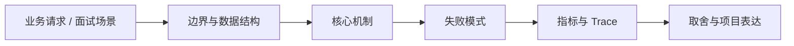

# 企业 Agent 方案地图

## 面试定位

企业 Agent 方案地图 属于 AI 工程趋势与实战方案 / 企业 Agent 应用方案。面试里它不是背概念题，而是用来判断你是否能把知识落到架构、数据流、指标和取舍上。
一句话定位：企业 Agent 方案可按问数、问文档、问代码、问业务流程、操作系统和质量治理六类组织，每类都有不同的工具、数据和评测边界。

**必须讲清楚**
- 企业 Agent 方案可按问数、问文档、问代码、问业务流程、操作系统和质量治理六类组织，每类都有不同的工具、数据和评测边界。
- 先分场景再选架构
- 企业方案核心是数据与权限
- 项目表达要讲指标和失败

**常见追问方向**
- 企业 Agent 方案如何分类和选型。
- DataAgent、知识库问答、AI Code Review 和自动化测试有什么不同。
- 如何定义一个 Agent 项目的边界、数据和成功指标。
- 如果这个点落到 Paper Agent：论文研读与可追溯综述、Coding Agent：代码库任务 Harness、Web Agent：公开网页任务自动化与评测，架构如何设计？
- 线上失败时看哪些 trace、日志、指标，怎么回滚或补偿？

## 架构与运行机制

### 核心机制

- DataAgent/Text2SQL、知识库客服、AI Code Review、回归测试和项目管理 Agent 都不是同一种系统。
- 面试里要能把业务目标映射到数据源、工具、权限、评测和上线边界。

### 通用数据流

可以按用户目标、模型、上下文、状态、工具、执行循环、评测、安全和可观测性来讲。数据流是用户任务进入编排层，Context Builder 汇总系统指令、用户约束、RAG 证据、短期状态和工具结果，模型输出结构化动作，宿主程序执行工具并把 observation 写回 State 和 Trace。

### 工程落点

- 为每个方案卡定义 scenario、users、data_sources、tools、risk_level、eval_metrics 和 fallback。
- 先做 deterministic workflow 或 RAG baseline，再证明 Agent loop 的收益。
- 权限、审计、human review 和 unsupported state 必须前置设计。
- 上线后跟踪业务成功率、人工接管率、成本、延迟和安全拦截。
- 方案卡字段包含 scenario、users、data_sources、tools、risk_level、eval_metrics、fallback、human_review。
- 先用 workflow baseline，再证明 Agent 带来收益。
- 把每个关键步骤都映射到可观测指标，避免只描述功能。
- 回答时主动说明哪些信息是强一致状态，哪些只是上下文或缓存视图。

## 可画图

图 1：企业 Agent 方案地图 的回答要从业务入口进入，先讲边界和数据结构，再讲机制、失败模式、指标和取舍。

## 系统设计案例

### 企业 Agent 方案地图 的面试级设计题

典型设计题是企业内部 Agent、Coding Agent、Paper Agent 或 Web Agent：外层 deterministic workflow 管理权限、预算、审批和最终提交，内层 Agent loop 处理开放探索，Eval Gate 根据 golden case、轨迹评分、工具结果和人工反馈决定是否继续。

**可画架构**
- 入口层校验用户请求、权限、租户、参数和幂等键。
- 业务服务层决定同步处理、异步处理、缓存读写、数据库回源或降级返回。
- 状态层保存业务状态、缓存版本、事件状态和恢复点。
- 执行层处理存储访问、下游调用、异步任务和补偿动作，并把结构化结果写入 trace。
- 观测层用指标、日志和链路追踪证明系统可运行、可排障、可复盘。

**数据流**
- 请求进入入口层后生成 request_id/run_id。
- 业务服务读取缓存、数据库或异步事件状态，选择执行路径。
- 执行结果写回状态存储，并向监控系统上报延迟、错误和业务结果。
- 保护策略根据成功标准、失败次数、SLA 和风险等级决定继续、降级、补偿或停止。

## 真实问题与排障

真实线上问题一般从任务成功率、工具调用成功率、invalid args、上下文漂移、幻觉率、引用准确率、token 成本、延迟、guardrail block rate 和 human handoff rate 看起。回答时要把模型问题、检索问题、工具问题、状态问题和权限问题分开归因。

**排查顺序**
- 先确认用户可感知问题：错误率、延迟、成功率、数据一致性或结果质量是否异常。
- 再沿数据流定位是哪一段出了问题：入口、状态、缓存、数据库、异步事件、外部依赖或消费端。
- 对比最近发布、配置变更、流量变化、数据倾斜和下游限流。
- 先止血：限流、降级、回滚、暂停消费、隔离高风险工具或切换只读模式。
- 最后把失败样例进入 regression/eval，避免同类问题复发。

**重点指标**
- business_success_rate
- manual_handoff_rate
- unsupported_request_rate
- cost_per_success
- risk_block_rate

**常见误区**
- 所有场景都套 Agent
- 没有权限和审计
- 没有业务指标

## 业界方案与技术取舍

AI Agent 的取舍是开放任务能力换来了不确定性、成本、延迟和治理复杂度。面试追问通常会围绕 workflow 与 agent 边界、memory 与 RAG 区别、function calling 是否等于 agent、eval 怎么证明不是 demo、如何做安全边界展开。

**方案对比**
- 企业 Agent 方案要先按场景分类，再选架构，不能所有业务都套 autonomous agent。
- 数据、权限、评测、回滚和人工审核决定方案能不能生产落地。
- 项目表达要从业务问题、数据源、工具、指标和失败模式展开。

**复习时要能讲出的细节**
- 这个知识点解决什么问题，不解决什么问题。
- 关键数据结构、状态变化、失败边界和可观测指标是什么。
- 面试官继续追问时，能从架构图、数据流、线上排障和项目证据四个角度展开。
- 能说明为什么这个取舍适合当前业务，而不是只背业界名词。

## 深入技术细节

企业 Agent 方案可按问数、问文档、问代码、问业务流程、操作系统和质量治理六类组织，每类都有不同的工具、数据和评测边界。

面试深挖时要把对象、状态、协议、执行顺序和失败分支讲出来。不要只说“可以用 Redis/数据库/MQ 解决”，而要说明 key、字段、版本、超时、重试、幂等、降级和观测指标如何共同工作。

## 关键数据结构与协议

| 字段 | 所属对象 | 作用 | 排障价值 |
| :--- | :--- | :--- | :--- |
| `solution_card_id` | 方案卡 | 标识一个企业 Agent 场景和版本 | 防止不同场景混用架构 |
| `scenario` | 业务问题 | 说明问数、问文档、问代码、问流程或操作系统等类型 | 判断是否真的需要 Agent loop |
| `data_sources` | 数据边界 | 列出数据库、文档库、代码库、工单和 API 来源 | 排查答案事实源和权限问题 |
| `permission_scope` | 权限模型 | 定义只读、草稿、写入、审批和租户隔离 | 审计越权访问和误写入 |
| `tool_set` | 工具集合 | 记录可调用工具、side effect 和超时策略 | 定位工具失败或副作用 |
| `success_metric` / `fallback` | 验收策略 | 定义业务成功、人工接管、unsupported 和降级路径 | 判断方案是否值得上线 |

## 深问准备

被追问边界时，先说这个方案适合什么、不适合什么，再给反例。被追问线上故障时，按影响面、止血、根因、修复、回归五段回答。被追问项目时，把回答落到你做过的接口、缓存、队列、数据库、监控或 Agent 工程链路。

- 反例要明确，例如强事务事实源不能交给缓存或搜索读模型。
- 指标要可执行，例如 p95、error_rate、retry_rate、lag、miss_rate、stale_rate。
- 回归要可复现，例如固定输入、故障注入、压测脚本或 golden case。

## 趋势落地补充

企业 Agent 方案地图要先回答“这是不是 Agent 问题”。问数更像语义层、权限和 SQL 约束问题；问文档更像解析、检索和 citation 问题；问代码需要 diff、测试和 review pipeline；问流程才可能需要 planner、tool runtime 和 human gate。把这些场景都写成 autonomous loop，会让方案成本、风险和验收指标失真。

落地时可以用 solution card 管理每类方案：`scenario`、`user_role`、`data_sources`、`permission_scope`、`tool_set`、`risk_level`、`success_metric`、`fallback`、`human_review` 和 `unsupported_state`。先做 workflow/RAG baseline，再用数据证明 Agent loop 带来了更高成功率或更低人工成本。没有 baseline 的“Agent 升级”很难说服面试官。

## 生产验收清单

- 每个方案都要明确事实源、权限模型、读写边界、审计要求和不可支持请求的返回方式。
- 高风险写操作必须有 approval、dry-run、rollback 或补偿路径，不把模型决策直接接生产写入。
- 指标要落到业务成功率、人工接管率、unsupported_request_rate、成本、延迟和风险拦截率。
- 复盘材料要保留成功样例、失败样例、人工修正和上线后指标变化，避免只展示 demo。

## 公开阅读校验

公开读者读这一篇，应该先学会分类，而不是被“企业 Agent 平台”这个大词带着走。问数、问文档、问代码、问流程、操作系统控制和质量治理，虽然都可能使用 LLM，但它们的数据源、权限、工具、副作用和评测方式完全不同。一个专业方案必须先判断场景类型，再决定用 RAG、workflow、tool calling 还是 agent loop。

落地表达最好用 solution card，而不是堆产品名。每张卡都要写清 `scenario`、`user_role`、`data_sources`、`permission_scope`、`tool_set`、`risk_level`、`success_metric`、`fallback` 和 `human_review`。这样读者可以快速看出方案是面向客服问答、报表分析、代码审查还是流程自动化，也能看出哪些请求应该返回 unsupported。

评价企业 Agent 的关键不是“能不能回答”，而是它是否比 baseline 更有业务收益。可以先做 workflow/RAG baseline，再比较 business_success_rate、manual_handoff_rate、cost_per_success 和 risk_block_rate。如果 Agent loop 没有降低人工成本或提升完成率，复杂度就是负收益。

## 项目表达样例

面试里可以用“三张方案卡”证明你会选型：DataAgent 卡强调语义层、指标口径、SQL 权限和结果解释；知识库问答卡强调文档解析、检索、citation 和 stale answer；流程自动化卡强调 tool runtime、审批、补偿和 human handoff。三者都用 LLM，但只有流程自动化通常需要更完整的 Agent loop，问数和问文档很多时候先做 deterministic baseline 更稳。

如果被追问上线评估，可以给出灰度路径：先选低风险部门和只读场景，收集 unsupported_request_rate、manual_handoff_rate、cost_per_success；再开放草稿写入，让人审后提交；最后才让部分工具进入自动执行。每一步都要定义 rollback、audit log 和 owner。这样方案地图就不是 PPT 分类，而是能指导企业从试点走到生产的治理框架。

## 来源与延伸阅读

- [OpenAI: A practical guide to building agents](https://cdn.openai.com/business-guides-and-resources/a-practical-guide-to-building-agents.pdf)：用于确认官方语义边界、命令行为和工程约束。
- [Anthropic: Building effective agents](https://www.anthropic.com/engineering/building-effective-agents)：用于确认官方语义边界、命令行为和工程约束。
