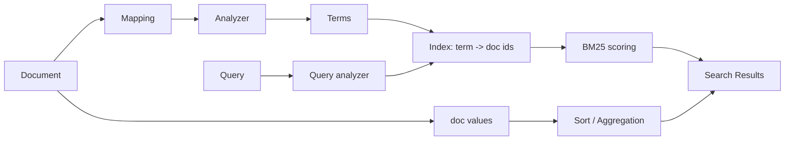
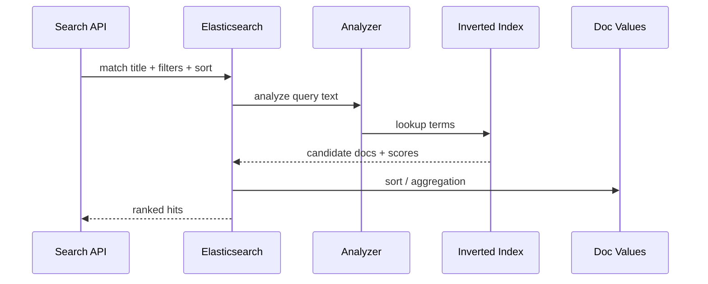

# 倒排索引、Mapping 与分词

## 面试定位

ES 题目高频会问“为什么适合全文检索”。答案不能只说倒排索引，要把 analyzer、mapping、text/keyword、doc values、segment 和查询路径讲清楚。面试官通常会继续追问：和 MySQL B+ 树有什么区别，为什么 mapping 设计错会影响性能和召回。

一个好的回答是：ES 通过 analyzer 把文本变成 term，用倒排索引从 term 找 doc；mapping 决定字段如何被索引和查询；doc values 支撑排序、聚合和脚本访问。

## 一句话定义

倒排索引是从 term 到 document 的映射，适合全文检索和相关性打分。Mapping 是字段级索引契约，决定字段是 text、keyword、numeric、date 还是 nested，以及是否启用 analyzer 和 doc values。

它解决的是搜索读模型问题，不适合替代事务数据库。

## 为什么需要它

B+ 树适合按主键、范围和有序字段查找，但不擅长“包含某个词”“多个词相关性排序”“分词后匹配”。倒排索引把文本拆成 term，查询时先找到包含 term 的文档集合，再计算相关性。

Mapping 决定索引质量。把订单号做成 text 会被分词，精确查询可能异常。把长文本只做 keyword 会失去全文检索能力。把高基数字段乱聚合会造成内存和延迟问题。

## 核心架构

图里要区分两条路径：全文检索主要走倒排索引和 BM25 打分；排序聚合主要依赖 doc values。mapping 影响这两条路径的行为和成本。

## 架构与运行机制

写入时，ES 根据 mapping 判断字段类型。text 字段会经过 analyzer，生成 token，写入倒排索引。keyword 字段通常不分词，适合精确过滤、聚合和排序。numeric/date 字段走适合范围查询的结构。doc values 是列式存储，支持排序和聚合。

查询时，match query 会对查询文本做 analyzer，再查倒排索引并计算相关性。term query 不分析输入，适合 keyword 精确匹配。filter context 不参与评分，更适合可缓存的精确过滤。

## 运行机制

倒排索引的基本结构是 term dictionary + postings list。term dictionary 记录词项，postings list 记录出现该词的文档、频次和位置信息。BM25 会考虑词频、文档长度和逆文档频率。

segment 是不可变的 Lucene 索引片段。refresh 后新 segment 对搜索可见，merge 会把小 segment 合并，降低查询开销但消耗 IO 和 CPU。

## 关键设计取舍

| 设计点 | 推荐做法 | 收益 | 风险 |
| --- | --- | --- | --- |
| text | 用于全文检索，配置 analyzer | 支持分词和相关性 | 不适合精确聚合 |
| keyword | 用于 ID、状态、标签、精确过滤 | 精确查询和聚合稳定 | 长文本会造成高基数 |
| multi-field | `name` 做 text，`name.keyword` 做 keyword | 同时支持搜索和聚合 | mapping 更复杂 |
| doc values | 排序聚合字段保持开启 | 聚合和排序更高效 | 存储增加 |
| dynamic mapping | 生产中谨慎使用模板 | 快速接入 | 类型误判后修复成本高 |

## 生产落地细节

生产索引要用 index template 管 mapping。日志、商品、订单、trace 这类索引族需要稳定字段约定。字段新增要评估类型、analyzer、是否聚合、是否排序、是否高基数。

常用排查工具包括 `_mapping`、`_analyze`、`profile`、slow log 和 `_cat/segments`。性能指标包括 `query_latency_p95`、`fetch_latency`、`segment_count`、`heap_usage`、`fielddata_evictions`、`refresh_time` 和 `merge_time`。

## 系统设计案例

商品搜索可以把 `title` 做 text 并使用中文 analyzer，把 `brand`、`category_id`、`sku` 做 keyword，把 `price` 做 numeric。用户输入关键词走 match 查询，品牌和类目走 filter，价格排序和聚合走 doc values。

这个案例能说明：全文检索、过滤、排序和聚合不是一条路径，mapping 决定它们是否稳定。

## 真实问题与排障

如果搜索结果不准，先看 analyzer：索引时和查询时分词是否一致。再看 mapping：字段是不是 text/keyword 用错。然后看 query：match、term、filter、boost 是否符合预期。最后用 profile 看耗时瓶颈。

如果聚合慢或内存高，检查高基数字段、doc values、fielddata、分片大小和查询范围。不要在 text 字段上随意开 fielddata。

## 常见误区与排障

常见误区包括：把 ES 当事务主库；把所有字符串都 dynamic 成 text；用 term query 查 text 字段；对高基数字段做无限制聚合；深分页不用 search_after。

排障时沿数据流看：document 如何被 analyzer 处理，term 是否进入倒排索引，query 是否被同样分析，filter 是否命中，排序聚合是否走 doc values。

## 面试追问

1. 倒排索引和 B+ 树区别是什么？term 到 doc vs key 到 row/range。
2. text 和 keyword 区别是什么？分词全文检索 vs 精确过滤聚合。
3. analyzer 影响什么？影响 token、召回和相关性。
4. doc values 有什么用？支撑排序、聚合和脚本访问。

## 项目化表达

在 RAG hybrid search 中，ES 的 BM25 可以补足向量检索对错误码、专有名词和精确词的不稳定。后端经验可以讲 mapping 模板、alias 切换、慢查询 profile、索引生命周期和字段治理。

## 深入技术细节

ES 的查询质量很大程度由 mapping 和 analyzer 决定。`text` 字段会进入 analyzer 产生 token，适合 match/full-text；`keyword` 字段保持原值，适合 term/filter/aggregation/sort；numeric/date/ip 等字段使用专门 BKD/doc values 结构。字段类型一旦写错，后期修复通常要 reindex。

Lucene segment 是不可变的。refresh 让新 segment 可见，merge 合并小 segment。频繁 refresh 会提升实时性但增加 segment 数和 merge 压力；大批量写入时要权衡 refresh interval、replica、bulk size 和 merge IO。

## 关键数据结构与协议

| 概念 | 作用 | 排障点 |
| :--- | :--- | :--- |
| `term dictionary` | term 查找 | 分词是否符合预期 |
| `postings list` | term 到 doc | 召回与评分 |
| `doc values` | 排序聚合列存 | 聚合内存 |
| `segment` | 不可变索引片段 | segment_count |
| `mapping template` | 字段治理 | dynamic 误判 |
| `analyzer` | 分词链路 | 中文/错误码召回 |

协议上生产索引要通过 template 和 alias 管理。新增字段先评估 query/filter/aggregation/sort 用途，再确定类型和 analyzer；需要零停机重建时，用新索引、reindex、alias 切换。

## 深问准备

被问“term query 查 text 为什么不准”，回答：text 字段索引时被 analyzer 分词，term query 不分析查询词，必须精确匹配 token；全文检索应用 match，精确过滤应用 keyword。

被问“ES 和向量检索怎么结合”，回答：BM25 负责错误码、函数名、ID 和精确短语，向量负责语义泛化，metadata filter 保证权限和版本，RRF/rerank 控制最终证据质量。

## 来源与延伸阅读

- [Elastic Elasticsearch Guide](https://www.elastic.co/guide/en/elasticsearch/reference/index.html)：用于 mapping、analyzer、query 和 index 基础。
- [Elastic Search API](https://www.elastic.co/guide/en/elasticsearch/reference/current/search-search.html)：用于查询、filter 和 profile。
- [Elastic Reading and writing documents](https://www.elastic.co/guide/en/elasticsearch/reference/current/docs-replication.html)：用于写入与 refresh/replica 背景。
