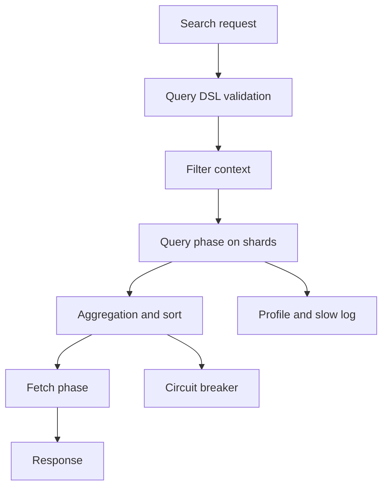

# 查询、分页、聚合与优化

## 一句话定义

ES 查询优化是围绕 query DSL、filter context、排序、分页、aggregation 和资源保护的系统设计。深分页用 search_after 和 PIT，深桶聚合用 composite aggregation，高成本查询要受 timeout、circuit breaker 和 slow log 管控。

## 面试定位

这类题常见于后端面试。面试官希望你能从查询语义、索引设计、分页方案、聚合成本和集群资源几个层面定位问题，而不是只说“加索引”。

回答要覆盖架构、数据流、指标、取舍和追问。

## 为什么需要它

ES 查询慢可能来自 query DSL 不合理、mapping 不合适、深分页、聚合字段高基数、shard 过多、segment 太多、缓存失效或 JVM 压力。优化要先定位，再改设计。

## 核心架构

| 问题 | 推荐方案 | 风险 |
| --- | --- | --- |
| 过滤条件 | filter context | 别用 script 滥算 |
| 深分页 | search_after + PIT | 不适合随机跳页 |
| 深桶聚合 | composite aggregation | 需要分页拉取 |
| 高基数字段 | 预聚合或限制 | 内存压力 |
| 慢查询定位 | profile API + slow log | 线上谨慎开启 |

## 架构与运行机制

查询阶段先在各 shard 执行 query DSL 和 filter，再返回候选 doc id、score 和排序值。Fetch 阶段取回文档字段。聚合在 shard 上局部计算，再由 coordinating node 合并。

filter context 不计算相关性得分，适合租户、状态、时间范围和枚举过滤。深分页如果用 from/size，会让每个 shard 维护大量排序结果。search_after 搭配 PIT 可以稳定地向后翻页。

## 运行机制

1. Search API 校验用户参数和字段白名单。
2. filter context 先缩小候选范围。
3. query phase 在 shard 内执行检索、排序和聚合。
4. coordinating node 合并各 shard 结果。
5. fetch phase 取回必要字段。
6. slow log、profile API 和指标用于定位瓶颈。

## 关键设计取舍

| 取舍 | 收益 | 代价 | 建议 |
| --- | --- | --- | --- |
| from/size | 简单 | 深分页很贵 | 只用于浅页 |
| search_after + PIT | 稳定深翻页 | 不能随机跳页 | 列表滚动 |
| terms aggregation | 简单 | 高基数危险 | 限制字段和 size |
| composite aggregation | 可分页 | 实现复杂 | 大规模桶遍历 |

## 生产落地细节

- 对外 Search API 要限制字段、排序、分页深度、聚合字段和时间范围。
- 查询模板版本化，避免用户直接提交任意 query DSL。
- 高成本聚合做预聚合、异步任务或缓存。
- 监控 search_latency、query_time、fetch_time、aggregation_time、heap、circuit_breaker_tripped 和 rejected_requests。
- 慢查询样本要进入回归集，防止新版本 DSL 退化。

## 系统设计案例

订单搜索后台支持按关键词、时间、状态、用户和金额过滤。API 层先校验字段白名单，时间范围必须有限制。列表页浅分页用 from/size，导出或滚动查询使用 PIT + search_after。

数据流是：参数校验 -> DSL 构建 -> filter context -> query/fetch -> 聚合或分页 -> slow log trace。这样既能满足业务，又避免任意查询拖垮集群。

## 真实问题与排障

查询突然变慢时，先看是 query phase、fetch phase 还是 aggregation 慢。再看最近 mapping、数据量、shard、segment、GC 和缓存变化。profile API 可定位具体 query 子句，但线上要控制采样。

## 常见误区与排障

- 用 from/size 做深分页。
- 对高基数字段随意 terms aggregation。
- 把用户参数直接拼 query DSL。
- 不限制时间范围和 size。
- 只看平均延迟，不看 p95/p99。

## 面试追问

- query context 和 filter context 区别是什么？
- search_after 为什么适合深分页？
- PIT 解决什么问题？
- composite aggregation 适合什么场景？
- circuit breaker 为什么会触发？

## 项目化表达

项目里可以说：“我把 ES 查询做成受控 Search API。参数白名单限制用户输入，filter context 提前缩小范围，深分页用 PIT + search_after，大规模聚合用 composite aggregation 或异步预聚合，并用 slow log/profile 做回归。”

## 深入技术细节

ES 查询慢要先区分 query phase、fetch phase、aggregation 和集群资源。query phase 慢常见于 wildcard、script、低选择性 filter、shard fan-out 或 analyzer 不匹配。fetch phase 慢可能是 `_source` 太大、highlight 成本高、返回字段过多。aggregation 慢常见于高基数字段、大范围时间窗口、nested 聚合或 fielddata 误用。资源层要看 heap、GC、search thread pool、circuit breaker、磁盘 IO 和 segment 数量。

优化不是“加机器”优先。filter context 可以利用缓存且不参与评分；深分页不要用 from/size 堆大候选，改用 PIT + search_after；大 terms aggregation 可以改 composite aggregation 分页拉取；高频统计可预聚合或用 rollup 思路；脚本排序应尽量改成索引时预计算字段。每个优化都有取舍，限制 DSL 能保护集群但会降低灵活性，预聚合能降延迟但牺牲实时性。

## 关键数据结构与协议

搜索请求建议显式记录 `query_hash`、index alias、time_range、filter fields、sort fields、from/size 或 PIT/search_after、aggregation names、track_total_hits、timeout。慢查询样本要保存 DSL、profile result、shard count、hit count、aggregation buckets、response size 和用户场景。

Profile API 输出能看到 query tree 中各节点耗时，但线上使用要控制采样，避免对每个请求开启。监控指标包括 search_latency_p95、query_time、fetch_time、aggregation_time、request_cache_hit_rate、fielddata_evictions、circuit_breaker_tripped、search_rejected、heap_used_percent、hot_threads。

## 深问准备

- 追问 filter context：说明不评分、可缓存、适合精确过滤。
- 追问 search_after：说明依赖稳定排序，常和 PIT 保持一致视图。
- 追问 composite aggregation：说明适合大基数分页聚合，不是一次性拿全量 buckets。
- 追问 profile API：说明用于定位 DSL 瓶颈，不是常态线上全量开启。

## 来源与延伸阅读

- [Elasticsearch Query DSL](https://www.elastic.co/guide/en/elasticsearch/reference/current/query-dsl.html)
- [Elasticsearch Paginate search results](https://www.elastic.co/guide/en/elasticsearch/reference/current/paginate-search-results.html)
- [Elasticsearch Search profile API](https://www.elastic.co/guide/en/elasticsearch/reference/current/search-profile.html)
- [Elasticsearch Composite aggregation](https://www.elastic.co/guide/en/elasticsearch/reference/current/search-aggregations-bucket-composite-aggregation.html)
