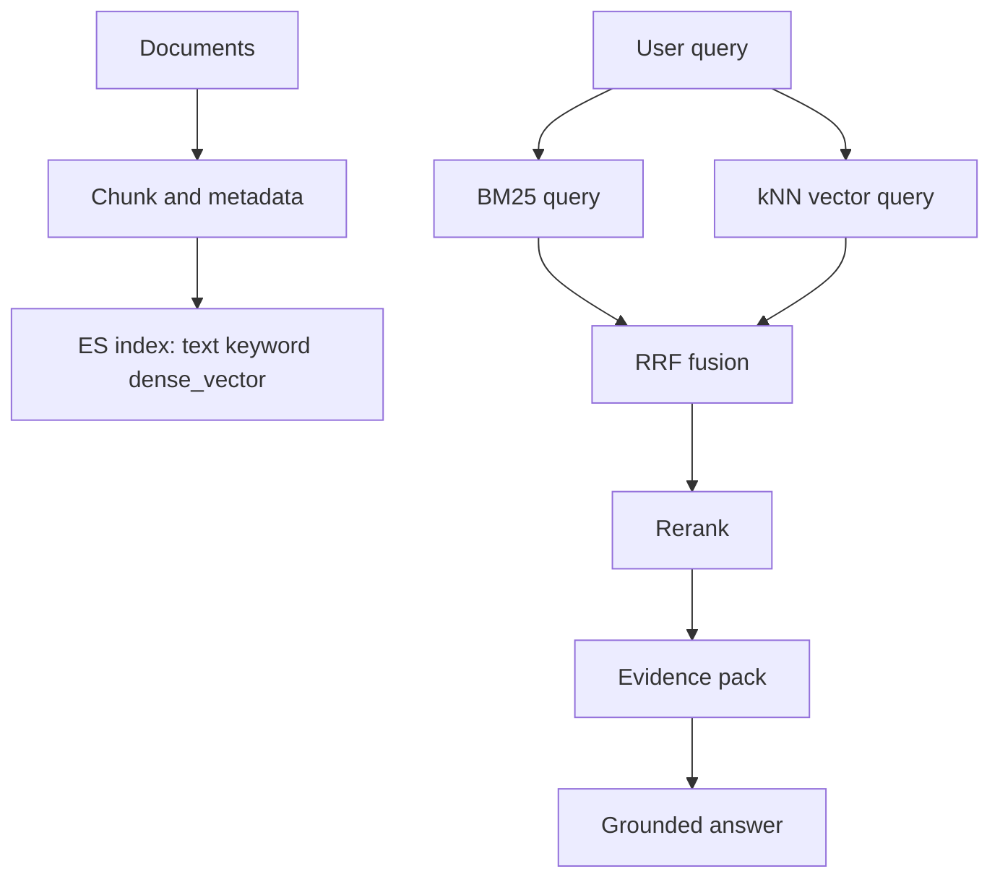

# ES 与 RAG Hybrid Search

## 一句话定义

ES 在 RAG Hybrid Search 中可以同时承载 BM25、metadata filter、dense_vector、kNN 和 RRF 融合，形成 lexical + semantic 的召回层，再把候选交给 rerank 与 citation grounding。

## 面试定位

这题连接 ES 和 AI 应用。面试官想看你能否把传统搜索经验迁移到 RAG，而不是只说“ES 支持向量”。

回答要覆盖架构、数据流、指标、取舍和追问。重点是 metadata、BM25、向量、RRF、rerank 的职责边界。

## 为什么需要它

RAG 不应该只依赖向量检索。企业知识库里有产品名、接口名、错误码、版本号和权限字段，BM25 与 metadata filter 很重要。ES 的优势是把全文检索、过滤、排序、聚合和向量召回放在同一个搜索系统里治理。

## 核心架构

图 1：ES Hybrid Search 把文档解析、文本字段、向量字段、用户查询、双路召回、RRF 融合、rerank 和 grounded answer 串成一条 RAG 检索链路。

图中 `ES index` 是召回层边界，负责 text、keyword、metadata 和 dense_vector 的统一检索；`RRF fusion` 是排序融合边界，避免直接相加不同检索器的分数；`Evidence pack` 是生成前的证据边界，只有通过 rerank 和 citation grounding 的片段才应进入答案上下文。这个边界能把“搜到候选”和“可被引用”分开。

| 层次 | ES 能力 | RAG 作用 |
| --- | --- | --- |
| text field | BM25 和 analyzer | lexical recall |
| keyword/date | filter 和权限 | metadata filter |
| dense_vector | embedding 存储 | semantic recall |
| kNN | 近似向量检索 | 候选召回 |
| RRF | 排名融合 | 合并 BM25 与向量 |

## 架构与运行机制

文档入库时要做 chunk，并保存 doc_id、section、tenant、version、updated_at、permission 和 dense_vector。查询时先应用 metadata filter，再运行 BM25 与 kNN。候选通过 RRF 融合，避免不同打分体系直接相加。

融合后的候选并不等于最终上下文。Rerank 要判断 answerability，Citation Grounding 要检查 claim 是否被 evidence span 支持。

## 运行机制

1. 文档解析成 chunks，并写入 text、keyword、metadata 和 dense_vector。
2. 用户 query 生成关键词查询和 embedding。
3. ES 执行 BM25、kNN 和 metadata filter。
4. RRF 融合两个召回列表。
5. Rerank 选出 top evidence。
6. Grounded generator 生成带 citation 的答案。
7. Eval 记录 recall、precision、citation_precision 和延迟。

## 关键设计取舍

| 取舍 | 好处 | 代价 | 建议 |
| --- | --- | --- | --- |
| ES 统一承载 | 运维简单 | 向量能力受版本影响 | 中小知识库合适 |
| 独立向量库 | 专项能力强 | 多系统一致性 | 大规模向量场景 |
| BM25 + kNN | 覆盖广 | 候选噪声多 | 必配 rerank |
| 只用 kNN | 简单 | 精确词弱 | 不建议生产独用 |

## 生产落地细节

- chunk 粒度要按段落和标题组织，避免证据过粗。
- metadata filter 必须包含租户、权限、版本和时间。
- dense_vector 的维度、模型版本和归一化策略要记录。
- RRF 参数和各路 top_k 要通过消融实验调。
- 指标包括 recall@k、precision@k、citation_precision、rerank_lift、query_latency 和 index_refresh_lag。

落地时建议把检索 trace 作为一等产物保存下来，而不是只保存最终回答。一次 trace 至少包含 query rewrite、metadata filter、BM25 命中、kNN 命中、RRF 排名、rerank 前后名次、进入上下文的 evidence span 和最终 citation。这样当用户反馈“答案看起来对但引用不对”时，可以判断是召回漏证据、融合排序错、rerank 误判，还是生成层把证据外推了。

索引演进也要提前设计。embedding 模型升级时不要直接覆盖旧 `dense_vector` 字段，而是新增向量字段或新索引，保留 `embedding_model_version`，用同一批 gold queries 回放 BM25-only、kNN-only、hybrid 和 hybrid+rerank。只有 recall、citation_precision、permission_leak_count、latency 都在可接受范围内，才把线上流量切到新字段或新 alias。

## 系统设计案例

企业知识库问答使用 ES 存储制度文档。text 字段用于 BM25，keyword 字段用于部门和权限，dense_vector 字段用于语义召回。用户问题同时跑 BM25 和 kNN，RRF 融合后交给 reranker。

数据流是：文档 -> chunk -> ES index -> hybrid query -> RRF -> rerank -> evidence pack -> answer。若答案引用错误，能沿 trace 查到候选来自 BM25 还是 kNN。

## 真实问题与排障

如果召回缺少精确错误码，检查 analyzer、text/keyword 字段和 BM25 路径。若向量召回噪声多，检查 chunk、embedding 模型、kNN top_k 和 rerank。若权限泄漏，首先查 metadata filter。

事故处理要按影响面、止血、根因、回归拆开。影响面先看 query 类别、租户、权限范围、unsupported claim、citation_precision 和 query_latency_p95；止血可以临时降低 vector top_k、关闭高风险文档集合、回退 embedding_model_version、只放行 BM25+metadata 的保守路径，或在生成层拒答低置信 evidence；根因要回放同一 query 的 BM25-only、kNN-only、hybrid 和 rerank trace，确认问题来自 analyzer、chunk、向量版本、RRF 参数还是权限过滤；回归要把事故 query 加入 eval set，并保存 retrieved chunk、rank、rrf_score、rerank_score 和最终 citation。

## 常见误区与排障

- 把向量检索当成 RAG 全部。
- metadata filter 放到生成后。
- dense_vector 模型版本不记录。
- RRF 融合后不保存来源。
- 不做 BM25-only、kNN-only、hybrid 的消融。

## 面试追问

- ES 的 BM25 和 kNN 如何融合？
- RRF 为什么比直接分数相加稳？
- dense_vector 的模型升级怎么处理？
- ES 和独立向量库如何选型？
- 如何评测 RAG hybrid search？

## 项目化表达

项目里可以说：“我用 ES 同时承载 text、keyword、metadata 和 dense_vector。BM25 兜住精确词，kNN 做语义召回，RRF 融合候选，rerank 和 citation verifier 控制最终证据质量。”

## 公开阅读校验

面向公开读者时，要把 Hybrid Search 写成可验证链路，而不是“BM25 加向量”的口号。读者应该能看到：metadata filter 为什么必须前置，RRF 为什么处理的是排名而不是原始分数，rerank 为什么只作用在小候选集，citation verifier 为什么检查 claim 与 evidence 的支撑关系。如果缺少这几层边界，文章会让人误以为 ES 只是在向量库旁边多跑一次关键词搜索。

## 深入技术细节

Hybrid Search 的关键是把 lexical、semantic、metadata 三类信号分开。BM25 擅长错误码、函数名、专有名词、版本号和短精确词；向量检索擅长同义表达和语义相关；metadata filter 负责 tenant、department、doc_type、version、time_range 等权限和范围约束。只用向量会漏掉精确术语，只用 BM25 会漏掉自然语言改写，所以生产 RAG 通常采用双路召回。

融合阶段要避免简单拼接分数，因为 BM25 和向量分数尺度不同。RRF 通过排名融合降低分数归一化难度，也能保留多路候选。融合后还要 rerank，判断 query 和 chunk 是否真的能支持答案。最后 grounding/verifier 检查答案中的 claim 是否被 citation 覆盖。深问时要说明：召回高不等于可回答，排序高不等于可引用，生成流畅不等于事实正确。

## 关键数据结构与协议

文档 chunk 应包含 `chunk_id`、`doc_id`、`title_path`、`section_path`、`text`、`embedding_model_version`、`acl`、`doc_version`、`updated_at`、`source_url`。检索结果要保留 `retriever_type`、`rank`、`score`、`rrf_score`、`rerank_score` 和 `evidence_id`。这样答案生成后可以追踪每个 claim 来自哪条 evidence。

RAG 评测要覆盖 recall@k、precision@k、MRR、citation_precision、unsupported_claim_rate、rerank_lift、answerability_rate、permission_leak_count、query_latency_p95。消融实验至少比较 BM25 only、vector only、BM25+vector、BM25+vector+rerank，才能证明 Hybrid Search 的收益。

## 深问准备

- 追问 RRF：说明按排名融合，适合不同检索器分数不可比的场景。
- 追问 dense_vector 升级：回答双写新向量字段、版本化 embedding_model、离线回放评测后切流量。
- 追问 metadata filter 位置：必须在召回前或召回中前置过滤，不能生成后才过滤。
- 追问 ES 和向量库选择：ES 适合搜索、过滤、聚合和向量一体化，专用向量库适合超大规模向量检索和特定索引能力。

## 来源与延伸阅读

- [Elasticsearch kNN search 官方文档](https://www.elastic.co/guide/en/elasticsearch/reference/current/knn-search.html)：用于支持 ES 可在同一检索链路中执行近似向量召回和过滤的机制说明。
- [Elasticsearch Dense vector field 官方文档](https://www.elastic.co/guide/en/elasticsearch/reference/current/dense-vector.html)：用于确认 dense_vector 字段、embedding 版本和索引建模的语义边界。
- [Elasticsearch RRF 官方文档](https://www.elastic.co/guide/en/elasticsearch/reference/current/rrf.html)：用于说明为什么 BM25 与 kNN 分数不宜直接相加，以及 RRF 如何按排名融合多路候选。
- [OpenAI Cookbook: Elasticsearch RAG](https://developers.openai.com/cookbook/examples/vector_databases/elasticsearch/elasticsearch-retrieval-augmented-generation)：用于补充 ES 作为 RAG 检索后端的工程实践，包括索引、召回和生成链路衔接。
