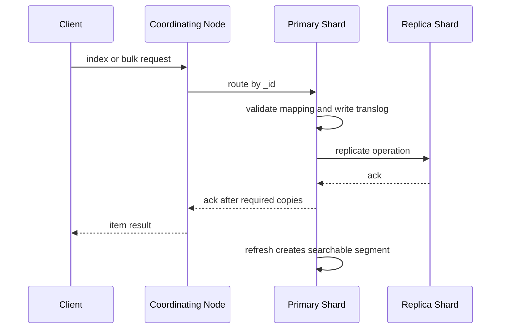

# 分片副本与写入链路

## 一句话定义

ES 写入链路是文档先路由到 primary shard，再复制到 replica，并通过 translog、refresh、segment 和 in-sync copies 管理持久性、可见性与副本一致性的过程。

## 面试定位

面试官问写入链路，通常想看你是否理解“写入成功”和“可搜索”不是一回事，以及 primary shard、replica、refresh、translog、segment merge 分别解决什么问题。

回答要覆盖架构、数据流、指标、取舍和追问。不要只说“写到分片再同步副本”。

## 为什么需要它

ES 是分布式搜索引擎，写入要同时考虑路由、并发、持久化、副本、近实时可见和失败恢复。理解写入链路，才能排查数据不可见、写入慢、bulk 部分失败和副本不一致。

## 核心架构

图 1 里要把三个状态拆开：客户端拿到 item result 只说明写入链路被 primary 和要求的副本接受；translog 关系到崩溃恢复；refresh 之后 searcher 才能看到新的 segment。面试时如果能把 accepted、durable、searchable 分开，就能解释“写入成功但搜索不到”的大部分现场。

| 阶段 | 作用 | 关键点 |
| :--- | :--- | :--- |
| routing | 决定目标 primary shard | 默认按 _id hash |
| primary write | 校验 mapping 并写 translog | primary 先处理 |
| replica write | 复制到 in-sync copies | 副本 ack 影响结果 |
| refresh | 生成可搜索 segment | 写入成功后不一定可搜 |
| merge | 合并 segment | 后台影响 IO |

| 状态 | 由什么决定 | 用户现象 | 排障入口 |
| --- | --- | --- | --- |
| write accepted | primary shard 和 bulk item result | 客户端收到单条成功 | bulk item status |
| replicated | in-sync replica ack | 副本确认或集群 yellow | shard allocation 与 health |
| durable | translog 与 flush/checkpoint | 节点重启后能恢复 | translog stats 与 checkpoint |
| searchable | refresh 打开新 segment | 搜索请求能看到文档 | refresh stats、alias、routing |

## 架构与运行机制

写请求先到 coordinating node，再按 routing 找到 primary shard。primary 执行写入、写 translog，并把操作复制给 replica。达到要求的副本确认后，客户端收到结果。

refresh 会把内存中的 indexing buffer 变成可搜索 segment，因此 ES 是 near real-time。translog 用于故障恢复，segment merge 用于减少小 segment，但会消耗 IO。

## 运行机制

1. Client 发起 index、update 或 bulk。
2. Coordinating node 根据 routing 定位 primary shard。
3. Primary shard 解析 mapping、写入 buffer 和 translog。
4. 写操作复制到 replica shard。
5. in-sync copies 达到要求后返回 ack。
6. refresh 后文档进入可搜索视图。
7. 后台 merge 合并 segment，降低查询开销。

## 关键设计取舍

| 取舍 | 收益 | 代价 | 建议 |
| :--- | :--- | :--- | :--- |
| 更短 refresh_interval | 搜索更实时 | 写入吞吐下降 | 搜索 SLA 决定 |
| 更多 replica | 查询和容灾更好 | 写入放大 | 读多场景使用 |
| bulk 更大 | 吞吐高 | 单批失败影响大 | 控制批大小 |
| shard 更多 | 分摊数据 | 管理和查询开销 | 按容量规划 |

## 生产落地细节

- bulk 写入要处理 item 级失败，而不是只看 HTTP 状态。
- 对高写入索引用合理 refresh_interval，必要时写入期延长 refresh。
- 使用 alias 和 rollover 管理重建索引和版本切换。
- 关注 thread pool rejected、indexing_latency、refresh_time、merge_time、translog_size 和 replica_sync。
- 写入链路要有幂等文档 ID，避免重试产生重复数据。

写入治理还要明确“客户端成功语义”。业务调用方拿到 HTTP 200 时，仍要读取 bulk item 的 status、error type、`_id`、`_seq_no` 和 `_primary_term`。如果同步链路来自 MQ 或 CDC，消费者要把失败 item 原因带入 DLQ，并区分 mapping conflict、version conflict、routing 错误、集群限流和临时网络失败。只有这样，重试策略才不会把不可重试的坏数据反复打到集群。

## 系统设计案例

日志索引写入时，应用日志通过采集器进入 ES。高峰期使用 bulk 写入，按时间滚动索引。refresh_interval 可以放宽到数秒，换取更高吞吐。

数据流是：collector -> bulk request -> primary shard -> replica -> refresh -> searchable。若用户查不到新日志，先看 bulk item result 和 refresh，而不是直接认为数据丢了。

## 真实问题与排障

写入慢时，先看 bulk 大小、mapping 动态字段、磁盘 IO、refresh 和 merge。数据不可搜索时，检查 refresh、alias、routing 和查询时间范围。副本异常时，看 in-sync copies、节点状态和 shard allocation。

故障现场可以这样拆：商品服务 bulk 同步 ES，HTTP 返回 200，但运营后台搜不到部分新商品。影响面先看缺失商品数量和时间窗口；证据先查 bulk item result，而不是只看 HTTP 状态；止血可以暂停增量消费者、保留失败 item 并临时从主库读取；根因常见是 mapping conflict、旧 MQ 事件覆盖新版本、写入 alias 指错或 refresh 未完成；修复后要把失败 item、旧版本事件和 alias 切换都加入回归用例。

## 常见误区与排障

- 以为写入成功就马上可搜索。
- bulk 只看整体状态，不看 item failure。
- shard 数随意设置。
- refresh_interval 过短导致写入抖动。
- update 大量使用导致读改写成本高。
- 反例：如果业务要求付款后立刻强一致读到最新状态，不应该把 ES 当事实源，应该读主库或用明确 refresh 策略承担吞吐代价。
- 反例：如果数据通过 MQ 同步，不能让旧事件无条件覆盖新文档，必须用业务 version、`if_seq_no`/`if_primary_term` 或更新时间保护。

## 面试追问

- primary shard 和 replica 的职责是什么？
- translog 与 segment 分别做什么？
- refresh 和 flush 的区别是什么？
- bulk 部分失败如何处理？
- 为什么写入高峰查询会变慢？

## 项目化表达

项目里可以说：“我把 ES 写入看成近实时搜索视图同步链路。写入先到 primary shard，再复制 replica，translog 保证恢复，refresh 决定可搜索时间。排障时按 bulk、routing、refresh、merge 和副本同步分段定位。”

## 公开阅读校验

这篇文章给公开读者时，重点不是记住 primary、replica、translog 这些名词，而是理解三个边界：写入被接受不等于已经搜索可见，bulk 整体成功不等于每条 item 成功，搜索视图同步成功不等于 ES 可以替代主库。只要文章能持续围绕这三个边界展开，读者在遇到“写进去了但搜不到”“HTTP 200 但少数据”“重试后数据被旧事件覆盖”时就能按证据排查。

## 深入技术细节

写入链路第一步是 routing。默认按 `_id` hash 到 shard，也可以用业务 routing key，但 routing key 选错会造成热点 shard。coordinating node 把请求转发给 primary shard，primary 做 mapping 解析、版本冲突检查、写入内存 buffer 和 translog，再复制给 in-sync replica。客户端收到成功通常表示 primary 和要求的副本确认了写操作，但这不等于文档已经进入 searcher 可见视图。

refresh 会把内存中的变更打开成新的 segment，使其可搜索；flush 则和 translog checkpoint、持久化恢复相关。merge 会把小 segment 合并成大 segment，降低查询开销，但会消耗 IO 和 CPU。bulk 写入要逐条看 item result，因为 HTTP 层成功不代表每条都成功。深问时能说出这些状态差异，就不会停留在“ES 写入很快”的层面。

## 关键数据结构与协议

写入请求应关注 `_index`、`_id`、`routing`、`op_type`、`if_seq_no`、`if_primary_term`、refresh policy、pipeline 和 bulk item status。内部状态可以用 `seq_no`、`primary_term`、translog generation、global checkpoint、in-sync allocation ids 来理解恢复和复制。

业务同步事件建议带 `entity_id`、`entity_version`、`operation`、`source_updated_at`、`idempotency_key`。消费者写 ES 时按 version 防止旧消息覆盖新状态，失败进入 retry 和 DLQ。指标包括 bulk_item_failure_rate、indexing_latency_p95、refresh_total_time、merge_throttle_time、translog_size、replica_ack_latency、thread_pool_write_rejected。

## 深问准备

- 追问 refresh 和 flush：refresh 影响搜索可见性，flush 影响 translog 和恢复边界。
- 追问 replica 写失败：说明 in-sync copies、重试、分片分配和 yellow/red health。
- 追问 bulk 部分失败：按 item 重试，保留失败原因，避免整批盲目重放。
- 追问强实时查询：可以显式 refresh 或读主库，但要讲吞吐代价。

## 来源与延伸阅读

- [Elasticsearch Index API](https://www.elastic.co/guide/en/elasticsearch/reference/current/docs-index_.html)：用于说明 index/write 请求和 refresh policy 的 API 语义。
- [Elasticsearch Near real-time search](https://www.elastic.co/guide/en/elasticsearch/reference/current/near-real-time.html)：用于支持“写入成功不等于立刻可搜索”的近实时边界。
- [Elasticsearch Bulk API](https://www.elastic.co/guide/en/elasticsearch/reference/current/docs-bulk.html)：用于说明 bulk item 级结果和部分失败处理。
- [Elasticsearch Translog](https://www.elastic.co/guide/en/elasticsearch/reference/current/index-modules-translog.html)：用于确认 translog、flush 和恢复语义。
