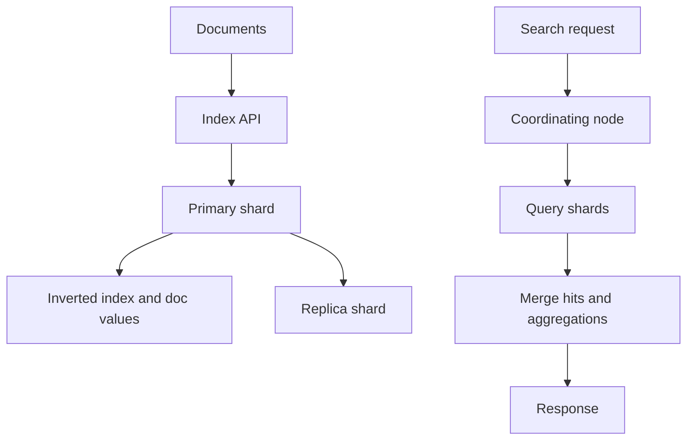

# ES 使用场景与边界

## 一句话定义

Elasticsearch 是面向 search、日志分析和 aggregation 的 near real-time 分布式检索引擎。它基于 inverted index、mapping、shard 和 segment 提供高性能检索，但不适合替代关系数据库做强事务主存储。

## 面试定位

面试官问 ES 边界，不是想听“ES 搜索很快”。真正考察的是你是否理解倒排索引、近实时、分片、副本、映射和查询模型，以及什么时候不该用 ES。

回答要覆盖架构、数据流、指标、取舍和追问。尤其要把 ES 与 MySQL、缓存、RAG 检索的边界讲清楚。

## 为什么需要它

业务系统常有全文搜索、日志检索、商品筛选、监控分析和知识库召回需求。关系数据库可以做简单查询，但面对复杂文本检索、多字段过滤、排序和聚合时，ES 更合适。

同时，ES 的 near real-time 语义、分布式写入成本和 mapping 约束，决定它不适合作为强一致交易库。

## 核心架构

| 场景 | ES 适合度 | 原因 | 边界 |
| :--- | :--- | :--- | :--- |
| 全文搜索 | 高 | inverted index 和 relevance | 需要正确 analyzer |
| 日志检索 | 高 | 时间序列和 aggregation | 成本治理重要 |
| 商品筛选 | 中高 | filter、sort、聚合 | 主数据仍在数据库 |
| 强事务订单 | 低 | near real-time | 不能替代 OLTP |
| RAG 召回 | 中高 | BM25、metadata、dense_vector | 需要 rerank |

## 架构与运行机制

ES 将文档写入 index，再按 mapping 构建倒排索引和列式 doc values。搜索时，coordinating node 将 query DSL 分发到相关 shard，各 shard 返回局部结果，最后汇总排序和聚合。

near real-time 意味着写入成功不等于立刻可搜索。refresh 之后新 segment 才进入搜索视图。这个边界在同步链路和面试回答中要讲清楚。

## 运行机制

1. 业务数据从主库、日志系统或事件流进入 ES。
2. Indexing 根据 mapping、analyzer 和字段类型构建索引。
3. refresh 让新 segment 可搜索。
4. 查询请求进入 coordinating node。
5. Query phase 在 shard 内执行检索和过滤。
6. Fetch phase 取回文档字段并合并结果。

## 关键设计取舍

| 取舍 | 收益 | 代价 | 建议 |
| --- | --- | --- | --- |
| 多 shard | 横向扩展 | 查询 fan-out 增加 | 按数据量规划 |
| 多 replica | 查询吞吐和容灾 | 写入成本上升 | 读多场景增加 |
| keyword/text | 精确或全文 | mapping 不当难改 | 提前建模 |
| refresh 短 | 可见性快 | 写入压力上升 | 按业务 SLA |

## 生产落地细节

- 主数据仍应在数据库，ES 做搜索视图或分析视图。
- mapping 设计要区分 text、keyword、date、numeric 和 dense_vector。
- 高频过滤字段要考虑 doc values 和 query cache。
- 使用 alias、rollover、ILM 管理索引生命周期。
- 指标包括 indexing_latency、refresh_time、search_latency、heap_usage、segment_count、rejected_requests 和 disk_watermark。

## 系统设计案例

商品搜索系统可以用数据库保存交易一致性数据，用 ES 保存搜索视图。商品变更通过 MQ 或 CDC 同步到 ES。用户搜索时，ES 做关键词召回、过滤、排序和聚合，详情页再回源主库或缓存。

数据流是：DB update -> event -> index document -> refresh -> search。若同步延迟，页面要接受短暂近实时差异，不能把 ES 当强一致主库。

## 真实问题与排障

如果搜索结果缺最新数据，先看写入是否成功、refresh 是否发生、alias 是否指向正确索引。若查询慢，查看 query DSL、shard 数、segment、heap、slow log 和 profile API。

排障时要分清写入延迟、refresh 延迟、mapping 问题和查询设计问题。

## 常见误区与排障

- 把 ES 当强事务数据库。
- mapping 随便建，后期大量重建索引。
- shard 越多越好。
- 忽略 refresh 的 near real-time 边界。
- 用深分页拖垮集群。

## 面试追问

- inverted index 和 doc values 分别解决什么？
- near real-time 是什么意思？
- ES 和 MySQL 的边界是什么？
- shard 数如何规划？
- 什么场景不应该用 ES？

## 项目化表达

项目里可以说：“我把 ES 定位为搜索视图，不是交易主库。主数据由数据库保证一致性，ES 负责全文检索和聚合，写入链路用事件同步，并用 alias、mapping 和 slow log 做治理。”

## 深入技术细节

ES 的核心价值来自倒排索引、列式 doc values、分片并行和近实时 refresh。写入文档时，text 字段经 analyzer 变成 term，term 写入 inverted index；keyword、numeric、date 字段通常用于 filter、sort、aggregation。查询时 query phase 在各 shard 内找候选并评分，fetch phase 再取回文档字段。这个链路决定了 ES 适合全文检索、日志检索、筛选聚合和 RAG lexical recall，但不适合作为强事务主库。

边界要讲清：near real-time 不是强实时，refresh 之前写入成功的文档可能不可搜；分布式查询有 fan-out 成本，shard 过多会拖慢协调和内存；mapping 一旦不合理，后期修复往往要 reindex。把这些限制讲出来，比只说“ES 快”更像真实工程经验。

## 关键数据结构与协议

索引设计要关注 `index_template`、`mapping`、`settings`、`alias` 和 `refresh_interval`。字段层要区分 `text`、`keyword`、`date`、`long`、`nested`、`dense_vector`。搜索请求对象通常包含 query DSL、filter context、sort、from/size 或 search_after、aggs、source filtering、timeout 和 track_total_hits。

同步协议建议包含 `event_id`、`entity_id`、`op_type`、`version`、`occurred_at`、`payload_hash`、`retry_count` 和 `dead_letter_reason`。这样 ES 作为查询视图时，能处理重复消息、乱序更新和重建索引。监控要看 search_latency_p95、indexing_rate、refresh_time、merge_time、heap_usage、rejected_requests、segment_count。

## 深问准备

- 追问“为什么不用 MySQL like”：解释分词、倒排索引、相关性评分和多字段聚合。
- 追问“为什么不用 ES 做主库”：讲事务、强一致、更新冲突、refresh 可见性和数据恢复边界。
- 追问“mapping 错了怎么办”：回答新建索引、reindex、alias 切换和双写校验。
- 追问“什么时候不用 ES”：低数据量、强事务、简单主键查询、严格实时一致场景优先主库。

## 来源与延伸阅读

- [Elasticsearch Near real-time search](https://www.elastic.co/guide/en/elasticsearch/reference/current/near-real-time.html)
- [Elasticsearch Mapping](https://www.elastic.co/guide/en/elasticsearch/reference/current/mapping.html)
- [Elasticsearch Query DSL](https://www.elastic.co/guide/en/elasticsearch/reference/current/query-dsl.html)
- [Elasticsearch Shards and replicas](https://www.elastic.co/guide/en/elasticsearch/reference/current/scalability.html)
