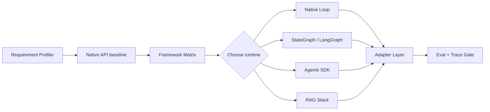

# Agent 框架选型

## 面试定位

Agent 框架选型考的是工程判断。面试官想听你如何在 Native API baseline、LangGraph StateGraph、OpenAI Agents SDK、RAG 框架和团队维护成本之间做取舍，而不是背框架名。

## 一句话定义

Agent 框架选型是基于任务复杂度、状态模型、工具数量、handoff、guardrails、tracing、eval、部署和 lock-in 风险，选择原生实现或框架的工程决策。

## 为什么需要它

Agent 项目很容易“为了框架而框架”。简单任务用原生 API 更透明，复杂状态和长期执行需要 StateGraph 或 workflow。多 Agent handoff、guardrails 和 tracing 场景可能适合 Agents SDK。数据密集 RAG 又可能需要检索框架。选型必须先有 baseline，再比较收益和成本。

## 核心架构

图 1：Agent 框架选型先从 Requirement Profiler 和 Native API baseline 开始，再通过 Framework Matrix 选择 Native Loop、StateGraph、Agents SDK 或 RAG Stack，并统一接入 Adapter Layer 与 Eval/Trace Gate。

图中 `Native API baseline` 是判断框架是否值得引入的对照组；`Framework Matrix` 是选型决策边界，把状态复杂度、工具数量、handoff、guardrails、tracing、部署和团队能力放在一起评估；`Adapter Layer` 是 lock-in 边界，业务代码依赖内部接口而不是直接散落框架 API；`Eval + Trace Gate` 是上线边界，只有 golden case、trace 覆盖和成本延迟指标达标，框架实现才应保留。

Adapter Layer 让业务代码依赖内部 AgentRuntime 接口，而不是到处直接调用框架 API。

## 架构与运行机制

选型流程先做 Requirement Profiler：状态复杂度、工具数量、外部副作用、人工确认、恢复需求、延迟预算、团队语言栈。然后实现 baseline，记录 task_success_rate、p95_latency、cost_per_success、trace_coverage 和 unsafe_action_block_rate。最后用 Framework Matrix 比较 StateGraph、Agents SDK、RAG stack 和原生 loop。

核心数据流是需求画像进入 baseline，baseline 指标进入 Framework Matrix，候选 runtime 通过 Adapter Layer 接入业务，最终由 eval 与 trace gate 决定是否保留。

StateGraph 适合显式状态图、checkpoint、interrupt 和 human-in-the-loop。Agents SDK 适合 OpenAI 生态里的 tools、handoffs、guardrails 和 tracing。Native API 适合简单 loop 或强定制。无论选什么，tool schema、权限、eval 和 trace 都不能省。

## 运行机制

选型结论要说明迁移条件。比如 baseline 已能覆盖 80% 简单任务，只有当状态恢复、并行节点或人工审批变复杂时才引入 LangGraph。框架接入后要通过 Adapter Layer、contract tests 和 eval gate 防 lock-in。

## 关键设计取舍

| 方案 | 适用场景 | 优点 | 风险 |
| --- | --- | --- | --- |
| Native API baseline | 简单 loop、强定制 | 透明、依赖少 | state/trace 要自建 |
| StateGraph | 复杂状态和恢复 | checkpoint 清晰 | 图膨胀 |
| Agents SDK | handoff、guardrails、tracing | 集成度高 | 生态绑定 |
| RAG stack | 数据连接和检索 | 索引能力强 | Agent 控制流有限 |

## 生产落地细节

选型表要覆盖 state、checkpoint、tool schema、handoff、guardrails、tracing、eval、deployment、debuggability、team_skill 和 lock-in。指标包括 `implementation_complexity`、`debug_time`、`framework_error_rate`、`eval_integration_cost`、`migration_risk` 和 `direct_framework_dependency_ratio`。

## 系统设计案例

Paper Agent 以 RAG 和 citation 为核心，可以先用 Native API + 检索栈。Travel Agent 有多阶段规划、确认和恢复，可以考虑 StateGraph。客服 Agent 有多角色 handoff 和 guardrails，可以考虑 Agents SDK。最终都通过 Adapter Layer 暴露统一 ToolDispatcher、StateStore、TraceStore 和 EvalRunner。

## 真实问题与排障

如果框架后调试困难，先查 trace 是否能看到工具、状态和 handoff。若延迟上升，拆分框架 overhead、模型耗时和工具耗时。若团队改不动，说明抽象过厚或 lock-in 过强。若功能简单但代码复杂，应回退到 Native API baseline。

## 常见误区与排障

- 只因为流行就引入框架。
- 没有 baseline，无法证明框架收益。
- 业务代码直接依赖框架对象，迁移成本失控。
- 用框架掩盖对 loop、state、tool 和 eval 的理解不足。

## 面试追问

1. 什么时候不用框架？任务线性、状态少、团队需要透明控制时。
2. LangGraph 和 Agents SDK 怎么选？前者偏状态图和恢复，后者偏 tools、handoff、guardrails、tracing。
3. 怎么防 lock-in？Adapter Layer、contract tests、数据格式隔离。
4. 如何证明选型有效？同一批 golden case 对比 baseline 与框架实现。

## 项目化表达

可以说：我先做 Native API baseline，再用 Framework Matrix 对比 StateGraph、Agents SDK 和 RAG stack。业务层只依赖 Adapter Layer，最终用 eval 和 trace 指标决定是否迁移。

## 深入技术细节

框架选型最容易被问穿的点是“你如何证明框架值得”。推荐先定义 Requirement Profile：`state_complexity`、`tool_count`、`handoff_need`、`checkpoint_need`、`human_interrupt_need`、`guardrail_need`、`trace_requirement`、`latency_budget`、`team_skill`、`deployment_target`。然后做 Native API baseline，跑同一批 golden cases，得到成功率、成本、延迟和 debug time。只有当框架在某些维度显著改善，才引入。

接入框架时，业务代码不要散落框架 API。内部可以抽象 `AgentRuntime`、`ModelClient`、`ToolDispatcher`、`StateStore`、`TraceStore`、`EvalRunner`。LangGraph、Agents SDK、Native Loop、RAG stack 都只是 adapter。这样能降低 lock-in，也方便同一批 eval 对比不同 runtime。

不同框架适合不同失败模式。状态恢复、checkpoint、human interrupt 复杂时，StateGraph 更合适；工具权限、handoff、guardrails、tracing 强依赖 OpenAI 生态时，Agents SDK 更顺；简单线性任务、强延迟约束、完全可控上下文时，Native API 更透明；数据召回和证据处理复杂时，RAG stack 是检索层，不一定替代 Agent runtime。

## 关键数据结构与协议

| 维度 | Native API | StateGraph / LangGraph | Agents SDK | RAG Stack |
| --- | --- | --- | --- | --- |
| 状态复杂度 | 自己维护 | 显式 State/Edge/Checkpoint | 取决于 SDK 抽象 | 通常不负责完整控制流 |
| 工具调用 | 自定义 dispatcher | node 中调用 | tools 原生集成 | 检索工具强 |
| 人工介入 | 自建 | interrupt/resume 更自然 | 可接 handoff/guardrail | 需外部编排 |
| 追踪 | 自建 schema | 图节点 trace | SDK tracing | 检索 trace |
| 风险 | 透明但重复造轮子 | 图膨胀 | 生态绑定 | Agent 控制弱 |

Adapter Layer 的 contract 可以包含 `run(input, options)`、`dispatchTool(toolCall)`、`loadState(threadId)`、`appendTrace(span)`、`runEval(caseSet)`。迁移时只替换 adapter，不改业务 schema、工具权限和 eval 数据。

## 深问准备

- 什么时候不用框架？任务线性、状态少、团队需要透明控制、延迟敏感或框架 trace 不透明时。
- 怎么证明框架收益？同一批 golden cases 对比 baseline 和框架实现，看成功率、恢复率、延迟、成本和 debug_time。
- 如何防 lock-in？Adapter Layer、contract tests、统一 state/tool/trace schema、迁移演练。
- LangGraph 和 Agents SDK 怎么选？前者偏状态图和恢复，后者偏 OpenAI tools、handoff、guardrails、tracing。
- 框架引入后变慢怎么办？拆分模型耗时、工具耗时、框架 overhead 和 trace 写入成本。

## 公开阅读校验

框架选型的公开稿不能停在“某框架很强”，而要给出可复现的取舍路径。建议把选型写成三步：先做 Native API baseline，证明不用框架能跑通最小任务；再用 Framework Matrix 标注状态复杂度、工具数量、恢复需求、人机协同、guardrails、部署约束和团队熟悉度；最后用同一批 golden cases 对比成功率、恢复率、延迟、成本、trace 可读性和调试时间。

真正需要框架的信号通常不是“想做 Agent”，而是运行中已经出现复杂状态恢复、并发节点合并、人工暂停恢复、多角色 handoff、长期任务 checkpoint 或统一 tracing 的需求。反过来，如果任务只是单轮检索、固定工具调用或短流程生成，框架会把问题变成 adapter、版本升级和隐藏状态调试。文章里把这条边界说清，读者才不会把框架当成简历关键词。

落地验收可以维护一个 `runtime_contract_tests` 集合：同一份输入在 Native Loop、LangGraph、Agents SDK adapter 下都要产生兼容的 trace、tool call、state update 和 error taxonomy。每次升级框架版本都跑迁移演练，重点看 `adapter_breaking_change_count`、`framework_overhead_ms`、`checkpoint_restore_success_rate`、`trace_gap_count` 和 `vendor_specific_leak_count`。这些指标能说明选型是工程决策，不是追热点。

## 来源与延伸阅读

- [LangGraph Graph API 官方文档](https://docs.langchain.com/oss/python/langgraph/graph-api)：用于说明 StateGraph、节点、边和 checkpoint 等机制，支撑“复杂状态恢复适合显式图”的判断。
- [OpenAI Agents SDK 官方文档](https://developers.openai.com/api/docs/guides/agents)：用于说明 agents、tools、handoffs、guardrails 与 tracing 的集成边界。
- [OpenAI Agents SDK Tracing 官方文档](https://openai.github.io/openai-agents-python/tracing/)：用于确认框架内建 trace 能记录运行轨迹，但仍需要业务侧 eval 和成本指标闭环。
