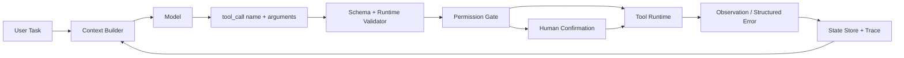
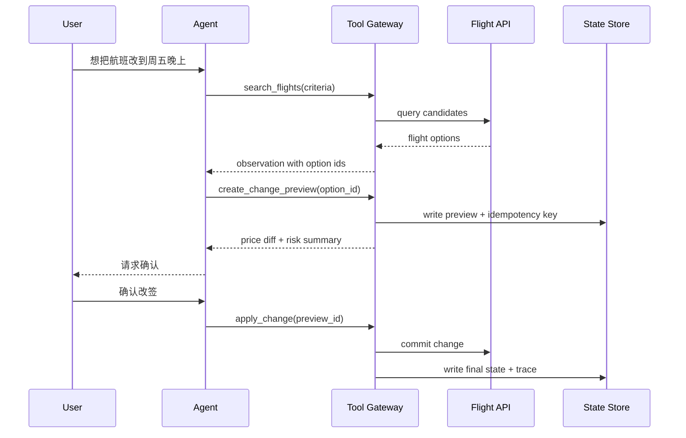

# Function Calling 机制

## 面试定位

Function Calling 是 Tool Use 里最容易被问深的基础能力。面试官通常不是想听“模型可以调用函数”这句话，而是要确认你能否把模型输出、宿主执行、权限校验、状态回写和 trace 串成一个可上线的运行时。

回答时先讲边界：模型不会真的执行 API。模型只根据上下文和 tool schema 生成一个结构化的 `tool_call`，真正执行的是宿主系统。宿主负责 schema validation、permission gate、幂等、超时、重试、审计和错误恢复。工具结果再以 `observation` 的形式写回上下文、状态和 trace。

## 一句话定义

Function Calling 是模型与外部系统之间的结构化调用协议。它把自然语言意图转成可校验的 `tool_call(name, arguments)`，再由宿主程序执行真实工具并把结果回传给模型。

它解决的是“模型如何表达要调用哪个工具、传哪些参数”的问题，不自动解决权限、安全、事务、幂等、状态管理和评测。把 Function Calling 说成完整 Agent，是面试里的高频扣分点。

## 为什么需要它

没有 Function Calling 时，模型只能生成自然语言或普通 JSON。自然语言难以稳定执行，普通 JSON 也缺少运行时语义：不知道这个 JSON 是草稿、最终答案，还是要进入真实外部动作。

Function Calling 把“模型建议动作”和“系统真实执行”分开：

- 模型负责理解用户目标，选择候选工具，生成结构化参数。
- 宿主负责判断参数是否可信，用户是否有权限，动作是否有副作用。
- Tool Runtime 负责调用真实 API、数据库、搜索服务、浏览器或后端任务。
- State Reducer 负责把 observation、错误、成本和状态变化写回 trace。

这个边界让 AI 系统可以接入真实工程能力，同时保留后端系统必须有的控制面。

## 核心架构

图 1 里的核心边界是 `Model -> tool_call -> Host Runtime`。模型输出调用意图，宿主拿到意图后先做校验，再决定是否执行。高风险动作要经过 human confirmation，失败结果要结构化返回，而不是把异常堆栈直接塞回模型。

## 架构与运行机制

一次完整链路可以拆成七步：

1. Context Builder 根据用户身份、任务目标和权限选择可见工具，不把全部工具一次性暴露给模型。
2. 模型基于 tool schema 输出 `tool_call`，通常包含 tool name、arguments 和 call id。
3. Validator 做 JSON schema validation，也做业务 runtime validation，例如对象归属、参数范围、租户边界和必填字段。
4. Permission Gate 根据风险级别、用户 scope、动作副作用和速率限制决定放行、拒绝或要求确认。
5. Dispatcher 调用真实工具，并给每次调用附带 timeout、retry policy、idempotency key 和 trace id。
6. Tool Runtime 返回 `observation` 或 structured error，包含 code、retryable、message、partial data 和 source。
7. State Reducer 把结果写入状态和 trace，模型再基于 observation 继续调用工具或生成最终答案。

这里的关键是不要信任模型参数。schema 正确只说明格式正确，不说明业务正确。比如 `refund_order(order_id, amount)` 的 `amount` 是数字，不代表用户能退款，也不代表金额没有超过可退余额。

## 运行机制

Function Calling 的工程价值来自三个契约：

- **输入契约**：工具名要具体，参数要有 required、enum、range、format 和说明。`do_task` 这种泛化工具会让模型难以判断边界。
- **执行契约**：宿主必须统一处理 validation、permission、timeout、retry、幂等、审计和降级。
- **输出契约**：工具结果要短、结构化、可引用。返回原始大文本会污染上下文，也让最终答案难以追溯。

生产系统还要记录 `run_id`、`step_id`、`tool_name`、`schema_version`、`arguments_hash`、`latency`、`status` 和 `error_code`。没有这些 trace 字段，线上只会看到“模型答错了”，很难判断根因来自 schema、权限、工具、上下文还是模型选择。

## 关键设计取舍

| 设计点 | 推荐做法 | 收益 | 风险 |
| --- | --- | --- | --- |
| 工具粒度 | 用业务动作命名，例如 `search_policy`、`create_refund_preview` | 边界清晰，权限好管 | 过细会增加调用轮次 |
| 参数 schema | 明确 required、enum、range、format、nullable | 降低 invalid arguments | 仍不能替代业务校验 |
| 执行权限 | 宿主做 permission gate 和 risk confirmation | 防止越权和误操作 | 高风险动作会增加交互成本 |
| 并行调用 | 只读、互不依赖工具可并行 | 降低延迟 | 写操作并行会带来一致性问题 |
| 工具返回 | 返回 observation summary、source、error code | 便于模型继续推理和 trace | 过度摘要可能丢证据 |

## 生产落地细节

工具 schema 建议包含这些字段：name、description、input schema、output schema、side effect、risk level、timeout、retry policy、owner、version 和 examples。对写操作还要有 `idempotencyKey` 和 dry-run preview。

宿主运行时至少要有四层防线：

- Validator：校验类型、枚举、范围、对象归属和业务状态。
- Permission Gate：校验用户 scope、租户隔离、敏感字段和风险等级。
- Execution Wrapper：统一 timeout、retry、circuit breaker、rate limit 和 structured error。
- Trace Store：保存 tool call、arguments hash、observation summary、state diff、cost 和 verdict。

对外部 API 调用要特别注意幂等。模型可能因为超时、上下文误解或 retry 策略重复发起同一动作。写操作必须用业务幂等键或状态机保护，不能假设模型“应该只调用一次”。

## 系统设计案例

假设要设计一个旅行 Agent 的机票改签工具，不应该直接给模型一个 `change_ticket` 写操作。更稳妥的设计是拆成 preview 和 apply：

这个设计把查询、预览、确认和提交拆开。模型可以帮助用户比较候选方案，但最终提交必须依赖 preview id、用户确认、权限和幂等键。面试中这样讲，会比“让 Agent 调航班 API”可信得多。

## 真实问题与排障

线上排查要先按失败类型分类：

- invalid arguments：看 schema 是否模糊，示例是否误导，Context Builder 是否暴露了不相关工具。
- permission denied：看用户 scope、租户、对象归属和 risk level 是否配置正确。
- tool timeout：看下游 API 延迟、retry 次数、并发、熔断和降级策略。
- wrong tool selected：看工具描述、候选工具数量、few-shot 示例和模型版本变更。
- final answer unsupported：看 observation 是否被正确写回，模型是否引用了工具结果。

重点指标包括 `valid_call_rate`、`invalid_args_rate`、`permission_denial_rate`、`tool_chain_success_rate`、`retry_success_rate`、`unsafe_call_block_rate`、`p95_latency` 和 `cost_per_successful_task`。这些指标能把“模型不好用”拆成可修的工程问题。

## 常见误区与排障

常见误区有三类：

- 把 Function Calling 等同于 Agent。它只是工具调用协议，完整 Agent 还需要状态、loop、规划、评测、安全和停止条件。
- 只依赖 strict schema。strict schema 能改善格式稳定性，但不能证明用户有权限，也不能证明业务动作安全。
- 把工具结果原样塞回模型。长文本结果会增加 token 成本和上下文污染，应该返回摘要、关键字段、source 和分页句柄。

排障时先沿数据流走，不要一上来调 prompt。先看 tool call 是否有效，再看宿主是否拒绝，再看工具是否成功，再看 observation 是否进入状态，最后看模型是否正确使用 observation。

## 面试追问

1. Function Calling 和普通 JSON 输出有什么区别？重点回答运行时语义、宿主执行链路和 trace。
2. Function Calling 和完整 Agent 差什么？重点回答状态、loop、规划、评测、安全和停止条件。
3. 如果工具参数格式正确但业务错误怎么办？重点回答 runtime validation、permission gate 和业务状态校验。
4. 写操作如何避免重复执行？重点回答 idempotency key、preview/apply、状态机和补偿。
5. 多工具并行怎么做？重点回答只读可并行，写操作要串行、事务或补偿。

## 项目化表达

如果落到 Coding Agent，可以说：我会把 `read_file`、`apply_patch`、`run_tests`、`git_diff` 都封装成工具。读工具可以并行和缓存，写工具必须经过 diff preview、权限确认和工作区隔离。每次 tool call 都记录 arguments hash、状态变化和测试结果，失败样本进入 eval。

如果落到 Travel Agent，可以说：我不会让模型直接提交订单，而是让它先调用搜索和预览工具。提交工具必须使用 preview id、用户确认、幂等键和审计记录。这样既保留 Agent 的自然语言交互能力，也符合交易系统的安全边界。

## 深入技术细节

Function Calling 的关键不是“模型会输出 JSON”，而是建立 Host Runtime 的执行边界。模型产出 `tool_call` 后，宿主根据 tool registry 解析工具、校验 schema、检查业务权限、执行工具、规范化 observation，并把结果写入 state 和 trace。这个链路让工具调用可审计、可恢复、可评测。

生产工具要声明 side effect 和 risk level。只读工具可以更自动，写操作要有 dry-run、preview、confirmation、idempotency key 和 rollback/compensation plan。工具调用失败时返回 error envelope，而不是自然语言堆栈。

## 关键数据结构与协议

| 字段 | 所属层 | 作用 |
| :--- | :--- | :--- |
| `tool_name` | model output | 表达调用意图 |
| `schema_version` | registry | 管理兼容性 |
| `arguments_hash` | runtime | 审计与确认 |
| `permission_verdict` | policy | allow/deny/confirm |
| `observation_id` | state | 连接结果和下一步 |
| `error_code` | recovery | 指导重试或降级 |

协议上，Function Calling 可以是 workflow 节点，也可以是 Agent loop 的动作接口。是否升级为 Agent，取决于任务路径是否开放、状态是否需要多步反馈、以及 eval 是否证明收益。

## 深问准备

被问“Function Calling 和完整 Agent 差什么”，回答：Function Calling 解决动作表达，Agent 还需要 Goal、State、Loop、Verifier、Guardrails、Trace 和 Eval。工具能调用成功，不代表任务完成。

被问“如何设计高风险工具”，用 preview/apply 拆分，preview 生成影响范围和风险，apply 要求 confirmation id、args hash 和 idempotency key，执行后写 audit。

## 来源与延伸阅读

- [OpenAI Function Calling](https://platform.openai.com/docs/guides/function-calling)：用于说明 tool schema、tool call 和 structured outputs 的 API 语义。
- [OpenAI Agents SDK](https://platform.openai.com/docs/guides/agents-sdk)：用于说明 Agent、tools、handoff、guardrails 和 tracing 如何组合。
- [Anthropic Building effective agents](https://www.anthropic.com/engineering/building-effective-agents)：用于支持 workflow 与 agent 边界、工具设计和简单优先原则。
- [MCP Architecture](https://modelcontextprotocol.io/docs/learn/architecture)：用于确认 Host、Client、Server 与工具暴露边界。
