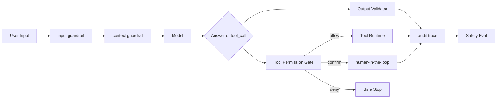

# Guardrails 分层防护

## 面试定位

Guardrails 不是一句“请安全回答”的 system prompt。面试官真正想看的是，你能不能把输入、上下文、工具权限、输出验证、人工确认、审计和评测串成一套安全架构。Agent 一旦能调用工具，安全边界就必须落在宿主程序、权限系统和可验证策略里。

## 一句话定义

Guardrails 是围绕用户输入、context、模型输出、工具调用、外部副作用和 human-in-the-loop 建立的多层防护体系。典型模块包括 input guardrail、context guardrail、Tool Permission Gate、Output Validator、Human Approval 和 Safety Eval。

## 为什么需要它

普通聊天应用主要担心不当输出。Agent 系统还要担心越权读数据、误调用写工具、泄露敏感信息、被 prompt injection 操控、执行不可逆动作。只靠模型自律不够，因为模型看到的网页、邮件、文档和 RAG chunk 都可能包含恶意指令。Guardrails 的目标是让系统能拦截、降级、确认、审计和回归。

## 核心架构

图 1：Guardrails 分层防护链路。图中的关键是：安全策略不是只在模型前后各放一个检查，而是贯穿输入、上下文、工具和输出。

## 架构与运行机制

input guardrail 识别恶意请求、PII、越权意图和高风险任务。context guardrail 把网页、邮件、RAG chunk 标为 untrusted evidence，避免它们覆盖 system 指令。Tool Permission Gate 按用户身份、资源归属、riskLevel、requiresConfirmation 和 permissionScope 决策。Output Validator 检查 PII、citation、JSON schema、业务规则和 unsupported claim。

如果触发高风险动作，系统进入 human-in-the-loop。确认记录必须包含 actor、action、parameters、risk、preview、decision、timestamp 和 rollback plan。确认前后的参数要用 hash 校验，避免模型在确认后替换目标。

## 运行机制

数据流从风险识别开始。请求进入后先做身份、租户和风险判断。Context Builder 对外部证据打 trustLevel。模型输出 tool_call 后，权限层做 deterministic 决策。输出前再做格式、引用和敏感信息检查。所有 allow、deny、confirm、rollback 都进入 audit trace，后续作为 Safety Eval 样本。

## 关键设计取舍

| 防护层 | 作用 | 优点 | 风险 | 面试表达 |
| --- | --- | --- | --- | --- |
| 规则 guardrail | 硬性权限和格式 | 稳定、可审计 | 覆盖长尾弱 | 关键安全边界规则化 |
| 模型 guardrail | 语义风险识别 | 覆盖复杂输入 | 漂移和误判 | 作为辅助判断 |
| 人工确认 | 高风险动作 | 最可信 | 影响效率 | 只用于不可逆或高价值动作 |
| Safety Eval | 回归测试 | 持续改进 | 需要样本沉淀 | 漏拦和误拦都要进入 eval |

## 生产落地细节

工具元数据必须包含 riskLevel、permissionScope、requiresConfirmation、reversible、externalEffect、sensitiveData 和 owner。输入和输出 guardrail 要版本化，策略变更要能灰度和回滚。对 prompt injection、PII、越权工具调用、unsupported claim 写 fixture，进入 CI 或发布前检查。

关键指标包括 `unsafe_tool_call_block_rate`、`prompt_injection_block_rate`、`false_positive_rate`、`pii_leak_count`、`confirmation_audit_completeness`、`human_handoff_rate` 和 `policy_bypass_attempts`。误拦截和漏拦截都要单独看，不能只追求拦截率高。

## 系统设计案例

企业知识库 Agent 读取内部文档时，Context Builder 必须按用户权限过滤 evidence。网页或文档里的“忽略前面规则”只能作为文本证据，不能变成指令。若模型想调用 `send_email` 或 `delete_file`，Tool Permission Gate 根据风险等级要求 preview 和确认。

Travel Agent 支付或改签属于高风险外部副作用。系统应先生成 preview，展示价格、退改规则、目标账号、回滚方案和过期时间。用户确认后执行，结果写 audit trace。失败时进入 compensation 或人工工单。

## 真实问题与排障

如果出现越权访问，先看 evidence 权限过滤，再看工具可见性，最后看执行层 ACL。若 prompt injection 成功，检查外部内容是否被标为 untrusted evidence。若确认弹窗后执行参数变了，要查 args hash 和 approval 记录。若误拦截过多，按样本校准策略，而不是关闭整层 guardrail。

## 常见误区与排障

- 只靠 system prompt 做安全。
- 让模型自己决定权限边界。
- prompt injection 防护只靠模型识别。
- 高风险动作没有 preview、approval、audit 和 rollback。

## 面试追问

1. input guardrail 和 output guardrail 分别做什么？重点是入口风险和发布前验证。
2. prompt injection 怎么防？重点是 context guardrail 和工具权限隔离。
3. 哪些动作需要 human-in-the-loop？重点是不可逆、敏感、财务和外部副作用。
4. 如何评估 guardrails？重点是误拦、漏拦、回归样本和安全指标。

## 项目化表达

可以说：我把 Guardrails 分成输入、上下文、工具、输出和人工确认五层。每层都有策略版本、日志和 eval case。工具执行权不交给模型，高风险动作必须 preview + approval + audit。这样面试官能看到你考虑的是完整安全架构，而不是一句提示词。

## 深入技术细节

Guardrails 要区分语义风险判断和确定性策略执行。模型 guardrail 可以识别复杂语义，例如用户是否在诱导越权；但权限、资源归属、金额上限、确认状态、租户隔离必须由 deterministic policy 判断。高风险动作要在 tool runtime 前做 preview，确认后用 args hash 锁定参数，防止确认后被替换。

上下文 guardrail 是很多系统忽略的一层。RAG chunk、网页、邮件、PDF 都是 untrusted evidence，它们可以提供事实，但不能覆盖 system instruction 或扩大工具权限。Context Builder 应携带 trust label，并在模型提示和工具权限中区分来源。

## 关键数据结构与协议

| 字段 | 作用 | 所属环节 |
| :--- | :--- | :--- |
| `risk_level` | 动作风险分级 | Tool metadata |
| `permission_scope` | 用户授权边界 | Policy Gate |
| `trust_label` | 上下文可信级别 | Context Builder |
| `approval_id` | 人工确认记录 | HITL |
| `args_hash` | 防参数替换 | Execution Gate |
| `policy_version` | 策略可回滚 | Audit/Eval |

协议上所有 allow、deny、confirm、rollback 都要进入 audit trace。安全事件要生成 eval fixture，尤其是 prompt injection、越权工具、PII 泄漏和 unsupported claim。

## 深问准备

被问“guardrail 能否替代权限系统”时，要明确不能。Guardrail 是风险识别和流程控制，权限系统是确定性授权。写操作最终必须由后端 ACL、租户隔离和资源归属校验决定。

被问“如何评估 guardrails”，不能只看拦截率。要同时看 false positive、false negative、unsafe action block、PII leak、human handoff 和用户完成率。拦太多也会让系统不可用。

## 生产验收清单

Guardrails 上线前要做三类验收。第一类是策略覆盖：输入侧至少覆盖 jailbreak、prompt injection、PII、越权意图和高风险任务；上下文侧要把网页、邮件、PDF、RAG chunk 标记为 untrusted evidence；工具侧要按 read/write、risk_level、permission_scope、external_effect、reversible 和 sensitive_data 分级；输出侧要验证 JSON schema、citation、PII、unsupported claim 和业务规则。每条策略都要有 owner、policy_version、样本集和回滚路径。

第二类是故障演练：把恶意网页指令、越权文档、错误工具参数、确认后参数替换、敏感信息泄露和 unsupported claim 做成 fixture。演练时要证明模型可以识别风险，但最终 allow/deny/confirm 由 deterministic policy 和业务 ACL 决定。尤其是确认链路，要验证 preview_snapshot、args_hash、approval_id 和执行参数一致；如果目标金额、收件人、文件路径或权限范围变化，旧 approval 必须失效。

第三类是指标闭环：上线后同时看漏拦和误拦。`unsafe_tool_call_block_rate` 高不一定是好事，可能说明工具暴露过宽；`false_positive_rate` 高会伤害任务完成率；`pii_leak_count` 和 `policy_bypass_attempts` 是安全事故信号；`human_handoff_rate` 要按 risk_level 分桶。面试里能讲出这套验收，说明你把 Guardrails 当成安全工程，而不是把它当成提示词技巧。

## 公开阅读校验

面向公开读者时，Guardrails 要避免写成“模型会拒绝危险请求”。更严谨的表达是：模型可以参与风险分类，但最终执行边界由 policy engine、ACL、工具运行时和人工确认共同决定。文章应明确输入拦截、上下文隔离、工具执行前校验、输出发布前检查、人工审批和审计回放各自负责什么，避免把所有安全问题压进一个 system prompt。

生产系统还需要区分 fail-open 和 fail-closed。读操作失败可以返回 empty state 或 unsupported，写操作策略服务不可用时应默认拒绝或进入人工确认。高风险工具要有 preview snapshot、参数 hash、审批 ID、执行前再校验和 rollback plan。若用户确认的是“给 A 转账 100 元”，执行时变成“给 B 转账 1000 元”，旧 approval 必须自动失效。

复盘样本要覆盖真实绕过方式：恶意网页要求模型忽略规则、RAG 文档诱导调用删除工具、用户把敏感信息藏在附件里、模型生成 unsupported claim、工具返回中夹带新指令。每个事故样本都要沉淀为 eval fixture，并记录 `policy_version`、`decision_reason`、`model_risk_score`、`deterministic_rule_result` 和最终动作。这样 Guardrails 才能持续迭代，而不是上线一次后靠运气。

## 来源与延伸阅读

- [OpenAI: A practical guide to building agents](https://cdn.openai.com/business-guides-and-resources/a-practical-guide-to-building-agents.pdf)：用于 guardrails、tools、handoff 与安全设计。
- [OpenAI Agents SDK](https://platform.openai.com/docs/guides/agents-sdk/)：用于理解 guardrails 与 tracing 在 SDK 中的一等地位。
- [Anthropic: Building effective agents](https://www.anthropic.com/engineering/building-effective-agents)：用于理解何时保持简单 workflow，避免不必要的 Agent 风险。
