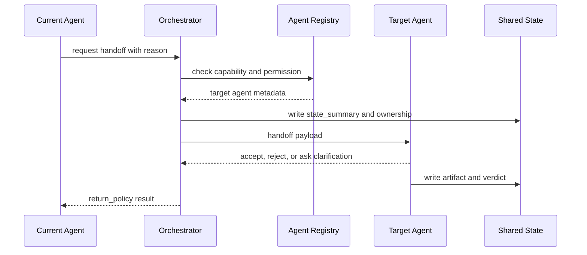

# Handoff 与编排模式

## 一句话定义

Handoff 是一个 Agent 或 Orchestrator 把任务控制权转给另一个 capability 更匹配的 Agent 的机制。生产实现必须定义 handoff payload、state_summary、ownership、return_policy、trace 和失败回退。

## 面试定位

面试官问 handoff，重点不是“能不能转交”。真正的问题是：转交后谁负责结果，哪些上下文必须带过去，接收方如何拒绝，原 Agent 是否等待返回，以及 trace 怎样串起完整数据流。

你要能比较 handoff、manager pattern 和普通 tool call。tool call 是调用确定性能力，handoff 是转移任务控制权，manager pattern 则由中心编排器持续拥有调度责任。

## 为什么需要它

复杂系统里，不同 Agent 常常拥有不同工具、权限和上下文。例如客服 Agent 识别到退款问题，需要转给 refund Agent；代码 Agent 发现安全风险，需要 handoff 给 security reviewer。没有规范 handoff，系统容易丢上下文、重复执行或出现两个 Agent 同时写状态。

## 核心架构

图 1：Handoff 链路由当前 Agent 发起转交请求，Orchestrator 校验 Agent Registry 和权限，写入 Shared State，再把结构化 payload 交给目标 Agent，最后按 return_policy 回流结果。

图中 `Agent Registry` 是能力和权限边界，避免把任务错派给没有工具或权限的 Agent；`Shared State` 是 ownership 和 evidence 边界，保存 state_summary、artifact_refs、verdict 和写锁；`Target Agent` 可以 accept、reject 或 ask clarification，不能被动接收所有任务；`return_policy` 是流程恢复边界，定义完成、失败、拒绝和超时后原 Agent 是否等待或退出。

| 模式 | 控制权 | 优点 | 风险 |
| :--- | :--- | :--- | :--- |
| Tool call | 原 Agent 保持控制 | 简单、可验证 | 不适合开放子任务 |
| Direct handoff | 接收 Agent 接管 | 专家能力强 | ownership 容易模糊 |
| Manager pattern | Orchestrator 持续调度 | 全局可控 | 中心复杂度高 |
| Human handoff | 人类接管 | 高风险安全 | 延迟和运营成本 |

## 架构与运行机制

一个可靠的 handoff payload 至少包含 task_id、sender、target、capability、state_summary、artifact_refs、constraints、permission_scope、deadline、return_policy 和 trace_id。state_summary 不是聊天摘要，而是接收方完成任务所需的最小状态投影。

接收方不能被动接受所有转交。它要检查 capability 是否匹配、权限是否足够、上下文是否完整，以及是否存在更高风险的人工确认要求。无法处理时应返回 reject reason 或 ask clarification。

## 运行机制

1. 当前 Agent 判断自己能力、权限或上下文不足，提出 handoff request。
2. Orchestrator 查询 Agent Registry，确认目标 Agent 的 capability 和 policy。
3. 系统生成 state_summary 和 artifact_refs，写入 shared state。
4. 目标 Agent 做 accept/reject/clarify 决策。
5. 接收后 ownership 转移，原 Agent 按 return_policy 等待、退出或继续协作。
6. 结果写入 trace，供回放、计费、排障和 trajectory eval 使用。

## 关键设计取舍

| 取舍 | 选择 A | 选择 B | 建议 |
| --- | --- | --- | --- |
| 直接 handoff | 灵活 | 容易循环 | 高自治场景谨慎使用 |
| 中心 manager | 可控 | manager 负担重 | 生产系统优先 |
| 完整上下文 | 信息充分 | token 和泄漏风险 | 用 state_summary + artifact_refs |
| 自动接收 | 低延迟 | 错派风险 | 高风险任务要允许拒绝 |

## 生产落地细节

- handoff payload 必须 schema 化，不能只发自然语言。
- ownership 要进入 shared state，防止两个 Agent 同时修改同一资源。
- return_policy 定义接收方完成、失败、超时和拒绝时原流程怎样恢复。
- trace 要串联 sender_span、handoff_span 和 receiver_span。
- 指标至少看 handoff_accept_rate、handoff_loop_rate、context_loss_rate、timeout_rate 和 recovery_success_rate。

## 系统设计案例

以网页 Agent 为例，Browser Agent 负责观察页面和执行动作；遇到支付、删除或账号修改时，应 handoff 给 Risk Agent 或请求 human confirmation。payload 里携带当前页面状态、用户目标、已点击步骤、可疑内容和候选动作，而不是把完整网页文本全部塞给接收方。

数据流是：Browser Agent 发现高风险动作，Orchestrator 检查 capability 和权限，Risk Agent 输出 verdict。如果允许继续，原 Agent 按 return_policy 执行动作；如果拒绝，系统向用户解释风险并停止。这样可审计，也能避免越权执行。

## 真实问题与排障

handoff 后上下文丢失时，先看 payload 是否缺少约束、artifact_refs 或上一阶段 verdict。责任不清时，检查 shared state 里 ownership 是否更新，以及两个 Agent 是否同时持有写锁。

循环 handoff 通常来自 capability 描述过宽或 stop policy 缺失。修复方式是缩小 Agent Registry 的能力边界，限制最大 handoff 深度，并在 trace replay 中加入循环样本。

## 常见误区与排障

- 把 handoff 当成普通 prompt 转发。
- payload 里塞满聊天历史，缺少结构化 state_summary。
- 不允许接收方拒绝，导致错派任务继续运行。
- return_policy 不清楚，原 Agent 不知道是否等待结果。
- trace 只记录最终答案，看不到转交链路。

## 面试追问

- handoff 和 tool call 的边界是什么？
- manager pattern 何时优于 peer-to-peer handoff？
- state_summary 应该包含什么，不能包含什么？
- 如何避免 handoff 后两个 Agent 同时写状态？
- 对高风险工具，handoff 是否足够，还是必须人工确认？

## 项目化表达

你可以把 handoff 讲成“任务控制权转移协议”。项目上要强调 schema、ownership、return_policy 和 trace，而不是说“让另一个 Agent 接着做”。这样回答会比泛泛讲多智能体更像真实系统设计。

## 深入技术细节

Handoff 的难点是控制权和状态边界。一个 handoff request 不应只是自然语言，而要包含 `task_id`、`sender_agent`、`target_agent`、`capability_required`、`state_summary`、`artifact_refs`、`constraints`、`permission_scope`、`ownership_transfer`、`deadline` 和 `return_policy`。接收方应能 accept、reject、clarify 或 escalate。

state_summary 要是最小可执行状态，而不是完整聊天历史。完整历史可能泄漏无关信息，也会让接收 Agent 继承错误假设。artifact_refs 允许接收方按需读取证据，例如截图、日志、diff 或检索结果。

## 关键数据结构与协议

| 字段 | 作用 | 失败风险 |
| :--- | :--- | :--- |
| `ownership_transfer` | 谁负责下一步 | 双写或无人负责 |
| `return_policy` | 完成/失败后怎么回流 | 原流程卡住 |
| `capability_required` | 选择目标 Agent | 错派任务 |
| `artifact_refs` | 按需取证 | 上下文丢失 |
| `permission_scope` | 限制动作 | 越权执行 |
| `handoff_depth` | 防循环 | 来回转交 |

协议上接收方必须可以拒绝。拒绝原因应结构化，例如 capability mismatch、missing context、permission denied、risk too high 或 deadline impossible。这样 Orchestrator 能恢复，而不是让错派继续扩大。

## 深问准备

被问“handoff 和 tool call 区别”时，回答：tool call 是原 Agent 保持控制权调用一个动作；handoff 是任务控制权转移给另一个 Agent 或人，并需要 ownership、return policy 和 trace。

被问“如何避免 handoff 循环”，可以用 Agent Registry 精确 capability、最大 handoff depth、completed_steps、arbiter fallback 和 failure taxonomy。循环样本要进入 trajectory eval。

## 来源与延伸阅读

- [OpenAI Agents SDK Handoffs 官方文档](https://openai.github.io/openai-agents-python/handoffs/)：用于说明 handoff 是受控的任务交接机制，不是简单 prompt 转发。
- [OpenAI Agents SDK Multi-agent patterns 官方文档](https://openai.github.io/openai-agents-python/multi_agent/)：用于对照 manager pattern、handoff 和多 Agent 编排模式的语义边界。
- [Anthropic: Building effective agents](https://www.anthropic.com/engineering/building-effective-agents)：用于支持“优先使用简单可组合 workflow，只有需要时再扩大自治”的工程取舍。
- [Google Agent2Agent 项目](https://github.com/google/A2A)：用于补充跨 Agent 协作协议化的行业实践，尤其是任务交接、能力发现和状态传递。
