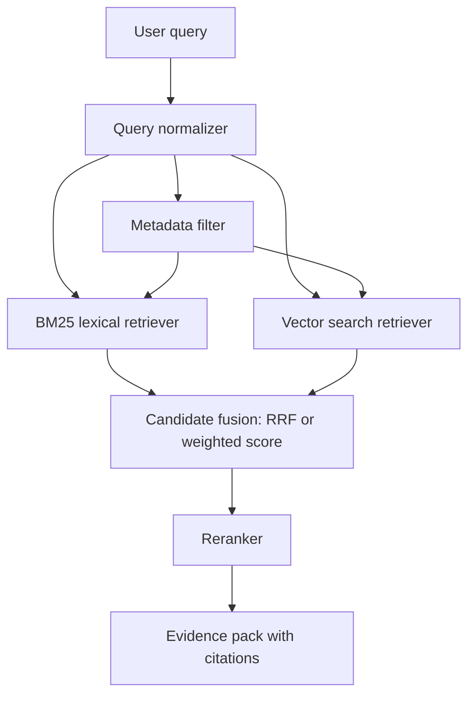

# 混合检索

## 一句话定义

混合检索是把 BM25 等 lexical 检索与 vector search 等 semantic 检索组合起来，再通过 RRF、加权融合或 rerank 提升 recall 与 precision。它解决关键词精确匹配和语义泛化各自的短板。

## 面试定位

这道题常出现在 RAG 系统设计里。面试官想听到你为什么不只用向量检索，以及如何设计可评测的召回链路。

一个好回答要覆盖架构、数据流、指标、取舍和追问。尤其要解释 BM25、metadata filter、vector search、融合策略和后续 rerank 的位置。

## 为什么需要它

向量检索擅长语义相近，但对专有名词、编号、错误码、函数名和精确短语不一定稳定。BM25 擅长词项匹配，却无法理解“同义表达”和跨语言语义。

生产 RAG 需要兼顾这两类能力。比如用户问“ERR_CONN_RESET 怎么处理”，BM25 能命中错误码，vector search 能命中“连接被重置”的说明。混合检索把候选集合做融合，再交给 rerank 或生成模型。

## 核心架构

图 1：Hybrid Search 在 RAG 召回层的双路融合链路。图中 Query Normalizer 负责抽取关键词、实体和过滤条件；Metadata filter 是权限与版本边界；BM25 兜住错误码、函数名和专有名词；Vector search 负责语义泛化；Candidate fusion 只合并候选；Reranker 再判断哪些证据真正能回答问题。

这张图说明 hybrid search 的收益来自“不同召回信号互补”，不是把所有候选简单堆进上下文。BM25 与向量分数本身不可直接比较，所以 RRF 这类基于 rank 的融合更适合做初步合并；但融合后仍需要 rerank、citation check 或 evidence verifier 控制上下文质量。

| 检索方式 | 擅长 | 不擅长 | 典型用途 |
| :--- | :--- | :--- | :--- |
| BM25 | 关键词、ID、错误码、函数名 | 同义和语义泛化 | 精确召回 |
| vector search | 语义相似、长问句 | 罕见词和数字精确性 | 语义召回 |
| metadata filter | 租户、权限、时间、类型 | 语义相关性 | 安全边界 |
| RRF | 融合不同排序 | 无法判断证据质量 | 初步合并 |
| rerank | 精排 answerability | latency 和 cost 上升 | 上下文入口 |

## 架构与运行机制

混合检索通常先做 query normalizer，把用户问题转成关键词、向量查询和过滤条件。metadata filter 必须在召回前或召回中生效，防止跨租户、过期版本或无权限文档进入候选。

候选融合可以用 Reciprocal Rank Fusion，也可以用归一化分数加权。融合后要保留 retriever_type、rank、score、source 和 evidence_id，便于后续解释为什么某条证据被选中。

## 运行机制

1. 解析 query，提取关键词、实体、时间和权限过滤条件。
2. BM25 路径召回 lexical candidates。
3. vector search 路径召回 semantic candidates。
4. 合并去重，使用 RRF 或加权策略生成 candidate set。
5. 对 top candidates 做 rerank，输出少而准的 evidence pack。
6. 用 recall、precision、citation precision 和 answer success 评估链路。

## 关键设计取舍

| 取舍 | 好处 | 代价 | 建议 |
| --- | --- | --- | --- |
| 只用 BM25 | 快、可解释 | 语义召回弱 | 适合精确搜索 |
| 只用向量 | 表达灵活 | 精确项不稳 | 不适合独立承担 RAG |
| 双路召回 | recall 高 | 成本和去重复杂 | 生产 RAG 常用 |
| 多路融合 | 覆盖广 | 噪声变多 | 配合 rerank 和 eval |

## 生产落地细节

- chunk 要保留 doc_id、section、version、tenant、updated_at 和 permission metadata。
- BM25 与 vector search 的 top_k 要单独调，不要默认一样。
- RRF 融合后要记录每条证据来自 lexical、semantic 还是两者都命中。
- hybrid search 的评测要做消融实验，比较 BM25-only、vector-only、hybrid、hybrid+rerank。
- 指标包括 recall@k、precision@k、MRR、nDCG、citation_precision、latency_p95 和 cost_per_query。

## 系统设计案例

企业知识库问答里，用户可能用内部系统名、错误码或自然语言描述问题。系统先按 tenant 和部门做 metadata filter，再分别跑 BM25 和 vector search。候选用 RRF 融合，最后由 reranker 选择能回答问题的证据。

数据流是：query 进入 normalizer，双路召回生成候选，fusion 合并去重，rerank 输出 evidence pack，生成阶段要求引用 evidence_id。失败样本进入 retrieval eval，判断是关键词漏召、向量召回噪声还是融合权重问题。

## 真实问题与排障

如果答案引用了不相关文档，先看 lexical 和 semantic 各自候选。若 BM25 命中了同名旧文档，检查版本过滤。若向量召回了语义相近但无答案的段落，调整 chunk、embedding 或 rerank。

如果延迟过高，拆分每一路耗时，缩小 top_k，缓存 query embedding，或把 rerank 放到更小候选集上。

事故处理可以按影响面拆：若只是特定错误码漏召，优先查 analyzer、同义词和 BM25 top_k；若语义相近但无答案的段落大量进入上下文，优先查 embedding、chunk 粒度和 reranker；若出现无权限或旧版本证据，立即止血，强制 metadata filter 前置并清理缓存；根因需要保留单路候选、fusion_score、rerank_score、evidence_id 和 citation verdict；回归要做 BM25-only、vector-only、hybrid、hybrid+rerank 的消融。

## 常见误区与排障

- 认为向量检索可以完全替代关键词检索。
- metadata filter 放在生成后，安全边界太晚。
- 融合时丢掉来源和 rank，无法解释。
- 不做消融实验，无法证明 hybrid 有收益。
- 只看召回率，不看进入上下文的证据质量。

## 面试追问

- RRF 为什么适合融合不同检索器？
- BM25 与 vector search 的 top_k 怎么调？
- 什么时候 hybrid 反而没有收益？
- metadata filter 应在检索前还是检索后？
- 如何设计 hybrid search 的离线评测？

## 项目化表达

项目里可以说：“我没有只用 embedding，而是用 BM25 兜住精确词，vector search 处理语义泛化，RRF 做候选融合，再用 rerank 控制 precision。每个阶段都有 trace 和消融指标。”

## 深入技术细节

混合检索的关键是把 query 拆成多种检索意图。Query Normalizer 提取关键词、实体、错误码、时间、文档类型和权限过滤；BM25 负责精确词项，向量负责语义相似，metadata filter 负责租户、版本和 ACL。召回阶段宁愿多一点候选，进入上下文前再由 fusion 和 rerank 控制精度。

RRF 适合融合不同检索器，因为它依赖 rank 而不是原始分数，能避免 BM25 分数和向量相似度不可比的问题。但 RRF 只做候选融合，不判断证据能否回答问题。answerability 仍要靠 rerank、evidence verifier 或生成后的 citation check。

## 关键数据结构与协议

| 字段 | 作用 | 诊断点 |
| :--- | :--- | :--- |
| `retriever_type` | BM25/vector/filter | 区分召回来源 |
| `original_rank` | 单路排序 | 判断融合贡献 |
| `fusion_score` | 融合得分 | 调试 RRF/权重 |
| `metadata_filter` | 权限和版本 | 防止泄露/过期 |
| `evidence_id` | 证据编号 | 支持引用追踪 |
| `selected_reason` | 入选原因 | 解释 top_k |

协议上每次查询要保存单路候选、融合结果和 rerank 结果。只有最终 top_k 不够排障，因为你看不到正确证据是没召回、被融合降权，还是被 rerank 丢掉。

## 深问准备

被问“metadata filter 放哪里”时，回答应是检索前或检索中，而不是生成后。无权限文档一旦进入上下文，即使不引用也可能被模型利用，安全边界已经太晚。

被问“如何证明 hybrid 有收益”，做消融：BM25-only、vector-only、hybrid、hybrid+rerank，分别看 recall@k、precision@k、citation_precision、latency_p95 和 cost_per_query。没有消融就无法证明混合链路值得复杂度。

## 公开阅读校验

Hybrid Search 的公开内容要把“召回更多”与“回答更准”分开。BM25、向量、metadata filter、RRF、rerank 都只是候选链路，最终读者关心的是正确证据是否进入上下文、错误证据是否被排除、无权限证据是否根本没有泄露。文章应明确：权限过滤和版本过滤要在检索前或检索中完成，不能等生成后再让模型“不引用”。

离线评测至少要按查询类型分桶：精确词查询、语义泛化查询、错误码/实体查询、时间敏感查询、权限敏感查询和无答案查询。每个桶分别跑 BM25-only、vector-only、hybrid、hybrid+rerank，并记录正确证据在单路召回、融合和重排中的位置变化。若正确文档在 vector top50 中存在但被 rerank 丢掉，优化方向和“向量没召回”完全不同。

线上 trace 需要保存 `query_rewrite`、`metadata_filter`、单路候选、fusion rank、rerank score、selected evidence 和 citation check 结果。关键指标包括 `recall_at_50`、`answerable_at_5`、`citation_precision`、`unauthorized_candidate_count`、`stale_document_hit_rate`、`rerank_drop_relevant_count` 和 `search_latency_p95`。这些数据能支撑持续调参，而不是靠感觉调 top_k。

## 来源与延伸阅读

- [Elasticsearch Reciprocal Rank Fusion](https://www.elastic.co/docs/reference/elasticsearch/rest-apis/reciprocal-rank-fusion)：官方文档用于支持 RRF 适合融合不同检索器排序结果的机制说明。
- [Elasticsearch kNN Search](https://www.elastic.co/docs/solutions/search/vector/knn)：官方文档用于说明向量召回在 ES 中的执行方式和参数边界。
- [Elasticsearch Semantic Search](https://www.elastic.co/docs/solutions/search/semantic-search)：官方文档用于解释语义检索与传统关键词检索在搜索方案中的互补关系。
- [OpenAI Cookbook: Elasticsearch RAG](https://cookbook.openai.com/examples/vector_databases/elasticsearch/elasticsearch-retrieval-augmented-generation)：官方示例用于说明 Elasticsearch 与 RAG 证据召回的工程组合。
- [Cohere Rerank 文档](https://docs.cohere.com/docs/reranking)：官方文档用于说明 rerank 在候选召回后提升 answerability 和上下文精度的作用。
