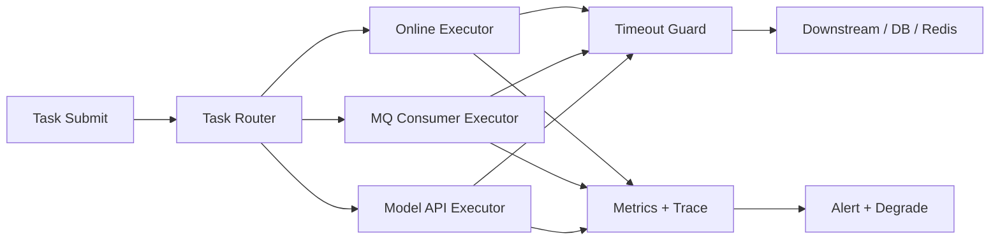

# Java 线程池参数、隔离与反压治理

## 面试定位

线程池题不能只背 `corePoolSize`、`maximumPoolSize`、`keepAliveTime`、`workQueue`、`handler`。面试官真正想看的是你能否根据任务类型、SLA、下游容量和故障模式设计并发边界。Oracle Java Concurrency 官方教程用于确认线程和并发工具的基础语义，但生产系统还要补上队列、拒绝、超时、上下文传播、指标、降级和回归。

反例是所有异步任务共用一个线程池，或者使用无界队列让系统“看起来不拒绝”。无界队列会把压力藏成排队延迟、内存膨胀和 OOM；共享线程池会让一个慢下游拖垮所有业务。

## 一句话定义

线程池是复用线程执行任务的并发调度组件。线程池治理是围绕任务分类、资源隔离、队列容量、拒绝策略、超时取消、上下文传播、监控指标和降级策略构建的运行体系。反压是当系统不可承受时，让压力在入口被限制、排队、拒绝或降级，而不是无限堆积。

## 架构与运行机制

图 1 展示的是线程池治理架构：任务先按类型路由到不同 executor，再由有界队列、超时保护和拒绝策略控制资源。图中 Metrics + Trace 用于记录 pool active、queue size、reject count、task latency、trace_id 和 reject reason。

这张图用于说明 Java 官方并发工具只是基础构件，工程系统必须把线程池接入下游容量、降级开关和可观测链路。

## 架构与运行机制细化

线程池参数要从任务画像反推。CPU 密集任务受核心数限制，线程数过大只会增加上下文切换；IO 密集任务可以更多线程，但上限受下游连接池、数据库、Redis、模型 API 限额和 SLA 限制。MQ 消费、HTTP 请求、批量导出、异步日志和 Agent 工具执行最好隔离，否则一个慢任务会占满共享线程。

队列是隐含延迟。队列长度乘以平均任务耗时，就是用户或消息看到的排队时间。队列越大，拒绝越少，但尾延迟越不可控；队列越小，系统更早暴露压力，但调用方必须能处理失败。拒绝策略不是异常分支，而是保护机制：同步接口可以快速失败或降级，异步任务可以写 retry/DLQ，低优任务可以丢弃并计数。

上下文传播也经常被忽略。线程池复用线程，`ThreadLocal`、MDC、traceId、tenantId、安全上下文不会天然安全地跨线程传递。提交任务时要捕获上下文，执行前设置，finally 清理，避免串租户、日志错乱和内存泄漏。

## 线程池设计对比

| 设计点 | 推荐做法 | 收益 | 风险 |
| --- | --- | --- | --- |
| 任务隔离 | 按业务和下游拆线程池 | 防止故障扩散 | 配置复杂度增加 |
| 有界队列 | 明确 queue capacity | 压力可见，保护内存 | 需要处理拒绝 |
| 拒绝策略 | 快速失败、降级、retry/DLQ | 形成反压 | 调用方契约要清晰 |
| 超时取消 | 给任务设置 deadline | 防止线程长期占用 | 取消不一定能中断下游 |
| 上下文传播 | 捕获、设置、清理 | trace 和租户正确 | 包装代码复杂 |
| 自适应并发 | 根据 p95/error 调整 | 更贴合下游容量 | 指标抖动会误判 |

这张表的取舍是回答重点。线程池不是为了“尽量多跑任务”，而是为了让系统在压力下保持可控。

## 深入技术细节

参数设计可以先估算任务耗时和目标吞吐，再结合下游容量。比如一个外部 HTTP 调用 p95 为 200ms，接口目标 500 QPS，如果全部同步阻塞，理论并发需求很高，但真正上限还受下游 rate limit 和连接池限制。盲目把最大线程数调大，会把压力放大到下游，最后形成超时、重试和线程池打满的循环。

线程池打满时要区分原因：任务提交过快、任务执行变慢、下游变慢、锁竞争、GC 停顿、队列过长、拒绝策略无效，还是某类任务占用共享资源。只看 active count 不够，要同时看 queue size、oldest task age、task latency、downstream latency、timeout count、reject count 和业务入口。

MQ 消费线程池尤其要谨慎。扩消费者或线程数前，要看 partition 数、下游容量、单条处理耗时和重试策略。否则扩容只会把 DB、Redis 或模型 API 打爆。线程池拒绝后不能直接 ack 消息，否则消息丢失；也不能无限重试，否则形成重试风暴。

## 关键数据结构与协议

| 字段 | 来源 | 作用 | 排障价值 |
| --- | --- | --- | --- |
| `executor_name` | 线程池配置 | 标识线程池 | 定位隔离边界 |
| `task_type` | 任务元数据 | 区分业务任务 | 识别热点任务 |
| `queue_size` | 指标 | 当前积压 | 判断反压风险 |
| `oldest_task_age` | 指标 | 最老排队时间 | 转成业务 SLA |
| `reject_count` | 指标 | 拒绝次数 | 验证保护触发 |
| `task_latency_p95` | 指标 | 执行耗时 | 判断任务变慢 |
| `trace_id` | 上下文 | 串联链路 | 排查跨线程调用 |
| `reject_reason` | 拒绝事件 | 解释失败 | 支持降级复盘 |

这些字段让线程池从黑盒变成可观测组件。没有 `oldest_task_age`，队列大小很难转换成用户影响。

## 系统设计案例

设计一个异步任务执行平台，支持 MQ 消费、Redis 回源重建、模型 API 调用和导出任务。架构上，Task Router 按任务类型选择线程池；每个 executor 使用有界队列；Timeout Guard 控制 deadline；Context Propagator 传递 trace 和租户；Fallback Handler 处理拒绝和超时；Metrics Exporter 暴露指标。数据流是 submit -> route -> enqueue -> execute -> downstream -> result/fallback -> metrics。

关键取舍是：隔离越细，故障扩散越少，但资源利用率和配置复杂度上升；队列越大，拒绝越少，但尾延迟和内存风险上升；快速失败保护系统，但需要调用方能降级。面试追问通常会问 CPU/IO 线程数、拒绝策略、ThreadLocal 传播和线程池打满的止血顺序。

## 真实问题与排障

线上接口 p95 升高，线程池 queue size 持续增长时，先看影响面：哪个 executor、哪些 task_type、是否单个下游慢、是否有 MQ lag、是否 reject 增加、是否 GC pause 同时升高。止血可以限流入口、暂停低优任务、隔离慢下游、缩短 timeout、打开降级开关或把失败任务写 retry/DLQ。

根因定位看任务耗时分布、下游 p95、锁等待、数据库连接池、Redis latency、模型 API rate limit、线程 dump 和 GC。回滚可能是恢复旧线程池配置、关闭新异步任务、降低消费并发或回滚下游调用。回归要模拟下游慢、队列打满、拒绝策略触发和上下文传播。

## 项目化表达

项目里可以说：我把 MQ 消费、模型 API 调用、导出任务和在线请求拆成独立线程池，每个线程池都有 queue capacity、timeout、reject policy 和指标。一次短信下游变慢事故中，共享线程池导致发券和 ES 同步也积压；改造后按下游隔离，短信线程池触发拒绝和 DLQ，核心订单后置流程不再被拖垮。指标看 `pool_active_count`、`queue_size`、`reject_count`、`task_latency_p95`、`consumer_lag` 和 `downstream_error_rate`。

这也能迁移到 AI Agent 平台：tool execution、embedding job、eval run、trace persistence 和模型 API 调用必须隔离线程池和限流，否则一个用户的大任务会拖垮全局。

更强的项目表达是把线程池打满讲成事故复盘：先说明影响面是哪个 executor 和业务入口，再说止血动作是限流、暂停低优任务、开启降级和 DLQ，根因是下游慢导致 queue age 增长，最后给出改进：有界队列、独立线程池、拒绝策略、上下文传播包装器和回归压测。这样回答既有参数，也有生产闭环。

## 边界条件与反例

反例一：无界队列。它让提交方看不到拒绝，却让延迟和内存风险无限增长。

反例二：所有任务用 common pool。慢任务、阻塞 IO 和 CPU 任务互相影响，问题定位困难。

反例三：拒绝策略只打印日志。任务已经被拒绝，如果没有业务补偿或返回错误，就是静默丢任务。

反例四：ThreadLocal 不清理。线程复用后，前一个租户或 trace 上下文可能污染后续任务。

## 深问准备

1. 线程数怎么估？答任务类型、耗时、下游容量、CPU、SLA 和压测。
2. 队列多大合适？答用排队时间反推，超过 SLA 就拒绝或降级。
3. 拒绝策略如何选？答同步快速失败，异步 retry/DLQ，低优任务可丢弃并计数。
4. 线程池打满先做什么？答看影响面，限流/降级/隔离，再查根因。
5. 上下文怎么传？答提交时捕获，执行前设置，finally 清理。

补充追问：线程池指标异常时，要先判断是入口流量、下游慢、锁等待、GC 还是配置变更导致，避免只靠扩线程掩盖故障。

## 来源与延伸阅读

- [Oracle Java Tutorials: Concurrency](https://docs.oracle.com/javase/tutorial/essential/concurrency/)：用于确认线程、同步、并发工具和任务执行模型的基础语义。
- [Java SE 21 API: ThreadPoolExecutor](https://docs.oracle.com/en/java/javase/21/docs/api/java.base/java/util/concurrent/ThreadPoolExecutor.html)：用于核对 corePoolSize、maximumPoolSize、workQueue、RejectedExecutionHandler 和生命周期方法的官方定义。
- [Prometheus Documentation](https://prometheus.io/docs/introduction/overview/)：用于支持线程池 active、queue、reject、latency、timeout 等指标的采集、告警和看板设计。
- [RabbitMQ: Consumer Acknowledgements and Publisher Confirms](https://www.rabbitmq.com/docs/confirms)：用于连接消费线程池、ack、重试和消息积压治理。
