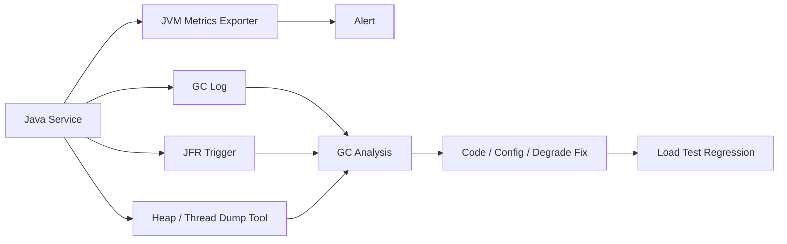

# JVM GC、内存与线上排障

## 面试定位

JVM GC 题不是让你背收集器名称，而是看你能否在真实事故中判断影响面、采集证据、止血、定位根因、回滚和回归。Oracle HotSpot GC Tuning 官方文档用于确认 JVM GC 的调优语义，但生产回答要把 GC log、JFR、heap dump、thread dump、Prometheus 指标和业务 trace 串成证据链。

反例是一上来就说“调大堆”或“换 G1/ZGC”。调参可能缓解症状，也可能扩大停顿、增加 dump 成本、推迟 OOM。没有证据的调参不是排障。

## 一句话定义

GC 是 JVM 自动回收不可达对象内存的机制。JVM 排障是利用运行时指标、日志、采样和 dump 证据，定位堆、非堆、线程、对象分配、停顿和下游联动问题的过程。线上 GC 治理要同时关注延迟、吞吐、内存曲线和业务 SLA。

## 架构与运行机制

图 1 展示的是 JVM 排障证据链：指标先发现异常，GC log/JFR/dump 提供定位材料，修复后通过压测和线上指标回归。图中 Dump Tool 必须受控，因为 heap dump 可能很大，错误采集会占满磁盘或暂停业务线程。

这张图用于说明官方 GC 文档只能提供机制和调优指导，生产系统还要有安全采集、事故流程和回归验证。

## 架构与运行机制细化

GC 停顿是现象，不一定是根因。对象分配速率上升、缓存膨胀、队列积压、下游慢、线程池打满、日志暴增、trace buffer 太大，都可能导致堆压力上升，最终表现为频繁 GC。也可能是 GC 先停顿，导致请求超时和 MQ 积压。因此排障要先建立时间线：业务 p95、GC pause、CPU、allocation rate、heap used after GC、线程池 queue size、downstream latency 谁先变化。

堆内存只是 JVM 内存的一部分。direct memory、metaspace、线程栈、本地库、mmap 文件和容器限制都可能触发 OOM 或进程被杀。只看 heap used 很容易误判。生产看板至少要包含 heap、non-heap、direct memory、thread count、GC pause、allocation rate、safepoint time 和 process RSS。

JFR 的价值在于低开销记录一段时间窗口内的分配、锁、线程、IO、异常和 GC 事件。heap dump 的价值在于查看对象保留大小和引用链。thread dump 的价值在于定位线程阻塞、死锁、高 CPU 线程和线程池耗尽。三者不是互相替代，而是从不同角度拼证据。

## 排障手段对比

| 手段 | 解决问题 | 收益 | 风险 |
| --- | --- | --- | --- |
| GC Log | GC cause、pause、回收效果 | 开销低，适合长期保留 | 需要会解读 |
| JFR | 分配、锁、线程、IO 时间线 | 证据丰富，开销可控 | 文件含敏感信息 |
| Heap Dump | 对象引用链和保留大小 | 定位泄漏和大对象 | 文件大，可能影响服务 |
| Thread Dump | 阻塞、死锁、高 CPU 线程 | 快速定位线程问题 | 单次只能看瞬间 |
| Metrics | 趋势和告警 | 可持续观测 | 粒度不够定位代码 |
| Trace | 业务路径和下游依赖 | 关联用户影响 | 采样不足会漏证据 |

这张表的取舍要说清：排障工具越强，采集风险和隐私风险也越高。

## 深入技术细节

GC 日志要看 pause 时间、GC cause、young/old 区变化、对象晋升、Full GC 次数和回收后堆占用。`heap_used_after_gc` 持续升高比单次 heap used 更能说明可能泄漏。allocation rate 持续升高说明对象创建速度太快，哪怕没有泄漏，也会造成频繁 Young GC 和 CPU 消耗。

Full GC 或长停顿出现后，不要只从 JVM 参数找答案。要检查最近发布是否引入大对象、缓存 key/value 是否膨胀、线程池队列是否积压、RAG trace 是否保存过长上下文、批量任务是否一次加载太多数据、日志是否异常拼接大字符串。很多所谓 GC 问题，本质是对象生命周期和数据结构设计问题。

JVM 调参要有目标。如果目标是降低停顿，要看延迟收集器、堆大小、region、pause target 和分配速率；如果目标是提高吞吐，要看 CPU 和 GC 占比；如果目标是避免 OOM，要找对象保留路径和内存上限。调大堆会降低 GC 频率，但可能增加单次停顿和故障恢复时间。

## 关键数据结构与协议

| 字段 | 来源 | 作用 | 排障价值 |
| --- | --- | --- | --- |
| `gc_pause_p95` | JVM metrics | GC 停顿分位数 | 判断 SLA 影响 |
| `full_gc_count` | GC log/metrics | Full GC 次数 | 识别严重回收 |
| `heap_used_after_gc` | GC log | 回收后堆占用 | 判断泄漏趋势 |
| `allocation_rate` | JFR/metrics | 分配速度 | 定位对象 churn |
| `thread_count` | JVM metrics | 线程数量 | 判断线程泄漏 |
| `executor_queue_size` | 线程池指标 | 任务积压 | 区分 GC 与队列 |
| `dump_id` | Dump 工具 | dump 审计 | 追踪采集风险 |
| `incident_window` | 事故记录 | 时间窗口 | 串联业务和运行时 |

这些字段组成了 JVM 事故协议。没有 `incident_window` 和 `heap_used_after_gc`，GC 分析很容易被单点截图误导。

## 系统设计案例

设计一个 Java 服务运行时观测系统，需求是在线上接口抖动时快速判断 GC 是否影响 SLA。架构上，服务默认输出 GC log 和 JVM metrics，Prometheus 采集指标，告警触发短窗口 JFR，Dump Tool 通过审批采集 heap/thread dump，Incident Dashboard 关联 HTTP p95、MQ lag、Redis latency、线程池 queue 和 GC pause。数据流是 metrics -> alert -> evidence capture -> analysis -> fix -> regression。

关键取舍是：长期保留 GC log 成本低但信息有限；JFR 信息丰富但要控制窗口和敏感数据；heap dump 能定位引用链但文件大、风险高；重启实例能止血但会丢失现场。面试追问通常会问如何区分 GC 是原因还是结果、如何安全 dump、为什么不能只调大堆。

## 真实问题与排障

线上接口 p99 从 200ms 升到 5s，先看影响面：哪些实例、是否所有接口、是否伴随错误率、CPU、GC pause、Full GC、heap used after GC、线程池队列、MQ lag、Redis/DB p95。止血可以限流非核心流量、关闭大对象功能、降低 trace 采样、缩短缓存、暂停批量任务、重启单个异常实例或回滚新版本。隔离要分批操作，避免同时 dump 或重启所有实例。

根因定位要建立时间线。如果队列先涨、下游先慢、对象堆积后 GC 才变多，GC 可能是结果；如果 GC pause 先出现并冻结所有请求，GC 更可能是直接原因。回滚可能是恢复旧参数、回滚新缓存 schema、关闭新 trace 字段、缩小批量大小或修复 ThreadLocal 清理。回归要用压测验证 `gc_pause_p95`、`allocation_rate`、`heap_used_after_gc`、业务 p95 和错误率。

## 项目化表达

项目里可以说：一次活动页接口抖动中，Prometheus 显示 GC pause 和 DB p95 同时升高，但时间线显示 Redis 大 value 发布后 allocation rate 先暴涨，线程池 queue size 随后上升，Full GC 最后出现。我们先关闭非核心活动模块和降低 trace 采样止血，再用 JFR 和 heap dump 定位到大 value 与 trace buffer 膨胀，修复为分页加载和有界 buffer。回归压测后 `heap_used_after_gc` 稳定，`gc_pause_p95` 降回阈值内。

AI Agent/RAG 系统里也常见类似问题：长 prompt、全量 trace、embedding 批量结果、大 JSON 工具响应、热门知识库缓存都可能制造大对象和高分配速率。

这类项目表达要强调不是“GC 调参成功”，而是用证据链证明根因、止血、修复和回归。

## 公开阅读校验

公开文章里，GC 排障最需要防止“参数崇拜”。读者应该先学会建立时间线：业务 p95、error rate、allocation rate、heap used after GC、Full GC、线程池队列、下游延迟和发布变更谁先变化。只有时间线说明 GC 是直接原因时，才讨论收集器、堆大小和 pause target；如果队列、下游或大对象先变化，GC 往往只是结果。文章还要提醒 dump 和 JFR 的采集风险，避免事故中为了取证制造二次故障。

证据采集要有分级策略。普通抖动先看 metrics、GC log 和少量 thread dump；需要定位分配热点时再开短窗口 JFR；怀疑泄漏且实例容量允许时才采 heap dump。dump 前要确认磁盘空间、实例是否可摘流、文件是否包含敏感数据、采集后如何加密和清理。这个流程能把“拿证据”和“保护线上容量”同时说清楚。

## 边界条件与反例

反例一：没有证据直接调大堆。可能把短停顿变成长停顿，把小 dump 变成巨大 dump。

反例二：只看 heap，不看 direct memory、metaspace、线程数和容器内存。OOM 不一定发生在 Java heap。

反例三：把线程池积压误判成 GC 根因。队列先涨时，GC 可能只是对象堆积后的结果。

反例四：事故时同时对所有实例做 heap dump。可能造成集群容量骤降和磁盘二次事故。

## 深问准备

1. 如何判断内存泄漏？答 heap used after GC 持续升高、对象引用链保留、压测后不回落。
2. GC 是原因还是结果？答看时间线：分配、队列、下游、pause 谁先变化。
3. 为什么不能只调大堆？答停顿、dump、恢复时间和根因掩盖。
4. JFR 和 heap dump 区别？答 JFR 看时间线和分配，heap dump 看对象图和引用链。
5. Agent 系统有什么 JVM 风险？答长上下文、大 trace、大 JSON、批量 embedding 和无界缓存。

更深一层可以追问“如何证明修复有效”。回答要包含优化前后的同一压测脚本、相同流量模型、`gc_pause_p95`、`heap_used_after_gc`、`allocation_rate`、业务 p95、错误率和对象保留路径对比。如果只是线上观察短时间不报警，不能证明泄漏或对象 churn 已经解决。

如果追问容器环境，还要补充 RSS 与 JVM 指标的差异。容器被 OOMKill 可能不是 Java heap 满，而是 direct memory、线程栈、metaspace、mmap、JIT code cache 或 native library 占用叠加超过 cgroup 限制。生产看板要同时看 heap、non-heap、direct buffer、thread count、process RSS 和容器 memory limit，否则容易把非堆问题误判成 GC 参数问题。

## 来源与延伸阅读

- [Oracle: HotSpot VM Garbage Collection Tuning Guide](https://docs.oracle.com/en/java/javase/21/gctuning/)：用于确认 GC 日志、收集器、停顿目标、吞吐和堆参数调优语义。
- [Oracle: Troubleshooting Guide for Java SE 21](https://docs.oracle.com/en/java/javase/21/troubleshoot/)：用于支撑 JFR、heap dump、thread dump、Native Memory Tracking 和线上诊断流程。
- [Oracle Java Tutorials: Concurrency](https://docs.oracle.com/javase/tutorial/essential/concurrency/)：用于连接线程状态、线程池、锁等待和运行时问题。
- [Prometheus Documentation](https://prometheus.io/docs/introduction/overview/)：用于支持 JVM 指标、告警、SLO 看板和事故时间线设计。
