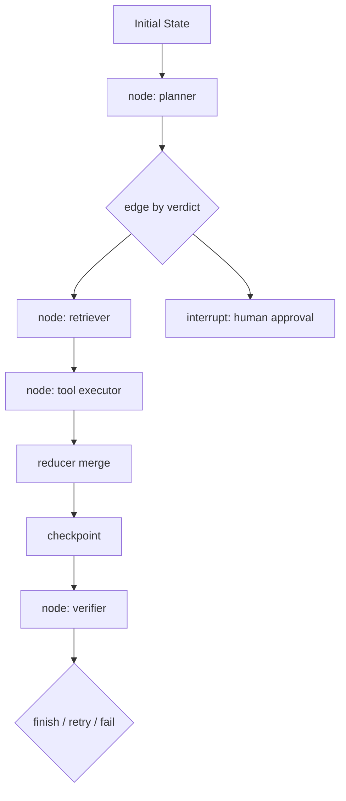

# LangGraph

## 面试定位

LangGraph 考的是你是否理解“有状态 Agent workflow”。面试官会追问 state schema、node、edge、reducer、checkpoint、interrupt 和 human-in-the-loop 如何配合，以及什么时候不要把简单 loop 过度图化。

## 一句话定义

LangGraph 用图来组织 Agent workflow：node 读取 state schema 并返回部分更新，edge 决定下一步流转，checkpoint 保存状态，interrupt 支持人工介入和 resume。

## 为什么需要它

普通代码式 loop 很灵活，但当任务有多阶段状态、条件分支、工具失败、人工确认和长任务恢复时，控制流容易藏在代码和 prompt 里。LangGraph 把状态、节点、边和恢复点显式化，让系统更容易测试、可视化、回放和排障。

## 核心架构

图 1：LangGraph 用 state、node、edge、reducer 和 checkpoint 组织有状态 Agent workflow。Initial State 进入 planner 后，edge 根据结构化 verdict 分流到检索、人工 approval 或工具执行；reducer 合并 partial state update，checkpoint 保存恢复点，verifier 决定 finish、retry 或 fail。

图里的重点是 state 是共享事实源，node 只产出 state update，edge 负责路由。它的边界也很重要：LangGraph 不会自动让业务正确，真正的可靠性来自清晰 state schema、可测试 edge condition、显式 reducer、checkpoint 持久化和 interrupt 前后的权限/确认链路。

## 架构与运行机制

state schema 应定义 goal、constraints、plan、tool_results、artifacts、risk_level、verdict 和 state_version。node 保持单一职责，例如 planner、retriever、tool_executor、verifier、human_approval。edge 根据 verifier verdict、tool error、risk level 或 human decision 进入下一步。reducer 定义同一字段的更新语义，例如 append、replace 或 merge。

checkpoint 让 graph 在每个关键步骤保存状态。interrupt 会暂停执行，把需要人工判断的信息暴露给外部，等待 resume 后继续。生产中大文件不要直接进 checkpoint，应该保存 artifact 引用。

## 运行机制

典型数据流是用户任务初始化 state，planner 写入计划，retriever 补 evidence，executor 运行工具，reducer 合并更新，verifier 产生 verdict，edge 决定 finish、retry、interrupt 或 fail。每个节点都应有 component eval，复杂事故可用 trace replay。

## 关键设计取舍

| 设计点 | 优点 | 风险 | 面试表达 |
| --- | --- | --- | --- |
| 显式 state schema | 可测试、可恢复 | 建模成本高 | 先状态后节点 |
| node/edge 拆分 | 控制流清楚 | 图可能膨胀 | 不把逻辑藏在 node |
| checkpoint | 支持 resume | 存储和隐私成本 | 保存引用而非大对象 |
| interrupt | 安全介入 | 用户等待增加 | 高风险动作前暂停 |

## 生产落地细节

关键 trace 字段包括 `run_id`、`node_name`、`edge_name`、`state_version`、`state_diff`、`checkpoint_id`、`interrupt_id`、`latency` 和 `error_code`。指标包括 `node_success_rate`、`edge_transition_error_rate`、`checkpoint_resume_rate`、`human_intervention_rate`、`graph_complexity` 和 `state_merge_conflict_count`。

## 系统设计案例

Travel Agent 可以建成 Preference Collector、Planner、Tool Executor、Constraint Verifier 和 Human Approval 五个节点。预算超限进入重规划，付款或预订进入 interrupt，用户确认后 resume。失败时从 checkpoint 恢复，不需要从头收集偏好。

## 真实问题与排障

如果 resume 后从头开始，检查 thread_id、checkpoint_id 和 interrupt 配置。若状态被覆盖，检查 reducer。若图越来越复杂，说明动态探索任务可能不适合全量图化。若节点失败难定位，检查 node trace 和 edge condition 是否结构化。

事故复盘要沿 graph 执行链路查。影响面先看是某个 node、某条 edge、某类 reducer 还是 checkpoint resume 全局失败；止血可以禁用高风险 edge、回退到上一版 graph schema、人工接管 interrupt 队列；根因常见于 reducer 默认覆盖、edge condition 解析自然语言、checkpoint 没保存 artifact ref、thread_id 混乱或 interrupt 前未持久化；回归要固定 state fixture、edge transition case、resume case 和 human approval case。

## 常见误区与排障

- 先写节点，再反推 state schema。
- 把复杂分支藏在 node 内部。
- reducer 默认覆盖导致状态污染。
- checkpoint 存大对象，带来成本和隐私问题。

## 面试追问

1. LangGraph 适合什么场景？复杂状态、恢复、人机协同和可图建模流程。
2. reducer 为什么重要？它决定多个 node update 如何合并。
3. interrupt 和 checkpoint 的关系？interrupt 暂停前要靠 persistence 保存状态。
4. 什么时候不用 LangGraph？简单线性 loop 或高度开放探索任务。

## 项目化表达

可以说：我会先定义 state schema，再拆 planner、executor、verifier 和 human approval 节点。高风险动作通过 interrupt 暂停，checkpoint 支持恢复，每个 node 都有 eval 和 trace。

## 深入技术细节

LangGraph 的关键是“状态先行”。先定义 state schema，再拆 node 和 edge。State 中的字段应有清晰更新语义：计划字段可能 replace，messages 可能 append，evidence board 可能 merge，risk flags 可能 union。Reducer 决定这些字段如何合并，如果默认覆盖，很容易把工具结果、人工确认或风险标记覆盖掉。

Checkpoint 不是简单日志，它是 resume 的事实源。每个关键 node 后保存 `thread_id`、`checkpoint_id`、`state_version`、`state_diff`、`node_name` 和 `edge_decision`。大文件、长日志和截图不要直接进入 state，而是以 artifact ref 保存。Interrupt 发生前必须 checkpoint，否则人工确认后无法稳定恢复。

## 关键数据结构与协议

| 字段 | 所属层 | 作用 |
| --- | --- | --- |
| `state_schema` | graph | 定义共享事实源 |
| `node_name` | node | 定位执行单元 |
| `edge_condition` | edge | 控制下一步路由 |
| `reducer` | state update | 合并多节点结果 |
| `checkpoint_id` | persistence | 支持 resume |
| `interrupt_id` | human-in-loop | 暂停和恢复人工决策 |

协议上每个 node 应只返回 partial state update，不要直接改全局对象。edge 只能根据结构化 verdict 路由，不要解析自然语言结论。这样 graph 才能测试、回放和可视化。

## 深问准备

被问“什么时候不用 LangGraph”时，可以回答：简单线性任务、一次性工具调用、或者高度开放且状态模型不清的探索任务，不一定需要图。强行图化会增加维护成本和边数量。

被问“如何排查 resume 失败”，先看 thread_id 和 checkpoint_id 是否一致，再看 interrupt 前是否保存 state，最后检查 reducer 是否覆盖了字段。指标看 `checkpoint_resume_rate`、`state_merge_conflict_count`、`edge_transition_error_rate` 和 `human_intervention_rate`。

## 来源与延伸阅读

- [LangGraph Graph API](https://docs.langchain.com/oss/python/langgraph/graph-api)：用于支持 State、Node、Edge 和 reducer 是 LangGraph 的核心建模边界。
- [LangGraph Persistence](https://docs.langchain.com/oss/python/langgraph/persistence)：用于支持 checkpoint、thread-scoped state 和 resume 是长任务 graph 的可靠性基础。
- [LangGraph Interrupts](https://docs.langchain.com/oss/python/langgraph/interrupts)：用于支持高风险动作和人机协同时需要 interrupt、人工输入和恢复协议。
