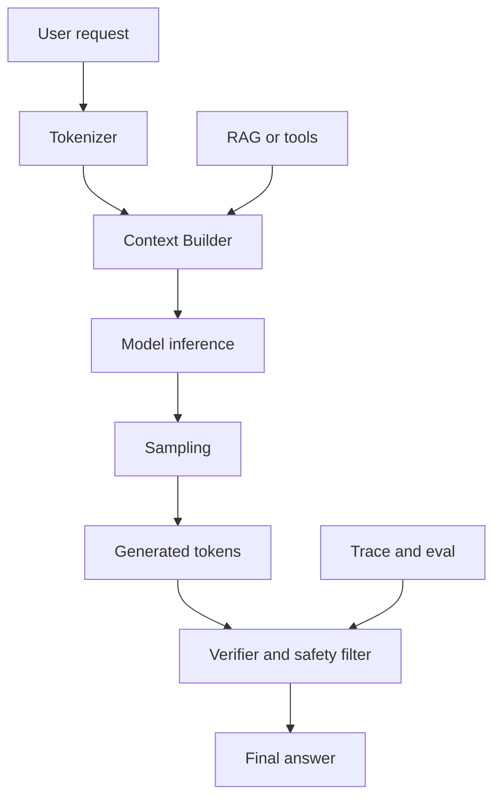

# LLM 的基本概念

## 一句话定义

LLM 是基于大规模文本和代码数据训练的概率生成模型。它把输入拆成 token，在 context window 内结合 prompt、历史、工具结果和外部证据，通过 sampling 逐步生成输出；事实可靠性需要 embedding 检索、工具查询、citation 和 verifier 约束。

## 面试定位

这类问题不是背“LLM 是大语言模型”。面试官真正想看的是你是否能说清 LLM 的能力边界：它能生成、总结、改写和推理，但不是数据库，也不是确定性规则引擎。

回答时要把架构、数据流、指标、取舍和追问准备好。尤其要解释 hallucination 为什么不是普通 bug，而是概率生成系统在证据不足、上下文污染或约束不清时的典型风险。

## 为什么需要它

理解 LLM 的基本概念，是后面学习 RAG、Agent、Function Calling、Eval 和 Guardrails 的地基。只有知道模型当前能看到什么、不能保证什么，才能设计可靠的应用。

工程上，LLM 更像一个高成本、非确定性、需要强观测的推理服务。后端系统仍然要做限流、超时、重试、降级、审计和结果校验。

## 核心架构

图 1：LLM 在线推理在应用系统中的基本控制流。

图中 Tokenizer、Context Builder、Model inference、Sampling 和 Verifier 分别对应“切分输入、构造上下文、生成 token、控制输出分布、校验结果”。RAG or tools 是事实来源入口，Trace and eval 是上线后复盘入口。这个结构想表达的是：LLM 不是孤立回答器，而是被上下文、工具、采样参数和验证器共同约束的推理服务。

| 概念 | 工程含义 | 常见风险 |
| --- | --- | --- |
| token | 模型处理文本的基本单位 | 成本和长度估算错误 |
| context window | 本次推理可见信息边界 | 关键证据被挤出 |
| sampling | 控制输出随机性和多样性 | 稳定性下降 |
| embedding | 把文本映射到向量空间 | 相似不等于正确 |
| hallucination | 无证据或弱证据下生成看似合理内容 | 事实错误 |
| verifier | 对输出做格式、事实和安全校验 | 延迟增加 |

## 架构与运行机制

LLM 推理时不会“查询参数中的事实表”。它基于训练得到的参数和当前上下文，预测下一个 token 的概率分布。context window 内的信息包括系统指令、用户问题、历史摘要、RAG 证据、工具 observation 和格式约束。

如果任务需要实时事实、权限数据或业务状态，必须通过 RAG、数据库或工具提供证据。模型可以综合和表达，但事实源应来自可追溯系统。

## 运行机制

1. 用户请求进入 API 或 Agent Runtime。
2. Tokenizer 将文本拆成 token，并估算上下文预算。
3. Context Builder 组装系统指令、用户目标、证据、工具结果和历史状态。
4. 模型根据上下文生成 token，sampling 参数影响稳定性和创造性。
5. Verifier 检查 schema、citation、unsupported claim、敏感内容和安全策略。
6. Trace 记录 prompt_version、model、tokens、latency、cost、verdict 和用户反馈。

## 关键设计取舍

| 取舍 | 收益 | 代价 | 建议 |
| --- | --- | --- | --- |
| 更大模型 | 复杂任务质量更高 | latency 和 cost 增加 | 按风险分级路由 |
| 更长上下文 | 可放更多证据 | 噪声和费用增加 | 用检索和压缩控制 |
| 更高 temperature | 创造性更强 | 稳定性下降 | 事实任务偏低 |
| 强 verifier | 降低幻觉和格式错误 | 可能拒答和变慢 | 高风险场景必备 |

## 生产落地细节

- Model Gateway 统一管理模型、参数、timeout、retry、fallback 和成本。
- 事实型任务必须接入 RAG、工具或数据库，不能只靠模型记忆。
- prompt、模型版本、知识库版本和 verifier 版本都要进入 trace。
- 指标包括 answer_accuracy、citation_precision、unsupported_claim_rate、latency_p95、cost_per_request 和 safety_violation_rate。
- 失败样本要进入 eval，避免模型或 prompt 升级后退化。

对后端工程师来说，LLM 接入不是“多调一个 HTTP API”。它通常需要请求分级：闲聊、摘要、事实问答、代码修改、业务动作分别走不同模型、不同超时和不同 verifier。低风险任务可以允许更高创造性，高风险任务要降低随机性、强制结构化输出、绑定证据和人工兜底。模型升级也不能只看主观体感，要用固定 eval 集比较准确率、拒答率、延迟和成本。

还要把上下文污染当成一等风险。用户输入、网页内容、RAG 文档、工具结果和历史摘要的可信级别不同，不能混在同一段 prompt 里不加标记。Context Builder 应明确哪些是指令、哪些是证据、哪些是不可信内容；Verifier 则检查输出是否越权使用证据或编造来源。

## 系统设计案例

设计企业知识库助手时，LLM 不直接回答公司制度事实。用户问题先进入 Context Builder，系统按权限检索制度文档，生成 evidence pack，再让模型基于证据回答。答案输出前，verifier 检查关键 claim 是否有 citation。

数据流是：用户问题 -> 权限过滤 -> RAG evidence -> 模型生成 -> claim verifier -> trace/eval。这样系统把生成能力和事实来源分开，减少幻觉。

## 真实问题与排障

如果用户反馈事实错误，先看 trace：上下文里有没有正确证据，证据是否被模型引用，sampling 参数是否过高，verifier 是否漏掉 unsupported claim。

止血可以降级为“只返回检索摘要”、降低 temperature、提高证据阈值或转人工。长期修复要补 eval、改检索和增强 verifier。

如果问题是输出不稳定，先把它拆成三类：相同上下文下措辞不同、相同问题检索到不同证据、不同模型版本行为变化。第一类通常调 sampling 和输出 schema；第二类调检索、rerank 和 context budgeting；第三类需要版本化 eval 和灰度。不要把所有波动都归因于“模型随机”，否则无法定位工程层的责任。

## 常见误区与排障

- 把 LLM 当成数据库或搜索引擎。
- 只讨论参数规模，不讨论上下文和评测。
- 事实错误只靠 prompt 修。
- 不记录 prompt_version 和 model_version。
- 没有成本、延迟和安全指标。

## 面试追问

- token 和 context window 对成本有什么影响？
- 为什么 LLM 会 hallucination？
- embedding 相似为什么不等于事实正确？
- 事实型业务如何降低错误率？
- LLM 接入后端系统时最重要的边界是什么？

## 项目化表达

项目里可以说：“我把 LLM 当作受控推理服务，而不是事实库。Model Gateway 管模型和参数，Context Builder 管证据，Verifier 管输出质量，Trace/Eval 管回归和线上观测。”

## 深入技术细节

LLM 在线推理的关键不是“模型会不会”，而是输入上下文如何被构造。一次请求通常会被拆成 `system`、`developer`、`user`、retrieved evidence、tool observation 和 output constraint。Context Builder 要先做 token budgeting，把不可丢的安全策略、用户目标和证据放在高优先级，再对历史对话做摘要或截断。长上下文并不自动更好，因为无关片段会稀释注意力，也会增加 latency、cost 和 prompt injection 风险。

生成阶段要区分解码参数和事实可靠性。`temperature`、`top_p`、max tokens 会影响输出分布，但它们不能创造事实依据。事实型任务的可靠性来自 evidence coverage、citation grounding、claim verifier 和 regression eval。线上排障时要把错误拆成 retrieval miss、context pollution、instruction conflict、sampling instability、verifier miss，而不是一句“模型幻觉”带过。

## 关键数据结构与协议

一个可落地的 LLM 请求对象至少要包含 `request_id`、`user_id`、`tenant_id`、`task_type`、`model`、`prompt_version`、`context_refs`、`tool_results`、`temperature`、`max_output_tokens` 和 `safety_policy`。响应对象不能只有文本，应该包含 `answer`、`citations`、`unsupported_claims`、`finish_reason`、`usage`、`latency_ms`、`verifier_result` 和 `trace_id`。

Trace 里建议按 span 记录：context build、retrieval、model inference、tool call、verification、streaming。每个 span 记录输入摘要、输出摘要、耗时、错误码和版本号。这样面试官追问“线上错答怎么复盘”时，可以说明你不是靠日志全文搜索，而是靠结构化 trace 定位具体失败层。

## 深问准备

- 如果面试官问“降低 temperature 能否解决 hallucination”，回答要点是它只能降低随机性，不能补足证据缺失。
- 如果追问“为什么 embedding 相似不等于正确”，要说明向量相似衡量语义邻近，不验证实体、时间、权限和因果关系。
- 如果追问“context window 越大是不是越好”，要讲 token cost、噪声、attention 稀释、证据排序和压缩保真。
- 如果追问“LLM 和规则引擎如何组合”，可以说规则负责确定边界，LLM 负责语义理解和表达，最终由 verifier 或业务规则裁决。

## 公开阅读校验

LLM 基础文章最容易写成模型科普，但公开读者真正需要的是接入系统的边界。建议把 LLM 定位成“概率推理与语言生成服务”，事实可靠性来自上下文、工具、检索、校验和业务规则。文章里要明确参数规模、上下文窗口、temperature、embedding、fine-tuning 都不是单独的可靠性保证，它们只改变能力或行为的某一层。

生产接入前可以做任务分桶评测：事实问答、格式生成、代码生成、工具调用、摘要压缩、分类抽取、安全拒答。每个桶固定 prompt_version、model_version、解码参数和证据集合，记录 pass/fail、错误类型和成本。模型升级时不能只看总体胜率，要看 `task_type`、语言、上下文长度、风险等级和租户样本下是否有回归。

线上排障要把“幻觉”拆细：没有召回到证据、证据过期、上下文被污染、指令冲突、采样不稳定、输出校验漏过、用户问题本身无答案。推荐在 trace 中记录 `model_version`、`prompt_version`、`context_hash`、`retrieval_snapshot`、`verifier_result`、`usage` 和 `latency_ms`。这样读者能看到 LLM 工程不是靠神秘经验，而是靠可观测的系统边界。

## 来源与延伸阅读

- [OpenAI Text generation guide](https://platform.openai.com/docs/guides/text)：官方文档用于支持 token 生成、模型输出和应用层请求构造的基础概念。
- [OpenAI Embeddings guide](https://platform.openai.com/docs/guides/embeddings)：官方文档用于说明 embedding 适合语义检索，但不等同于事实验证。
- [OpenAI Prompt engineering guide](https://platform.openai.com/docs/guides/prompt-engineering)：用于支持指令、上下文和输出约束需要明确组织的工程实践。
- [OpenAI Evals guide](https://developers.openai.com/api/docs/guides/evals)：官方文档用于支持模型、prompt 或系统变更要用 eval 做回归比较。
- [Anthropic: Building effective agents](https://www.anthropic.com/engineering/building-effective-agents)：用于说明增强型 LLM 系统需要围绕清晰工作流、工具和边界设计，而不是只依赖模型本身。
