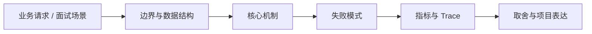

# Tokenizer、Token 与 Embedding

## 面试定位

Tokenizer、Token 与 Embedding 属于 AI Agent 与 RAG / LLM 与 ChatGPT 基础。面试里它不是背概念题，而是用来判断你是否能把知识落到架构、数据流、指标和取舍上。
一句话定位：Tokenization 把文本切成模型可处理的 token，Embedding 把 token 或文本映射为向量表示，是上下文长度、成本、检索和语义相似度的基础。

**必须讲清楚**
- Token 是模型内部处理文本的离散单位，不等同于汉字、英文单词或字符。
- Tokenizer 决定输入如何被拆分，影响上下文窗口、成本、截断和模型看到的边界。
- Embedding 是向量表示，适合语义召回和聚类，但最终事实仍要靠证据、引用和 verifier 校验。
- Tokenization 把文本切成模型可处理的 token，Embedding 把 token 或文本映射为向量表示，是上下文长度、成本、检索和语义相似度的基础。
- token 是模型处理和计费的基本单位
- embedding 表达语义相似但不证明事实正确
- 中文、代码和符号会影响 token 预算

**常见追问方向**
- 从训练目标、上下文窗口、生成机制和对齐方式解释能力边界。
- 用 prompt、token、embedding、attention、sampling、guardrail 这些工程概念串起来。
- 把 AI 基础和后端服务治理连接起来，讲清线上系统怎么稳定运行。
- 如果这个点落到 Paper Agent：论文研读与可追溯综述、Coding Agent：代码库任务 Harness，架构如何设计？
- 线上失败时看哪些 trace、日志、指标，怎么回滚或补偿？

## 架构与运行机制

### 核心机制

- 同一段文本在不同 tokenizer 下 token 数可能不同。
- 语义相似只代表距离近，不代表实体、时间、权限和因果关系正确。
- token budget 要为输出预留空间，不能把输入上下文塞满。
- 长文档切分要同时考虑语义完整性、检索粒度、上下文预算和引用跨度。
- Tokenizer 通常按子词、字节或混合规则切分文本，同一句话在不同模型上的 token 数可能不同。
- Embedding 将文本映射到向量空间，适合召回语义相近材料，但还要结合权限、时间、来源和引用校验。
- 上下文预算要同时容纳系统指令、用户问题、历史摘要、工具结果、检索证据和输出空间。
- 按 chunk token 数而不是字符数切分文档。
- 检索结果进入上下文前做 rerank 和去重。
- 对长上下文维护 context manifest，记录采用和丢弃的证据。
- RAG chunk metadata 至少保存 source_id、chunk_id、section_path、token_count、content_hash、embedding_model 和 permission_scope。
- 上下文构建时按 system policy、用户目标、必须证据、最近 trace、候选 evidence 和输出预算分层。
- 检索结果要区分语义召回分数和证据可信度，不能只按 embedding score 排序。

### 通用数据流

可以按用户目标、模型、上下文、状态、工具、执行循环、评测、安全和可观测性来讲。数据流是用户任务进入编排层，Context Builder 汇总系统指令、用户约束、RAG 证据、短期状态和工具结果，模型输出结构化动作，宿主程序执行工具并把 observation 写回 State 和 Trace。

### 工程落点

- 明确输入、上下文、模型、参数、工具、安全策略和输出校验。
- 为关键能力建立离线评测和线上观测。
- 按业务风险设计缓存、降级、审计和人工确认。
- RAG 摄入时保留 chunk_id、source_id、section、token_count 和 embedding_model。
- 请求前估算 input/output token，超预算时按安全策略、任务目标、证据优先级和时效性裁剪。
- 把每个关键步骤都映射到可观测指标，避免只描述功能。
- 回答时主动说明哪些信息是强一致状态，哪些只是上下文或缓存视图。

## 可画图

图 1：Tokenizer、Token 与 Embedding 的回答要从业务入口进入，先讲边界和数据结构，再讲机制、失败模式、指标和取舍。

## 系统设计案例

### Tokenizer、Token 与 Embedding 的面试级设计题

典型设计题是企业内部 Agent、Coding Agent、Paper Agent 或 Web Agent：外层 deterministic workflow 管理权限、预算、审批和最终提交，内层 Agent loop 处理开放探索，Eval Gate 根据 golden case、轨迹评分、工具结果和人工反馈决定是否继续。

**可画架构**
- 入口层：生成 request_id，识别用户、租户、任务类型、风险等级和预算。
- Context Builder：组装 system policy、用户目标、历史摘要、RAG evidence、工具结果和输出约束。
- Model Gateway：选择模型、解码参数、timeout、retry、fallback 和成本记录。
- Tool/Verifier 层：执行受控工具，校验 schema、citation、权限、业务规则和安全策略。
- Trace/Eval 层：保存上下文 manifest、模型输出、工具 observation、verdict 和失败样本。

**数据流**
- 用户请求进入后生成 request_id，并绑定 tenant、user_scope、task_type 和 risk_level。
- Context Builder 按 token budget 和可信级别选择证据、历史、状态和工具说明。
- 模型生成结构化输出或工具调用意图，宿主程序负责执行、权限、错误和审计。
- Verifier 检查引用、格式、安全和业务规则；失败样本进入 eval/regression。

## 真实问题与排障

真实线上问题一般从任务成功率、工具调用成功率、invalid args、上下文漂移、幻觉率、引用准确率、token 成本、延迟、guardrail block rate 和 human handoff rate 看起。回答时要把模型问题、检索问题、工具问题、状态问题和权限问题分开归因。

**排查顺序**
- 先确认是事实错误、格式错误、工具错误、权限错误、成本异常还是延迟异常。
- 查看 context manifest：模型看到哪些证据、哪些内容被裁剪、是否有权限污染。
- 查看 model/tool/verifier trace，定位是检索、上下文、模型、工具还是校验层失败。
- 先止血：降级到检索摘要、关闭高风险工具、回滚 prompt/model/config 或转人工。
- 把失败样本加入 golden set，并补 citation、schema、权限或工具回归。

**重点指标**
- prompt_tokens
- completion_tokens
- embedding_latency
- retrieval_recall_at_k
- citation_precision

**常见误区**
- 把字符数当 token 数
- 认为 embedding 相似就代表答案正确
- 忽略代码、表格和中文切分导致的预算膨胀

## 业界方案与技术取舍

AI Agent 的取舍是开放任务能力换来了不确定性、成本、延迟和治理复杂度。面试追问通常会围绕 workflow 与 agent 边界、memory 与 RAG 区别、function calling 是否等于 agent、eval 怎么证明不是 demo、如何做安全边界展开。

**方案对比**
- 按 chunk token 数而不是字符数切分文档。
- 检索结果进入上下文前做 rerank 和去重。
- 对长上下文维护 context manifest，记录采用和丢弃的证据。
- chunk 越小召回越细但上下文更碎。
- chunk 越大保留语义更多但召回噪声和 token 成本更高。
- 更高维 embedding 可能提升表达能力，但会增加存储、延迟和索引成本。
- 先讲模型能力来自预训练和对齐，不要把 LLM 描述成数据库或规则引擎。
- 推理服务由模型、上下文、采样参数、安全策略和工具层共同决定输出。
- 生产落地要把质量、延迟、成本、安全和可观测性一起纳入设计。
- 可以把 token budget 类比为请求 payload 和内存预算。
- embedding 检索类似搜索召回层，但它不替代数据库权限和事实校验。

**复习时要能讲出的细节**
- 这个知识点解决什么问题，不解决什么问题。
- 关键数据结构、状态变化、失败边界和可观测指标是什么。
- 面试官继续追问时，能从架构图、数据流、线上排障和项目证据四个角度展开。
- 能说明为什么这个取舍适合当前业务，而不是只背业界名词。

## 深入技术细节

Tokenization 把文本切成模型可处理的 token，Embedding 把 token 或文本映射为向量表示，是上下文长度、成本、检索和语义相似度的基础。 Token 是模型内部处理文本的离散单位，不等同于汉字、英文单词或字符。 Tokenizer 决定输入如何被拆分，影响上下文窗口、成本、截断和模型看到的边界。 Embedding 是向量表示，适合语义召回和聚类，但最终事实仍要靠证据、引用和 verifier 校验。 同一段文本在不同 tokenizer 下 token 数可能不同。 语义相似只代表距离近，不代表实体、时间、权限和因果关系正确。 token budget 要为输出预留空间，不能把输入上下文塞满。 长文档切分要同时考虑语义完整性、检索粒度、上下文预算和引用跨度。

面试深挖时要把模型、上下文、工具、证据、状态、verifier 和 trace 的边界讲清楚。不要把问题都归因于模型，也不要把 prompt 当作唯一治理手段。

## 关键数据结构与协议

| 字段 | 所属对象 | 作用 | 排障价值 |
| :--- | :--- | :--- | :--- |
| `request_id` | 请求 | 串联模型、工具、检索和 verifier | 定位一次错答或超时 |
| `context_pack` | 上下文 | 记录系统指令、证据、记忆、工具和预算 | 排查遗漏、污染和越权 |
| `evidence_id` | 证据 | 绑定文档、chunk、权限和版本 | 校验 citation 和事实来源 |
| `tool_call_id` | 工具调用 | 记录工具、参数 hash、结果和错误码 | 复盘外部动作失败 |
| `verifier_result` | 输出校验 | 标记 schema、citation、安全和业务规则结果 | 判断是否应重试、降级或拒答 |

## 深问准备

被追问边界时，先说这个方案适合什么、不适合什么，再给反例。被追问线上故障时，按影响面、止血、根因、修复、回归五段回答。被追问项目时，把回答落到你做过的接口、缓存、队列、数据库、监控或 Agent 工程链路。

- 反例要明确，例如强事务事实源不能交给缓存或搜索读模型。
- 指标要可执行，例如 p95、error_rate、retry_rate、lag、miss_rate、stale_rate。
- 回归要可复现，例如固定输入、故障注入、压测脚本或 golden case。

## 来源与延伸阅读

- [OpenAI Documentation: Text generation](https://platform.openai.com/docs/guides/text)：用于确认官方语义边界、命令行为和工程约束。
- [OpenAI Documentation: Prompt engineering](https://platform.openai.com/docs/guides/prompt-engineering)：用于确认官方语义边界、命令行为和工程约束。
