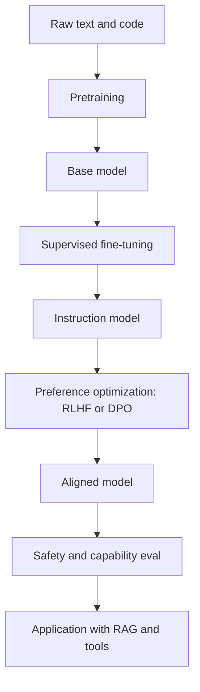

# LLM 训练与对齐

## 一句话定义

LLM 训练通常包括 pretraining、supervised fine-tuning、偏好优化和安全评测。alignment 通过 RLHF、DPO 等方法让模型更符合人类偏好、指令遵循和安全要求，但业务事实能力仍要靠 RAG、工具和 eval 管理。

## 面试定位

这类题不是要求你讲论文细节，而是看你能否区分预训练、微调、对齐、RAG 和 Prompt 的工程边界。

回答要覆盖架构、数据流、指标、取舍和追问。尤其要说明业务团队什么时候该微调，什么时候不该微调。

## 为什么需要它

业务团队经常把“模型答不好”归因于“需要微调”。但事实错误、知识过期、权限数据、结构化任务和实时查询，通常更适合 RAG、工具和 verifier，而不是把知识塞进参数。

理解训练与对齐，可以帮助你在 Prompt、RAG、fine-tune、adapter 和 eval 之间做技术选型。

## 核心架构

图 1：LLM 从预训练到应用层工程控制的能力形成链路。图中 pretraining 学通用语言和代码规律，SFT 让模型更稳定地遵循指令，RLHF/DPO 用偏好数据优化回答行为，eval 负责上线门禁，应用层再用 RAG、tools、guardrails 和 verifier 处理业务事实与副作用。

这张图的边界是：alignment 改善行为倾向，但不等于把企业实时知识写进模型，也不等于免除应用层验证。训练阶段解决“模型会不会按某类行为回答”，应用阶段解决“这次回答是否有证据、是否有权限、是否可回滚”。这也是为什么事实类问题通常先看 RAG/tool，而不是第一反应微调。

| 阶段 | 目标 | 数据 | 适合解决 |
| :--- | :--- | :--- | :--- |
| pretraining | 学语言和代码规律 | 大规模语料 | 通用能力 |
| supervised fine-tuning | 学指令和格式 | 高质量示例 | 输出风格和任务格式 |
| RLHF | 根据人类偏好优化 | 比较偏好数据 | 有用性和安全性 |
| DPO | 直接用偏好对优化 | chosen/rejected pairs | 偏好对齐 |
| eval | 验证能力和风险 | golden set | 回归和上线门禁 |

## 架构与运行机制

Pretraining 让模型学习语言、代码和世界知识的统计规律。supervised fine-tuning 用指令数据让模型更会按要求回答。RLHF 和 DPO 这类 alignment 方法，用偏好数据让模型输出更符合人类期待。

但对齐不等于业务正确。企业内部制度、订单状态、实时价格和权限判断，不应依赖模型参数记忆。应用层仍要通过 RAG、tool calling、guardrails 和 eval 控制。

## 运行机制

1. 预训练阶段使用大规模文本和代码学习通用表示。
2. SFT 用高质量指令样本训练模型遵循任务格式。
3. RLHF 或 DPO 使用偏好数据优化回答风格、安全和有用性。
4. 安全与能力 eval 检查幻觉、拒答、偏见和危险输出。
5. 应用层用 Prompt、RAG、工具和 verifier 适配具体业务。
6. 线上失败样本回到 eval 或微调数据池，但要先做根因分析。

## 关键设计取舍

| 方案 | 适合 | 不适合 | 风险 |
| --- | --- | --- | --- |
| Prompt | 快速约束格式和风格 | 稳定复杂行为 | 易退化 |
| RAG | 外部事实和可追溯证据 | 改模型表达习惯 | 检索质量依赖 |
| fine-tune | 固定格式、领域语气 | 实时事实 | 数据成本高 |
| RLHF/DPO | 偏好和安全对齐 | 单个业务知识点 | 评测复杂 |

## 生产落地细节

- 先用 eval 判断失败类型，再决定 Prompt、RAG、tool 还是 fine-tune。
- 微调数据要去重、脱敏、版本化，并保留验证集。
- 对齐后的模型仍需输出校验和安全策略。
- 事实问题优先走 RAG 或工具，风格和格式问题才考虑 SFT。
- 指标包括 instruction_following、format_pass_rate、hallucination_rate、preference_win_rate、safety_violation_rate 和 regression_pass_rate。

## 系统设计案例

客服助手回答政策问题时，最新政策应走 RAG。客服口吻、固定回复格式和 FAQ 分类可以用 prompt 或 supervised fine-tuning。高风险拒答和安全边界通过 alignment、guardrail 和 verifier 管理。

数据流是：用户问题 -> 场景分类 -> RAG/工具取事实 -> 模型按格式生成 -> verifier 检查证据和安全。微调只解决稳定表达，不承担事实数据库职责。

## 真实问题与排障

如果模型答错业务事实，先查证据链，不要立刻微调。若 evidence 缺失，是检索问题。若证据正确但格式错，是 prompt 或 SFT 问题。若高风险内容没拦住，是 safety eval 或 guardrail 问题。

这类归因能避免把所有问题都丢给训练。

事故处理建议先分影响面：是事实错误、格式不稳定、安全边界失效，还是模型升级回归；止血可以回滚模型版本、关闭新 prompt、降低高风险自动化或强制走工具/RAG；根因要查 eval case、required_evidence、training_data_version、prompt version、model version 和 guardrail verdict；回归要把失败样本写入 golden set，覆盖事实、格式、安全、拒答过度和工具调用五类场景。

## 常见误区与排障

- 认为微调可以更新所有业务知识。
- 把 alignment 当作充分安全保证。
- 没有 eval 就上线新模型。
- 训练数据不脱敏。
- 不区分事实错误、格式错误和安全错误。

## 面试追问

- pretraining 和 SFT 的区别是什么？
- RLHF 与 DPO 分别解决什么问题？
- 什么时候选择 RAG 而不是微调？
- 微调数据如何版本化和评测？
- 模型升级后如何做回归？

## 项目化表达

项目里可以说：“我先用 eval 对失败分桶。事实和实时性问题走 RAG 或工具，格式稳定性问题考虑 SFT，安全和偏好问题用 alignment 与 guardrails。训练不是替代工程控制，而是其中一层。”

## 深入技术细节

训练阶段要和应用阶段分清。Pretraining 学到的是通用语言建模能力，SFT 让模型更稳定地遵循指令和输出格式，RLHF/DPO 让模型在偏好比较中更接近人类选择。它们都不能保证某个企业知识点长期正确，因为参数更新周期、训练数据版本和业务权限模型都跟线上事实不同。

业务里最重要的是 failure attribution。一个失败样本要先标注 `failure_type`：retrieval_miss、wrong_citation、format_error、unsafe_answer、tool_error、instruction_conflict、domain_style_mismatch。只有大量样本集中在 domain_style_mismatch 或 stable_format_error 时，fine-tune 才可能比 prompt/schema 更合算。否则微调会把检索、权限或工具问题掩盖掉。

## 关键数据结构与协议

Eval case 至少包含 `case_id`、`input`、`expected_behavior`、`required_evidence`、`forbidden_behavior`、`rubric`、`tags`、`risk_level` 和 `dataset_version`。微调样本要包含 `messages`、`target_output`、`source_policy`、`pii_status`、`quality_score` 和 `reviewer_id`。线上模型发布记录要包含 `base_model`、`fine_tune_job_id`、`training_data_version`、`eval_report_id`、`rollback_model`。

对齐相关指标不能只看主观好不好。可以拆成 instruction_following、format_pass_rate、preference_win_rate、safety_refusal_precision、over_refusal_rate、hallucination_rate、regression_fail_count。面试里说清这些指标，能体现你知道训练不是一次性动作，而是数据、评测、发布和回滚的闭环。

## 深问准备

- 如果追问“微调能不能让模型记住企业知识”，回答要强调不适合高频更新、权限敏感和需要 citation 的事实。
- 如果追问“RLHF 和 DPO 区别”，可以从是否显式训练 reward model、实现复杂度和偏好数据使用方式解释。
- 如果追问“什么时候不用微调”，要列出证据缺失、实时状态、权限过滤、工具失败和 prompt 未收敛这些反例。
- 如果追问“微调上线怎么防回归”，要讲固定 golden set、领域样本、红队安全样本、灰度流量、回滚模型和版本化 trace。

## 公开阅读校验

训练与对齐的公开内容要避免给读者一种错觉：只要微调或 RLHF，系统就会更正确。更严谨的边界是，训练改变模型行为分布，不能替代实时事实、权限系统、工具执行和上线监控。事实更新快、需要 citation、受租户权限约束的知识，优先走 RAG 或工具；稳定格式、领域表达和固定流程失败，才可能进入 SFT 或偏好优化候选。

上线前应先做 failure attribution，而不是直接攒训练集。把错误按 `failure_type` 分桶后，如果主要是 retrieval_miss、wrong_permission、stale_data 或 tool_error，训练通常治标不治本；如果主要是 stable_format_error、domain_style_mismatch、instruction_following_gap，才评估微调收益。训练样本必须记录来源、脱敏状态、reviewer、质量分和数据版本，否则模型变好或变坏都无法解释。

发布验收要包含回滚路径：同一批 golden cases、红队样本、真实灰度流量和长尾语言样本同时比较 base model、candidate fine-tune 和当前线上模型。指标看 `format_pass_rate`、`preference_win_rate`、`hallucination_rate`、`safety_refusal_precision`、`over_refusal_rate`、`regression_fail_count`、`cost_delta` 和 `latency_delta`。如果候选模型只在主观偏好上升，却让安全拒答或事实引用退化，就不应发布。

数据治理也要写进流程。训练集应有可追溯授权、PII 脱敏记录、重复样本检测和污染检查；高风险行业样本要有人审标签，不能把线上坏答案直接回灌成“偏好数据”。否则所谓对齐会把事故固化进模型。

## 来源与延伸阅读

- [OpenAI Fine-tuning guide](https://platform.openai.com/docs/guides/fine-tuning)：官方文档用于说明微调适合稳定格式、风格和任务行为，不适合作为实时事实数据库。
- [OpenAI Evals](https://platform.openai.com/docs/guides/evals)：官方文档用于支持用 golden set、rubric 和回归指标管理模型上线风险。
- [InstructGPT / RLHF paper](https://arxiv.org/abs/2203.02155)：论文用于说明用人类反馈训练模型遵循指令和偏好的基本范式。
- [Direct Preference Optimization paper](https://arxiv.org/abs/2305.18290)：论文用于支持 DPO 作为偏好优化方法，与 RLHF 在实现路径上的差异。
- [OpenAI Prompt engineering guide](https://platform.openai.com/docs/guides/prompt-engineering)：官方文档用于说明 prompt 与训练、RAG、工具之间的工程边界。
