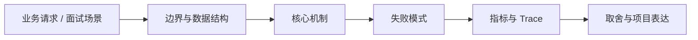

# Transformer、Attention 与上下文建模

## 面试定位

Transformer、Attention 与上下文建模 属于 AI Agent 与 RAG / LLM 与 ChatGPT 基础。面试里它不是背概念题，而是用来判断你是否能把知识落到架构、数据流、指标和取舍上。
一句话定位：Transformer 通过 self-attention 在上下文内建模 token 之间的关系，让模型能根据已有上下文预测后续 token。

**必须讲清楚**
- Transformer 是以 attention 为核心的序列建模架构。
- Self-attention 让每个 token 在当前上下文中参考其他 token 的表示。
- 对应用工程师来说，重要边界是模型只处理当前上下文，不能自动读取外部事实源。
- Transformer 通过 self-attention 在上下文内建模 token 之间的关系，让模型能根据已有上下文预测后续 token。
- attention 建模 token 关系
- 上下文不是永久记忆
- 长上下文会带来成本和噪声

**常见追问方向**
- 从训练目标、上下文窗口、生成机制和对齐方式解释能力边界。
- 用 prompt、token、embedding、attention、sampling、guardrail 这些工程概念串起来。
- 把 AI 基础和后端服务治理连接起来，讲清线上系统怎么稳定运行。
- 如果这个点落到 Paper Agent：论文研读与可追溯综述、Coding Agent：代码库任务 Harness，架构如何设计？
- 线上失败时看哪些 trace、日志、指标，怎么回滚或补偿？

## 架构与运行机制

### 核心机制

- attention 帮助模型在当前上下文内建立关联，但不保证事实真实。
- 上下文越长，成本、延迟和噪声通常越高。
- 系统应显式区分指令、用户输入、证据、工具 observation 和历史摘要。
- 上下文污染会改变模型行为，外部网页和文档中的指令必须降权或隔离。
- Self-attention 会根据当前 token 与上下文中其他 token 的关系计算表示。
- Transformer 堆叠多层注意力和前馈网络，逐层形成更抽象的上下文表示。
- 上下文窗口只是本次推理可见范围，超出窗口的信息必须靠摘要、检索、状态或工具重新引入。
- Context manifest。
- Evidence ranking。
- Context compression。
- Prompt injection filtering。
- Context Builder 输出应记录每个片段的 source、trust_level、token_count、priority、expires_at 和 dropped_reason。
- 事实型任务把证据放入独立 evidence 区域，不让外部文档覆盖 system/developer 指令。
- 长任务通过 state、summary 和 retrieval 恢复，而不是无限拼历史消息。

### 通用数据流

可以按用户目标、模型、上下文、状态、工具、执行循环、评测、安全和可观测性来讲。数据流是用户任务进入编排层，Context Builder 汇总系统指令、用户约束、RAG 证据、短期状态和工具结果，模型输出结构化动作，宿主程序执行工具并把 observation 写回 State 和 Trace。

### 工程落点

- 明确输入、上下文、模型、参数、工具、安全策略和输出校验。
- 为关键能力建立离线评测和线上观测。
- 按业务风险设计缓存、降级、审计和人工确认。
- 回答长上下文问题时要同时讲 token 成本、attention 稀释、证据排序和 prompt injection 风险。
- 系统设计里用 Context Builder 控制哪些信息进入模型，而不是依赖模型自动记住所有历史。
- 把每个关键步骤都映射到可观测指标，避免只描述功能。
- 回答时主动说明哪些信息是强一致状态，哪些只是上下文或缓存视图。

## 可画图

图 1：Transformer、Attention 与上下文建模 的回答要从业务入口进入，先讲边界和数据结构，再讲机制、失败模式、指标和取舍。

## 系统设计案例

### Transformer、Attention 与上下文建模 的面试级设计题

典型设计题是企业内部 Agent、Coding Agent、Paper Agent 或 Web Agent：外层 deterministic workflow 管理权限、预算、审批和最终提交，内层 Agent loop 处理开放探索，Eval Gate 根据 golden case、轨迹评分、工具结果和人工反馈决定是否继续。

**可画架构**
- 入口层：生成 request_id，识别用户、租户、任务类型、风险等级和预算。
- Context Builder：组装 system policy、用户目标、历史摘要、RAG evidence、工具结果和输出约束。
- Model Gateway：选择模型、解码参数、timeout、retry、fallback 和成本记录。
- Tool/Verifier 层：执行受控工具，校验 schema、citation、权限、业务规则和安全策略。
- Trace/Eval 层：保存上下文 manifest、模型输出、工具 observation、verdict 和失败样本。

**数据流**
- 用户请求进入后生成 request_id，并绑定 tenant、user_scope、task_type 和 risk_level。
- Context Builder 按 token budget 和可信级别选择证据、历史、状态和工具说明。
- 模型生成结构化输出或工具调用意图，宿主程序负责执行、权限、错误和审计。
- Verifier 检查引用、格式、安全和业务规则；失败样本进入 eval/regression。

## 真实问题与排障

真实线上问题一般从任务成功率、工具调用成功率、invalid args、上下文漂移、幻觉率、引用准确率、token 成本、延迟、guardrail block rate 和 human handoff rate 看起。回答时要把模型问题、检索问题、工具问题、状态问题和权限问题分开归因。

**排查顺序**
- 先确认是事实错误、格式错误、工具错误、权限错误、成本异常还是延迟异常。
- 查看 context manifest：模型看到哪些证据、哪些内容被裁剪、是否有权限污染。
- 查看 model/tool/verifier trace，定位是检索、上下文、模型、工具还是校验层失败。
- 先止血：降级到检索摘要、关闭高风险工具、回滚 prompt/model/config 或转人工。
- 把失败样本加入 golden set，并补 citation、schema、权限或工具回归。

**重点指标**
- context_tokens
- lost_context_rate
- evidence_coverage
- latency_p95
- cost_per_request

**常见误区**
- 把 attention 说成模型在外部检索事实
- 认为上下文越长一定越好
- 把聊天历史当成可靠长期记忆

## 业界方案与技术取舍

AI Agent 的取舍是开放任务能力换来了不确定性、成本、延迟和治理复杂度。面试追问通常会围绕 workflow 与 agent 边界、memory 与 RAG 区别、function calling 是否等于 agent、eval 怎么证明不是 demo、如何做安全边界展开。

**方案对比**
- Context manifest。
- Evidence ranking。
- Context compression。
- Prompt injection filtering。
- 更长上下文提升可见信息量但会增加噪声。
- 强压缩降低成本但可能丢约束。
- 更严格证据排序提升可靠性但可能减少召回。
- 先讲模型能力来自预训练和对齐，不要把 LLM 描述成数据库或规则引擎。
- 推理服务由模型、上下文、采样参数、安全策略和工具层共同决定输出。
- 生产落地要把质量、延迟、成本、安全和可观测性一起纳入设计。
- 可以把 context window 类比为一次请求的工作集。
- Context Builder 类似后端服务中的查询规划和权限过滤层。

**复习时要能讲出的细节**
- 这个知识点解决什么问题，不解决什么问题。
- 关键数据结构、状态变化、失败边界和可观测指标是什么。
- 面试官继续追问时，能从架构图、数据流、线上排障和项目证据四个角度展开。
- 能说明为什么这个取舍适合当前业务，而不是只背业界名词。

## 深入技术细节

Transformer 通过 self-attention 在上下文内建模 token 之间的关系，让模型能根据已有上下文预测后续 token。 Transformer 是以 attention 为核心的序列建模架构。 Self-attention 让每个 token 在当前上下文中参考其他 token 的表示。 对应用工程师来说，重要边界是模型只处理当前上下文，不能自动读取外部事实源。 attention 帮助模型在当前上下文内建立关联，但不保证事实真实。 上下文越长，成本、延迟和噪声通常越高。 系统应显式区分指令、用户输入、证据、工具 observation 和历史摘要。 上下文污染会改变模型行为，外部网页和文档中的指令必须降权或隔离。

面试深挖时要把模型、上下文、工具、证据、状态、verifier 和 trace 的边界讲清楚。不要把问题都归因于模型，也不要把 prompt 当作唯一治理手段。

## 关键数据结构与协议

| 字段 | 所属对象 | 作用 | 排障价值 |
| :--- | :--- | :--- | :--- |
| `request_id` | 请求 | 串联模型、工具、检索和 verifier | 定位一次错答或超时 |
| `context_pack` | 上下文 | 记录系统指令、证据、记忆、工具和预算 | 排查遗漏、污染和越权 |
| `evidence_id` | 证据 | 绑定文档、chunk、权限和版本 | 校验 citation 和事实来源 |
| `tool_call_id` | 工具调用 | 记录工具、参数 hash、结果和错误码 | 复盘外部动作失败 |
| `verifier_result` | 输出校验 | 标记 schema、citation、安全和业务规则结果 | 判断是否应重试、降级或拒答 |

## 深问准备

被追问边界时，先说这个方案适合什么、不适合什么，再给反例。被追问线上故障时，按影响面、止血、根因、修复、回归五段回答。被追问项目时，把回答落到你做过的接口、缓存、队列、数据库、监控或 Agent 工程链路。

- 反例要明确，例如强事务事实源不能交给缓存或搜索读模型。
- 指标要可执行，例如 p95、error_rate、retry_rate、lag、miss_rate、stale_rate。
- 回归要可复现，例如固定输入、故障注入、压测脚本或 golden case。

## 来源与延伸阅读

- [Attention Is All You Need](https://arxiv.org/abs/1706.03762)：用于确认官方语义边界、命令行为和工程约束。
- [OpenAI Documentation: Text generation](https://platform.openai.com/docs/guides/text)：用于确认官方语义边界、命令行为和工程约束。
