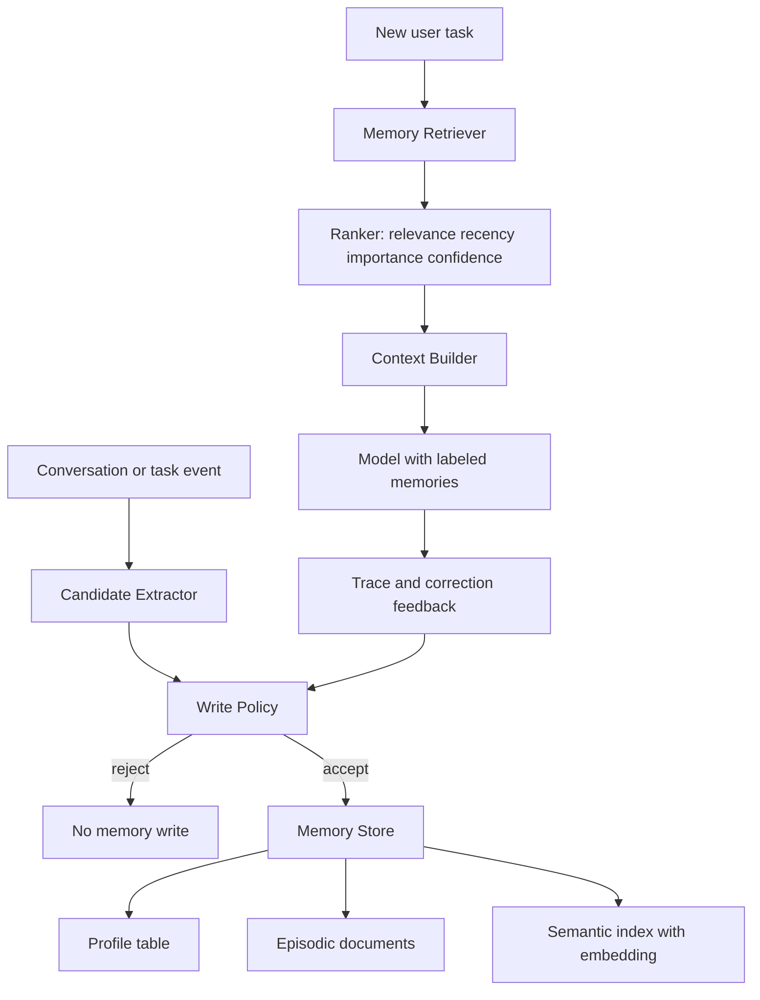

# 长期记忆

## 一句话定义

长期记忆是 Agent 跨会话保存可复用信息的能力。它把用户偏好、任务历史、已确认事实、项目约束和失败经验写入 Memory Store，并在新任务中通过 metadata、embedding 和结构化过滤做 retrieval。

## 面试定位

面试官问长期记忆，不是在问“把聊天记录存起来”。真正考察的是你能否区分短期上下文、RAG 证据和跨会话状态，并能说明写入策略、读取排序、隐私边界和过期机制。

一个成熟回答要覆盖四件事：什么信息值得写，如何按 scope 隔离，读取后如何进入上下文，以及旧记忆出错时怎样纠正。回答里要自然带出架构、数据流、指标、取舍和追问。

## 为什么需要它

没有长期记忆的 Agent 每次启动都像第一次见用户。它可以完成一次性任务，却很难持续适配用户的代码风格、项目约束、常用工具和长期目标。

长期记忆解决的是连续性问题，但它不是事实真相源。外部知识仍应优先来自 RAG citation、数据库或业务 API。Memory 更多是“这个用户或 workspace 以前确认过什么”，因此每条记录都要带 source、confidence、version 和 TTL。

## 核心架构



| 层次 | 保存内容 | 典型字段 | 主要风险 |
| :--- | :--- | :--- | :--- |
| Profile memory | 稳定偏好、语言、工作方式 | user_id、scope、content、confidence | 隐私和过度个性化 |
| Episodic memory | 项目事件、决策、失败样例 | sourceEventId、createdAt、summary | 时间久后 staleness 上升 |
| Semantic memory | 知识片段、笔记、经验沉淀 | embedding、metadata、citation | 检索噪声和解释性弱 |
| Control plane | 写入策略、删除、审计 | TTL、version、consent、owner | 误写后长期污染 |

## 架构与运行机制

长期记忆的写入路径比读取路径更危险。错误写入会在之后的任务里持续影响模型，所以生产系统通常先抽取候选，再用 policy 判断稳定性、敏感性、作用域和未来复用价值。

读取路径要控制数量和优先级。Retriever 先用 user、workspace、topic、scope 等 metadata 过滤，再用 embedding 召回候选，最后按 relevance、recency、importance、confidence 和 TTL 做排序。Context Builder 只取少量高置信记忆，并明确标注“这是可参考上下文，不是最高优先级指令”。

关键对象可以设计成这样：

```ts
type MemoryRecord = {
  id: string;
  scope: "user" | "workspace" | "project" | "task";
  kind: "profile" | "episodic" | "semantic";
  content: string;
  metadata: Record<string, string>;
  sourceEventId: string;
  confidence: number;
  version: number;
  ttl?: string;
  lastUsedAt?: string;
};
```

## 运行机制

1. 任务结束、用户明确偏好或系统发现稳定事实时，Candidate Extractor 生成候选记忆。
2. Write Policy 检查是否敏感、是否短期、是否未经确认、是否已有冲突版本。
3. Memory Store 同时保存结构化字段和向量索引，便于按 metadata 与 embedding 组合检索。
4. 新任务开始时，Retriever 只从当前 scope 内取回少量候选。
5. 模型使用记忆后，Trace 记录 read_hit、source、confidence 和最终任务结果。
6. 用户纠错、任务失败或外部证据冲突时，系统降低 confidence、生成新 version 或删除记录。

## 关键设计取舍

| 取舍 | 好处 | 代价 | 面试表达 |
| --- | --- | --- | --- |
| 全量历史 vs 筛选写入 | 历史完整 | 噪声、隐私和成本高 | 生产系统更偏向 write policy |
| 向量召回 vs 结构化过滤 | 语义匹配灵活 | 可解释性弱 | 二者组合，先过滤再召回 |
| 长期保留 vs TTL 衰减 | 连续性强 | stale memory 增多 | 用 TTL、confidence 和 correction 控制 |
| 自动写入 vs 用户确认 | 体验顺滑 | 误记风险大 | 敏感或高影响记忆必须确认 |

## 生产落地细节

- 每条记忆必须有 owner、scope、source、createdAt、lastUsedAt、confidence、TTL 和 deletion policy。
- 写入前做去重、敏感信息过滤、重要性评分和冲突检测。
- retrieval 结果要带来源和置信度，不能把旧偏好提升成系统指令。
- 删除和纠错要有审计链路，用户删除后不能通过缓存再次召回。
- 指标至少看 memory_precision、stale_memory_rate、correction_rate、privacy_block_rate 和 task_success_lift。

## 系统设计案例

设计一个 coding agent 的长期记忆系统，可以把 workspace 级偏好、项目技术栈、测试命令、历史失败原因和用户审查偏好分别建模。写入时只保存稳定约束，例如“这个 repo 使用 pnpm verify:ci 做发布前验证”。读取时先按 repo scope 过滤，再用当前任务 query 召回相关记忆。

数据流是：任务事件进入候选抽取，policy 判定后写入 Memory Store；下一次任务由 Retriever 取回相关记录；Context Builder 将它们放到“可参考项目上下文”块；模型执行后把成功、失败和用户纠错写回 trace。这样既能复用历史经验，又能避免把过期信息当成强规则。

## 真实问题与排障

常见线上问题不是“没有记忆”，而是记忆召回错了、太旧、跨用户串了或覆盖了当前指令。排障先看 trace 中哪些 memory 被读取，再看它们的 scope、source、confidence、TTL 和生成时间。

如果出现错误个性化，先暂停相关 memory type 的写入，降低可疑记录的 confidence，并把失败样本加入 memory eval。若怀疑隐私泄漏，要检查 scope filter、缓存键和删除传播链路。

## 常见误区与排障

- 把长期记忆等同于完整聊天记录。
- 只做 embedding 检索，不做 metadata 隔离。
- 让模型自己决定所有写入，缺少 policy 和审计。
- 旧记忆与当前用户指令冲突时仍强行使用。
- 只关注 hit rate，不评估 precision 和 staleness。

## 面试追问

- 什么时候不应该写入长期记忆？
- Memory 与 RAG citation 冲突时优先相信谁？
- 历史记录非常大时，retrieval 如何分层？
- 用户要求删除记忆时，索引、缓存和 trace 如何处理？
- 如何证明长期记忆真的提升任务成功率，而不是制造幻觉？

## 项目化表达

你可以把它讲成一个 Memory Store + Write Policy + Retriever + Review UI 的闭环。项目亮点不是“接了向量库”，而是把记忆生命周期做完整：候选抽取、写入判断、跨租户隔离、读取排序、纠错删除、指标评估和回归样本沉淀。

面试里建议用一句话收束：长期记忆的核心不是存更多，而是让系统只在正确 scope、正确时间、用可信来源取回有用信息。

## 深入技术细节

长期记忆要有写入策略、读取策略和纠错策略。写入策略判断某条信息是否稳定、是否敏感、是否跨任务有价值、是否需要用户确认；读取策略先按 scope、tenant、workspace、project 过滤，再按 relevance、freshness 和 confidence 排序；纠错策略处理用户删除、事实冲突和旧版本衰退。

Memory 不应替代 RAG 证据。用户偏好、项目习惯和历史经验可以进入 Memory；事实性答案仍应回到 source、citation 或业务 API。Memory 与当前用户指令冲突时，当前指令优先；Memory 与外部证据冲突时，要标记 conflict 并复核。

## 关键数据结构与协议

| 字段 | 作用 | 风险 |
| :--- | :--- | :--- |
| `scope` | 隔离用户/项目 | 跨租户污染 |
| `kind` | profile/episodic/semantic | 写入策略不同 |
| `confidence` | 可信度 | 旧错高权重 |
| `sourceEventId` | 来源追踪 | 无法复查 |
| `ttl` | 生命周期 | stale memory |
| `version` | 纠错演进 | 新旧冲突 |

协议上，删除和纠错要传播到结构化库、向量索引、缓存和检索服务。否则用户以为删除了，系统仍可能通过 embedding 召回旧内容。

## 深问准备

被问“什么时候不写入记忆”，回答：一次性临时指令、敏感信息、未经确认的模型猜测、外部事实快照、高风险权限信息、和当前 scope 不明确的内容都不应自动写入。

被问“如何证明长期记忆有用”，做 A/B 或回放集，比较 `task_success_lift`、`memory_precision`、`correction_rate`、`stale_memory_rate` 和用户修订率。命中率高但错误多不是好记忆系统。

## 来源与延伸阅读

- [OpenAI Agents SDK 文档](https://openai.github.io/openai-agents-python/)
- [Anthropic: Building effective agents](https://www.anthropic.com/engineering/building-effective-agents)
- [Anthropic: Effective tools for agents](https://www.anthropic.com/engineering/effective-tools-for-agents)
- [Model Context Protocol 文档](https://modelcontextprotocol.io/docs)
