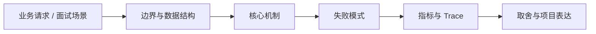

# Loop Engineering 与 Agent Runtime

## 面试定位

Loop Engineering 与 Agent Runtime 属于 AI 工程趋势与实战方案 / Loop Engineering 与 Agent Runtime。面试里它不是背概念题，而是用来判断你是否能把知识落到架构、数据流、指标和取舍上。
一句话定位：Loop Engineering 把一次 prompt 调用升级为带状态、验证器、调度、恢复和反馈闭环的 Agent Runtime。

**必须讲清楚**
- Loop Engineering 把一次 prompt 调用升级为带状态、验证器、调度、恢复和反馈闭环的 Agent Runtime。
- prompt 不是系统边界
- state 和 verifier 是循环可靠性的核心
- schedule 决定长任务能否持续推进

**常见追问方向**
- Loop Engineering 和 Prompt Engineering 的区别。
- 长任务 Agent 如何设计 state、verifier、budget 和 schedule。
- 如何避免 Agent 无限循环、越跑越偏或自我判定成功。
- 如果这个点落到 Coding Agent：代码库任务 Harness、Web Agent：公开网页任务自动化与评测，架构如何设计？
- 线上失败时看哪些 trace、日志、指标，怎么回滚或补偿？

## 架构与运行机制

### 核心机制

- 核心问题是让 Agent 在多步任务中持续记录状态、检查结果并恢复失败。
- 它连接 ReAct、Plan-and-Execute、反思、工具调用和轨迹评测。

### 通用数据流

可以按用户目标、模型、上下文、状态、工具、执行循环、评测、安全和可观测性来讲。数据流是用户任务进入编排层，Context Builder 汇总系统指令、用户约束、RAG 证据、短期状态和工具结果，模型输出结构化动作，宿主程序执行工具并把 observation 写回 State 和 Trace。

### 工程落点

- 定义 run state：goal、constraints、plan、completed_steps、open_risks、artifact_refs 和 next_actions。
- 每个 step 保存 tool call、observation、cost、duration、error 和 verifier verdict。
- 调度层设置 max steps、timeout、budget、pause/resume、human gate 和 rollback。
- 用 trajectory eval 和 artifact verifier 判断循环是否真的推进目标。
- 为每次 run 建立 state file、step log、verifier verdict 和 next action。
- 把停止条件、预算、重试、人工确认写进 runtime，而不是交给模型自由判断。
- 把每个关键步骤都映射到可观测指标，避免只描述功能。
- 回答时主动说明哪些信息是强一致状态，哪些只是上下文或缓存视图。

## 可画图

图 1：Loop Engineering 与 Agent Runtime 的回答要从业务入口进入，先讲边界和数据结构，再讲机制、失败模式、指标和取舍。

## 系统设计案例

### Loop Engineering 与 Agent Runtime 的面试级设计题

典型设计题是企业内部 Agent、Coding Agent、Paper Agent 或 Web Agent：外层 deterministic workflow 管理权限、预算、审批和最终提交，内层 Agent loop 处理开放探索，Eval Gate 根据 golden case、轨迹评分、工具结果和人工反馈决定是否继续。

**可画架构**
- 入口层校验用户请求、权限、租户、参数和幂等键。
- 业务服务层决定同步处理、异步处理、缓存读写、数据库回源或降级返回。
- 状态层保存业务状态、缓存版本、事件状态和恢复点。
- 执行层处理存储访问、下游调用、异步任务和补偿动作，并把结构化结果写入 trace。
- 观测层用指标、日志和链路追踪证明系统可运行、可排障、可复盘。

**数据流**
- 请求进入入口层后生成 request_id/run_id。
- 业务服务读取缓存、数据库或异步事件状态，选择执行路径。
- 执行结果写回状态存储，并向监控系统上报延迟、错误和业务结果。
- 保护策略根据成功标准、失败次数、SLA 和风险等级决定继续、降级、补偿或停止。

## 真实问题与排障

真实线上问题一般从任务成功率、工具调用成功率、invalid args、上下文漂移、幻觉率、引用准确率、token 成本、延迟、guardrail block rate 和 human handoff rate 看起。回答时要把模型问题、检索问题、工具问题、状态问题和权限问题分开归因。

**排查顺序**
- 先确认用户可感知问题：错误率、延迟、成功率、数据一致性或结果质量是否异常。
- 再沿数据流定位是哪一段出了问题：入口、状态、缓存、数据库、异步事件、外部依赖或消费端。
- 对比最近发布、配置变更、流量变化、数据倾斜和下游限流。
- 先止血：限流、降级、回滚、暂停消费、隔离高风险工具或切换只读模式。
- 最后把失败样例进入 regression/eval，避免同类问题复发。

**重点指标**
- task_success_rate
- loop_completion_rate
- verifier_reject_rate
- resume_success_rate
- cost_per_success

**常见误区**
- 只写更长 prompt
- 没有 verifier 就宣称 autonomous
- 长任务无恢复点

## 业界方案与技术取舍

AI Agent 的取舍是开放任务能力换来了不确定性、成本、延迟和治理复杂度。面试追问通常会围绕 workflow 与 agent 边界、memory 与 RAG 区别、function calling 是否等于 agent、eval 怎么证明不是 demo、如何做安全边界展开。

**方案对比**
- Loop Engineering 的核心是把一次模型调用变成可持续运行的软件循环。
- prompt 只是输入，真正的系统边界在 state、verifier、scheduler、tool runtime 和 artifact store。
- 面试要从状态机、恢复点、停止条件和评测证据解释为什么它不是简单自动化脚本。

**复习时要能讲出的细节**
- 这个知识点解决什么问题，不解决什么问题。
- 关键数据结构、状态变化、失败边界和可观测指标是什么。
- 面试官继续追问时，能从架构图、数据流、线上排障和项目证据四个角度展开。
- 能说明为什么这个取舍适合当前业务，而不是只背业界名词。

## 深入技术细节

Loop Engineering 把一次 prompt 调用升级为带状态、验证器、调度、恢复和反馈闭环的 Agent Runtime。

面试深挖时要把对象、状态、协议、执行顺序和失败分支讲出来。不要只说“可以用 Redis/数据库/MQ 解决”，而要说明 key、字段、版本、超时、重试、幂等、降级和观测指标如何共同工作。

## 关键数据结构与协议

| 字段 | 所属对象 | 作用 | 排障价值 |
| :--- | :--- | :--- | :--- |
| `run_id` | Agent run | 标识一次长任务执行 | 串联状态、工具、验证和成本 |
| `state_version` | Run state | 标识 goal、constraints、plan、completed_steps 的版本 | 防止恢复时沿用过期计划 |
| `step_log_ref` | Step log | 保存每一步 tool call、observation、duration、cost 和 error | 复盘循环是否推进目标 |
| `verifier_verdict` | 验证器 | 记录 artifact、测试、截图或外部状态的检查结果 | 防止模型自判完成 |
| `schedule_policy` | 调度器 | 定义 max_steps、deadline、budget、pause/resume 和 human gate | 排查无限循环和预算失控 |
| `artifact_refs` | 产物证据 | 指向 diff、测试日志、截图、报告或引用证据 | 支持恢复、回滚和人工审查 |

## 深问准备

被追问边界时，先说这个方案适合什么、不适合什么，再给反例。被追问线上故障时，按影响面、止血、根因、修复、回归五段回答。被追问项目时，把回答落到你做过的接口、缓存、队列、数据库、监控或 Agent 工程链路。

- 反例要明确，例如强事务事实源不能交给缓存或搜索读模型。
- 指标要可执行，例如 p95、error_rate、retry_rate、lag、miss_rate、stale_rate。
- 回归要可复现，例如固定输入、故障注入、压测脚本或 golden case。

## 趋势落地补充

Loop Engineering 的核心是把“思考-行动-观察”从提示词习惯变成运行时协议。一个可上线的 Agent loop 至少要有 run state、step log、tool runtime、verifier、scheduler 和 artifact store；每个 step 都要记录输入、工具参数、observation、耗时、成本、错误类型和验证结果。没有这些字段，失败后就只能重跑或靠聊天记录猜。

停止条件比继续条件更重要。Runtime 要能根据 max_steps、cost_budget、deadline、重复失败、verifier reject、用户审批缺失和风险等级停下来。面试里可以把 `loop_completion_rate`、`verifier_reject_rate`、`resume_success_rate`、`cost_per_success` 和 `human_handoff_rate` 作为生产指标，说明你不是在讲“模型自己会规划”。

## 生产验收清单

- 每个任务要能从 state file 恢复，不依赖上一轮模型的自然语言记忆。
- Tool runtime 要有权限、超时、重试、幂等和 side-effect 标记，避免开放工具被循环滥用。
- Verifier 必须读取 artifact、测试、截图、引用或外部状态，不能只问模型是否完成。
- Schedule 要支持暂停、继续、升级给人和回滚，且所有决策进入 trace。

## 公开阅读校验

公开读者读这一篇，应该能把 Loop Engineering 和 Prompt Engineering 分开：prompt 决定一次模型输入，runtime 决定多步任务怎样保存状态、调用工具、验证产物、控制预算、恢复失败和停止执行。真正的工程问题不是“让模型再想一想”，而是让每一步都有 state、trace 和 verifier。

文章要特别强调停止条件。很多 Agent demo 失败不是因为不会规划，而是因为没有 max steps、cost budget、deadline、重复失败检测、risk gate 和 human handoff。一个成熟 runtime 应该能在证据不足、验证失败、成本超限或风险升级时停下来，并把原因写进 trace，而不是继续循环到上下文耗尽。

验收样例可以是一条 30 分钟长任务：中途断开、恢复、重试、失败再规划。合格 runtime 要能从 state file 恢复目标和约束，从 artifact_refs 找到已有产物，从 verifier verdict 判断哪些步骤可信，再决定继续、回滚或交给人。这样的例子比“Agent 自动完成任务”更能体现工程深度。

## 项目表达样例

可以把项目讲成一个“长任务 Agent Runtime”：用户提交目标后生成 run state，planner 拆出任务队列，executor 每步调用工具并写 step log，verifier 读取 artifact 判断是否达成，scheduler 根据预算、失败次数和风险等级决定继续、暂停或交给人。这个表达比“用了 ReAct”更工程化，因为它把循环拆成了可以测试和替换的模块。

排障时也要按 runtime 分层：如果循环不前进，看 planner 是否重复生成同类 next_action；如果成本暴涨，看 scheduler 是否缺少 max_steps 和 cost_budget；如果自称完成但产物错误，看 verifier 是否只依赖模型判断；如果恢复后跑偏，看 state_version 和 artifact_refs 是否过期。读者能按这些线索排查，文章才算真正落地。

## 来源与延伸阅读

- [Addy Osmani: Loop Engineering](https://addyosmani.com/blog/loop-engineering/)：用于确认官方语义边界、命令行为和工程约束。
- [OpenAI: A practical guide to building agents](https://cdn.openai.com/business-guides-and-resources/a-practical-guide-to-building-agents.pdf)：用于确认官方语义边界、命令行为和工程约束。
- [Anthropic: Building effective agents](https://www.anthropic.com/engineering/building-effective-agents)：用于确认官方语义边界、命令行为和工程约束。
