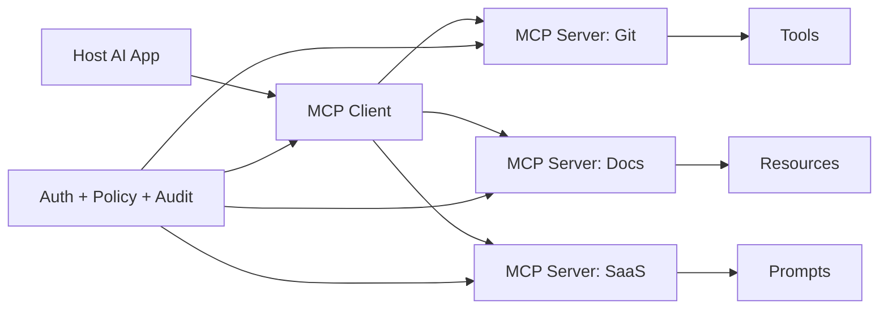
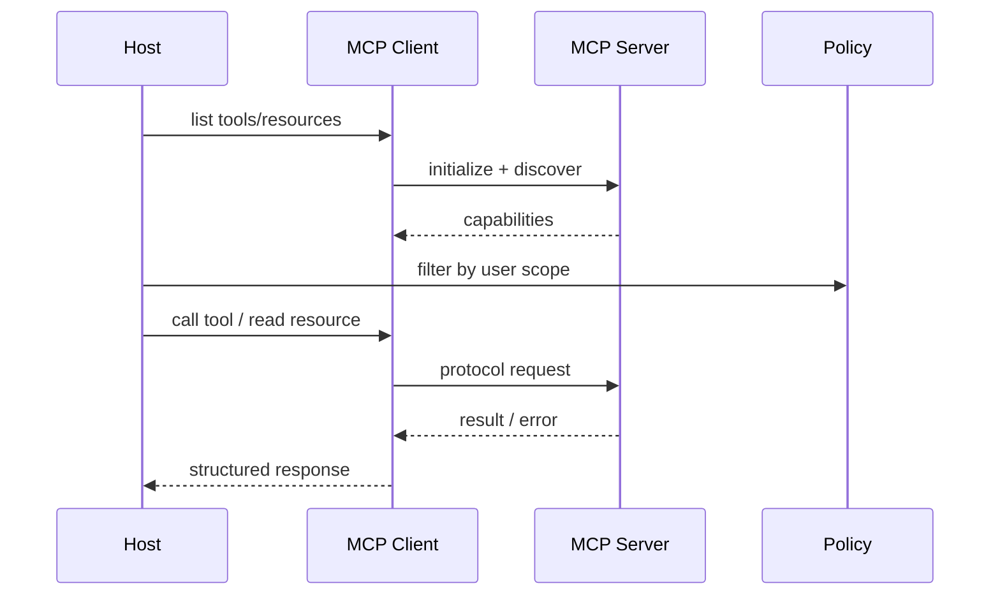

# MCP 基础

## 面试定位

MCP 题目考察的是协议边界，不是背缩写。要能讲清 Host、Client、Server 怎么协作，Resources、Prompts、Tools 分别是什么，以及为什么它能降低 Agent 接工具的集成成本。

面试里要避免把 MCP 说成“又一个 function calling”。Function Calling 是模型 API 的工具调用能力，MCP 是应用与外部能力提供方之间的上下文和工具协议。

## 一句话定义

MCP 是 Model Context Protocol，用来让 AI 应用以统一方式连接外部 tools、resources 和 prompts。它把能力提供方做成 MCP Server，AI 应用作为 Host，通过 Client 与 Server 通信。

它解决的是工具和上下文接入标准化问题，不自动解决业务权限、数据最小化、审计和高风险动作确认。

## 为什么需要它

没有 MCP 时，每个 Agent 应用都要为 Git、文件、数据库、SaaS、知识库写一套私有插件接口。工具定义、鉴权、错误格式和资源读取方式都不一致。

MCP 把能力暴露为协议化 Server。Host 不需要知道每个系统的内部实现，只需要通过 Client 发现 tools、读取 resources、使用 prompts，并按协议处理返回。

## 核心架构

图 1 里 Host 是用户使用的 AI 应用，Client 是连接某个 Server 的协议适配层，Server 暴露能力。Tools 是可执行动作，Resources 是可读上下文，Prompts 是可复用提示模板。

## 架构与运行机制

MCP 的数据流通常是：Host 启动或连接 MCP Server，Client 发现可用 tools/resources/prompts，Host 根据任务和权限选择要暴露给模型的能力，模型提出调用意图，Host 通过 Client 调 Server，Server 返回结构化结果。

关键边界是：Server 暴露能力，不代表模型可以随便用。Host 仍要做工具选择、权限判断、用户确认、结果脱敏和 trace。

## 运行机制

Tools 适合表达动作，例如 `search_repo`、`create_issue`、`query_database`。Resources 适合表达上下文，例如文件、文档、表结构或日志片段。Prompts 适合表达可复用任务模板。

不要把所有东西都做成一个大 Tool。可读数据优先用 Resources，确定动作才做 Tools，高风险 Tools 必须有 schema、权限和确认。

## 关键设计取舍

| 设计点 | 推荐做法 | 收益 | 风险 |
| --- | --- | --- | --- |
| 本地 Server | 文件、Git、IDE、终端等本机能力 | 延迟低，集成深 | 权限和沙箱要严格 |
| 远程 Server | SaaS、工单、知识库、数据库 | 易共享和治理 | OAuth、租户隔离更复杂 |
| Tools | 用于有副作用或计算动作 | 能扩展 Agent 能力 | 误调用会产生风险 |
| Resources | 用于上下文读取 | 降低工具滥用 | 需要权限过滤 |
| Prompts | 用于任务模板 | 复用团队经验 | 不能替代系统指令 |

## 生产落地细节

MCP Server 侧要定义清晰 schema、错误码、权限 scope、限流、审计和版本。Host 侧要控制哪些 Server 可见、哪些 tool 暴露给模型、哪些 resource 能读、哪些动作需要 human confirmation。

远程 Server 必须考虑 OAuth、租户隔离、token 生命周期、数据脱敏、日志审计和网络故障。本地 Server 必须考虑文件系统边界、shell 权限和敏感文件排除。

## 系统设计案例

Coding Agent 可以接多个 MCP Server：Git Server 暴露 diff 和 branch 信息，Docs Server 暴露项目文档资源，Issue Server 暴露工单工具。Host 根据当前任务只选择相关能力放进上下文。

这个案例的重点是发现、过滤、调用和审计，而不是让模型直接连到所有外部系统。

## 真实问题与排障

MCP 问题常见在四类：Server 没连上，capability 发现不完整，权限过滤错误，工具返回格式让模型难以使用。排查时先看连接和初始化，再看 capabilities，再看 Host 是否暴露了正确能力，最后看 tool result 和 trace。

指标包括 `server_connect_success_rate`、`tool_call_success_rate`、`permission_denial_rate`、`resource_read_latency`、`schema_error_rate` 和 `audit_coverage`。

## 常见误区与排障

常见误区是把 MCP 当成模型能力，忽略 Host 仍要做选择和治理。另一个误区是把 Resources、Prompts、Tools 混成一个大工具，导致权限和审计很难做。

排障时沿数据流看：Host 是否连接 Server，Client 是否发现能力，Policy 是否过滤，Server 是否返回结构化错误，模型是否正确使用结果。

## 面试追问

1. MCP 和 Function Calling 区别是什么？一个是应用接外部能力的协议，一个是模型 API 的工具调用形式。
2. Tools、Resources、Prompts 怎么区分？动作、上下文、模板。
3. MCP Server 暴露写工具时怎么做安全？scope、确认、审计、幂等和最小权限。
4. 本地 MCP 和远程 MCP 风险有什么不同？文件/进程边界 vs 网络/OAuth/租户边界。

## 项目化表达

在个人 Coding Agent 里，可以用 MCP 接 Git、文件系统、文档和 issue 系统。项目表达时强调：我不会把所有本机能力直接给模型，而是通过 Host 的权限策略、Server capability 和 tool schema 做最小暴露。

## 深入技术细节

MCP 的核心是把外部能力接入标准化，但它不是安全系统本身。Host 通过 Client 连接 Server，发现 Tools、Resources、Prompts；Host 再根据用户身份、任务目标和风险策略裁剪能力，决定哪些 schema 进入模型上下文。Server 侧仍要做 OAuth、租户隔离、参数校验、限流和审计。

Tools、Resources、Prompts 的风险等级不同。Resource 是可读上下文，Tool 是动作或计算，Prompt 是任务模板。只读文档不应硬包装成写工具，高风险写操作也不能因为挂在 MCP Server 上就绕过确认和幂等。

## 关键数据结构与协议

| 对象 | 关键字段 | 边界 |
| :--- | :--- | :--- |
| Host | user、task、policy | 决定暴露哪些能力 |
| Client | server_id、session、transport | 连接与调用 |
| Server | capabilities、auth、audit | 提供能力 |
| Tool | schema、risk、side_effect | 可执行动作 |
| Resource | uri、mime、permission | 可读上下文 |
| Trace | call_id、args_hash、result | 排障与审计 |

协议上一次 MCP 调用应记录 discovery 版本、capability 名称、schema version、user scope、args hash、result status 和 latency。否则排障时无法区分是连接、schema、权限还是业务错误。

Server capability 还要有版本和缓存失效策略。Host 不能永久相信启动时发现的 schema，Server 升级或权限变化后应重新 discovery，避免模型继续调用已经下线或权限收紧的能力。

## 深问准备

被问“MCP 和 Function Calling 区别”时，可以回答：Function Calling 是模型表达调用意图的 API 形式；MCP 是应用连接外部能力的协议。真实系统里二者常配合：模型输出 tool call，Host 通过 MCP Client 调 Server。

被问“本地 Server 风险”时，重点讲文件系统、shell、Git 凭证和环境变量；默认只读、路径白名单、写操作确认、敏感文件排除和审计是必需的。

## 公开阅读校验

公开读者最需要分清的是：MCP 解决的是能力接入标准化，不自动解决权限、安全和可观测性。一个可信的 MCP 方案应能展示 Host 如何 discovery、如何按用户与任务裁剪 capabilities、如何把 tool schema 放入模型上下文、如何在调用前后记录审计。只说“接了 MCP Server”没有工程说服力，因为真正的边界在 Host 的治理层。

上线验收建议做四类 fixture：Server 离线、capability schema 变更、用户权限收紧、高风险写工具误暴露。每类都要检查 Host 是否重新 discovery、是否拒绝过期 schema、是否把无权限 tool/resource 从上下文中移除、是否把拒绝原因写入 trace。尤其是本地文件系统、shell、Git、浏览器会话这类 Server，要验证路径白名单、敏感文件排除、写操作确认和环境变量隔离。

指标上可以看 `capability_refresh_latency`、`stale_schema_call_count`、`unauthorized_capability_exposure_count`、`tool_policy_denial_rate`、`mcp_error_taxonomy_coverage` 和 `audit_trace_completeness`。这些指标能说明 MCP 接入是可治理的外部能力层，而不是把本机或企业系统裸露给模型。

还要给读者一个选型边界：如果只是单应用内的少量固定工具，普通 Function Calling 加内部 dispatcher 可能更简单；当工具来自多个进程、团队或外部系统，且需要统一 discovery、资源访问和 prompt 模板时，MCP 的协议化价值才会显现。把这个边界说清，文章会更像工程判断，而不是把 MCP 当成所有工具接入的默认答案。

故障复盘时也要按层切分。连接失败看 transport 和 auth；能力缺失看 discovery 与缓存；模型不会用工具看 schema 描述和示例；越权调用看 Host policy；业务失败看 Server 返回的结构化错误。这样读者能把 MCP 问题拆成可排查链路，而不是笼统归因给“Agent 不稳定”。

这也是 MCP 文章最该强调的工程价值：把外部能力变成可发现、可裁剪、可审计的接口。

## 来源与延伸阅读

- [MCP Architecture](https://modelcontextprotocol.io/docs/learn/architecture)：用于 Host、Client、Server 和协议层边界。
- [Model Context Protocol](https://modelcontextprotocol.io/)：用于 Tools、Resources、Prompts 的官方概念。
- [AgentGuide Agent 求职路线](https://github.com/adongwanai/AgentGuide/blob/main/docs/05-roadmaps/agent-job-ready-roadmap-2026.md)：用于中文面试复习组织。
