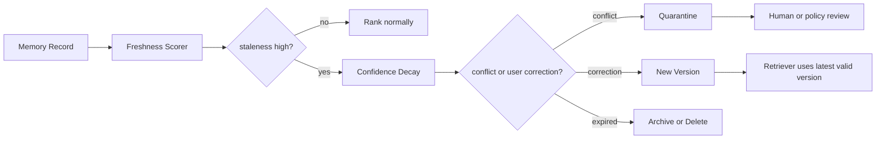

# 记忆衰退与污染控制

## 一句话定义

记忆衰退与污染控制，是给 Agent 长期记忆建立 TTL、confidence、staleness、correction、quarantine 和 version 机制，防止旧信息、错误偏好或跨任务噪声长期影响后续决策。

## 面试定位

这道题通常跟长期记忆连着问。面试官想知道你是否理解：记忆一旦写入，就会变成未来上下文的一部分，因此它必须像缓存、索引和配置一样有生命周期治理。

好的回答要把“衰退”讲成工程系统，而不是说“定期清理”。你需要解释怎样识别 stale memory，怎样处理冲突版本，怎样让用户纠错，以及如何用指标证明污染下降。

## 为什么需要它

Agent 的用户偏好、项目状态和外部事实都会变化。今天正确的部署命令，三个月后可能已经被 CI 替换；用户曾经喜欢的格式，也可能在新团队里不再适用。

如果没有衰退机制，Memory Store 会逐渐变成高置信噪声库。模型召回越多，越容易出现上下文污染、错误个性化和越权使用旧数据。

## 核心架构

| 控制点 | 作用 | 典型字段 | 失败信号 |
| :--- | :--- | :--- | :--- |
| TTL | 控制可用时间 | expiresAt、ttlReason | 过期信息仍被读取 |
| confidence | 表示可信程度 | score、lastVerifiedAt | 低置信内容影响答案 |
| staleness | 衡量陈旧度 | lastUsedAt、sourceAge | 旧项目约束覆盖新指令 |
| correction | 处理用户纠错 | correctedBy、reason | 同错反复出现 |
| quarantine | 隔离可疑记忆 | riskLabel、reviewState | 污染扩散到上下文 |
| version | 保留演进历史 | version、supersedes | 新旧记录互相打架 |

## 架构与运行机制

记忆衰退可以分成三条链路。第一条是时间衰退：TTL 到期、长期未使用或来源过旧时降低权重。第二条是证据衰退：RAG citation、业务 API 或用户纠错证明旧记录不再可信。第三条是行为衰退：某条记忆被使用后导致任务失败，就要把失败样本回灌给评测和写入策略。

系统不应该直接删除所有旧记忆。对用户偏好，可能降低 confidence 并等待确认；对事实类记录，应该用来源复核或重新索引；对敏感、冲突或疑似污染内容，可以进入 quarantine。

## 运行机制

1. 写入时根据 memory type 设置 TTL 和初始 confidence。
2. 每次 retrieval 前计算 freshness score，过滤已过期或不在 scope 内的记录。
3. 如果当前证据与旧记忆冲突，生成 conflict event，而不是把文本粗暴合并。
4. 用户纠错时创建新 version，并将旧版本标记为 superseded。
5. 对可疑来源、跨租户痕迹或被攻击内容进入 quarantine。
6. 定期用 correction rate、stale_memory_rate 和 task impact 更新策略。

## 关键设计取舍

| 取舍 | 好处 | 代价 | 建议 |
| --- | --- | --- | --- |
| 硬删除 | 彻底消除污染 | 丢失审计和回溯 | 对隐私删除必须支持 |
| 软失效 | 可追踪历史 | 需要过滤逻辑 | 对普通过期更合适 |
| 自动衰退 | 运营成本低 | 可能误降权 | 结合人工纠错样本 |
| 人工确认 | 准确性高 | 打扰用户 | 用于高影响或冲突记忆 |

## 生产落地细节

- memory record 要保存 version、source、scope、confidence、TTL、lastVerifiedAt 和 correction history。
- 检索排序不能只看 embedding similarity，还要加入 freshness 与 staleness penalty。
- 事实类记忆要能回到原始 citation 或业务对象，避免只保存自然语言摘要。
- quarantine 中的记录默认不可进入上下文，只能提供给审核或安全评估。
- 指标要看 stale_memory_rate、conflict_rate、correction_latency、quarantine_release_rate 和 repeated_error_rate。

## 系统设计案例

假设 Paper Agent 会记住用户常看的领域、论文筛选标准和历史总结模板。用户改研究方向后，旧偏好可能继续影响推荐。系统应该给偏好类记忆设置可衰退 confidence，并在新查询与旧偏好冲突时追问：“这次是否仍按旧方向筛选？”

数据流是：检索候选记忆后先计算 freshness，再对冲突记录触发 review；如果用户确认新偏好，系统写入新 version 并降低旧版本权重。后续 eval 用推荐点击率、用户纠错率和引用准确率判断衰退策略是否有效。

## 真实问题与排障

线上看到 Agent 总按旧项目路径回答时，先查被读取的 memory_id。确认它的 scope 是否正确、TTL 是否过期、source 是否来自旧会话，以及最近是否有用户 correction 被漏处理。

止血可以先对该 workspace 禁用相关 memory type，或者把可疑记录放入 quarantine。根因修复通常在 Write Policy、Retriever freshness scoring、缓存失效和用户删除传播这几层。

## 常见误区与排障

- 只靠时间删除，不看事实冲突和用户纠错。
- 把 stale memory 当成普通低相似度问题。
- 忘记对 embedding index 同步删除或降权。
- 没有 version，导致新旧记忆互相覆盖。
- 只统计命中率，不统计错误命中造成的任务失败。

## 面试追问

- 新旧记忆冲突时，系统应自动选择还是向用户追问？
- 过期记忆是否需要从 trace 中删除？
- 如何区分用户临时指令和长期偏好？
- quarantine 记录什么时候能释放？
- 如何设计 memory eval 来捕捉污染问题？

## 项目化表达

可以把这个点讲成“长期记忆的治理层”。项目里不是简单加一个定时任务，而是把 TTL、confidence、staleness、correction、quarantine、version 都进入数据模型和 trace。这样面试官继续追问时，你能从数据结构、检索排序、用户纠错和线上指标四个方向展开。

## 深入技术细节

记忆衰退要作用在写入、检索和使用三个阶段。写入时为不同 memory type 设置 TTL、scope、source 和初始 confidence；检索时 freshness scorer 将 embedding similarity、scope match、last_verified_at、source_age 和 correction history 一起排序；使用后如果导致任务失败，要把 memory_id 和失败类型回灌到衰退策略。

冲突处理不能简单合并文本。系统应生成 conflict event，记录旧记忆、新证据、来源、影响范围和建议动作。用户纠错时写入新版本，并把旧版本标记 superseded；对疑似 prompt injection、跨租户泄漏或敏感信息，进入 quarantine，默认不参与上下文构建。

## 关键数据结构与协议

| 字段 | 作用 | 失败风险 |
| :--- | :--- | :--- |
| `memory_id` | 可追踪记录 | 无法定位污染 |
| `scope` | 工作区/用户/项目边界 | 跨任务误用 |
| `confidence` | 可信度 | 低质记忆高权重 |
| `expires_at` | TTL | 过期仍命中 |
| `supersedes` | 版本关系 | 新旧冲突 |
| `quarantine_state` | 隔离状态 | 可疑内容扩散 |

协议上，事实类记忆必须能回到原始 source 或 citation；偏好类记忆可以更软，但在新任务冲突时要询问用户。删除或纠错还要同步到向量索引，否则文本库删除了，embedding 仍可能召回。

## 深问准备

被问“新旧记忆冲突怎么办”时，可以按风险回答：低风险偏好可询问或临时覆盖，高风险事实要回源验证，敏感或跨租户冲突要 quarantine。不能让模型自己静默选择看起来更顺的版本。

被问“如何评估污染下降”，看 `stale_memory_rate`、`conflict_rate`、`correction_latency`、`repeated_error_rate`、`quarantine_precision` 和 `memory_caused_failure_rate`。只看记忆命中率会鼓励召回更多噪声。

## 来源与延伸阅读

- [OpenAI Agents SDK 文档](https://openai.github.io/openai-agents-python/)
- [Anthropic: Context engineering for agents](https://www.anthropic.com/engineering/context-engineering-for-agents)
- [Anthropic: Building effective agents](https://www.anthropic.com/engineering/building-effective-agents)
- [Model Context Protocol 文档](https://modelcontextprotocol.io/docs)
