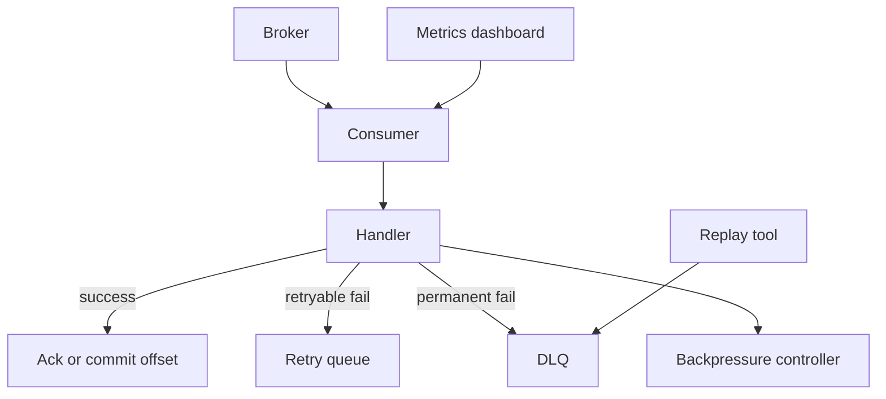

# 消费治理、积压与故障排查

## 一句话定义

消费治理是围绕 consumer lag、ack、retry、DLQ、backpressure、poison message 和下游保护设计的运行体系。目标是让消息既能被稳定处理，又能在失败时可观测、可隔离、可重放。

## 面试定位

这类题通常比“怎么发消息”更能体现生产经验。面试官想看你是否知道消费端才是 MQ 稳定性的主战场。

回答要覆盖架构、数据流、指标、取舍和追问。重点包括积压定位、失败重试、死信处理、限流和幂等。

## 为什么需要它

消费者可能因为下游慢、代码 bug、消息格式变更、热点 key、外部依赖故障或 poison message 出现积压。没有治理时，retry 会放大流量，DLQ 无人处理，最终业务数据长时间不一致。

## 核心架构

图 1：消费治理链路从 Broker、Consumer、Handler 开始，按处理结果进入 ack、retry、DLQ 或 backpressure，并通过指标看板与重放工具形成运维闭环。

图中 `Handler` 是业务副作用边界，只有业务状态、幂等记录和下游写入都成功后才能进入 `Ack or commit offset`；`Retry queue` 处理临时错误，`DLQ` 隔离不可恢复或超过阈值的消息；`Backpressure controller` 是下游保护边界，不能让 retry 在故障时继续放大流量。`Replay tool` 只应从 DLQ 读取已分类、已修复、已审批的消息。

| 治理点 | 作用 | 指标 |
| --- | --- | --- |
| consumer lag | 衡量积压 | lag、delay |
| ack/offset | 控制消费进度 | commit_latency |
| retry | 处理临时错误 | retry_rate |
| DLQ | 隔离永久失败 | DLQ_count |
| backpressure | 保护下游 | throttle_rate |
| poison message | 防止反复失败 | poison_count |

## 架构与运行机制

消费者处理成功后才 ack 或提交 offset。失败要分可重试和不可重试。可重试错误进入延迟 retry，不可重试错误进入 DLQ。对于下游超时或错误率上升，要通过 backpressure 降低并发。

poison message 不能无限重试，否则会造成积压和资源浪费。DLQ 需要告警、检索、修复、重放和审计。

## 运行机制

1. Consumer 从 broker 拉取消息。
2. Handler 校验 schema、幂等键和业务状态。
3. 成功后 ack 或提交 offset。
4. 可重试错误进入 retry，并增加 retry_count。
5. 永久错误或超过重试次数进入 DLQ。
6. Backpressure 根据下游延迟和错误率调节并发。
7. 运维通过 dashboard 和 replay tool 处理积压与死信。

## 关键设计取舍

| 取舍 | 收益 | 代价 | 建议 |
| --- | --- | --- | --- |
| 高并发消费 | 吞吐高 | 下游压力大 | 动态限流 |
| 快速 retry | 恢复快 | 故障时放大流量 | 指数退避 |
| 直接 DLQ | 隔离快 | 可能延迟业务 | 明确错误分类 |
| 自动重放 | 效率高 | 可能重复副作用 | 幂等后使用 |

## 生产落地细节

- 消费者处理前校验 schema_version，避免格式变更导致 poison message。
- ack 必须在业务成功后执行。
- retry 要带 retry_count、last_error、next_retry_at。
- DLQ 要有责任人、告警、检索和重放工具。
- 指标包括 consumer_lag、end_to_end_delay、ack_latency、retry_rate、DLQ_count、handler_error_rate、downstream_latency 和 replay_success_rate。

## 系统设计案例

搜索索引同步消费者处理商品变更消息。下游 ES 慢时，backpressure 降低消费并发。格式错误消息进入 DLQ。ES 临时 429 的消息进入延迟 retry。消费者按 product_id 和 version 做幂等，防止旧消息覆盖新索引。

数据流是：broker -> consumer -> handler -> ES -> ack。异常链路分别进入 retry 或 DLQ。

## 真实问题与排障

consumer lag 上升时，先看生产速率是否突增，再看消费者错误率、下游延迟、rebalance、热点 partition 和 poison message。不要盲目加消费者，因为瓶颈可能在下游。

事故链路建议按四步说清。影响面：确认 topic、consumer group、最老消息时间、积压条数、影响业务 key 和下游错误率。止血：暂停高风险重放、降低消费并发、保护下游限流、回滚消费者版本或隔离 poison message。根因：对比发布版本、schema_version、错误码、trace_id、retry_count 和 DLQ reason，判断是代码 bug、格式变更还是外部依赖。回归：用事故消息做 dry-run 重放，确认幂等记录、ack 时机、retry 策略和告警阈值都覆盖同类问题。

## 常见误区与排障

- 失败消息无限重试。
- ack 早于业务提交。
- DLQ 只写进去没人看。
- 积压时只扩容消费者，不看下游。
- 没有端到端延迟指标。

## 面试追问

- consumer lag 上升怎么定位？
- retry 和 DLQ 怎么划分？
- poison message 如何隔离？
- 如何保护慢下游？
- 重放 DLQ 时如何防重复副作用？

## 项目化表达

项目里可以说：“我把消费端做成有治理的 pipeline。成功后 ack，失败按错误类型进 retry 或 DLQ，backpressure 保护下游，consumer lag、DLQ_count 和 end_to_end_delay 是核心告警。”

## 深入技术细节

消费治理的关键是 ack/offset 时机和错误分类。业务处理成功、幂等记录写入成功之后再 ack 或 commit offset，才能避免“消息丢进度”。如果先 ack 再写业务，进程崩溃会造成消息丢失；如果一直不 ack，失败消息会反复投递并阻塞后续消息。错误要分类：临时下游错误走 retry，数据格式错误或不可恢复业务错误进 DLQ，权限或状态冲突走补偿或人工处理。

consumer lag 上升时不能只加实例。先看生产速率、分区分布、单条处理耗时、下游 p95、错误率、rebalance 次数和毒消息。若瓶颈在下游数据库或 ES，加消费者只会放大压力。backpressure 可以通过降低并发、暂停分区、延迟重试、限流下游调用实现。

## 关键数据结构与协议

消费者处理记录建议包含 `event_id`、`consumer_group`、`partition`、`offset`、`attempt`、`status`、`error_code`、`retryable`、`next_retry_at`、`dlq_reason`、`handler_latency_ms`。DLQ 消息要保留原 payload、headers、trace_id、error_code、stack 摘要和最后一次处理上下文。

重放协议要有 operator、reason、message_ids、rate_limit、dry_run、replay_result。没有这些字段，DLQ 重放会变成新的事故源。指标包括 consumer_lag、end_to_end_delay、handler_latency_p95、retry_rate、DLQ_count、poison_message_count、rebalance_count、ack_latency、downstream_error_rate。

消费者还要区分“处理成功但 ack 失败”和“处理失败但 ack 成功”的风险。前者会导致重复投递，需要幂等兜底；后者会造成消息丢失，必须避免。面试里能把 ack 时机讲清楚，通常比只说“加重试和死信队列”更有说服力。

治理还包括发布节奏。消费者新版本上线前要用影子消费或小流量 consumer group 验证 schema、幂等和下游限流；如果新版本错误率升高，要暂停消费或回滚，而不是让错误消息迅速灌满 DLQ。

Runbook 也要写清楚负责人。告警触发后先冻结重放，再确认错误类型、影响 topic、业务 key 范围、最老积压时间、trace_id 和影响用户规模，最后决定扩容、限流、回滚、补偿或人工修复。

## 深问准备

- 追问 lag 上升：按 producer、broker、consumer、downstream、poison message 分段排查。
- 追问 retry 和 DLQ：临时错误重试，不可恢复或超过阈值进入 DLQ。
- 追问慢下游：限流、降并发、暂停消费、延迟重试，保护下游优先。
- 追问 DLQ 重放：先分类修复，再审批限速重放，消费者必须幂等。

## 公开阅读校验

这篇文章对外发布时，要避免把消费治理讲成“消费者线程数调优”。更严谨的表述是：消费端治理由进度确认、失败分类、下游保护、毒丸隔离、死信处置和重放审计共同组成。读者应该能从文中看出三条边界：第一，业务副作用完成前不能提交 ack 或 offset；第二，retry 只适合临时错误，永久错误必须被隔离；第三，积压处理优先保护下游，而不是一味提高消费并发。

如果用于项目复盘，可以补一句可验证的生产口径：“我们把 `consumer_lag`、`oldest_message_age`、`handler_latency_p95`、`downstream_error_rate`、`retry_rate`、`dlq_count` 和 `rebalance_count` 放到同一张看板里，告警先判断积压是生产突增、下游变慢、消费发布异常、热点 partition 还是 poison message。”这句话能把抽象治理落到可观测指标。

还要明确 DLQ 的运营责任。DLQ 消息进入后应保留原 payload、headers、trace_id、handler version、error_code、retry_count 和 `dlq_reason`，并能按 topic、consumer group、业务 key 和时间范围检索。重放必须支持 dry-run、审批、限速、灰度和审计结果。没有这些能力时，DLQ 只是把主链路错误搬到另一个队列，并没有真正提升可靠性。

面试中最容易被追问的是“积压时要不要扩容”。推荐回答是先看瓶颈位置：如果 lag 按所有 partition 均匀增长，且下游延迟正常，可以扩消费者或提高并发；如果 lag 集中在单个 partition，大概率是热点 key 或毒丸消息；如果下游 p95 和错误率同时升高，扩消费者会放大故障，应先降并发、暂停部分分区或延长 retry。这个判断链路比“加机器”更像真实生产经验。

还可以补一个反例帮助读者记忆：某次消费者发布后 schema 校验失败，所有新格式消息都进入 retry，团队只扩容 consumer，结果下游被无效重试打满，DLQ 也快速膨胀。正确处理应该是先暂停异常版本或异常 partition，确认 schema_version 和错误码，再把可修复消息限速重放。这类反例能把治理重点从“吞吐”拉回“分类、隔离和恢复”。

## 来源与延伸阅读

- [Kafka Consumer configs 官方文档](https://kafka.apache.org/documentation/#consumerconfigs)：用于确认 consumer group、offset、poll 与提交相关配置的语义边界。
- [RabbitMQ Consumer acknowledgements 官方文档](https://www.rabbitmq.com/docs/confirms)：用于支持“业务成功后再 ack”的机制说明，尤其是确认与重投递行为。
- [RabbitMQ Dead Letter Exchanges 官方文档](https://www.rabbitmq.com/docs/dlx)：用于说明 DLQ/DLX 如何隔离无法正常消费的消息，以及为什么死信也需要治理工具。
- [RocketMQ Retry and DLQ 官方文档](https://rocketmq.apache.org/docs/featureBehavior/10consumerretrypolicy/)：用于对照 retry、最大重试次数和 DLQ 的工程实践。
