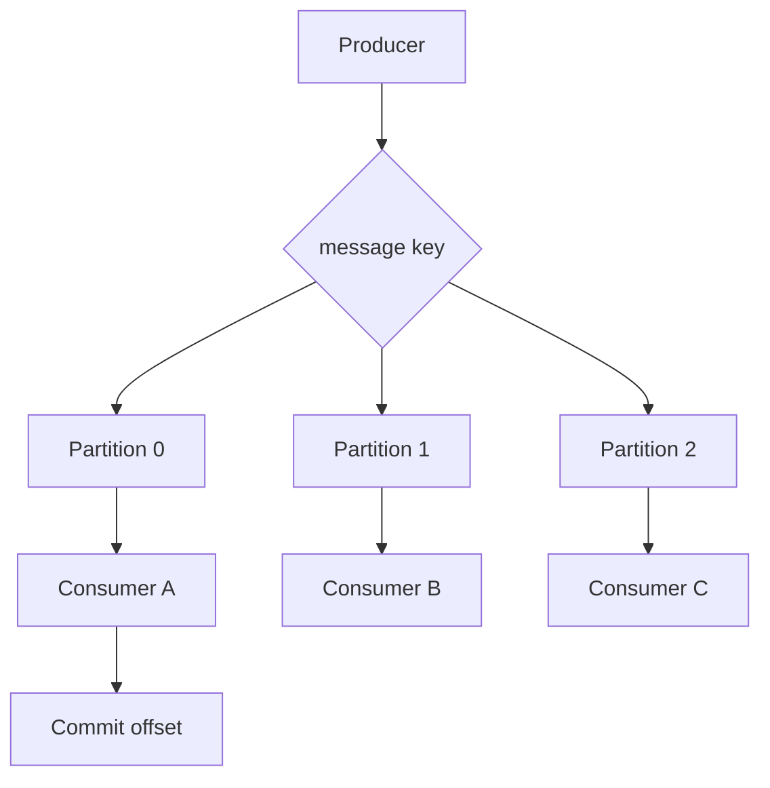

# 顺序消息、分区与 Consumer Group

## 一句话定义

MQ 的 ordering 通常是分区级别的：同一 message key 进入同一 partition 或 message group，由同一 consumer group 内的消费者按 offset 顺序处理。全局顺序代价极高，生产系统通常选择业务局部顺序。

## 面试定位

这题考顺序语义。面试官想知道你是否理解全局顺序、分区顺序、消费者组、rebalance、offset 和吞吐之间的取舍。

回答要覆盖架构、数据流、指标、取舍和追问。不要只说“用同一个 key”。

## 为什么需要它

订单状态、账户流水、库存变更和 Agent run step 事件都可能需要同一业务对象内的顺序。如果消息乱序，可能出现已取消订单又被发货、旧状态覆盖新状态等问题。

但全局顺序会牺牲并发。更合理的方式是按业务 key 分区，只保证同一订单、账户或 run_id 内有序。

## 核心架构

图 1：顺序消息通常以业务 key 进入固定 partition，再由同一 consumer group 内的消费者按 offset 顺序处理，处理成功后提交消费进度。

图中 `message key` 是顺序域选择边界，决定哪些事件必须落到同一 partition；`Partition` 是 MQ 提供顺序和并发的基本单位；`Consumer` 是业务状态机执行边界；`Commit offset` 是进度确认边界，必须晚于业务处理和幂等记录。只要这几个边界被破坏，就可能出现状态回退、重复执行或跳过失败消息。

| 概念 | 作用 | 风险 |
| --- | --- | --- |
| message key | 决定分区或消息组 | key 倾斜 |
| partition | 顺序和并发单位 | 分区内串行 |
| consumer group | 横向扩展消费 | rebalance 抖动 |
| offset | 消费进度 | 提交过早会丢处理 |
| rebalance | 分配分区 | 处理中断 |

## 架构与运行机制

Producer 根据业务 key 发送消息，同一 key 进入同一 partition。Broker 保证 partition 内日志顺序。Consumer group 内，一个 partition 同时只分给一个 consumer 实例消费，因此可以保持分区内顺序。

如果消费者处理失败，不能简单跳过，否则状态顺序被破坏。需要 retry、暂停该 key、DLQ 或业务补偿。rebalance 时要处理未提交 offset 和正在执行的消息。

## 运行机制

1. 选择业务顺序键，例如 order_id、account_id、run_id。
2. Producer 将同一 key 的消息路由到同一 partition。
3. Consumer group 分配 partition 给消费者。
4. 消费者按 offset 顺序处理。
5. 业务成功后提交 offset 或 ack。
6. 失败时按顺序策略 retry 或隔离 poison message。

## 关键设计取舍

| 取舍 | 收益 | 代价 | 建议 |
| --- | --- | --- | --- |
| 全局顺序 | 简单语义 | 吞吐极低 | 极少使用 |
| 分区顺序 | 并发和顺序平衡 | 只保证 key 内有序 | 业务常用 |
| 多消费者 | 吞吐高 | rebalance 复杂 | 监控 lag |
| 跳过失败消息 | 避免阻塞 | 可能破坏状态 | 高风险禁用 |

## 生产落地细节

- message key 要稳定，并避免热点 key。
- partition 数影响最大并行度，后期扩容要注意 key 分布变化。
- 消费成功后再提交 offset，避免处理失败但进度已推进。
- 对同一 key 的失败要有顺序保护策略。
- 指标包括 partition_lag、rebalance_count、offset_commit_latency、key_skew、processing_time 和 ordering_violation_count。

## 系统设计案例

订单状态流转可以用 order_id 作为 message key。创建、支付、发货、取消事件都进入同一 partition，并由同一消费者顺序处理。消费者按订单版本号做幂等，防止重复消息覆盖新状态。

数据流是：order event -> partition by order_id -> consumer -> state transition -> offset commit。若某订单消息失败，只阻塞该 partition 或 key 的处理策略，不应影响所有业务。

## 真实问题与排障

如果出现状态回退，先看消息 key 是否一致，再看消费者是否并发处理了同一 key，最后看 offset 是否过早提交。若 lag 集中在一个 partition，可能是热点 key 或 poison message。

排障时可以把链路拆成四段。影响面：确认哪些 aggregate、partition、offset 范围出现 ordering violation，是否集中在某个 key。止血：暂停该 partition 或该 key 的消费，冻结自动补偿，避免旧事件继续覆盖新状态。根因：检查 producer 是否改过 key 规则、partition 数是否调整、rebalance 是否打断正在处理的消息、消费者是否在同一 key 内开了并发。回归：用同一批事件按原 offset 回放，验证状态机版本约束、幂等表和 offset 提交时机。

## 常见误区与排障

- 以为 MQ 默认全局有序。
- key 选择不稳定。
- 失败后跳过消息导致状态错乱。
- rebalance 时没有处理正在执行的任务。
- 扩 partition 后不评估 key 分布。

## 面试追问

- 全局顺序和局部顺序如何取舍？
- Kafka consumer group 如何保证分区内顺序？
- rebalance 对顺序有什么影响？
- 热点 key 怎么处理？
- 顺序消息失败时能不能跳过？

## 项目化表达

项目里可以说：“我只承诺业务 key 内顺序。Producer 用 order_id 或 run_id 做 message key，consumer group 保证 partition 内按 offset 处理，业务层再用 version 和 idempotency 防重复和状态回退。”

## 深入技术细节

顺序消息首先要定义顺序范围。全局顺序通常意味着单 partition 或单消费者，吞吐、可用性和扩展性都会明显下降。生产系统更常见的是业务 key 内局部顺序，例如同一 order_id、account_id、workflow_run_id。Producer 用稳定 message key 路由，同一 key 进入同一 partition 或 FIFO message group，Consumer group 保证同一 partition 在同一时刻由一个消费者处理。

失败处理决定顺序是否真实成立。如果某条消息处理失败后直接提交 offset，后续消息会先执行，状态机可能回退或跳跃。如果一直阻塞，又会造成 partition lag。常见策略是有限重试、poison message 隔离、人工修复、业务版本号防回退。rebalance 时要优雅停止正在处理的任务，避免两个消费者同时处理同一 partition 的未提交消息。

## 关键数据结构与协议

消息字段建议包含 `message_key`、`partition`、`offset`、`aggregate_version`、`event_id`、`trace_id`、`retry_count`。业务表要有 version 或状态机约束，例如订单只能从 paid 到 shipped，不能从 shipped 回到 paid。消费者提交 offset 或 ack 之前，必须确保业务处理和幂等记录已经成功。

监控指标包括 partition_lag、consumer_lag、rebalance_count、ordering_violation_count、hot_key_count、poison_message_count、offset_commit_latency、idempotency_conflict_count。如果某个 partition lag 远高于其他分区，通常是热点 key、慢下游或毒消息，而不是简单“消费者不够”。

扩容时要特别小心 partition 和 key 的关系。增加消费者数量只能提高可并行 partition 的处理能力，不能让同一个 partition 内消息并发。增加 partition 可能改变 key 分布，部分系统还要考虑历史消息和新消息落点不一致的问题，所以顺序语义必须写进事件路由规则和发布规范。

面试中可以补充一个判断标准：只要业务状态机要求 A 事件必须先于 B 事件生效，就应把它们放进同一个顺序域；如果只是最终值覆盖且带 version，可以用幂等和版本判断替代强顺序。

## 深问准备

- 追问全局顺序：讲单分区代价和局部顺序的业务建模。
- 追问 rebalance：说明 revoke 前停止拉取、处理完或中断、提交进度、恢复时幂等。
- 追问热点 key：回答拆分业务维度、异步补偿、单 key 限流，但不能破坏状态机顺序。
- 追问失败消息能否跳过：默认不能直接跳过，除非进入 DLQ 并有补偿或人工处理策略。

## 来源与延伸阅读

- [Apache Kafka Concepts 官方文档](https://kafka.apache.org/documentation/#intro_concepts_and_terms)：用于支持 partition、record 顺序和 consumer group 的基础语义说明。
- [Apache Kafka Consumer configs 官方文档](https://kafka.apache.org/documentation/#consumerconfigs)：用于确认 consumer group、offset 提交和消费配置对顺序处理的影响。
- [RocketMQ FIFO Message 官方文档](https://rocketmq.apache.org/docs/featureBehavior/03fifomessage/)：用于对照 message group/FIFO 语义，说明局部顺序比全局顺序更常见。
- [RabbitMQ Consumer acknowledgements 官方文档](https://www.rabbitmq.com/docs/confirms)：用于说明 ack 时机和重投递行为如何影响顺序与重复处理。
