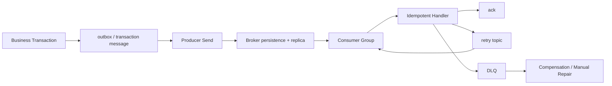
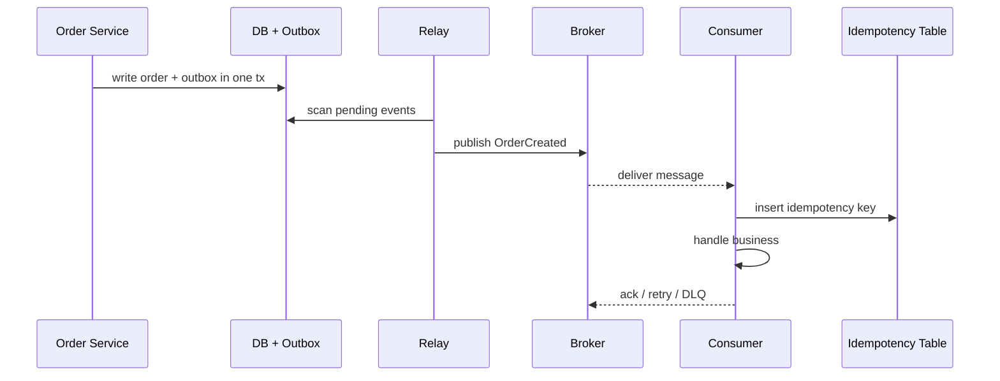

# 可靠投递、重试与幂等消费

## 面试定位

MQ 可靠性题不能只答 ack。面试官要看你能否端到端拆解：本地事务和发消息一致性、producer ack、broker 持久化、副本、consumer ack、retry、DLQ、幂等、补偿和监控。

一句成熟回答是：多数 MQ 实际提供 at-least-once 语义，重复消息是正常情况。系统目标不是幻想端到端天然 exactly-once，而是让消息最终被可靠处理，并且重复处理不会产生错误业务副作用。

## 一句话定义

可靠投递是让消息从业务事务产生到消费者成功处理形成可恢复闭环。幂等消费是让同一业务消息被重复投递时，只产生一次有效业务结果。

这两个问题必须一起讲。只保证消息到 broker，不等于业务已经可靠完成。

## 为什么需要它

分布式系统里每一段都可能失败：写库成功但发消息失败，producer 超时但 broker 已写入，consumer 处理成功但 ack 失败，重试导致重复扣款，毒丸消息拖垮队列。

MQ 把同步链路解耦，但也把一致性、顺序、重复和排障问题显性化。可靠性设计要覆盖端到端，而不是只覆盖 broker。

## 核心架构

图 1 里的关键是确认和补偿。生产端解决本地事务与消息发送一致性，broker 解决持久化和副本，消费端解决 ack、retry、DLQ 和幂等。

## 架构与运行机制

端到端数据流是：业务服务在本地事务中写业务表和 outbox 表；relay 扫描 outbox 发送 MQ；broker 持久化并复制；consumer 拉取消息后先做幂等判断，再执行业务；成功后 ack；失败进入 retry；超过阈值进入 DLQ；补偿任务或人工平台处理 DLQ。

RocketMQ transaction message 也能解决类似问题，通过半消息和事务回查确认提交或回滚。Outbox 更通用，依赖数据库事务和异步 relay。

## 运行机制

消费端要默认消息会重复。幂等键可以是 `orderId + eventType + version`，也可以是上游生成的 `event_id`。处理时先插入幂等表或更新状态机版本，成功后再执行业务动作。

对外部接口调用也要传 idempotency key。否则 MQ 重试可能造成重复扣款、重复发券或重复通知。

## 关键设计取舍

| 设计点 | 推荐做法 | 收益 | 风险 |
| --- | --- | --- | --- |
| 本地事务一致性 | outbox 或事务消息 | 防止写库成功但消息丢失 | relay 和补偿复杂 |
| 投递语义 | 按 at-least-once 设计 | 可恢复性强 | 必须处理重复 |
| 重试策略 | 指数退避 + 最大次数 | 给下游恢复时间 | 重试风暴风险 |
| DLQ | 告警、分类、重放、审计 | 长期失败可处理 | 不治理就变垃圾桶 |
| 幂等 | 唯一键、状态机版本、结果缓存 | 防重复副作用 | 需要业务唯一键设计 |

## 生产落地细节

outbox 表建议包含 `event_id`、`aggregate_id`、`event_type`、`payload`、`status`、`retry_count`、`next_retry_at` 和 `created_at`。幂等表建议包含 `idempotency_key`、`status`、`result_hash`、`first_seen_at`、`last_seen_at` 和 `error_reason`。

监控指标要覆盖 `produce_tps`、`consume_tps`、`consumer_lag`、`retry_rate`、`DLQ_count`、`ack_latency`、`processing_p95`、`duplicate_message_rate` 和 `idempotency_conflict_rate`。

## 系统设计案例

订单创建后通知积分、库存和搜索索引。订单服务在同一数据库事务里写 `orders` 和 `outbox_events`。Relay 发送 `OrderCreated` 到 MQ。积分消费者用 `order_id + event_type + version` 写幂等表，插入成功才加积分，业务成功后 ack，失败进入 retry，长期失败进入 DLQ。

## 真实问题与排障

发送超时但 broker 可能已写入，producer 重试会产生重复。consumer 处理成功但 ack 失败，broker 会再次投递。毒丸消息会反复失败，导致 retry 风暴和 consumer lag 增长。

排查顺序是：先看影响面和 lag，再看 producer ack、broker log、consumer error、retry_count、DLQ_count、下游延迟和幂等冲突。先止血可以暂停异常消费者、隔离毒丸消息、限流下游或扩大消费者，但根因要回到业务处理和重试策略。

## 常见误区与排障

常见误区包括：只说 ack，忽略本地事务；把 exactly-once 当成端到端业务保证；DLQ 没有告警和重放工具；幂等键设计过粗导致误去重。

排障时沿数据流走：消息是否产生，是否发送，broker 是否持久化，consumer 是否拿到，业务是否成功，ack 是否提交，失败是否进入 DLQ 和补偿。

## 面试追问

1. 如何保证消息不丢？讲 outbox/事务消息、producer ack、broker 持久化、副本、consumer ack、retry、DLQ。
2. 重复消息怎么办？讲 at-least-once、幂等键、唯一约束、状态机版本和外部接口 idempotency key。
3. DLQ 怎么处理？告警、分类、修复、重放、最大次数和审计。
4. 消费积压怎么排查？看 lag、处理耗时、下游限流、毒丸消息、rebalance 和线程池。

## 项目化表达

这类经验可以迁移到 Agent 系统里的异步工具队列、embedding job、RAG 索引同步和 Web Agent 任务执行。只要有异步任务，就需要可靠投递、幂等、重试、DLQ 和补偿。

## 深入技术细节

可靠投递要把“消息不丢”和“业务不重复”拆开设计。生产端用 outbox 或事务消息保证业务状态和事件写入一致；broker 用持久化、副本和确认机制降低消息丢失；consumer 按 at-least-once 处理，先写入幂等处理中记录，再执行业务，再 ack。端到端可靠性来自整条链路，而不是某一个 ack。

幂等表不是可选补丁，而是业务副作用边界。记录应包含 `idempotency_key`、`business_key`、`event_type`、`version`、`status`、`result_hash`、`first_seen_at`、`last_attempt_at` 和 `error_reason`。对于支付、发券、库存这类外部副作用，还要把 idempotency key 透传给下游。

## 关键数据结构与协议

| 字段 | 所属对象 | 作用 | 失败时如何使用 |
| :--- | :--- | :--- | :--- |
| `event_id` | Outbox Event | 全局事件 ID | 去重和追踪 |
| `aggregate_id` | Outbox Event | 业务聚合根 | 定位订单、库存或用户 |
| `event_type` | Message | 消息语义 | 路由 handler |
| `version` | Message | 业务版本 | 防旧消息覆盖 |
| `next_retry_at` | Retry | 下次重试时间 | 控制退避并排查积压 |
| `idempotency_key` | Consumer | 幂等键 | 防重复副作用 |
| `attempt_count` | Retry | 重试次数 | 判断是否进入 DLQ |
| `trace_id` | Message | 链路追踪 | 串联生产、broker 与消费 |
| `dlq_reason` | DLQ | 失败分类 | 支持修复、限速重放和审计 |

协议上 DLQ 不是垃圾桶。进入 DLQ 后要保留原始 payload、错误码、handler version、attempt count 和 trace id；重放前要修复原因、限速、复用幂等逻辑并写审计。

## 深问准备

被问“exactly-once 是否解决重复消费”时，可以回答：即使 broker 或流处理层提供 exactly-once 语义，外部数据库、短信、支付接口仍可能重复。业务侧仍要幂等和补偿。

被问“消费积压时能不能加消费者”，要看瓶颈和分区数。如果瓶颈是下游 DB 或外部 API，扩容 consumer 会加剧失败；如果分区不足，加消费者也无效。先看 lag、oldest age、processing p95、retry 和 downstream error。

## 生产验收清单

可靠投递上线前要先做链路级验收，而不是只验证 broker 可用。生产端要证明业务表和 outbox/事务消息在同一一致性边界内，消息字段包含 `event_id`、`business_key`、`event_type`、`version`、`trace_id` 和 `occurred_at`，producer confirm 或发送结果必须能落审计。Relay 要支持重试、限速、幂等发送和 pending event 巡检，避免数据库里已经有事件但长时间没有发出。

消费端验收要覆盖重复、乱序、超时和毒丸消息。每个 handler 都要说明幂等键、状态机版本、下游 idempotency key、ack 时机、可重试错误、不可重试错误和 DLQ 条件。重放 DLQ 前要能按 `dlq_reason`、handler version、trace_id 和业务 id 分类，修复后限速重放，并复用原幂等逻辑。否则 DLQ 只会从“防丢机制”变成“无人处理的失败仓库”。

监控验收要把生产、broker 和消费三段放在同一张事故视图里：`outbox_pending_age`、`produce_error_rate`、`consumer_lag`、`oldest_message_age`、`processing_p95`、`retry_rate`、`dlq_count`、`duplicate_message_rate`、`idempotency_conflict_rate` 和下游错误率。回归场景至少包括 producer 超时后重试、consumer 处理成功但 ack 失败、下游短暂限流、毒丸消息进入 DLQ、DLQ 修复后重放。面试里能讲清这套验收，才算把可靠投递讲成工程闭环。

## 来源与延伸阅读

- [RabbitMQ Publisher Confirms and Consumer Acknowledgements](https://www.rabbitmq.com/docs/confirms)：用于说明 producer confirm 和 consumer ack 的确认语义。
- [RabbitMQ Dead Letter Exchanges](https://www.rabbitmq.com/docs/dlx)：用于说明 DLQ 机制和失败消息治理边界。
- [Apache Kafka Documentation](https://kafka.apache.org/documentation/)：用于支持 consumer group、offset、partition 和可靠性语义。
