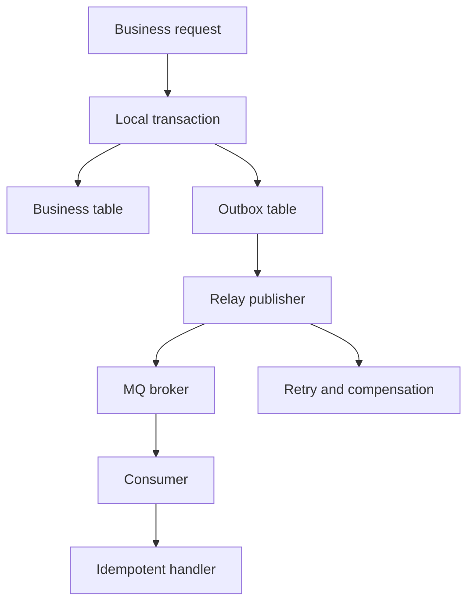

# 事务消息、Outbox 与最终一致性

## 一句话定义

事务消息与 Outbox 解决的是 local transaction 与消息发布之间的一致性问题。RocketMQ transaction message 通过 half message、事务执行和回查完成；Transactional Outbox 则把业务数据和 outbox 同事务写入，再异步发布并用 idempotency 保证最终一致。

## 面试定位

这题是 MQ 高危面试题。面试官想知道你如何处理“本地事务成功但消息发送失败”，以及你是否理解最终一致、补偿、幂等和回查。

回答要覆盖架构、数据流、指标、取舍和追问。

## 为什么需要它

业务经常需要“数据库更新”和“发消息”同时成立。例如支付成功后发券，订单创建后通知仓库。如果数据库提交成功但消息没发出去，下游可能长期不知道状态变化。如果先发消息再提交数据库，又可能下游看到不存在的数据。

事务消息和 Outbox 都是在解决这个缝隙。

## 核心架构

图 1：Transactional Outbox 的最终一致性链路，把业务状态和事件记录放进同一个本地事务，再由 relay 发布到 MQ，消费者用幂等处理重复投递。

这张图的重点是把“双写”拆成两个可靠边界：`Local transaction` 只负责同时写业务表和 outbox 表，保证事件不会在数据库提交后丢失；`Relay publisher` 负责异步发布、重试、补偿和状态标记，允许消息被重复发送；`Idempotent handler` 负责把重复消费收敛成一次业务效果。它追求的是可恢复的最终一致，不是跨 DB 和 MQ 的瞬时强一致。

| 方案 | 核心机制 | 优点 | 代价 |
| :--- | :--- | :--- | :--- |
| transaction message | half message + commit/rollback + check | broker 参与事务状态 | 依赖中间件能力 |
| outbox | 业务表和 outbox 同库事务 | 通用、可审计 | relay 和清理复杂 |
| 本地事务后直接发 | 简单 | 可能丢事件 | 不适合关键业务 |
| 分布式事务 | 强一致 | 复杂和性能差 | 谨慎使用 |

## 架构与运行机制

Outbox 的核心是利用本地数据库事务。业务状态和 outbox event 在同一个 local transaction 内提交。Relay 扫描 outbox 表发布消息，成功后标记已发送。消费者仍需 idempotency，因为 relay 可能重复发布。

RocketMQ 事务消息则先发送 half message，broker 暂不投递。Producer 执行本地事务后提交 commit 或 rollback。若状态未知，broker 会回查事务状态。

## 运行机制

1. 业务请求进入服务。
2. 本地事务写业务表和 outbox，或发送 half message 后执行业务事务。
3. 事务提交后消息进入可发布状态。
4. Relay 或 broker 将消息投递给消费者。
5. 消费者按 business_key 做幂等。
6. 失败进入 retry、compensation 或 DLQ。
7. 监控 outbox_pending_count、publish_lag 和 duplicate_count。

## 关键设计取舍

| 取舍 | 收益 | 代价 | 建议 |
| --- | --- | --- | --- |
| Outbox | 数据库事务可控 | relay 延迟 | 通用首选 |
| 事务消息 | 中间件原生 | 平台绑定 | RocketMQ 场景可用 |
| 同步 RPC | 反馈明确 | 耦合高 | 强实时小链路 |
| 补偿任务 | 易落地 | 延迟修复 | 必备兜底 |

## 生产落地细节

- outbox 表字段包括 event_id、business_key、event_type、payload、status、retry_count、next_retry_at 和 trace_id。
- relay 发布要幂等，消息重复发送由 consumer idempotency 兜底。
- transaction message 的回查逻辑必须能根据业务表判断事务状态。
- compensation 要可观测，不能只靠人工查库。
- 指标包括 outbox_pending_count、event_publish_lag、transaction_check_count、duplicate_consume_count、compensation_success_rate 和 DLQ_count。

## 系统设计案例

支付成功发券可以用 Outbox。支付服务在同一事务里更新 payment 状态并写入 CouponIssueRequested 事件。Relay 发布消息到 MQ。发券消费者按 payment_id 或 event_id 幂等发券。

数据流是：local transaction -> outbox -> relay -> MQ -> consumer -> idempotent handler。若 relay 挂了，outbox_pending_count 告警，恢复后继续发布。

## 真实问题与排障

如果业务状态已更新但下游没收到，先查 outbox 是否有 pending，relay 是否失败，broker 是否收到，consumer lag 是否积压。若重复发券，查 consumer 幂等表。

事故复盘要按影响面、止血、根因、回归展开。影响面先看是单个 aggregate、某个 event_type，还是 relay 全局停滞；止血可以暂停下游副作用、提高 relay 告警级别、对高风险事件改人工补偿；根因再分 outbox 未写入、本地事务回滚、relay 发布失败、broker 拒收、consumer 幂等缺失和 DLQ 未处理；回归则要补充事务提交后 relay 崩溃、broker 超时、重复发布、consumer 重启和状态未知回查等 case。只说“加重试”是不够的，因为重试会同时放大重复消费风险。

## 常见误区与排障

- 事务提交后直接发消息，没有兜底。
- 消费者不幂等。
- outbox 没有重试和清理。
- 事务回查无法判断状态。
- 只保证发送，不保证消费可观测。

## 面试追问

- Outbox 和事务消息怎么选？
- half message 是什么？
- 本地事务状态未知怎么办？
- 为什么消费者仍要幂等？
- 如何处理 outbox 积压？

## 项目化表达

项目里可以说：“我用 Outbox 把业务状态和事件写入同一个 local transaction，relay 异步发布，消费者按 event_id 幂等处理。这个设计牺牲一点实时性，换来可审计的最终一致。”

## 深入技术细节

本地事务和消息发送无法天然处在同一个数据库事务里，核心问题是“双写不一致”。业务库提交成功但消息发送失败，下游可能长期不知道状态变化；消息发送成功但本地事务回滚，下游会处理不存在的事实。Outbox 的思路是在本地事务里同时写业务表和 outbox 表，再由 relay 异步发布。事务消息的思路是 broker 先保存 half message，本地事务完成后提交或回滚消息，并在状态未知时回查。

两者取舍不同。Outbox 与数据库强绑定，通用、可审计、容易补偿，但有 relay 延迟和表清理成本。事务消息由中间件提供原生流程，适合 RocketMQ 这类支持半消息和事务回查的场景，但平台绑定更强。无论哪种方案，消费者仍要幂等，因为 broker 重试、relay 重发、回查误判都可能导致重复消费。

## 关键数据结构与协议

Outbox 表建议包含 `event_id`、`aggregate_id`、`event_type`、`payload`、`status`、`next_retry_at`、`retry_count`、`last_error_code`、`created_at`、`published_at`。Relay 发布时带 `trace_id` 和 `idempotency_key`，成功后更新状态。消费者侧记录 `event_id` 和处理结果，保证重复消息直接返回成功。

事务消息要关注 `half_message_id`、local transaction result、transaction check、commit/rollback、unknown status。排障指标包括 outbox_pending_count、oldest_pending_age、relay_publish_latency、transaction_check_count、unknown_transaction_count、duplicate_event_count、compensation_count。

## 深问准备

- 追问本地事务成功消息失败：Outbox 用 pending 事件兜底，relay 恢复后继续发布。
- 追问 half message：说明 broker 暂存不可消费消息，等本地事务结果决定提交或回滚。
- 追问状态未知：通过事务回查或 outbox 状态重试，但消费者仍保持幂等。
- 追问 Outbox 缺点：延迟、表膨胀、relay 可用性、清理归档和重复发布处理。

## 多轮追问模拟

**追问 1：Outbox 能不能保证消息只发送一次？**

不能，Outbox 更准确地说是保证事件不会因为“本地事务已提交但发送失败”而丢失。Relay 可能在发布成功但更新 outbox 状态前崩溃，所以消息可能重复发送。消费者仍然要按 `event_id` 或业务唯一键做幂等。

**追问 2：事务消息是不是比 Outbox 更强？**

不是简单强弱关系。事务消息把 half message、commit/rollback 和回查交给 broker，链路更贴近消息中间件；Outbox 借助数据库本地事务，更通用、更容易审计和补偿。选择要看中间件能力、团队运维经验、可观测性和业务对延迟的容忍度。

**追问 3：Outbox 积压时先扩容 relay 吗？**

先分桶定位。若 oldest_pending_age 增大但 broker 正常，可能是 relay 卡住或查询索引差；若 publish latency 高，可能是 broker 或网络；若某类 event 持续失败，要看 payload schema、权限或下游限流。盲目扩容 relay 可能把坏消息更快打到 broker 或消费者。

## 上线检查清单

上线前至少检查五件事。第一，业务表和 outbox 写入是否在同一个 local transaction 内完成，失败时是否整体回滚。第二，relay 是否有批量扫描上限、按 `next_retry_at` 调度、指数退避和 dead-letter 标记，避免坏消息阻塞全表。第三，消费者是否用 `event_id` 或业务唯一键做幂等，并把重复消费当作成功返回。第四，监控是否覆盖 oldest_pending_age、publish_lag、retry_count、DLQ_count 和 duplicate_consume_count。第五，补偿脚本是否可审计，能按 trace_id 解释某个业务对象从提交到消费的完整链路。

## 来源与延伸阅读

- [RocketMQ Transaction Message](https://rocketmq.apache.org/docs/featureBehavior/04transactionmessage/)：官方文档用于支持 half message、事务提交/回滚和事务状态回查这条事务消息链路。
- [Apache Kafka Transactions](https://kafka.apache.org/documentation/#transactions)：官方文档用于支持 Kafka 在生产者事务、幂等和 exactly-once 语义上的能力边界。
- [RabbitMQ Publisher Confirms](https://www.rabbitmq.com/docs/confirms)：官方文档用于支持发布确认只能证明 broker 接收，不等同于业务消费成功。
- [Microservices.io Transactional Outbox](https://microservices.io/patterns/data/transactional-outbox.html)：模式文档用于支持业务表与 outbox 同事务写入、再异步发布事件的方案。
