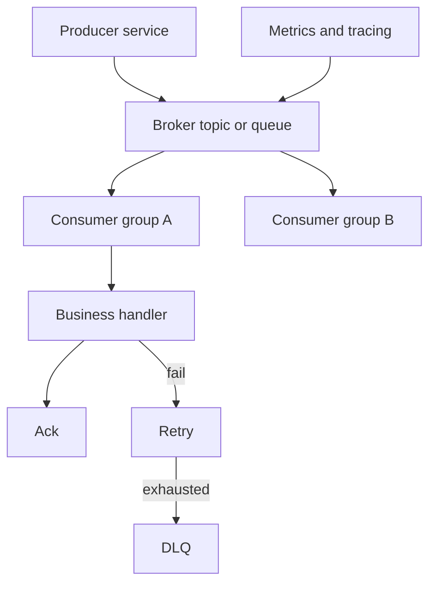

# MQ 使用场景与边界

## 一句话定义

MQ 用于 asynchronous 解耦、decoupling、peak shaving、事件广播和任务排队。它通常提供 at-least-once 投递语义，生产系统必须配套 idempotency、ack、retry 和 DLQ，而不能把 MQ 当成强一致事务数据库。

## 面试定位

面试官问 MQ 边界，想看你是否理解为什么用消息队列，以及它引入了什么复杂度：重复消费、顺序、延迟、积压、死信、幂等和最终一致性。

回答要覆盖架构、数据流、指标、取舍和追问。不要只说“削峰填谷、异步解耦”。

## 为什么需要它

业务系统里，订单创建后发券、发送通知、更新搜索索引、写审计日志，都不适合放在同步请求里串行完成。MQ 可以让核心链路更短，让下游系统按自己的节奏消费。

但 MQ 不是免费午餐。消息可能重复、乱序、延迟或进入 DLQ。消费者必须能幂等处理，系统必须能观测 consumer lag 和失败原因。

## 核心架构

图 1：MQ 的典型链路从 Producer 写入 Broker，再由多个 Consumer Group 独立消费，业务处理成功后 ack，失败进入 retry，超过阈值后进入 DLQ。

图中 `Broker topic or queue` 是异步边界，切断同步调用链；`Consumer group` 是扩展和隔离边界，不同下游可以拥有各自的消费进度；`Business handler` 是副作用边界，必须在业务写入和幂等记录完成后再 ack；`Retry` 和 `DLQ` 是失败治理边界，用来防止临时故障和永久坏消息混在主链路里。`Metrics and tracing` 贯穿链路，否则 MQ 只会把同步故障变成异步黑盒。

| 场景 | 适合 MQ | 关键风险 |
| --- | --- | --- |
| 异步通知 | 是 | 重复发送 |
| 搜索索引同步 | 是 | 延迟和乱序 |
| 日志事件流 | 是 | 积压和存储成本 |
| 支付扣款主流程 | 否 | 强一致要求 |
| 跨系统最终一致 | 可以 | 补偿和幂等 |

## 架构与运行机制

Producer 将业务事件写入 broker。Consumer group 订阅 topic 或 queue，消费成功后 ack。失败可以 retry，多次失败进入 DLQ。常见投递语义是 at-least-once，所以业务 handler 必须通过 idempotency key 防重复。

Kafka 更偏高吞吐事件流和分区顺序，RabbitMQ 更偏任务队列和路由语义，RocketMQ 在事务消息和延迟消息等业务场景里常见。选型要看吞吐、顺序、路由、事务、运维和生态。

## 运行机制

1. Producer 构造带 message_id、key、event_type 和 trace_id 的消息。
2. Broker 持久化消息并按 topic、queue 或 partition 组织。
3. Consumer group 拉取或接收消息。
4. Handler 执行业务逻辑，并基于业务键做 idempotency。
5. 成功后 ack 或提交 offset。
6. 失败进入 retry，超限进入 DLQ。
7. 监控 consumer lag、失败率、重试率和 DLQ 数量。

## 关键设计取舍

| 取舍 | 收益 | 代价 | 建议 |
| --- | --- | --- | --- |
| 同步调用 | 强反馈 | 链路长、耦合高 | 核心强一致使用 |
| MQ 异步 | 解耦和削峰 | 最终一致复杂 | 下游副作用使用 |
| at-most-once | 延迟低 | 可能丢消息 | 低价值日志 |
| at-least-once | 不易丢 | 可能重复 | 业务常用 |

## 生产落地细节

- 消息要包含 message_id、business_key、event_type、schema_version、trace_id 和 created_at。
- 消费者必须幂等，不能假设消息只会来一次。
- retry 要区分可重试错误和永久错误，避免 poison message 阻塞。
- DLQ 要有告警、重放和人工处理流程。
- 指标包括 publish_rate、consume_rate、consumer lag、retry_rate、DLQ_count、ack_latency 和 end_to_end_delay。

## 系统设计案例

订单支付成功后，不应在支付请求里同步完成发券、短信、积分和搜索索引更新。主流程提交订单状态后发布 OrderPaid 事件，各消费者独立处理。

数据流是：订单服务 -> broker -> 发券消费者/通知消费者/索引消费者。每个消费者按 order_id 做幂等。失败消息进入 retry 和 DLQ，运营或系统可重放。

## 真实问题与排障

如果下游没收到事件，先查 producer 是否发送成功，再看 broker 是否有消息、consumer group lag、ack 或 offset 是否推进。若重复发券，检查 idempotency 表和消息 key。

事故处理要拆成影响面、止血、根因和回归。影响面看 event_type、consumer group、最老消息时间、DLQ_count、重复副作用和业务 SLA；止血可以暂停非核心消费者、限流 producer、隔离 poison message、临时关闭重放或回滚消费者版本；根因要分清是 producer 未确认、broker 堆积、消费者 bug、下游超时、schema_version 不兼容还是幂等缺失；回归要用事故消息回放，验证 retry 退避、DLQ 分类、幂等键和告警阈值都能覆盖同类问题。

边界判断也很关键。如果用户下单后必须立即知道支付、库存和账户扣减的最终结果，MQ 只能作为后续事件通知或补偿通道，不能替代本地事务和一致性校验。如果业务能接受最终一致，例如发券、短信、搜索索引、审计日志，MQ 才能发挥解耦和削峰价值。这个回答能把“为什么用”与“什么时候不用”同时说清楚。

## 常见误区与排障

- 只记住“异步解耦削峰”，不讲重复和最终一致。
- 消费者没有幂等。
- retry 无限重试导致积压。
- DLQ 没有处理流程。
- 不监控 consumer lag。

## 面试追问

- MQ 和同步 RPC 如何取舍？
- at-least-once 为什么要求幂等？
- DLQ 的消息如何处理？
- consumer lag 上升怎么排查？
- 什么时候不该用 MQ？

## 项目化表达

项目里可以说：“我把 MQ 当成最终一致的事件通道。Producer 写带 trace_id 的业务事件，Consumer 用 idempotency key 处理，失败进入 retry 和 DLQ，consumer lag 与 end_to_end_delay 作为核心指标。”

## 深入技术细节

MQ 的核心不是“异步”两个字，而是把调用方和处理方之间的时间、吞吐和故障边界拆开。Producer 把业务事件写入 broker 后，Consumer 以自己的节奏处理。多数业务链路采用 at-least-once 语义，因此重复消息是常态风险，消费者必须通过 idempotency key、业务唯一约束或状态版本号保证重复消费不产生重复副作用。

使用 MQ 的代价是最终一致和可观测复杂度。同步 RPC 的成功失败在调用栈里直接返回，MQ 则需要处理发送确认、broker 堆积、消费失败、重试风暴、DLQ 重放和跨服务 trace。面试时要能讲清哪些场景适合 MQ：削峰、解耦、事件通知、异步补偿；哪些场景不适合：强实时返回、强事务锁定、小规模简单调用和用户必须立刻看到最终结果的链路。

## 关键数据结构与协议

业务消息至少应包含 `event_id`、`event_type`、`aggregate_id`、`aggregate_version`、`occurred_at`、`trace_id`、`producer`、`schema_version`、`idempotency_key` 和 payload。消费者处理记录建议包含 `event_id`、`consumer_group`、`status`、`retry_count`、`last_error_code`、`processed_at`。这些字段让重复消费、补偿、重放和审计有据可查。

生产监控不能只看 broker 存活。要看 publish_success_rate、producer_retry_count、consumer_lag、end_to_end_delay、handler_latency_p95、retry_count、DLQ_count、duplicate_detected_count、poison_message_count。排障时按 producer、broker、consumer、downstream 四段定位，避免只盯消费者线程数。

重放和补偿也要有协议。DLQ 消息不能直接全量重放，应先按 error_code、event_type、business_key 和时间范围筛选，修复代码或数据后限速重放。重放前后都要依赖消费者幂等，否则补救动作会变成二次事故。

Schema 演进也会影响边界。事件字段新增要保持向后兼容，删除或改名要通过 schema_version 灰度，否则老消费者会把消息打进 DLQ，形成看似“消费失败”的协议问题。

## 深问准备

- 追问 MQ 和 RPC 取舍：RPC 强同步反馈，MQ 解耦削峰但牺牲即时一致和调试简单性。
- 追问 at-least-once：说明 broker 或 consumer 重试会造成重复，幂等不是可选项。
- 追问 DLQ：回答要包含隔离、告警、分类、修复、审批、限速重放和幂等。
- 追问不用 MQ 的场景：简单同步查询、强事务链路、必须实时给用户最终结果的核心路径。

## 来源与延伸阅读

- [Apache Kafka Consumer configs 官方文档](https://kafka.apache.org/documentation/#consumerconfigs)：用于说明 consumer group、offset、poll 与提交配置如何影响消费语义和积压治理。
- [RabbitMQ Consumer acknowledgements 官方文档](https://www.rabbitmq.com/docs/confirms)：用于支持“业务成功后再 ack”的机制说明，也解释了确认失败时的重投递风险。
- [RabbitMQ Dead Letter Exchanges 官方文档](https://www.rabbitmq.com/docs/dlx)：用于说明 DLQ/DLX 是失败隔离机制，不是无人处理的垃圾桶。
- [Apache RocketMQ Documentation](https://rocketmq.apache.org/docs/)：用于对照事务消息、延迟消息、重试和业务场景支持，帮助解释不同 MQ 产品的能力边界。
