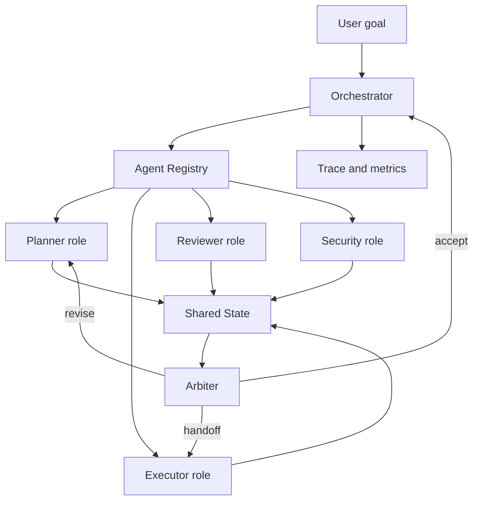

# 多 Agent 角色分工

## 一句话定义

多 Agent 角色分工，是把复杂任务拆给不同 role 的 Agent，由 Orchestrator、Agent Registry、shared state、handoff 和 arbiter 协同控制，避免单个模型同时承担规划、执行、审查和安全裁决。

## 面试定位

这类问题不是问“多几个智能体是不是更强”。面试官要判断你是否能解释多 Agent 的收益边界，以及复杂度从哪里来：状态共享、责任归属、循环调用、成本、延迟和冲突裁决。

优秀回答要先说适用条件，再画架构。适合多 Agent 的场景通常有清晰子任务、异构工具、需要独立审查或跨团队能力协作；如果任务小、状态耦合强或反馈回路很短，单 Agent 加工具往往更稳。

## 为什么需要它

单 Agent 容易在开放任务里过载。它既要拆计划，又要调用工具，还要判断输出质量和安全边界。多 Agent 的核心价值是职责隔离：planner 负责计划，executor 负责动作，reviewer 负责质量，security agent 负责风险，arbiter 负责冲突处理。

但多 Agent 不自动等于高质量。它引入了协议、共享状态、handoff、幂等和 trace 成本，所以必须先证明拆分能降低认知负载或提升可验证性。

## 核心架构

图 1：多 Agent 角色分工由 Orchestrator 接收用户目标，查询 Agent Registry 后分派 Planner、Executor、Reviewer、Security 等角色，所有中间状态写入 Shared State，再由 Arbiter 裁决并回到 Orchestrator。

图中 `Agent Registry` 是能力声明和权限边界，决定哪个 role 可以接什么任务；`Shared State` 是证据和产物边界，所有 plan、artifact、observation、verdict 都要有版本和引用；`Arbiter` 是冲突裁决边界，处理 revise、accept、handoff 和 escalate；`Trace and metrics` 是复盘边界，用来解释任务为什么成功、失败或成本过高。没有这些边界，多 Agent 很容易退化成多个 prompt 互相转述。

| role | 主要职责 | 输入 | 输出 |
| :--- | :--- | :--- | :--- |
| Orchestrator | 分派、汇总、停止条件 | 用户目标、状态 | task graph、final response |
| Planner | 拆解步骤和依赖 | 目标、约束 | plan、risk list |
| Executor | 调工具和产物生成 | 子任务、tool schema | artifact、observation |
| Reviewer | 验证质量和事实 | artifact、rubric | verdict、patch request |
| Arbiter | 冲突裁决 | 多方 verdict | accept、revise、escalate |

## 架构与运行机制

多 Agent 需要三个基础设施。第一是 Agent Registry，描述每个 Agent 的 capability、role、工具权限、输入输出 schema 和版本。第二是 shared state，保存任务计划、证据、产物、verdict 和锁。第三是 Orchestrator，负责选择谁执行、何时 handoff、何时停止。

如果没有这些基础设施，多 Agent 会退化成自由聊天。自由聊天没有稳定的数据流，也很难排查为什么某个 Agent 做了错误决定。

## 运行机制

1. Orchestrator 解析用户目标，创建 task_id 和初始 state。
2. 通过 Agent Registry 查询可用 capability，选择 planner 或专门 Agent。
3. Planner 生成子任务和依赖，写入 shared state。
4. Executor 领取任务并写入 observation、artifact 和 tool trace。
5. Reviewer 按 rubric 输出 verdict，必要时请求返工。
6. Arbiter 处理冲突、超时和多 Agent 结论不一致。
7. Orchestrator 汇总最终结果，并把完整轨迹进入 eval。

## 关键设计取舍

| 取舍 | 优势 | 风险 | 适用建议 |
| --- | --- | --- | --- |
| 单 Agent | 简单、低延迟 | 职责混杂 | 小任务和强交互任务 |
| Manager-worker | 中心可控 | manager 成瓶颈 | 子任务清晰时使用 |
| Peer handoff | 灵活扩展 | 循环调用和责任不清 | 需要强协议约束 |
| Reviewer 独立 | 质量更可控 | 成本和延迟上升 | 高风险输出必备 |

## 生产落地细节

- Agent Registry 要写清 role、capability、tool permission、输入输出 schema、owner 和 version。
- shared state 需要并发控制、幂等键、状态版本和审计字段。
- handoff payload 要携带 task_id、state_summary、artifact_refs、deadline 和 return_policy。
- 所有 Agent 之间的消息都要进入 trace，便于 replay 和 trajectory eval。
- 指标关注 task_success_rate、handoff_success_rate、conflict_rate、review_reject_rate、cost_per_success 和 latency_p95。

## 系统设计案例

设计一个技术调研 Agent，可以拆成 Researcher、Reader、Synthesizer、Reviewer 和 Citation Checker。Researcher 找资料，Reader 摘要并标注证据，Synthesizer 生成文章结构，Reviewer 检查逻辑，Citation Checker 验证引用和事实。

数据流不是 Agent 之间随便聊天，而是统一写入 shared state。每个阶段都产生可验证 artifact，例如 source list、claim table、draft、review verdict 和 citation map。这样出问题时能定位是检索漏了、阅读误解了，还是最终综合时出现幻觉。

## 真实问题与排障

多 Agent 常见故障包括循环 handoff、重复执行、冲突无人裁决、状态被覆盖和成本爆炸。排障先看 task graph 和 trace，确认哪个 role 创建了错误状态，哪个 Agent 消费了过期 artifact。

止血可以暂停 peer handoff，只保留 Orchestrator 统一分派；或者降低并发，强制 reviewer 拒绝缺少证据的产物。长期修复要补 schema、锁、return_policy 和 eval。

## 常见误区与排障

- 为了“看起来智能”拆太多 Agent。
- 没有 Agent Registry，导致 capability 和权限散落在 prompt 里。
- shared state 只靠自然语言摘要，没有版本和 artifact 引用。
- Reviewer 与 Executor 使用同样上下文，无法形成独立审查。
- 只看最终成功率，不看 handoff 失败和冲突率。

## 面试追问

- 多 Agent 相比单 Agent 的收益如何量化？
- shared state 用 blackboard、数据库还是消息队列？
- Agent 之间互相调用时怎样防止死循环？
- reviewer 和 arbiter 的职责边界是什么？
- 什么时候应该降级回单 Agent？

## 项目化表达

项目表达建议从“角色边界”讲起，而不是堆框架名。比如：“我把调研任务拆成 planner、executor、reviewer 和 citation checker，每个 Agent 的 capability 在 Agent Registry 里声明，所有中间产物写入 shared state，最终用 trajectory eval 衡量每个 role 的贡献。”

## 深入技术细节

多 Agent 的核心是任务图和所有权，而不是“多个模型聊天”。Orchestrator 应把用户目标拆成 task graph，每个 task 有 `owner_agent`、`input_artifacts`、`output_schema`、`dependencies`、`deadline` 和 `verifier`。执行中 shared state 要有版本、锁和 artifact refs，防止两个 Agent 同时覆盖同一结论。

Reviewer 和 Arbiter 要分开。Reviewer 检查产物质量，例如引用是否支持、补丁是否最小；Arbiter 处理冲突和资源竞争，例如两个 Agent 给出相反 verdict、同一文件被同时修改、任务超时。这样职责更清楚，trace 也更容易归因。

## 关键数据结构与协议

| 字段 | 作用 | 风险 |
| :--- | :--- | :--- |
| `agent_id` | 标识角色 | 责任不清 |
| `capability` | 可处理任务 | 错派 |
| `task_graph` | 子任务依赖 | 循环/重复 |
| `shared_state_version` | 状态并发控制 | 覆盖 |
| `artifact_refs` | 证据传递 | 上下文丢失 |
| `arbiter_verdict` | 冲突裁决 | 无人决策 |

协议上 Agent 间消息必须 schema 化，并带 task_id、correlation_id、sender、receiver 和 return_policy。自然语言可以作为解释，但不能替代控制字段。

## 深问准备

被问“多 Agent 何时比单 Agent 好”，可以回答：当任务天然有专业角色、可并行子任务、独立审查或权限分离时有收益；简单任务用多 Agent 只会增加延迟和成本。

被问“如何量化收益”，比较单 Agent baseline 与多 Agent 在 `task_success_rate`、`review_reject_rate`、`cost_per_success`、`latency_p95`、`handoff_loop_rate` 上的差异。没有指标证明，就不要为了架构感强行拆分。

## 公开阅读校验

多 Agent 文章要让公开读者相信“拆角色”确实带来收益，而不是把一个模型拆成多个名字。可上线的多 Agent 方案应先定义单 Agent baseline，再说明哪些任务因为专业分工、权限隔离、并行执行或独立审查而值得拆分。每个 Agent 的 capability、输入产物、输出 schema、可调用工具和写状态权限都应进入 Agent Registry，而不是只写在 prompt 里。

验收时建议做对照实验：同一批复杂任务分别由单 Agent、Orchestrator+Specialists、Peer Handoff 三种模式执行。比较成功率、成本、延迟、review 拒绝率、重复执行率、状态冲突和人工接管率。若多 Agent 成功率没有显著上升，却让成本和 handoff loop 上升，就应降级回更简单的 workflow。

生产事故也要可归因。每个 shared state update 都要记录 `owner_agent`、`artifact_ref`、`state_version`、`lock_token` 和 `verifier_verdict`。当最终答案错了，团队要能定位是 planner 拆错任务、executor 写错 artifact、reviewer 漏审，还是 arbiter 裁决错误。没有这种归因，多 Agent 只是更难调试的黑盒。

## 来源与延伸阅读

- [OpenAI Agents SDK Handoffs 官方文档](https://openai.github.io/openai-agents-python/handoffs/)：用于说明任务控制权转移需要结构化 payload、目标 Agent 和回流策略。
- [OpenAI Agents SDK Tracing 官方文档](https://openai.github.io/openai-agents-python/tracing/)：用于支持“多 Agent 必须可追踪、可回放、可归因”的机制说明。
- [Anthropic: Building effective agents](https://www.anthropic.com/engineering/building-effective-agents)：用于说明多 Agent 不是默认答案，应先从简单 workflow 和明确边界开始。
- [Agent2Agent 项目](https://github.com/a2aproject/A2A)：用于补充多 Agent 协作协议化的工程实践，包括能力发现和任务状态传递。
