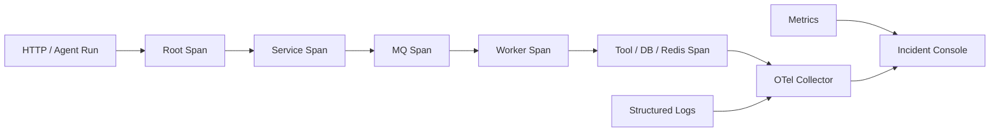

# Tracing、日志与事故复盘

## 面试定位

Tracing 题考的是跨服务定位能力。只说“加 traceId”不够，成熟回答要覆盖 trace/span 模型、上下文传播、采样、结构化日志、指标关联、事故时间线、根因分析和回归验证。OpenTelemetry 官方文档用于确认 trace context 和观测语义，工程答案要说明 HTTP、MQ、线程池和 Agent run 这些异步边界如何不断链。

反例是只有日志没有 trace，或者采样策略把错误请求丢掉。日志能解释局部细节，但不能天然展示跨服务路径；指标能发现趋势，但不能还原一次请求经过哪里。

## 一句话定义

Trace 是一次请求或任务跨多个组件执行路径的结构化记录，Span 是路径中的一个操作单元。日志补充局部状态和错误细节，指标提供趋势和告警。事故复盘是把影响面、止血、根因、修复、回滚和回归沉淀成可复用流程。

## 架构与运行机制

图 1 展示的是一次请求跨 HTTP、MQ、Worker 和工具调用的 Trace 数据流。图中日志和指标都进入 Incident Console，用于把“哪个时间点发生了什么”串成事故时间线。这张图用于说明 Trace 不是单个服务的调试日志，而是跨边界传播的上下文协议。

## 深入技术细节

Trace 设计要先定义 span 边界。HTTP handler、DB 查询、Redis 调用、MQ publish/consume、模型调用、Agent tool call 都适合成为 span。Span 标签要稳定，例如 service、route、tool_name、error_code、workspace_tier、release_id；不要把原始 prompt、完整 SQL、用户隐私和大 payload 直接放进 span。

上下文传播是难点。HTTP 可以通过 `traceparent` header，MQ 要把 trace context 放入 message header，线程池要在提交任务时捕获上下文并在执行时恢复，执行后清理。Agent run 也要有 run_id 和 trace_id 的映射，否则工具调用、模型响应和状态写入无法回放。

采样要服务事故。头部采样成本低，但可能丢掉慢请求和错误请求；尾部采样能根据结果保留错误和慢链路，但需要 Collector 支持和更多缓冲。高风险操作、支付、权限、工具执行可以提高采样率。

## 关键数据结构与协议

| 字段 | 所属对象 | 作用 | 风险 |
| --- | --- | --- | --- |
| `trace_id` | Trace | 串联一次请求 | 丢失后链路断裂 |
| `span_id` | Span | 标识操作节点 | 层级错误会误导 |
| `parent_span_id` | Span | 构造调用树 | 异步边界容易丢 |
| `traceparent` | Header | 跨服务传播 | 要避免被伪造滥用 |
| `error_code` | Span/Log | 错误分类 | 不稳定会影响聚合 |
| `run_id` | Agent Run | 映射任务轨迹 | 要和 trace 关联 |
| `payload_hash` | Log | 保护敏感参数 | 不能替代必要摘要 |

这些字段组成了事故复盘协议。字段越稳定，聚合和追问越容易。

## 采样、关联与保留策略

Trace 系统一定要回答“哪些链路必须保留”。普通成功流量可以低采样，错误请求、慢请求、高价值交易、权限拒绝、工具写操作和模型安全拦截要提高采样率。头部采样实现简单，但在请求开始时还不知道最终是否失败；尾部采样可以根据状态码、延迟和 span 属性保留关键链路，代价是 Collector 需要缓冲和更多资源。

日志与 Trace 的关联也要设计成协议。结构化日志至少带 `trace_id`、`span_id`、`service`、`release_id`、`error_code` 和必要的业务摘要。指标负责发现异常，例如 p95 升高、错误率升高、队列积压；Trace 负责定位异常在哪个 span；日志负责解释局部变量、参数摘要和业务状态。事故现场不能只靠其中一个信号。

保留策略要兼顾排障和隐私。最近高价值 Trace 可以热存储，历史 Trace 冷存储或聚合；日志字段做白名单，敏感字段保存 hash、脱敏摘要或 evidence_id；权限上按团队、服务和事故角色控制访问。否则可观测性会变成新的数据泄露面。

## 系统设计案例

设计一个 Agent 工具调用事故排查系统，架构上 Agent runtime 创建 run span，每个 tool call 是子 span，HTTP/MQ/DB/Redis 调用继续派生 span，结构化日志记录 tool_name、args_hash、policy verdict、error_code，Prometheus 指标记录 tool_error_rate 和 span_error_rate。数据流是 run -> model -> tool span -> downstream span -> logs/metrics -> incident console。

取舍是：全量 trace 定位能力强但成本高；采样降低成本但可能漏证据；日志字段越细越方便排障但隐私风险更高。面试追问通常会问异步 MQ 如何传 trace、错误采样怎么保留、日志如何脱敏。

如果落到一个 RAG 或 Agent 系统，可以把一次回答拆成 query rewrite、retriever、rerank、generator、citation verifier、final answer 六类 span。每个 span 保存输入摘要、evidence_id、版本、耗时和 verdict。这样当用户反馈“答案不准”时，不会只看最终文本，而是能判断是检索漏召回、重排误排、生成幻觉，还是引用校验失败。

## 真实问题与排障

线上 Agent 任务卡住时，先看影响面：哪个工具、哪个 workspace、哪个 release、错误率、p95、队列 lag、模型 API 限流和权限拦截。止血可以禁用高风险工具、回滚工具 schema、降低并发、切换模型或把任务转人工。

根因定位沿 trace 时间线：模型是否生成了错误参数，权限策略是否拦截，工具是否超时，下游 DB/Redis 是否慢，MQ 是否断了 trace，线程池是否丢上下文。回归要把失败 run 保存成 replay case，验证工具 schema、权限和恢复策略。

事故复盘的输出也要标准化。我会要求至少包含：影响面、时间线、用户可见症状、止血动作、直接原因、根因、为什么监控没有提前发现、修复 PR、回滚方案、回归样例、告警调整和 owner。对 Agent 系统还要补失败轨迹回放：当时的模型版本、工具 schema、policy verdict、observation 摘要和 verifier 结果都要可复现。

## 项目化表达

项目里可以说：我把传统分布式 trace 和 Agent run trace 对齐，HTTP 请求、MQ 消费、工具调用、模型调用都共享 trace_id。一次工具失败事故中，指标只显示 500 增加，Trace 显示失败集中在某个 tool schema 新版本，日志里的 args_hash 和 policy verdict 证明是参数校验错误。我们回滚 schema，并把失败 run 加入回放测试。

## 边界条件与反例

反例一：日志直接保存完整用户输入、prompt 或 tool args，容易泄露敏感数据。

反例二：只采样成功请求，事故时没有证据。

反例三：异步 MQ 不传 trace，消费者日志无法和用户请求关联。

反例四：复盘只写原因，没有告警、runbook 和回归。

## 深问准备

1. Trace 和日志分别解决什么问题？
2. MQ 异步链路如何传播 trace？
3. Tail sampling 有什么价值？
4. Agent run trace 如何设计？
5. 事故复盘要产出哪些工程动作？

## 面试加固与追问链路

如果面试官问“Trace 已经有了，为什么还需要日志和指标”，可以回答：指标负责全局趋势和告警，Trace 负责一次请求的路径，日志负责局部变量和错误上下文。三者的粒度不同，缺任何一个都会影响排障。比如接口 p95 升高，指标告诉你影响范围，Trace 告诉你慢在 rerank 服务，日志告诉你某个 workspace 的索引版本为空。

事故复盘也要有产物。不要只写“某服务超时导致故障”，要沉淀 runbook、告警阈值、采样策略、回归用例和代码修复。对 Agent 系统，失败 run 应该能 replay：模型输入、工具 schema、参数摘要、权限 verdict、observation、最终判断都要能复现。这样 Trace 不只是线上排障工具，也是评测和质量改进入口。

还要注意安全边界。日志和 Trace 里不能保存完整 prompt、token、身份证、订单隐私或工具原始参数。可以保存 hash、字段白名单、摘要和 error_code，并通过权限控制和保留周期降低风险。

再补一个项目扩展案例：RAG 服务回答错误时，Trace 能看到 query rewrite、retriever、rerank、generator、citation verifier 每一步耗时和输出摘要；日志保存 evidence_id、chunk_version、rerank_score、verdict；指标显示 citation_precision 下降。这样可以判断是检索漏召回、重排误排、生成阶段幻觉，还是引用校验失败。面试里把这条链路说出来，会明显比“看日志排查”更专业。

口述模板可以这样收束：我不会先翻日志，而是先用指标确认影响面，再用 Trace 找到异常 span，再用结构化日志看 error_code、release_id、payload_hash 和业务状态，最后把失败链路沉淀成 replay case。这样既有排障顺序，也有工程闭环。

如果追问“Trace 数据太多怎么办”，可以补充成本治理：高价值链路提高采样，普通流量降低采样，错误和慢请求通过 tail sampling 保留；历史 trace 分冷热存储；日志和 span 字段做白名单和脱敏。这样既不会因为全量采集拖垮系统，也不会在事故时没有证据。

## 来源与延伸阅读

- [OpenTelemetry Traces](https://opentelemetry.io/docs/concepts/signals/traces/)：用于确认 trace、span、span context 和跨组件路径建模语义。
- [OpenTelemetry Context Propagation](https://opentelemetry.io/docs/concepts/context-propagation/)：用于确认 HTTP、MQ、线程池等边界上传播 trace context 的原则。
- [OpenTelemetry Sampling](https://opentelemetry.io/docs/concepts/sampling/)：用于支撑头部采样、尾部采样和错误慢请求保留策略。
- [Prometheus Alerting Rules](https://prometheus.io/docs/prometheus/latest/configuration/alerting_rules/)：用于说明指标告警如何触发事故响应和复盘时间线。
