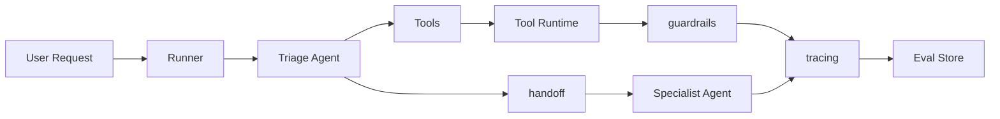
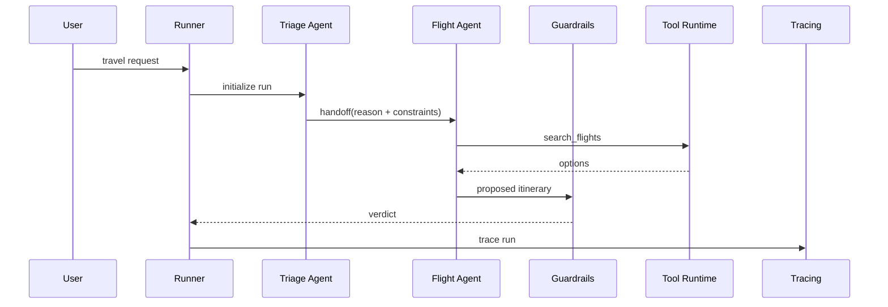

# OpenAI Agents SDK

## 面试定位

OpenAI Agents SDK 题目不要答成“一个框架”。面试官想看你是否理解 Agent、Runner、tools、handoff、guardrails 和 tracing 如何组成工程系统，以及你是否知道 SDK 不能替代业务权限、工具设计和评测。

一个成熟回答是：SDK 提供 Agent 应用的编排抽象和 tracing 能力，但生产质量仍取决于工具 schema、上下文、权限、guardrails、eval 和上线指标。

## 一句话定义

OpenAI Agents SDK 是面向 Agent 应用的代码式开发框架，把 Agent、Runner、tools、handoff、guardrails 和 tracing 作为一等概念。

它能降低多 Agent 编排和工具调用的工程成本，但不会自动把业务系统变安全，也不会自动证明任务成功率。

## 为什么需要它

如果自己从零写 Agent loop，要处理模型调用、工具执行、handoff、错误恢复、trace、guardrails 和输出结构。SDK 把这些常见能力抽象出来，让开发者更快构建和调试。

但框架抽象越强，也越要讲清边界：业务对象权限、工具幂等、数据脱敏、高风险动作确认和评测集仍然要自己设计。

## 核心架构

图里 Runner 负责推进 run。Agent 定义 instructions、model、tools、handoffs 和输出契约。Guardrails 覆盖输入、输出和工具动作。Tracing 记录模型、工具、handoff、guardrail verdict 和成本。

## 架构与运行机制

SDK 的数据流通常是：请求进入 Runner，Runner 初始化 run_id、上下文、预算和可用工具；Triage Agent 判断意图；必要时 handoff 到 Specialist Agent；Agent 选择 tool；Tool Runtime 做 schema validation、permission gate 和执行；guardrails 检查风险；tracing 保存每一步。

handoff 不是简单转发。它应该带 reason、state summary、user constraints、completed steps、open risks 和 return policy，否则多个 Agent 容易互相踢皮球。

## 运行机制

建议先用单 Agent 和少量 tools 建 baseline，再根据清晰职责拆 handoff。不要一开始堆多个 Agent。每个 Agent 都要有职责边界、允许工具、handoff target、输出 schema 和失败返回格式。

guardrails 也不能只写 prompt。高风险工具要配合 deterministic permission gate、人工确认、审计日志和 rollback plan。

## 关键设计取舍

| 设计点 | 推荐做法 | 收益 | 风险 |
| --- | --- | --- | --- |
| 单 Agent | baseline 和低复杂任务 | 简单、低延迟 | 专业能力边界不清 |
| 多 Agent handoff | 意图分诊和专家能力明显分离 | 职责清晰 | handoff 过多会损耗上下文 |
| Guardrails | 输入、输出、工具动作分层 | 降低风险 | 误拦截影响完成率 |
| Tracing | 失败和高风险 run 全量保存 | 便于复盘和 eval | 存储和脱敏成本 |
| Model tiering | 强模型建 baseline，小模型替换局部 | 降低成本 | 需要评测证明 |

## 生产落地细节

Agent Registry 要版本化，记录 instructions、model、tools、handoffs、output schema 和风险边界。Tool Runtime 要统一处理 timeout、retry、idempotency、structured error 和 permission。Eval 要按 Agent、tool、handoff、guardrail 分层，而不是只看端到端成功率。

关键指标包括 `handoff_accuracy`、`tool_chain_success_rate`、`guardrail_trigger_rate`、`unsafe_action_block_rate`、`trace_coverage`、`cost_per_task` 和 `model_fallback_rate`。

## 系统设计案例

旅行 Agent 可以设计成 Triage Agent + Flight Agent + Hotel Agent + Policy Guardrail。Triage Agent 只做意图分诊和约束提取，Flight/Hotel Agent 负责候选搜索和方案解释，最终预订必须由 workflow 和人工确认执行。

这个案例里，SDK 负责 Agent 编排，业务安全仍由工具运行时、guardrails 和确认流程共同完成。

## 真实问题与排障

常见问题包括 handoff 误判、Agent 职责重叠、guardrails 误拦截、工具权限错误、trace 缺字段和小模型替换后质量下降。排查时按 run trace 看：谁接管了任务，为什么 handoff，调用了什么 tool，guardrail verdict 是什么，最终失败在哪层。

## 常见误区与排障

常见误区是以为 SDK 自动解决安全和生产质量。另一个误区是把多 Agent 当成默认方案，导致延迟更高、上下文损耗更大、责任边界更模糊。

排障时先回到架构：Agent 职责是否清晰，handoff payload 是否足够，tools 是否最小暴露，guardrails 是否可解释，tracing 是否能复盘。

## 面试追问

1. Agents SDK 的核心概念有哪些？Agent、Runner、tools、handoff、guardrails、tracing。
2. handoff 怎么设计？reason、state summary、constraints、open risks、return policy。
3. guardrails 和权限校验有什么区别？guardrails 管模型输入输出和动作风险，权限校验管业务授权。
4. SDK 和自研 loop 怎么选？看生态绑定、trace 需求、可控性和团队维护成本。

## 项目化表达

在客服 Agent 中，可以用 Triage Agent 分诊订单、退款、物流。写操作必须回到 Tool Runtime 的权限和幂等控制。在 Coding Agent 中，可以把 reviewer、executor、verifier 做成明确职责，但文件写入和 shell 仍必须受宿主管控。

## 深入技术细节

Agents SDK 的核心概念要按 run lifecycle 理解。Agent 定义 instructions、model、tools、handoffs、output schema 和 guardrails；Runner 推进一次 run；Tool Runtime 执行外部能力；handoff 转移任务控制权；guardrails 检查输入、输出和动作风险；tracing 记录模型、工具、handoff、guardrail 和成本。

SDK 提供编排骨架，但生产边界仍在业务层。权限、租户隔离、幂等、确认、事务、补偿和审计不能只依赖 Agent instructions。尤其是写操作，Agent 可以生成 proposal，Tool Runtime 必须做 deterministic policy。

## 关键数据结构与协议

| 字段 | 所属概念 | 作用 |
| :--- | :--- | :--- |
| `agent.name` | Agent | 职责边界 |
| `tools` | Tool Runtime | 外部能力 |
| `handoff_reason` | Handoff | 解释转交 |
| `guardrail_verdict` | Guardrails | 风险决策 |
| `trace_id` | Tracing | 可观测性 |
| `output_type` | Output schema | 结构化结果 |

协议上 handoff payload 要包含 reason、state summary、constraints、completed steps、open risks 和 return policy。只转发聊天历史会丢状态，也难以审计。

## 深问准备

被问“什么时候不用 SDK”时，可以回答：已有强 workflow engine、需要跨供应商深度抽象、极低层状态机控制或特殊合规运行时时，可以自研 loop。选择标准是运行时控制、可观测、团队维护和生态。

被问“guardrails 能否替代权限”，明确不能。Guardrails 是风险判断和输出约束，业务权限必须由后端 ACL、资源归属和 Tool Runtime 执行。

## 来源与延伸阅读

- [OpenAI Agents SDK](https://platform.openai.com/docs/guides/agents-sdk)：用于 Agent、Runner、tools、handoff、guardrails 和 tracing。
- [OpenAI A practical guide to building agents](https://cdn.openai.com/business-guides-and-resources/a-practical-guide-to-building-agents.pdf)：用于生产化设计和 guardrails 思路。
- [Anthropic Building effective agents](https://www.anthropic.com/engineering/building-effective-agents)：用于简单优先和多 Agent 复杂度判断。
