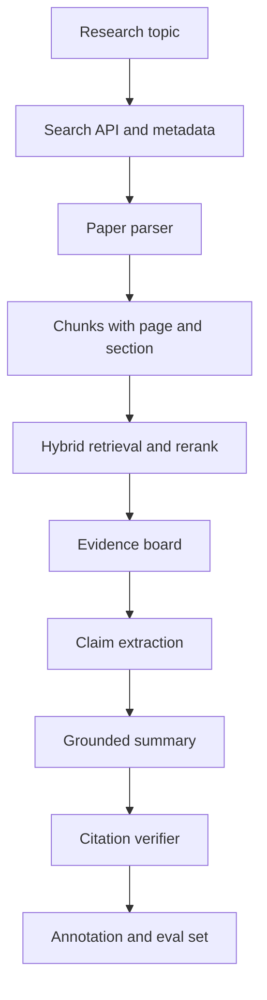

# Paper Agent 项目线

## 一句话定义

Paper Agent 是面向论文检索、阅读、证据整理和综述生成的 Agent 项目线。它的工程重点是 paper parser、citation graph、claim extraction、retrieval eval、hallucination rate 和人工 annotation 闭环。

## 面试定位

这个项目很适合展示 RAG、Agent、引用验证和评测能力。面试官会追问它是不是只把 PDF 丢给模型总结，所以必须讲出解析、检索、证据、引用和评测链路。

回答要覆盖架构、数据流、指标、取舍和追问。尤其要说明如何降低幻觉，以及怎样评测引用准确率。

## 为什么需要它

论文阅读任务天然需要 evidence grounding。用户关心的是论文提出什么方法、实验是否支持结论、和相关工作有什么差异。这些都不能只靠模型语言能力。

Paper Agent 的价值在于把论文 PDF、元数据、引用关系和用户问题组织成 evidence board，再生成可追溯的综述或对比表。

## 核心架构

| 模块 | 职责 | 关键字段 | 指标 |
| :--- | :--- | :--- | :--- |
| paper parser | 解析 PDF、表格、段落 | page、section、bbox | parse_success_rate |
| citation graph | 组织论文引用关系 | cited_by、references | coverage@k |
| retrieval | 找相关证据 | query、chunk_id、score | recall、precision |
| claim extraction | 抽取结论断言 | claim、evidence_id | claim_support_rate |
| verifier | 检查引用支持 | verdict、reason | hallucination rate |

## 架构与运行机制

系统先通过 arXiv、Semantic Scholar 或内部文献库获取元数据。PDF parser 要保留页码、章节、表格和公式附近文本，不能只得到无结构纯文本。

检索阶段结合关键词、作者、年份、venue、向量相似和 rerank。生成前先构建 evidence board，明确每个 claim 的来源。生成后再用 citation verifier 检查 claim 是否被 evidence span 支持。

## 运行机制

1. 用户输入主题、时间范围、领域和阅读目标。
2. Search API 召回论文元数据并构建候选集合。
3. Paper parser 解析 PDF，生成带页码和章节的 chunks。
4. Hybrid retrieval 与 rerank 找到相关证据。
5. Claim extraction 抽取方法、贡献、实验和限制。
6. Grounded generator 生成综述，所有 claim 带 citation。
7. Verifier 和人工 annotation 形成 eval 集。

## 关键设计取舍

| 取舍 | 好处 | 代价 | 建议 |
| --- | --- | --- | --- |
| 只读 abstract | 快 | 证据不足 | 仅用于粗筛 |
| 解析全文 | 证据完整 | 成本和格式复杂 | 核心论文必做 |
| 自动综述 | 效率高 | 幻觉风险 | 需 verifier |
| 人工 annotation | 评测可信 | 成本高 | 用于 golden set |

## 生产落地细节

- chunk 必须保留 paper_id、page、section、paragraph_id 和 evidence span。
- citation graph 可以帮助扩展相关工作，但不能替代证据验证。
- 对表格结论要保留表格结构或截图引用，避免模型读错数值。
- retrieval eval 要包含同领域相似论文作为 hard negative。
- 指标包括 citation_precision、claim_support_rate、hallucination rate、coverage@k、parse_failure_rate 和 annotation_agreement。

## 系统设计案例

用户要求比较三篇 Agent 评测论文。系统先检索论文元数据，解析 PDF，抽取方法、数据集、指标和结论，再建立 evidence board。最终输出对比表，每个结论都引用页码或段落。

数据流是：topic -> papers -> parsed chunks -> retrieval -> evidence board -> claims -> verified summary。若 verifier 发现结论没有证据，系统要回查论文或标注不确定。

## 真实问题与排障

常见失败是 PDF 解析错页码、引用了相关但不支持的段落、或把作者结论过度概括。排障先看 evidence_id 是否指向正确页，再检查 rerank 是否选择了 answerable chunk。

如果 hallucination rate 上升，优先检查 claim verifier 和 hard negative，而不是只调生成 prompt。

## 常见误区与排障

- 只总结 abstract，冒充读完整论文。
- citation 指到论文链接，不指具体 evidence span。
- 不保存页码和章节，无法复查。
- 评测只看摘要流畅度，不看 claim 支持。
- 没有 annotation，无法构建可信 eval。

## 面试追问

- 如何评测引用准确率？
- PDF 表格和公式怎么处理？
- citation graph 有什么用？
- 如何控制论文推荐的时效性和权威性？
- 综述生成失败时如何回放 trace？

## 项目化表达

项目里可以说：“Paper Agent 的核心不是论文总结，而是证据管线。paper parser 保留页码和结构，retrieval eval 验证召回，claim extraction 和 citation verifier 控制 hallucination rate，annotation 样本用于回归。”

## 深入技术细节

Paper Agent 的证据最小单元不是整篇论文，而是带位置的 evidence span。Parser 要输出 `paper_id`、`page`、`section`、`paragraph_id`、`bbox`、`text`、`table_id`、`figure_id` 和 `parse_confidence`。对表格和公式，最好保留结构化抽取结果和截图引用，避免模型把行列或指标读错。

生成前应先构建 evidence board：每条 claim 对应方法、实验、数据集、指标、限制或相关工作证据。生成后 claim verifier 检查是否被 span 支持。citation graph 可以帮助找相关论文和脉络，但不能替代 claim-to-evidence，因为“引用了某论文”不代表该论文支持当前结论。

## 关键数据结构与协议

| 字段 | 作用 | 常见问题 |
| --- | --- | --- |
| `paper_id` | 论文唯一标识 | 元数据混淆 |
| `page/section` | 定位证据 | 引用不可复查 |
| `evidence_span` | 支持 claim 的片段 | 引用过粗 |
| `claim_type` | 方法/结果/限制 | verifier 口径不同 |
| `citation_verdict` | supported/partial/unsupported | 控制发布 |
| `annotation_label` | 人工标注 | 构建 golden set |

协议上要区分粗筛、精读和发布。abstract 可以用于候选筛选，核心结论必须回到全文 evidence span；发布综述前必须通过 citation verifier，失败时输出 unsupported 或补检索。

## 深问准备

被问“表格和公式怎么处理”时，可以回答：表格保留结构化 cell、caption、page 和截图 ref；公式保留上下文段落和符号解释；高风险数值结论要让 verifier 对齐行列和指标，不能只让模型看 OCR 文本。

被问“如何评测 Paper Agent”，看 `citation_precision`、`claim_support_rate`、`hallucination_rate`、`coverage@k`、`parse_failure_rate`、`annotation_agreement`。如果引用很多但 claim support 低，说明 grounding 失败，不是摘要风格问题。

## 来源与延伸阅读

- [OpenAI Cookbook](https://cookbook.openai.com/)
- [Semantic Scholar API](https://api.semanticscholar.org/api-docs/)
- [arXiv API 文档](https://info.arxiv.org/help/api/index.html)
- [Anthropic: Building effective agents](https://www.anthropic.com/engineering/building-effective-agents)
