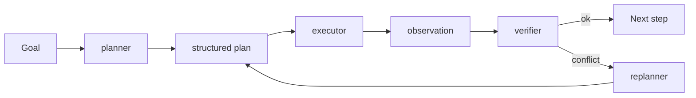
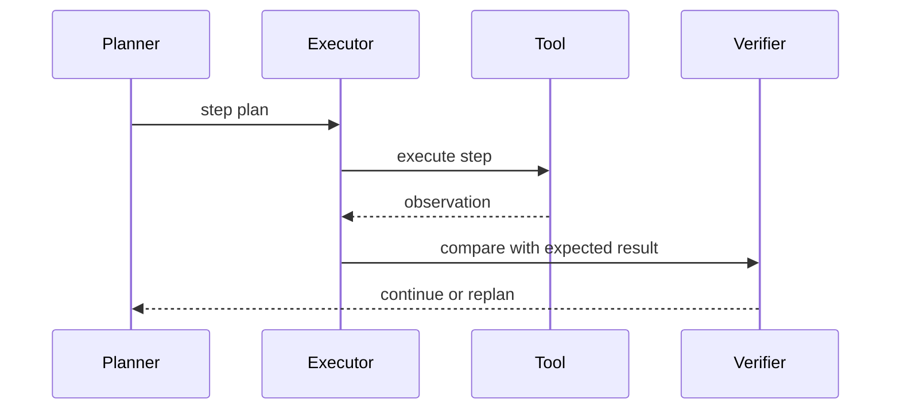

# 规划方法：CoT / ToT / Plan-and-Solve

## 面试定位

规划方法题目要避免背论文名词。面试官想知道你是否能说明 CoT、ToT、Plan-and-Solve、Planner-Executor、Replanner 在工程里的适用场景、成本和失败恢复。

## 一句话定义

规划方法是让模型把复杂任务拆成中间步骤、候选路径或可执行计划的技术集合。它帮助 Agent 降低盲目行动，但必须和执行反馈、verifier、预算和停止条件一起设计。

规划不是越复杂越好。固定任务不需要复杂计划，高价值开放任务才值得付出 token、延迟和工具调用成本。

## 为什么需要它

没有规划，Agent 容易一边执行一边漂移，遇到失败也不知道如何恢复。规划把目标转成步骤，让系统可以检查进度、重排优先级、回滚和评估。

但计划不是事实。执行结果可能推翻计划，所以必须支持 replanning。

## 核心架构

图 1：规划方法在 Agent 中形成 planner、executor、verifier、replanner 的闭环。Planner 把 Goal 转成 structured plan，Executor 执行每一步并产生 observation，Verifier 比较 expected observation 和 actual result，冲突时由 Replanner 生成新版本计划。

这张图的边界是：plan 不是事实源，observation 和 verifier 才是事实边界。计划可以降低盲目行动，但如果工具结果、用户约束或风险状态变化，系统必须重规划或停止，而不是沿着旧计划继续推进。

核心是 plan 和 observation 的闭环。Planner 产出结构化计划，Executor 执行，Verifier 判断是否需要重规划。

## 架构与运行机制

CoT 偏向让模型组织逐步推理；ToT 会探索多个候选路径；Plan-and-Solve 先生成计划再执行；Planner-Executor 把计划和执行拆成不同角色；Replanner 在观察结果和计划冲突时修正路线。

工程系统通常不会暴露完整隐式推理，而是保存 plan、decision summary、tool result 和 verifier verdict。

## 运行机制

计划应该结构化，例如 step id、goal、tool、expected observation、risk、done condition。执行时每一步都要绑定 observation 和状态变化。失败时根据错误类型决定重试、换工具、重规划或停止。

## 关键设计取舍

| 方法 | 适用场景 | 收益 | 风险 |
| --- | --- | --- | --- |
| CoT summary | 简单推理组织 | 成本低 | 不保证可执行 |
| ToT | 高价值、多路径问题 | 探索更充分 | 分支成本高 |
| Plan-and-Solve | 步骤明确的复杂任务 | 过程可检查 | 计划可能过期 |
| Planner-Executor | 工具任务和多角色 Agent | 边界清晰 | 协调复杂 |
| Replanner | 环境反馈频繁变化 | 恢复能力强 | 易陷入反复规划 |

## 生产落地细节

计划要有版本和状态。每次重规划要记录原因：工具失败、证据冲突、用户约束变化、预算不足或风险触发。Verifier 要检查 step 是否完成，而不是只相信模型说完成。

数据流上要能从 plan version 追到每一步 observation、state diff、verifier verdict 和 replan reason，否则后续无法解释计划为什么改变。

指标包括 `plan_success_rate`、`replan_rate`、`avg_plan_steps`、`tool_waste_rate`、`verifier_reject_rate` 和 `cost_per_completed_task`。

## 系统设计案例

Travel Agent 可以先规划：确认预算、查航班、查酒店、组合路线、生成候选、等待确认。若航班售罄，Replanner 需要回到日期或路线约束，而不是继续沿旧计划执行。

## 真实问题与排障

如果规划和执行冲突，先看计划是否假设了错误前提，再看工具 observation 是否可信，最后看 Verifier 是否应该触发 replan。不要让模型在旧计划上硬走。

事故复盘可以按计划版本排查。影响面先看是 planner 产出低质计划、executor 误执行、verifier 漏判，还是 replanner 覆盖旧约束；止血可以降低自动执行权限、缩小计划步数、要求每步 verifier 通过后再继续；根因常见于 expected_observation 过弱、done_condition 不可验证、budget 未限制、replan_reason 没记录；回归要固定“计划过期”“工具失败”“证据冲突”“预算耗尽”四类 case。

## 常见误区与排障

常见误区是计划生成后不更新，或者 ToT 分支无限扩张。排障要看 plan version、replan reason、被放弃路径和预算使用。

## 面试追问

1. CoT、ToT、Plan-and-Solve 区别是什么？
2. 如何限制规划成本？
3. observation 和 plan 冲突怎么办？
4. 如何评估 planner 好坏？

## 项目化表达

Coding Agent 可以讲先定位、再改动、再测试的计划；Travel Agent 可以讲约束驱动的 itinerary plan；Paper Agent 可以讲检索计划和证据缺口驱动的重检索。

## 深入技术细节

规划模块要把“模型想法”转换成可执行、可验证、可回放的计划对象。一个生产 plan 可以包含 `plan_id`、`plan_version`、`objective`、`constraints`、`steps[]`、`budget`、`risk_flags` 和 `stop_condition`。每个 step 至少有 `step_id`、`dependency_ids`、`action_type`、`tool_hint`、`expected_observation`、`done_condition`、`rollback_hint` 和 `max_attempts`。

执行时不要让 Planner 一次性决定到底。更稳的做法是 Planner 产出初版计划，Executor 每执行一步写入 observation，Verifier 比较实际结果和 expected observation。如果出现工具错误、证据冲突、用户约束变化、预算不足或风险触发，Replanner 生成新版本，并记录 `replan_reason` 和 abandoned steps。这样计划是状态机，不是一段静态文本。

## 关键数据结构与协议

| 字段 | 作用 | 排障价值 |
| --- | --- | --- |
| `plan_version` | 标记计划演进 | 解释为什么路径改变 |
| `step_id` | 绑定动作和 observation | 定位失败步骤 |
| `expected_observation` | 定义成功证据 | 防止模型自称完成 |
| `verifier_verdict` | 判断继续或重规划 | 区分工具失败和计划错误 |
| `budget_remaining` | 控制成本和延迟 | 防止 ToT 分支爆炸 |
| `replan_reason` | 记录重规划原因 | 沉淀失败类型 |

协议层可以把 Replanner 输出限制为结构化 diff：新增哪些 step、取消哪些 step、保留哪些约束、为什么改变路径。不要让重规划覆盖历史 trace，否则无法审计“旧计划错在哪里”。指标要看 `plan_success_rate`、`replan_rate`、`avg_plan_steps`、`verifier_reject_rate`、`tool_waste_rate` 和 `cost_per_completed_task`。

## 深问准备

面试里可以把 CoT、ToT、Plan-and-Solve 的差异落到成本和可控性。CoT summary 成本低但不可执行；ToT 适合高价值多路径问题，但必须限制 branching factor、depth 和 budget；Plan-and-Solve 更适合步骤清晰的复杂任务；Planner-Executor 适合工具任务，但要解决计划过期和观察反馈。

如果追问“计划和事实冲突怎么办”，答案不是继续说服模型，而是以 observation 为准。先验证工具返回是否可信，再判断计划假设是否失效；如果失效就重规划，如果风险过高就停止或人工接管。这个回答能体现 Agent 工程里的核心原则：计划是候选路线，trace 和 verifier 才是事实边界。

## 公开阅读校验

规划方法的公开稿不能停留在 CoT、ToT、ReAct 名词比较，而要证明“计划可执行、可验证、可回滚”。生产系统里的 plan 应该是结构化对象，不是模型的一段自然语言。每一步都要有 dependency、expected observation、done condition、预算、风险标记和失败恢复策略，否则计划无法被 executor、verifier 或人类审核稳定消费。

验收可以构造四类反例：工具返回与预期不一致、关键证据缺失、预算耗尽、用户约束中途变化。理想行为不是模型硬走旧计划，而是 Verifier 触发 replan，并保留旧 plan version、abandoned steps 和 replan reason。对于高风险动作，Planner 最多提出候选步骤，真正执行前仍要经过权限、preview 和人工确认。

指标要把“计划漂亮”转换成运行事实：`plan_step_completion_rate`、`verifier_reject_rate`、`replan_precision`、`abandoned_step_cost`、`budget_overrun_count`、`unsafe_step_block_count` 和 `objective_satisfied_rate`。如果 replan 很频繁但成功率不升，说明 planner 在猜路线；如果 verifier 很少拒绝，可能是 done condition 写得太弱。

还要区分规划粒度。太粗的计划无法定位失败，太细的计划会把每个小动作都变成模型决策，增加成本和漂移。生产上通常把“需要外部证据或副作用的动作”作为 step 边界，例如检索、读取文件、调用工具、生成补丁、运行测试、等待审批；纯内部思考不必全部拆成可执行步骤。

评测 planner 时也要包含“拒绝规划”的能力。用户目标不清、权限不足、缺少关键输入、风险过高或预算明显不够时，好的 Planner 应该返回 clarification、unsupported 或 human handoff，而不是编一个看似完整的计划。这一点能区分真实工程系统和只会生成待办列表的演示。

因此规划模块的目标不是产出最长计划，而是在证据、预算和风险边界内选择下一步。

## 来源与延伸阅读

- [Anthropic Building effective agents](https://www.anthropic.com/engineering/building-effective-agents)：用于支持 workflow、agent、tool use、eval 与人工反馈应按任务复杂度组合，而不是无条件追求复杂规划。
- [AgentGuide Agent 核心面试题库](https://github.com/adongwanai/AgentGuide/blob/main/docs/04-interview/03-agent-questions.md)：用于支持 CoT、ToT、Planner-Executor、Replanner 等概念在面试中应落到工程取舍、验证和失败恢复。
