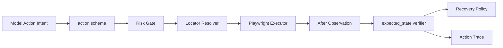

# Playwright 动作封装

## 面试定位

Playwright 动作封装考的是“浏览器工具是否可控、可验证、可恢复”。面试官不想听 `page.click()`，而是要听 action schema、locator 策略、auto-wait、expected_state、verifier、Recovery Policy 和安全边界。

## 一句话定义

Playwright 动作封装把 click、fill、select、scroll、screenshot、wait 等浏览器操作包装成 Agent 可调用的结构化工具，并在执行前后保存 observation、校验 expected_state、输出可审计结果。

## 为什么需要它

模型生成的动作意图经常模糊。页面元素也可能隐藏、disabled、被弹窗挡住或在导航后重建。直接让模型生成 selector 会把不稳定性暴露给模型。动作封装把浏览器 API 变成受控工具：模型描述目标，执行层选择 locator，verifier 判断结果，Recovery Policy 决定是否重试或转人工。

## 核心架构

图 1：Playwright 动作封装把模型意图转成受控 action，再经过风险门禁、定位、执行、验证、恢复和 trace 记录。

这张图的重点是把“点击一下”拆成多个工程边界。模型只负责表达目标，Schema 层把目标约束成可校验字段，Risk Gate 判断是否需要确认，Locator Resolver 把语义目标映射到稳定 locator，Executor 才调用 Playwright。Verifier 和 Recovery Policy 是闭环的关键：动作 API 没报错只说明浏览器操作执行了，不说明业务状态已经达成；Trace 则让失败路径能被回放和归因。

动作工具的返回值应该是结构化 observation，不是一句“clicked”。这样模型才能根据结果继续，而工程师也能复盘失败路径。

## 架构与运行机制

action schema 应包含 `action_id`、`action_type`、`target_description`、`locator_candidates`、`input_value`、`expected_state`、`risk_level`、`timeout_ms` 和 `requiresConfirmation`。Locator Resolver 优先使用 getByRole、getByLabel、test id 和可见文本，再退到局部 CSS/XPath。Playwright 的 auto-wait 负责 actionability checks，但它不等于业务成功。

核心数据流是模型提交动作意图，执行层补齐 action schema，Resolver 选择 locator，Executor 执行 Playwright 操作，Verifier 检查 expected_state，Recovery Policy 决定下一步。

每个动作前保存 before observation。动作后保存 after observation，并用 verifier 检查 URL、文本、元素状态、下载文件、toast 或截图区域是否符合 expected_state。失败要输出 error_code，例如 `selector_not_found`、`element_hidden`、`navigation_timeout`、`modal_blocking`、`verifier_failed`。

## 运行机制

Recovery Policy 不能盲目重复同一个动作。selector drift 时重新 observe 并 rerank locator。弹窗遮挡时先识别 modal。导航慢时等待明确状态而不是固定 sleep。涉及 password、payment、delete、submit 的动作必须接 Tool Permission Gate，先 preview，再 approval，最后 audit。

## 关键设计取舍

| 设计点 | 选择 | 收益 | 风险 |
| --- | --- | --- | --- |
| 语义 locator | role/name/label 优先 | 稳定且接近用户意图 | 页面无语义时不足 |
| CSS/XPath fallback | 局部精确定位 | 能处理遗留页面 | 改版后易漂移 |
| 强 verifier | 检查 expected_state | 降低误判完成 | 增加一次观察成本 |
| Recovery Policy | re-observe 或转人工 | 提升恢复率 | 过度重试可能误操作 |

## 生产落地细节

动作 trace 至少记录 before/after URL、screenshot_ref、locator、fallback_level、duration、error_code、verifier_result 和 recovery_decision。关键指标包括 `action_success_rate`、`verifier_pass_rate`、`selector_drift_recovery_rate`、`wrong_click_rate`、`modal_block_rate` 和 `sensitive_action_block_rate`。

## 系统设计案例

表单填写任务中，模型只输出“填写邮箱字段并提交”。工具层解析为 fill 和 click 两个 action。fill 使用 label locator，submit 使用 role button。提交后 verifier 检查 URL 或成功 toast。若按钮存在但 disabled，工具返回 `element_disabled`，模型应补充必填字段，而不是再次点击。

## 真实问题与排障

如果 Playwright 没报错但用户状态没变，优先查 verifier 是否只相信动作 API。若大量 timeout，检查等待条件和网络状态。若错点高，查 locator 候选和 observation 是否过期。若重复提交，查幂等键、确认记录和 retry policy。

## 常见误区与排障

- 把 selector 选择权完全交给模型。
- 点击后只看没有异常，不看页面状态。
- 用固定 sleep 代替 auto-wait 和业务 verifier。
- 对删除、付款、提交类动作不做 preview 和 approval。

## 面试追问

1. Playwright auto-wait 解决了什么？解决元素可操作性，不证明业务完成。
2. expected_state 怎么设计？用 URL、文本、元素状态、文件或截图区域。
3. selector drift 怎么恢复？重新 observe，重排 locator，再限制重试次数。
4. 敏感输入怎么办？risk_level 升级，走确认和审计。

## 项目化表达

可以说：我把 Browser Agent 动作封装成 action schema、Locator Resolver、Executor、Verifier 和 Recovery Policy。模型只提交意图，执行层负责定位、等待、验证、错误码和 audit。

## 深入技术细节

Playwright 封装要把动作拆成 intent、resolution、execution、verification 四步。模型只给 intent；Locator Resolver 结合 observation 中的 role、label、text、test id 和 bbox 生成 locator；Executor 使用 Playwright auto-wait 执行动作；Verifier 用 expected_state 检查业务状态。这样模型不需要手写脆弱 selector。

工具返回要结构化：`action_id`、`locator_used`、`fallback_level`、`before_snapshot`、`after_snapshot`、`duration_ms`、`error_code`、`verifier_result` 和 `recovery_hint`。如果只返回 clicked，模型会误以为成功，工程师也无法复盘错点。

## 关键数据结构与协议

| 字段 | 作用 | 典型失败 |
| :--- | :--- | :--- |
| `target_description` | 表达模型意图 | 目标含糊 |
| `locator_candidates` | 备选定位 | selector drift |
| `expected_state` | 业务验证 | click 成功但任务失败 |
| `risk_level` | 安全控制 | 敏感动作未确认 |
| `error_code` | 恢复分类 | 盲目重试 |
| `recovery_hint` | 下一步建议 | 卡在同一错误 |

协议上同一动作的重复重试要受限。若 before/after observation 没变化，Policy 应阻止无限点击，并要求 re-observe、换 locator、处理弹窗或转人工。

## 深问准备

被问“auto-wait 是否等于成功”时，要明确不是。auto-wait 只证明元素可操作，不能证明业务状态完成。最终还要看 URL、DOM、toast、表单值、下载文件或后端 mock。

被问“固定 sleep 为什么不好”时，可以回答：sleep 增加延迟且不稳定，页面快时浪费，页面慢时仍失败。应该等待明确状态或 locator 条件，并把 timeout 分类写入 trace。

## 公开阅读校验

Playwright Actions 面向公开读者时，要把“能点击页面”与“能可靠完成业务动作”分开。auto-wait、locator 和截图只能证明浏览器层动作更稳定，不能证明任务目标达成。生产级 Browser Agent 应为每个动作定义 expected state，并在执行后用 URL、DOM、toast、下载文件、网络响应或后端状态做 verifier。

验收用例应覆盖 selector drift、弹窗遮挡、页面局部刷新、重复点击、文件下载、表单校验失败和敏感提交。高风险动作必须先生成 preview snapshot，并把用户确认的目标、参数和页面状态 hash 绑定到 execution gate。若确认后 DOM 或参数变化，执行层应拒绝继续，不能让模型凭“看起来差不多”提交。

线上 trace 至少记录 `observation_id`、`locator_candidates`、`locator_used`、`actionability_result`、`before_snapshot`、`after_snapshot`、`expected_state_verdict`、`retry_count` 和 `recovery_path`。指标包括 `action_success_rate`、`verifier_failure_after_click_rate`、`selector_drift_rate`、`no_state_change_retry_count`、`sensitive_action_confirmation_rate` 和 `manual_handoff_rate`。这些指标能证明浏览器动作层是可恢复的工具系统。

另一个公开阅读重点是权限范围。Browser Agent 可以读页面、填表、点击按钮，但不应默认拥有付款、删除、群发、提交代码或修改账号设置等能力。动作 schema 要把副作用和可逆性写清楚，让执行层能在风险升级时暂停，而不是让模型自己判断“这个按钮是否危险”。

## 来源与延伸阅读

- [Playwright Auto-waiting](https://playwright.dev/docs/actionability)：用于支持 actionability checks 只能证明元素可操作，不能替代业务 expected_state verifier。
- [Playwright Locators](https://playwright.dev/docs/api/class-locator)：用于支持 role、label、text、test id 等 locator 策略比裸 CSS/XPath 更适合长期维护。
- [Playwright Actions](https://playwright.dev/docs/input)：用于支持 fill、click、select、keyboard、mouse 等动作应被封装成受控工具，而不是让模型直接拼浏览器脚本。
