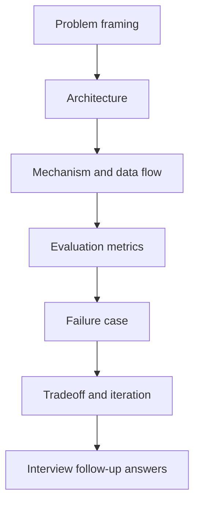

# 项目讲述结构

## 一句话定义

项目讲述结构是把经历从“我做了一个 demo”升级成工程故事：用 STAR 做 problem framing，再展开 architecture、数据流、metrics、failure case 和 tradeoff，让面试官看到真实系统能力。

## 面试定位

这类问题看似软技能，其实是技术面试里的系统设计表达。面试官想知道你是否能讲清楚为什么做、怎么做、遇到什么失败、如何验证、哪些地方没有做。

好的项目表达不是堆名词，而是把业务问题、技术架构、运行机制、指标、取舍和追问都准备好。尤其是 Agent 项目，不能只说“接了大模型 API”。

## 为什么需要它

很多候选人的 AI 项目听起来像 demo：输入 prompt，模型输出结果，页面展示一下。这样的表达很难支撑连续追问。

工程化讲述要让项目有边界、有证据、有失败、有指标。你需要说明哪些能力是 production-ready，哪些是 prototype，哪些功能故意不支持，以及为什么这样取舍。

## 核心架构

图 1：项目讲述从问题界定进入架构、机制、指标、失败案例和取舍，最后落到可被连续追问的回答。

图中每一层都对应面试官会追问的证据。Problem framing 证明项目不是随手 demo，Architecture 和 data flow 证明系统真的跑起来，metrics 证明效果口径，failure case 证明你处理过失败，tradeoff 证明你知道边界。最后的 follow-up answers 不是背稿，而是把这些证据组织成可以按模块展开的回答。

| 讲述层 | 要回答的问题 | 证据材料 | 常见追问 |
| :--- | :--- | :--- | :--- |
| STAR | 为什么做、影响谁 | 场景和约束 | 需求是否真实 |
| architecture | 系统如何拆 | 架构图、模块表 | 模块边界 |
| data flow | 请求如何流转 | trace、时序图 | 状态和异常 |
| metrics | 怎么证明有效 | eval、日志、A/B | 指标可信度 |
| failure case | 失败如何处理 | incident、回归样本 | 是否复盘 |
| tradeoff | 为什么这样选 | 对比表 | 备选方案 |

## 架构与运行机制

项目表达可以用“场景、架构、机制、指标、失败、取舍”六段。先用 STAR 的 Situation 和 Task 交代问题，再用 architecture 和数据流证明你真的做过系统，最后用 metrics 和 failure case 展示工程成熟度。

对 Agent 项目，重点模块通常包括入口、Context Builder、State Store、Tools、Guardrails、Eval、Trace 和 Human-in-the-loop。讲述时要把用户目标如何进入系统、模型如何调用工具、结果如何验证说清楚。

## 运行机制

1. 用 problem framing 限定目标用户、真实痛点和非目标。
2. 画架构图，说明入口、状态、模型、工具、存储和评测模块。
3. 讲一条关键数据流，从请求到输出，再到日志和回归样本。
4. 给指标，例如成功率、引用准确率、延迟、成本和安全拦截。
5. 讲 failure case，包括根因、止血、修复和防复发。
6. 收束 tradeoff，说明为什么不用更复杂或更简单的方案。

## 关键设计取舍

| 取舍点 | 讲得浅 | 讲得深 | 建议 |
| --- | --- | --- | --- |
| 项目定位 | 做了一个工具 | 解决了具体 workflow | 先讲问题 |
| 技术栈 | 罗列框架 | 解释模块边界 | 画架构图 |
| 效果证明 | 主观好用 | 指标和样本 | 准备 eval |
| 失败案例 | 避而不谈 | 展示复盘 | 可信度更高 |

## 生产落地细节

- 每个项目准备一张架构图、一条核心数据流、一组指标和一个失败案例。
- 不要把“模型能力”说成自己的工程能力，要强调工具封装、状态管理、评测和安全。
- 未实现能力要明确说 unsupported，不要硬编。
- 指标要能解释采样方式、样本来源和失败定义。
- 面试追问要准备到模块级，例如 schema、timeout、rollback、trace 和 eval。

## 系统设计案例

讲 Paper Agent 项目时，不要只说“能总结论文”。可以说：目标是降低技术调研中的证据整理成本；架构包括 paper parser、hybrid search、rerank、evidence board、grounded generator 和 citation verifier。

数据流是：用户输入主题，系统检索论文，解析 PDF，抽取 evidence spans，生成 claim table，最后输出带引用的综述。指标包括 citation_precision、hallucination_rate、coverage@k 和 manual_revision_rate。

## 真实问题与排障

如果面试官追问失败案例，可以讲一个具体样本：系统引用了相关论文但证据不支持结论。排障时发现 rerank 只看语义相似，没看 answerability。修复是加入 claim verifier 和 hard negative。

这种回答比“我优化了 prompt”更可信，因为它有根因、有数据流、有指标、有回归措施。

事故复盘可以按四步讲：影响面先说明哪些用户路径或样本失败，例如“综述答案中事实 claim 的 citation_precision 下降”；止血先限制高风险输出，例如遇到证据不足时降级为待确认答案；根因再落到具体模块，例如 rerank 只按相似度排序，没有判断证据是否能回答问题；回归则把失败样本加入 eval set，并要求后续版本在相同 claim-to-evidence 检查中通过。这种讲法能把项目从“我做过”变成“我知道它为什么会坏、怎么防止再坏”。

## 常见误区与排障

- 把项目讲成产品宣传页。
- 只说用了什么模型，不说系统边界。
- 没有指标，只说效果不错。
- 不敢讲失败，导致项目像玩具。
- 追问到安全、评测、状态时答不上来。

## 面试追问

- 这个项目最难的工程点是什么？
- 如何证明不是 demo？
- 失败案例是什么，怎么修？
- 为什么不用普通 workflow？
- 如果上线给真实用户，还缺哪些能力？

## 项目化表达

面试中可以用一句话开头：“这个项目我按 production agent 的思路做，不是只接模型 API；核心是把输入、检索、工具、状态、验证、安全和可观测性串成闭环。”

## 深入技术细节

项目讲述要准备到“能被追问到字段”的程度。比如讲 RAG，不只说用了向量库，而要说明 chunk metadata、权限过滤、hybrid retrieve、rerank、citation verifier 和失败回归。讲 Agent，不只说有工具调用，而要说明 tool schema、State Store、Trace、Guardrails、Eval、human confirmation 和 rollback。这样面试官能看到你知道系统怎么运行，而不是只会包装成果。

一个可复用结构是：先给 problem framing，再给 architecture diagram，再讲一条 end-to-end data flow，随后拿一个 failure case 解释如何定位，最后用 metrics 收束。每一段都要有证据：日志、trace、eval case、diff、监控截图或复盘结论。没有证据的“提升 30%”会被追问穿。

## 关键数据结构与协议

| 准备材料 | 应包含字段 | 用来回答什么 |
| --- | --- | --- |
| 架构图 | 模块、存储、外部依赖 | 系统边界 |
| 数据流 | request、state、tool、output | 运行机制 |
| 指标表 | baseline、样本、口径、结果 | 如何证明有效 |
| 失败案例 | symptoms、root cause、fix、regression | 工程成熟度 |
| 取舍表 | 方案 A/B、成本、风险 | 技术判断 |
| 未完成清单 | unsupported、risk、next step | 边界诚实 |

协议上，所有项目表达都要区分“我做了什么”和“模型天然会什么”。把模型能力说成自己的工程能力很容易被追问；把状态管理、工具封装、评测、权限和可观测性讲清楚，才是真正的工程贡献。

## 深问准备

如果被问“如何证明不是 demo”，可以回答四个证据：有真实样本或用户场景，有失败样本和回归集，有线上或离线指标，有明确 unsupported 边界。Agent 项目尤其要说明哪些动作只读自动执行，哪些写操作需要确认，哪些能力暂时不支持。

如果追问“最难的工程点”，不要泛泛说 prompt。可以说是数据质量、权限过滤、工具错误恢复、引用验证、trace replay 或评测集构建，并用一个具体失败样本说明修复前后指标变化。这样的回答更像工程师，而不是产品介绍。

最后准备一句边界说明：哪些模块已上线，哪些只是离线验证，哪些仍 unsupported。主动讲清楚限制，反而会让项目更可信，也能避免被面试官追到无法自洽。

## 来源与延伸阅读

- [Anthropic: Building effective agents](https://www.anthropic.com/engineering/building-effective-agents)：用于支持项目讲述要区分 workflow、agent、tool use 和人工反馈，而不是把所有 AI 项目都包装成自治 Agent。
- [OpenAI Agents SDK Tracing](https://openai.github.io/openai-agents-python/tracing/)：用于支持项目表达中的 trace、run、step、tool call 和失败复盘应有可审计证据。
- [OpenAI Agents SDK Guardrails](https://openai.github.io/openai-agents-python/guardrails/)：用于支持高风险动作、安全边界和人工确认是 Agent 项目讲述中必须交代的工程层。
- [OpenAI Cookbook](https://cookbook.openai.com/)：用于支持把项目经验落到可复现案例、评测样本和实现细节，而不是停留在口号。
