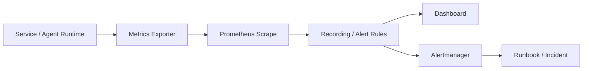

# Prometheus 指标建模、PromQL 与 SLO

## 面试定位

Prometheus 题不是问你会不会写几个 PromQL，而是看你能否把业务影响、系统资源、依赖状态和质量指标建成可告警、可复盘的时间序列。成熟回答要从问题出发：用户是否受影响，SLO 是什么，哪些指标能提前发现风险，哪些标签会让监控系统失控。

反例是堆一堆大屏但没有告警、没有 runbook、没有 SLO，或者把 `user_id`、`request_id`、`trace_id` 放进指标标签。Prometheus 官方文档用于确认指标和 PromQL 语义，工程答案还要补标签基数、告警窗口、AI/RAG 质量指标和事故闭环。

## 一句话定义

指标建模是把系统状态表达成可采集、可聚合、可告警的时间序列。PromQL 是对时间序列做窗口计算、聚合和告警表达的查询语言。SLO 是面向用户承诺的可靠性目标，告警应该优先围绕 SLO 消耗和用户影响，而不是只围绕 CPU 或机器负载。

## 架构与运行机制

图 1 展示的是指标从服务暴露到告警复盘的数据流。图中 Recording Rules 用于把复杂 PromQL 预聚合，Alertmanager 负责路由、抑制和通知，Runbook 负责把告警变成可执行动作。这张图用于说明官方文档里的 scrape 和 query 只是基础，生产系统必须把告警和事故处理连起来。

## 深入技术细节

指标类型要选对。Counter 适合请求数、错误数、重试数这类单调递增事件，查询时通常用 `rate()` 或 `increase()`；Gauge 适合队列长度、内存、连接数这类可升可降状态；Histogram 适合延迟和大小分布，可用 `histogram_quantile()` 计算近似分位数；Summary 的分位数在客户端计算，跨实例聚合能力有限。

标签设计是 Prometheus 成败关键。`service`、`route`、`method`、`status`、`tenant_tier` 这类低基数标签通常可控；`user_id`、`request_id`、`trace_id`、完整 URL、原始 prompt 这类高基数字段会制造海量时间序列，拖垮采集、存储和查询。高基数字段应该放到日志或 Trace，而不是指标标签。

SLO 告警要从用户体验反推。比如 RAG 服务不只看 HTTP 5xx，还要看 `retrieval_recall@k`、`citation_precision`、`faithfulness`、`tool_error_rate`、`eval_pass_rate`。如果接口成功但引用质量下降，用户仍然受影响。传统 RED 指标和 AI 质量指标要进入同一张事故时间线。

## 关键数据结构与协议

| 字段 | 类型 | 作用 | 风险 |
| --- | --- | --- | --- |
| `http_requests_total` | Counter | 请求总数 | 标签过多会爆炸 |
| `http_request_duration_seconds_bucket` | Histogram | 延迟分布 | bucket 设计不合理会失真 |
| `queue_size` | Gauge | 队列积压 | 需要转成 oldest age |
| `tool_error_total` | Counter | Agent 工具失败 | error_code 要稳定 |
| `retrieval_recall_at_k` | Gauge/Batch metric | RAG 召回质量 | 离线窗口延迟 |
| `citation_precision` | Gauge/Batch metric | 引用准确性 | 样本要可追溯 |
| `slo_burn_rate` | Rule | SLO 消耗速度 | 阈值要分窗口 |

这些字段让指标从“机器状态”扩展到“系统质量”。尤其是 AI/RAG 指标，要说明样本来源、评测窗口和延迟，否则告警会滞后。

## 系统设计案例

设计一个 Agent/RAG 观测看板，架构上服务暴露 HTTP、工具、检索、生成、成本和 JVM 指标，Prometheus 采集并通过 recording rules 聚合，Grafana 展示 SLO、质量和资源面板，Alertmanager 路由告警到 runbook。数据流是 service metrics -> scrape -> rules -> dashboard/alert -> incident。

取舍是：指标越细定位越快，但采集成本和标签基数越高；质量指标越贴近用户，但计算更慢、样本更贵；SLO 告警更有意义，但需要产品和工程共同定义“失败”。面试追问通常会问 Counter/Gauge/Histogram 区别、bucket 设计、高基数风险和 burn rate 告警。

## 真实问题与排障

线上 RAG 答案质量下降时，先看影响面：是否所有 workspace、是否某个知识库、接口 p95、检索 recall、引用 precision、rerank latency、模型错误率、工具失败率是否同时变化。止血可以回滚检索配置、关闭新 rerank、降低 topK、切回旧索引或提示用户结果更新中。

根因定位看指标时间线：是接口延迟先升，还是 recall 先降；是 embedding job 积压导致文档新鲜度下降，还是 rerank 服务限流；是 prompt 版本发布导致引用变差，还是数据源权限变更。回归要把失败 query 加入 golden set，并补告警和 runbook。

## 项目化表达

项目里可以说：我把传统 RED/USE 指标和 RAG 质量指标放到同一套 Prometheus/Grafana 看板。服务指标看 p95、error rate、queue、JVM；质量指标看 recall@k、citation_precision、eval_pass_rate；成本指标看 token 和模型调用。一次检索质量事故中，HTTP 成功率正常，但 recall@k 下降触发告警，我们回滚 chunk 配置并把失败样本加入回归。

## 边界条件与反例

反例一：只看 CPU 和内存。用户体验可能已经失败，但机器指标仍然正常。

反例二：标签里放高基数字段。监控系统会被时间序列数量打爆。

反例三：告警没有 runbook。告警只会制造噪声，不能缩短 MTTR。

反例四：AI 只看接口成功率。不看引用、召回和评测，无法发现质量退化。

## 深问准备

1. Counter、Gauge、Histogram 怎么选？
2. `histogram_quantile` 有什么限制？
3. 标签基数如何控制？
4. SLO burn rate 告警怎么设计？
5. Agent/RAG 应该加哪些质量指标？

## 面试加固与追问链路

如果面试官继续追问 PromQL，可以把答案落到三个层次。第一层是窗口：`rate(x[5m])` 看短期变化，`increase(x[1h])` 看周期累计，多窗口 burn rate 用短窗口发现突发、长窗口避免抖动。第二层是聚合：先按实例求 rate，再按 service、route、status 聚合，避免把 histogram bucket 的 `le` 标签错误丢掉。第三层是归因：告警触发后要能从 SLO 面板跳到服务指标、依赖指标、Trace 和日志。

项目里还可以补一条成本治理：Prometheus 不是无限存储，series count、scrape duration、rule evaluation duration、remote write lag 都要监控。一次高基数事故中，如果某个新指标把 document_id 放进标签，短时间内会让查询变慢甚至采集失败。止血是下线指标或 relabel drop，根因是指标评审缺失，回归是加 cardinality lint 和发布检查。

再补一条面试打法：当你被要求设计一个新服务的监控时，可以按“入口、依赖、资源、业务、质量”五层回答。入口看 QPS、错误率、延迟；依赖看 DB/Redis/MQ/模型 API；资源看 CPU、内存、GC、线程池；业务看订单、任务、文档处理进度；质量看 RAG 召回、引用和评测。这样回答比列一堆指标更有结构。

最后用一句话收束：指标不是为了证明系统“有监控”，而是为了在用户受影响前发现风险，在事故发生时缩短定位时间，在修复后证明质量真的恢复。

## 生产验收清单

落地 Prometheus 时，可以把验收拆成四层。第一层是指标契约：每个指标有 owner、单位、类型、标签白名单和废弃策略；新增指标进入代码评审，尤其审查 `label_values` 是否可能来自用户输入、文档 ID、trace ID 或 prompt 原文。第二层是查询契约：Dashboard 里复杂 PromQL 尽量沉淀成 recording rule，避免值班时现场拼查询；直方图查询保留 `le` 标签，先按实例或 route 做 `rate()`，再做聚合和 `histogram_quantile()`。

第三层是告警契约：每个告警要说明用户影响、触发窗口、恢复条件、降噪规则、升级人和 runbook 链接。只报 CPU、内存或单实例错误通常不足以支撑值班决策，SLO burn rate、错误率、p95/p99 和依赖失败率要能互相解释。第四层是事故回归：质量事故中的 query、样本、版本、配置和指标截图要进入 regression set，修复后用相同样本证明 recall、citation precision、latency 和 error_rate 已恢复。

面试中如果被要求现场写 PromQL，可以先写“错误率 = 失败请求 rate / 总请求 rate”，再解释 label 聚合维度；如果被追问成本，可以讲 series count、scrape duration、rule evaluation duration、remote write lag 和 retention。这样既能回答语法，也能证明你知道 Prometheus 在生产里会被标签基数、查询复杂度和告警噪声拖垮。

## 公开阅读校验

这篇文章要把 Prometheus 从“监控工具”讲成“时间序列建模和事故决策系统”。公开读者应该能看到四个层次：指标类型是否正确，标签基数是否可控，PromQL 是否表达了真实业务语义，告警是否能触发可执行 Runbook。只会写 `rate()` 不够，能解释为什么这个 rate 的分母、窗口和聚合维度可信，才是生产经验。

PromQL 细节建议更强调常见错误。Counter 要先 `rate()` 再聚合，Histogram 做分位数时不能丢 `le` 标签，错误率要用同一过滤条件下的失败请求除以总请求，Dashboard 查询要避免每次刷新都跑高成本大范围 PromQL。复杂查询沉淀成 recording rule 时，也要监控 rule evaluation duration，防止优化查询反而拖慢规则计算。

SLO 与 AI/RAG 质量指标要分清实时性。HTTP 错误率、p95、队列 lag 可以实时告警；`retrieval_recall@k`、`citation_precision`、`eval_pass_rate` 往往来自离线或准实时评测，适合质量看板、发布门禁和慢性退化告警。把它们放在同一事故时间线里，而不是强行当成同一种指标。

项目验收可以要求每个核心服务至少有入口 RED、依赖、资源、业务状态、质量和成本六类面板；每个告警绑定 owner、severity、runbook 和恢复条件；每个新指标经过 cardinality review。这样文章的读者能学到一套可落地的监控设计方法，而不只是 Prometheus 语法。

## 来源与延伸阅读

- [Prometheus Querying basics](https://prometheus.io/docs/prometheus/latest/querying/basics/)：官方文档，用于确认 instant vector、range vector、selector 和 PromQL 基础语义边界。
- [Prometheus Query functions](https://prometheus.io/docs/prometheus/latest/querying/functions/)：官方文档，用于支持 `rate`、`increase`、`histogram_quantile` 等函数的回答。
- [Prometheus Histograms and summaries](https://prometheus.io/docs/practices/histograms/)：官方文档，用于解释 Histogram bucket、Summary 和分位数聚合取舍。
- [Prometheus Alerting rules](https://prometheus.io/docs/prometheus/latest/configuration/alerting_rules/)：官方文档，用于确认告警规则、阈值表达和 rule evaluation 的工程边界。
- [Google SRE Workbook: Alerting on SLOs](https://sre.google/workbook/alerting-on-slos/)：用于支持 SLO、错误预算和 burn rate 告警的工程实践。
