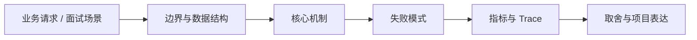

# Prometheus TSDB、WAL、Rules 与 Alertmanager

## 面试定位

Prometheus TSDB、WAL、Rules 与 Alertmanager 属于 Prometheus 与监控体系 / Dashboard、容量与成本治理。面试里它不是背概念题，而是用来判断你是否能把知识落到架构、数据流、指标和取舍上。
一句话定位：Prometheus 将抓取样本写入本地 TSDB 和 WAL，通过 recording/alerting rules 做预计算和告警，Alertmanager 负责去重、分组、抑制和通知路由。

**必须讲清楚**
- TSDB 是 Prometheus 的本地时间序列存储。
- WAL 记录近期写入，用于 Prometheus 异常退出后的恢复。
- Rules 将 PromQL 计算结果写回时间序列或生成告警，Alertmanager 处理告警生命周期。
- Prometheus 将抓取样本写入本地 TSDB 和 WAL，通过 recording/alerting rules 做预计算和告警，Alertmanager 负责去重、分组、抑制和通知路由。
- TSDB 保存时间序列样本
- WAL 用于崩溃恢复
- Rules 和 Alertmanager 把指标变成行动

**常见追问方向**
- Prometheus 题先讲指标建模和标签基数，再讲 PromQL、告警和 SLO。
- Trace 题先讲上下文传播、span 设计、采样和跨服务根因定位。
- AI 场景要主动连接 tool_error_rate、retrieval_recall@k、citation_precision 和 eval_pass_rate。
- 如果这个点落到 Coding Agent：代码库任务 Harness，架构如何设计？
- 线上失败时看哪些 trace、日志、指标，怎么回滚或补偿？

## 架构与运行机制

### 核心机制

- Prometheus 是本地时序数据库，不是无限容量日志系统。
- Rules 可以节省查询成本，也会增加计算和存储成本。
- 告警要分组、去重、抑制和静默，否则值班会被噪声淹没。
- 监控系统自身不可用时，事故期间会失明。
- 抓取样本先进入 head block 和 WAL，随后压缩成 block 存储。
- Recording rules 把复杂查询预计算成新时间序列，Alerting rules 产生告警事件。
- Alertmanager 对告警做 grouping、deduplication、silencing、inhibition 和 receiver routing。
- Retention and block compaction。
- Recording rules。
- Multi-window burn-rate alerting。
- Alertmanager routing/inhibition。
- Remote write for long-term storage。
- Prometheus 自身看 active series、samples appended、WAL fsync、rule evaluation、query duration 和 remote write lag。
- 规则分组要有 owner、评估间隔、预期 series 数和 Dashboard/告警消费者。
- Alertmanager route 要按 service、severity、team 和 environment 做路由，并配置 silence/inhibition 规则。

### 通用数据流

可以按业务 SLO、指标、日志、Trace、事件、告警、Dashboard、Runbook、事故复盘和回归验证来讲。数据流通常是服务暴露 metrics、写结构化日志、传播 trace context；Collector/Prometheus/日志系统采集后执行 recording rules、采样、索引和告警，Incident Console 把症状、路径、日志细节、发布变更和用户影响串成时间线。

### 工程落点

- 定义服务级 RED/USE 指标、业务指标和 AI 质量指标。
- 为 Trace、日志和指标统一 trace_id、tenant、workspace 和 release 维度。
- 事故后沉淀告警阈值、仪表盘、回归用例和 runbook。
- 监控 Prometheus 自身的 head series、WAL、block、rule evaluation duration 和 alert queue。
- 复杂 Dashboard 查询应沉淀为 recording rules，但要评估新增 series 和 rule 计算成本。
- 把每个关键步骤都映射到可观测指标，避免只描述功能。
- 回答时主动说明哪些信息是强一致状态，哪些只是上下文或缓存视图。

## 可画图

图 1：Prometheus TSDB、WAL、Rules 与 Alertmanager 的回答要从业务入口进入，先讲边界和数据结构，再讲机制、失败模式、指标和取舍。

## 系统设计案例

### Prometheus TSDB、WAL、Rules 与 Alertmanager 的面试级设计题

典型设计题是订单服务可观测体系、MQ 消费积压排障、JVM/Redis 联动事故、RAG 质量退化或 Agent tool 调用失败。架构上要包含 RED/USE 指标、SLO burn rate、trace_id 日志关联、错误链路保留、告警路由、Dashboard 分层、Runbook、复盘任务和 regression/eval 样本。

**可画架构**
- 指标暴露层：应用或 exporter 暴露 `/metrics`，定义 metric name、type、unit 和 label allowlist。
- 采集层：Prometheus 通过 scrape_config 和 service discovery 找到 target 并定期抓取。
- 存储层：样本进入 head block、WAL 和本地 TSDB block，按 retention 保留。
- 计算层：recording rules 预聚合复杂查询，alerting rules 产生告警事件。
- 响应层：Alertmanager 分组、去重、抑制、静默和路由，Runbook 指导止血和复盘。

**数据流**
- 服务暴露 metrics，Prometheus 根据 job、target、interval 和 timeout 定期抓取。
- 样本带 metric name 和 label 进入 TSDB，recording rules 生成聚合序列。
- alerting rules 根据 SLO、错误率、延迟或容量阈值生成告警。
- Alertmanager 做 grouping/dedup/inhibition/routing，值班人员按 Runbook 处理并复盘。

## 真实问题与排障

真实线上问题一般从用户影响、错误率、p95/p99、slo_burn_rate、consumer_lag、gc_pause、redis_latency、span_error_rate、log_error_code、recent_deploy、series_count 和 dropped_spans 看起。回答时要先用指标确认症状，再用 Trace 定位路径，日志补局部细节，最后用复盘和回归防止复发。

**排查顺序**
- 先确认用户影响和 SLO：错误率、延迟、可用性、质量指标是否异常。
- 检查 `up`、scrape_duration、samples、target 数量和 active series，确认采集是否健康。
- 检查 rule evaluation duration、query duration、Alertmanager 路由和通知错误。
- 对比最近发布、label 变化、target 发现规则、remote write 和 retention 配置。
- 止血可以 drop 高基数标签、禁用问题 rule、回滚配置或切换只读/降级面板。

**重点指标**
- prometheus_tsdb_head_series
- prometheus_rule_group_duration_seconds
- prometheus_notifications_errors_total
- wal_fsync_duration
- alert_noise_rate

**常见误区**
- 只会写 PromQL 不知道存储成本
- Recording rule 无 owner 导致新 series 膨胀
- 告警直接发消息没有分组和抑制

## 业界方案与技术取舍

可观测性的取舍是定位能力和事故恢复速度换来了采集成本、标签基数、存储、隐私和告警噪声。面试追问通常会围绕指标类型、PromQL、SLO burn rate、日志脱敏、Trace 采样、Dashboard 设计、Runbook、MTTR、标签基数和 AI/RAG 质量指标展开。

**方案对比**
- Retention and block compaction。
- Recording rules。
- Multi-window burn-rate alerting。
- Alertmanager routing/inhibition。
- Remote write for long-term storage。
- 更长 retention 利于复盘但增加存储。
- 更多 recording rules 提升查询体验但增加写入与规则负担。
- 告警抑制降低噪声但配置错误可能漏报。
- 先把观测体系看成指标、日志、Trace、事件和复盘流程的组合，而不是一套监控大屏。
- 指标负责趋势和告警，Trace 负责跨服务路径，日志负责局部细节，事件负责时间线。
- 回答观测题要把业务 SLA、系统资源、依赖、Agent/RAG 指标和事故回归连起来。
- 可以把 Prometheus 看成生产数据库来治理容量、写入、查询和保留。
- Alertmanager 相当于事故通知编排层，需要路由、抑制和升级策略。

**复习时要能讲出的细节**
- 这个知识点解决什么问题，不解决什么问题。
- 关键数据结构、状态变化、失败边界和可观测指标是什么。
- 面试官继续追问时，能从架构图、数据流、线上排障和项目证据四个角度展开。
- 能说明为什么这个取舍适合当前业务，而不是只背业界名词。

## 深入技术细节

Prometheus 将抓取样本写入本地 TSDB 和 WAL，通过 recording/alerting rules 做预计算和告警，Alertmanager 负责去重、分组、抑制和通知路由。 TSDB 是 Prometheus 的本地时间序列存储。 WAL 记录近期写入，用于 Prometheus 异常退出后的恢复。 Rules 将 PromQL 计算结果写回时间序列或生成告警，Alertmanager 处理告警生命周期。 Prometheus 是本地时序数据库，不是无限容量日志系统。 Rules 可以节省查询成本，也会增加计算和存储成本。 告警要分组、去重、抑制和静默，否则值班会被噪声淹没。 监控系统自身不可用时，事故期间会失明。

面试深挖时要把指标语义、标签基数、scrape、TSDB/WAL、rules、Alertmanager 和 Runbook 串起来。不要只说会写 PromQL，也要说明监控系统自身如何不被打爆。

## 关键数据结构与协议

| 字段 | 所属对象 | 作用 | 排障价值 |
| :--- | :--- | :--- | :--- |
| `job` | Scrape 配置 | 标识一组抓取目标 | 排查采集边界和 owner |
| `target` | 抓取目标 | 表示 instance 地址和标签集合 | 判断目标是否被发现和抓取 |
| `metric_name` | 时间序列 | 表达指标语义和单位 | 判断是否重复、废弃或误用 |
| `label_set` | 时间序列身份 | 决定 series 基数 | 排查高基数和查询成本 |
| `rule_group` | 规则 | 定义 recording/alerting 计算 | 排查 rule 超时、噪声和漏报 |
| `alert_fingerprint` | 告警 | 标识去重和分组后的告警 | 排查通知、抑制和静默 |

## 深问准备

被追问边界时，先说这个方案适合什么、不适合什么，再给反例。被追问线上故障时，按影响面、止血、根因、修复、回归五段回答。被追问项目时，把回答落到你做过的接口、缓存、队列、数据库、监控或 Agent 工程链路。

- 反例要明确，例如强事务事实源不能交给缓存或搜索读模型。
- 指标要可执行，例如 p95、error_rate、retry_rate、lag、miss_rate、stale_rate。
- 回归要可复现，例如固定输入、故障注入、压测脚本或 golden case。

## 来源与延伸阅读

- [Prometheus Documentation: Storage](https://prometheus.io/docs/prometheus/latest/storage/)：用于确认官方语义边界、命令行为和工程约束。
- [Prometheus Documentation: Recording rules](https://prometheus.io/docs/prometheus/latest/configuration/recording_rules/)：用于确认官方语义边界、命令行为和工程约束。
- [Prometheus Alertmanager Documentation](https://prometheus.io/docs/alerting/latest/alertmanager/)：用于确认官方语义边界、命令行为和工程约束。
