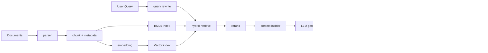
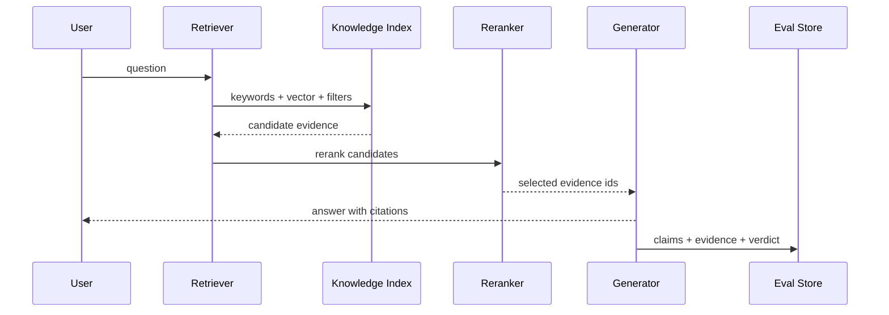

# RAG 全流程

## 面试定位

RAG 不是“接一个向量库”。面试里要讲清楚完整链路：ingest、parse、chunk、embed、index、query rewrite、retrieve、rerank、context build、generate、citation 和 eval。更重要的是，要能区分检索问题和生成问题。

一个成熟回答会强调：RAG 的目标是让答案有可追溯证据，降低知识过期和无依据生成；生产 RAG 的难点在数据质量、权限、召回、证据筛选、引用准确率、延迟和成本。

## 一句话定义

RAG 是把外部知识通过检索和证据注入接入模型生成过程的工程链路。它先从知识库中找到可支撑答案的 evidence，再让模型基于 evidence 生成回答和 citation。

它解决的是 grounding 和知识更新问题，不保证自动正确。检索不到、重排选错、证据不支持、生成乱引用，都会导致错误答案。

## 为什么需要它

纯模型回答依赖参数记忆，难以及时更新，也难以证明答案来源。RAG 把问题拆成两个可观测问题：是否检索到了正确证据，模型是否忠实使用证据。

这让系统可以分别优化 retriever、reranker、context builder 和 generator，而不是笼统地说“模型幻觉”。

## 核心架构

图 1 里要强调 evidence lifecycle。Parser 决定证据是否可定位，Retriever 决定候选是否覆盖，Rerank 决定上下文质量，Verifier 决定 claim 是否被证据支持。权限过滤应该发生在 retrieve 前或 retrieve 中，不能只在最终答案阶段做文本过滤。

## 架构与运行机制

RAG 的数据流分为离线和在线两条。离线链路负责文档解析、去重、chunk、metadata、embedding 和索引。在线链路负责 query rewrite、hybrid retrieve、rerank、证据选择、上下文拼装、生成和引用。

关键不是向量库，而是每一步是否可观测。retriever 要输出 evidence id、score、source 和 reason；reranker 要输出 selected evidence 和 dropped reason；generator 要输出 claim-to-evidence 映射。

## 运行机制

chunk 影响召回上限。小 chunk 精准但上下文不完整，大 chunk 完整但噪声高。常见方案是父子 chunk：小 chunk 用于召回，父文档或章节用于补上下文。

retrieve 不能只靠 vector。BM25 擅长错误码、编号、专有名词和精确词；向量擅长语义相似；metadata filter 负责租户、权限、时间和业务域。rerank 再判断候选是否真的能支撑答案。

## 关键设计取舍

| 设计点 | 推荐做法 | 收益 | 风险 |
| --- | --- | --- | --- |
| chunk 粒度 | 按标题、段落和父子结构切分 | 兼顾召回和完整性 | 需要评测调参 |
| 检索方式 | BM25 + vector + metadata filter | 召回更稳 | 延迟和资源成本增加 |
| Rerank | 用 cross-encoder 或 LLM rerank | 提升证据质量 | p95 latency 可能变高 |
| Citation | claim-to-evidence 映射 | 可追溯、可评测 | 回答会更保守 |
| Eval | 分层评测 retrieval、rerank、generation | 易定位根因 | 需要 golden set |

## 生产落地细节

chunk metadata 至少包含 source、title、section、page、version、permission、owner、timestamp 和 hash。索引要支持版本切换和 stale document 清理。查询 trace 要记录 query、rewrite、filters、topK、scores、rerank result、selected evidence、answer 和 citations。

评测要分层：`retrieval_recall@k`、`MRR`、`citation_precision`、`faithfulness`、`answer_relevance`、`permission_leak_count` 和 `p95_latency`。

## 系统设计案例

Paper Agent 可以用 RAG 做论文问答。PDF 解析后按章节和页码切 chunk，保存 paper id、section、page、figure/table 标记。用户提问时先 query rewrite，再 hybrid retrieve，rerank 后只把能支撑 claim 的 evidence 放入上下文。

这个案例里，citation 不是装饰。每个关键结论都要能回到 page、section 或 chunk。

## 真实问题与排障

RAG 答错时先问：正确证据是否进了候选集。如果没有，是 ingest、chunk、metadata、query rewrite 或 retriever 问题。如果正确证据进了候选但没进上下文，是 rerank 或 context budget 问题。如果正确证据进了上下文但答案仍错，是 generator、prompt、citation policy 或 verifier 问题。

事故剧本可以用“答案有 citation，但 citation 不支持 claim”来讲。影响面是用户以为答案可追溯，实际上关键结论没有证据支撑，可能污染技术决策或客服回复。trace 证据要查 `answer_claims`、`citation_ids`、`selected_evidence_ids`、`rerank_score` 和 `verifier_verdict`。止血动作是临时提高 verifier 阈值、要求 unsupported claim 返回“不足以判断”，并把相关问题加入人工复核队列。常见根因是 reranker 只判断主题相关，不判断 claim support，或 generator 在相邻 evidence 之间拼接了未被支持的结论。长期修复是让输出结构包含 claim-to-evidence mapping，并在回归集中加入“citation 存在但不支持 claim”的负例。

## 常见误区与排障

常见误区包括：只用向量检索，不做权限过滤；引用存在但不支持结论；只看最终答案，不看 retrieval 和 citation 指标；把 RAG 和长期记忆混为一谈。

排障要沿数据流看 trace，而不是只换模型。先看 query rewrite，再看 topK，再看 rerank，再看 selected evidence，最后看 claim-to-evidence。

## 面试追问

1. RAG 完整流程是什么？按 ingest 到 eval 讲。
2. 为什么 hybrid search 常见？BM25、vector、metadata filter 各补短板。
3. 如何区分检索问题和生成问题？看正确证据是否进入候选和上下文。
4. 如何评测 citation？看 claim 是否被 evidence 真实支持。

## 项目化表达

Paper Agent 可以讲 citation_precision 和 unsupported claim 检测。企业知识库可以讲权限过滤和 stale document。后端经验可以迁移到数据同步、索引版本、MQ 重试、监控告警和缓存降级。

## 深入技术细节

RAG 的工程核心是 evidence lifecycle。离线侧每个 chunk 要带 `doc_id`、`chunk_id`、`source_uri`、`section_path`、`page`、`version`、`permission_scope`、`content_hash` 和 `embedding_version`。在线侧每次 query 要记录 rewrite、filters、BM25/vector 候选、rerank score、selected evidence 和最终 claims。

如果这些字段缺失，错答时无法定位是文档没入库、chunk 切坏、权限 filter 错、retriever 漏召、reranker 丢证据，还是 generator 幻觉。高质量 RAG 不是向量库，而是从数据治理到引用验证的一条可回放链路。

## 关键数据结构与协议

| 字段 | 所属对象 | 作用 | 排障价值 |
| :--- | :--- | :--- | :--- |
| `doc_id` | Document | 文档唯一标识 | 定位文档版本 |
| `chunk_id` | Chunk | 证据最小单元 | 定位 citation |
| `section_path` | Chunk | 章节层级 | 避免上下文断裂 |
| `permission_scope` | Chunk | 权限过滤 | 防止越权召回 |
| `embedding_version` | Index | 向量版本 | 排查召回漂移 |
| `rerank_score` | Candidate | 精排分数 | 分析证据筛选 |
| `claim_support` | Verification | 支持、矛盾或不足 | 评估 unsupported claim |

协议上，权限过滤应在召回前或召回中执行；citation verifier 应检查 claim 是否被 evidence span 支持，而不是只检查链接存在。

## 深问准备

被问“如何区分检索问题和生成问题”，先看正确 evidence 是否进入 topK；没进是 ingest/retrieval/filter 问题，进了但没被选是 rerank/context 问题，进了上下文仍答错才是生成或 verifier 问题。

被问“chunk 怎么切”，回答结构优先：标题、章节、段落、表格和代码块保留语义边界；小 chunk 召回，父 chunk 补上下文，并用 eval 调参。

## 来源与延伸阅读

- [AgentGuide Agent 核心面试题库](https://github.com/adongwanai/AgentGuide/blob/main/docs/04-interview/03-agent-questions.md)：用于 RAG 面试题组织。
- [Elastic Search API](https://www.elastic.co/guide/en/elasticsearch/reference/current/search-search.html)：用于 BM25、filter、查询和 profile 思路。
- [OpenAI A practical guide to building agents](https://cdn.openai.com/business-guides-and-resources/a-practical-guide-to-building-agents.pdf)：用于把 RAG 放进 Agent 工具和知识层。
