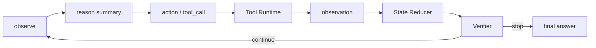
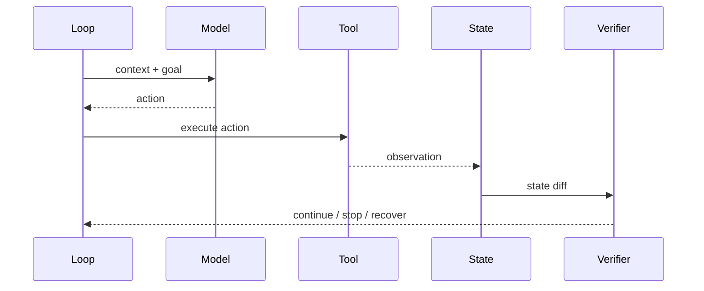

# ReAct 与 Agent Loop

## 面试定位

ReAct 题目要讲清“推理”和“行动”如何通过 observation 闭环，而不是输出 chain-of-thought。生产系统通常保存 reasoning summary、action、observation 和 verdict，不暴露完整隐式思考。

## 一句话定义

ReAct 是把 reason 和 act 交替组织的 Agent loop：模型基于当前观察决定下一步动作，工具执行后返回 observation，系统再决定继续、重试、停止或转人工。

它适合多步工具调用和需要环境反馈的任务，不适合无限循环或高风险自动执行。

## 为什么需要它

单次 LLM 调用无法处理“先查资料、再验证、再修正”的任务。ReAct 让模型在每一步读取外部反馈，从而把任务推进成动态路径。

但 loop 也会放大错误。没有 stop policy、max steps、timeout、trace 和 verifier，就容易陷入重复调用或错误累积。

## 核心架构

图 1：ReAct loop 把观察、决策摘要、结构化动作、工具执行、状态归并和验证器串成闭环，验证器决定继续、恢复或停止。

图里最重要的是 Observation、State Reducer 和 Verifier 三个边界。Observation 是外部事实，不能被模型的上一轮判断覆盖；State Reducer 把工具结果写成可审计状态变化，而不是简单追加聊天记录；Verifier 根据任务目标、预算、风险和成功断言判断是否满足标准。这样 ReAct 才是受控循环，而不是让模型持续自说自话。

## 架构与运行机制

数据流是：Loop Controller 构造当前 context，模型输出结构化 action，Tool Runtime 执行动作，State Reducer 写入 observation 和 state diff，Verifier 根据目标、预算和风险决定下一步。

生产系统不建议把完整 chain-of-thought 作为用户输出。可以记录可审计的 decision summary、tool args、observation 和 final rationale。

## 运行机制

每个 loop 至少要有 `max_steps`、`timeout`、`budget`、`stop_reason` 和 `retry_policy`。工具失败时不能让模型凭空继续，要返回 structured error。

Loop 的终止条件包括任务完成、验证失败、预算耗尽、风险触发、用户需要补充信息、人工接管。

## 关键设计取舍

| 设计点 | 推荐做法 | 收益 | 风险 |
| --- | --- | --- | --- |
| Action 格式 | 结构化 tool_call 或 final_answer | 易校验 | 设计成本 |
| Observation | 精简、带 source 和 error_code | 可追溯 | 过度摘要会丢信息 |
| Stop policy | max steps + verifier | 防循环 | 可能提前停止 |
| Trace | 记录 action/observation/state diff | 可复盘 | 存储和脱敏成本 |
| Replanning | observation 冲突时触发 | 提高恢复率 | 增加延迟 |

## 生产落地细节

Loop 状态应记录 current_step、last_action、last_observation、open_risks、tool_errors、budget_used 和 stop_reason。每次工具调用后都要让 State Reducer 更新可信状态，而不是把结果简单追加到 messages。

指标包括 `avg_steps`、`loop_timeout_rate`、`tool_success_rate`、`recovery_rate`、`verifier_pass_rate` 和 `cost_per_task`。

## 系统设计案例

Web Agent 的 ReAct loop 是 observe page、decide action、click/type、observe result、verify state。每一步都需要 DOM/screenshot observation，否则模型会基于旧页面继续操作。

## 真实问题与排障

如果 loop 卡住，先看是否一直调用同一工具、observation 是否为空、stop condition 是否缺失、工具错误是否被吞掉。再看预算和 max steps 是否合理。

## 常见误区与排障

常见误区是把 ReAct 等同于暴露思维链，或让模型在没有外部停止条件时自行循环。排障要看 action 和 observation 的差异，不要只看最终输出。

## 面试追问

1. ReAct 和普通 CoT 区别是什么？
2. 如何设计停止条件？
3. 工具失败后 loop 如何恢复？
4. trace 里应该记录什么？

## 项目化表达

Coding Agent 的 read/patch/test 就是典型 loop。Paper Agent 的检索、证据验证、再检索也是 loop。Web Agent 的观察、动作和截图验证更直观。

## 深入技术细节

ReAct 落地时不要把 loop 写成“模型回复一段思考，再执行”。更稳的状态机是：Loop Controller 生成 context，模型只能输出 `action` 或 `final_answer`，Action Validator 校验参数和风险，Tool Runtime 执行，State Reducer 写入 observation，Verifier 判断是否达到 done condition。每一轮都更新 `step_id`、`state_version`、`budget_used`、`open_risks` 和 `stop_reason`。

Observation 是 loop 的事实边界。浏览器工具要返回 DOM 片段、screenshot ref、URL 和 action result；代码工具要返回 exit code、失败摘要和日志引用；RAG 工具要返回 evidence id 和 score。不要把长日志原样塞回上下文，而是保存引用和摘要，必要时再按 cursor 读取，避免上下文污染和 token 爆炸。

工程上还要区分三类“继续”。第一类是正常推进，例如检索到证据后进入生成；第二类是恢复，例如工具超时后换查询或降级；第三类是澄清，例如 observation 表明用户目标缺参数，需要追问。把这三类都写成普通 continue，会让 trace 很难解释，也会让评测无法区分模型确实在推进还是只是在绕圈。

ReAct 的风险控制也应放进 loop contract。高风险工具调用前要经过 Policy Gate；连续失败要触发 backoff 或 handoff；相同 action 在相同 state 上重复超过阈值要停止；observation 与预期状态冲突时要先进入 diagnosis，而不是马上生成最终答案。面试里讲到这些细节，能说明你真正把 loop 当成生产系统，而不是只复述“想、做、看反馈”。

## 关键数据结构与协议

| 字段 | 作用 | 失败时怎么用 |
| --- | --- | --- |
| `step_id` | 标识每轮动作 | 找到第一次错误动作 |
| `action_type` | tool/final/handoff | 判断是否误用工具 |
| `observation_ref` | 外部事实引用 | 支持复盘和再读取 |
| `state_diff` | 本轮状态变化 | 支持回滚污染状态 |
| `verifier_verdict` | 继续/停止/恢复 | 防止无限循环 |
| `stop_reason` | done/budget/risk/handoff | 解释最终结果 |

协议上应禁止“无 observation 的连续行动”。如果工具失败、页面没变或测试无输出，下一步必须先处理错误或补充观察，而不是让模型基于旧状态继续行动。

## 深问准备

被问“如何设计停止条件”时，可以答多重 stop policy：任务完成、verifier 通过、预算耗尽、max steps、重复无改进、风险触发、需要用户输入或人工接管。只让模型自己判断 done，容易提前收敛或无限循环。

被问“ReAct 和 CoT 区别”时，强调 ReAct 的关键是外部 action 和 observation 闭环，而不是展示推理过程。生产系统可以保存 decision summary 和 trace，不需要也不应该把完整隐式推理暴露给用户。

还有一个常见深问是“loop 失败算模型问题还是系统问题”。我的回答会先看 trace：如果 observation 不完整，是工具问题；如果 verifier 漏判，是评测问题；如果同一动作重复，是 stop policy 问题；最后才归因到模型选择。

## 来源与延伸阅读

- [Anthropic Building effective agents](https://www.anthropic.com/engineering/building-effective-agents)：用于支持 workflow 与 agent 的差异、何时使用 agent loop、以及生产中需要可控工具和反馈边界。
- [AgentGuide Agent 学习地图](https://github.com/adongwanai/AgentGuide/blob/main/docs/00-getting-started/01-agent-map.md)：用于支持 ReAct、规划、工具调用、记忆和多智能体等 Agent 基础模块的学习路径划分。
