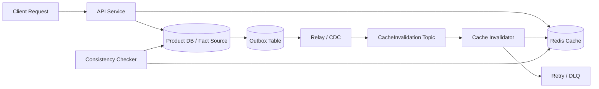

# Redis 缓存一致性与双写治理

## 面试定位

Redis 缓存一致性是后端面试里最容易被答浅的题。很多回答停在“先更新数据库，再删除缓存”，但生产系统真正难的是删除失败怎么办、并发旧值回填怎么办、缓存失效事件积压怎么办、用户能接受多久旧值、指标如何证明一致性正在收敛。

一个成熟回答要先把边界讲清：Redis 不是事实源，数据库、配置中心或搜索索引背后的主数据才是事实源。缓存一致性不是把 Redis 和数据库做成强一致事务，而是控制不一致窗口，并且让旧值、删除失败、回源风暴和补偿过程可观测。

## 一句话定义

缓存一致性是让 Redis 中的读模型与数据库事实源在业务可接受的时间窗口内收敛。双写治理是围绕写库、删缓存、事件失效、版本校验、补偿巡检和降级策略构建的一条工程链路。

反例是把 Redis 当主库写入，然后再异步同步数据库。这个做法不适合订单、权限、库存、余额、价格这类需要事实源约束的业务，因为 Redis 的过期、淘汰、主从切换和误删都可能让事实状态不可恢复。

## 架构与运行机制



图 1 展示的是生产里更完整的缓存一致性链路：读请求走 cache-aside，写请求落数据库事实源，同时通过 outbox、MQ 或 CDC 发出缓存失效事件。图中 Invalidator 删除缓存失败时不能只打印日志，而要进入 retry 或 DLQ；Checker 负责对账 DB 版本和缓存版本，用于确认旧值是否正在收敛。核心数据流是 read -> Redis -> DB fallback -> rebuild，以及 write -> DB -> outbox -> MQ -> delete cache。

这张图用于说明官方 Redis 文档只能给出缓存能力和命令语义，工程答案还要把 DB、MQ、补偿和观测连起来。面试官真正想听的是这条链路如何在失败时恢复。

## 为什么不是强一致

Redis 和数据库之间没有一个天然的本地事务。写数据库成功后，删除 Redis 可能失败；删除 Redis 成功后，DB 事务可能回滚；并发读可能在写库前读到旧值，随后把旧值回填到缓存；MQ 失效事件可能延迟、重复或进入死信。只要系统跨了两个存储，就一定要面对这些窗口。

所以缓存一致性题不能承诺“绝对一致”。更严谨的说法是：按照业务等级定义一致性 SLA。例如价格展示允许 3 秒内收敛，用户权限要求写后读强校验，推荐特征可以分钟级更新。不同 SLA 对应不同策略：短 TTL、绕缓存读 DB、版本校验、延迟双删、CDC 失效、后台刷新或人工补偿。

## 常见模式对比

| 模式 | 读路径 | 写路径 | 适合场景 | 主要风险 |
| --- | --- | --- | --- | --- |
| Cache Aside | 先读 Redis，miss 回源 DB | 先写 DB，再删除缓存 | 商品详情、配置、用户资料 | 删除失败和并发旧值回填 |
| Write Through | 应用写缓存，缓存同步写 DB | 写缓存即写 DB | 写路径可控、缓存组件支持代理 | 写延迟上升，组件耦合重 |
| Write Behind | 先写缓存，异步刷 DB | 后台批量落库 | 日志、计数、弱一致特征 | 进程或 Redis 故障导致事实源丢失 |
| Refresh Ahead | 后台提前刷新缓存 | 写路径可不直接处理缓存 | 热点配置、榜单、活动页 | 刷新任务失败会返回旧值 |
| CDC Invalidation | DB binlog 触发删缓存 | 写 DB 后由 CDC 发事件 | 多服务共享缓存失效 | CDC 延迟和重复事件治理 |
| Stale While Revalidate | 可短期返回旧值并后台刷新 | 写路径删除或标记旧值 | 高可用展示类接口 | 需要明确 stale TTL 和用户风险 |

这张表的重点不是背模式名，而是说明每个模式的机制、边界条件和误用风险。比如 Write Behind 对缓存友好，但不适合订单支付；Cache Aside 通用，但必须治理删除失败。

## 深入技术细节

标准 cache-aside 读链路是：根据 key schema 查 Redis；miss 后回源 DB；把结果组装成 value；写 Redis 并设置 TTL；返回给用户。写链路是：更新 DB 事实源；提交事务；发送缓存失效事件或直接删除缓存；删除失败进入 retry。这里的顺序很关键，通常推荐“写 DB 后删缓存”，而不是“写 DB 后 set 缓存”。

原因是 set 缓存更容易被并发旧值覆盖。一个典型并发窗口是：线程 A 准备更新商品价格；线程 B 在 A 提交前读到旧价格并回源；A 更新 DB 并 set 新缓存；B 最后把旧值写回 Redis。删除缓存虽然会让下一次读承担重建成本，但能减少旧值覆盖的概率。对强一致要求更高的场景，还要在 value 中带 `source_version`，写缓存前检查版本，拒绝旧版本覆盖新版本。

延迟双删的机制是：写 DB 后立即删除缓存，再等待一个短延迟后删除第二次。它能降低并发读回填旧值的概率，但不能证明绝对一致。延迟太短覆盖不了慢查询，太长又增加删除流量和维护复杂度。因此延迟双删只能作为降低风险的补丁，不能替代 outbox、MQ 失效、版本校验和补偿巡检。

更稳的生产方案是把缓存失效事件化。写业务数据时，在同一个本地事务中写 outbox 事件。Relay 或 CDC 把事件发布到 MQ。Invalidator 消费事件并删除 Redis key。删除失败时根据错误类型重试，超过阈值进入 DLQ。因为 MQ 语义通常是 at-least-once，Invalidator 必须幂等：重复删除同一个 key 是安全的，重复处理同一个 event_id 不应该产生副作用。

## 关键数据结构与协议

缓存 key 不是随手拼字符串。建议把 key 当成接口协议设计，至少包含业务域、实体类型、实体 id、视图维度和版本。例如：

```text
product:detail:v2:{product_id}
user:permission:v3:{tenant_id}:{user_id}
rag:doc-meta:v1:{workspace_id}:{doc_id}
```

value schema 也要能支撑排障：

| 字段 | 类型 | 作用 | 排障价值 |
| --- | --- | --- | --- |
| `data` | object | 实际业务数据 | 判断是否旧值或缺字段 |
| `schema_version` | string | value 结构版本 | 支持灰度与回滚 |
| `source_version` | number/string | DB 版本或更新时间 | 防止旧值覆盖新值 |
| `generated_at` | timestamp | 缓存生成时间 | 判断 stale 窗口 |
| `ttl_policy` | string | TTL 策略名 | 复盘过期与雪崩 |
| `trace_id` | string | 构建链路追踪 | 串联回源、删除和重建 |
| `build_reason` | string | miss、prewarm、refresh | 区分正常刷新和故障重建 |

失效事件也应有稳定字段：`event_id`、`aggregate_id`、`aggregate_type`、`source_version`、`changed_fields`、`cache_keys`、`occurred_at`、`retry_count`、`trace_id`。如果不直接携带 `cache_keys`，就要有一套从业务变更映射到 key 的规则，否则列表页、详情页、聚合页很容易漏删。

## 真实问题与排障

旧价格、旧权限或旧配置事故发生时，先不要急着改代码。第一步是界定影响面：哪些 key、哪些业务实体、哪些租户、哪个版本、从什么时候开始、是否只影响展示还是影响交易决策。第二步止血：临时绕过缓存读 DB、批量删除相关 key、关闭非核心入口、返回安全默认值，或把高风险接口切到强校验。第三步隔离：暂停异常 invalidator、暂停错误发布任务、限制补偿任务速率，避免修复动作打爆 Redis 或 DB。

根因定位沿链路走：DB 是否真的更新成功；outbox 是否写入；Relay 是否发布；MQ 是否积压；Invalidator 是否消费；Redis delete 是否失败；是否有并发旧值回填；value 的 `source_version` 是否低于 DB；是否有发布脚本误删或误预热。回滚策略通常不是回滚 DB，而是回滚缓存 schema、关闭新失效逻辑、删除错误 key 或恢复旧的 key 映射。回归要沉淀一个最小复现：并发读写、删除失败、MQ 延迟和慢回源同时出现时，旧值是否能在 SLA 内收敛。

## 系统设计案例

设计一个商品详情缓存系统时，架构可以拆成 API、Redis、Product DB、Outbox、MQ、Invalidator 和 Consistency Checker。数据流上，读请求先访问 Redis，miss 后回源 DB 并重建；写请求先提交 DB，再写 outbox 事件，事件消费者删除详情页、列表页和活动页相关 key。关键取舍是：删除缓存会增加下一次读的重建成本，但比直接更新缓存更能降低旧值覆盖风险；异步失效降低写路径延迟，但要承担 MQ 积压和删除失败补偿。

面试追问通常会落到三点：如何发现旧值、如何处理删除失败、如何证明修复有效。回答时要把指标讲清楚：`stale_read_rate` 反映旧值，`cache_delete_fail_count` 反映删除失败，`event_publish_lag` 反映失效链路延迟，`backend_fallback_qps` 和 DB p95 反映缓存策略是否正在伤害事实源。

## 项目化表达

如果你在项目里讲商品详情缓存，可以这样表达：商品 DB 是事实源，Redis 保存详情读模型，key 带业务视图和版本，value 带 `source_version`。后台改价时在同一事务写 outbox，Invalidator 删除详情、列表和活动页相关 key。删除失败进入 retry 和 DLQ，巡检任务按 DB `updated_at` 抽样对账缓存版本。指标看 `cache_hit_rate`、`stale_read_rate`、`cache_delete_fail_count`、`event_publish_lag`、`backend_fallback_qps` 和 DB p95。

这比“更新数据库后删缓存”更像生产经验，因为它回答了上线后怎么发现旧值、怎么止血、怎么补偿、怎么证明修复有效。迁移到 AI 项目也成立：RAG 文档元数据、用户权限、模型路由配置、工具开关都可能进 Redis；缓存旧值会导致错误检索、错误授权或错误模型选择。

## 边界条件与反例

不是所有数据都适合缓存。余额、库存扣减、支付状态、权限变更后的强校验点，不应该只依赖 Redis。可以用缓存提升读性能，但最终决策前要回查事实源或校验版本。

也不要把所有删除都做成 `KEYS pattern` 扫描。生产 Redis 上 `KEYS` 可能阻塞实例，批量删除要通过索引表、SCAN 分批、异步任务或预先维护 key 映射。对于多租户系统，key 还要包含 tenant/workspace，防止权限和缓存污染。

空值缓存不能用于下游错误。DB 确认不存在可以短 TTL 缓存空值；DB 超时、限流、网络错误不能缓存为空，否则会把短暂故障变成长期错误结果。

## 深问准备

1. 为什么删缓存比更新缓存更常见？答并发旧值覆盖、事实源重建和多字段聚合一致性。
2. 延迟双删能不能保证一致？答不能，只是缩小窗口，还需要版本、事件和补偿。
3. 删除失败怎么办？答 outbox、retry、DLQ、巡检、指标和人工修复。
4. 如何判断业务是否需要强一致？答按用户风险、资金风险、权限风险、展示容忍度和 SLA 分级。
5. 如何做上线验证？答压测并发读写、故障注入 delete 失败、MQ 延迟、DB 慢查询和旧值回归用例。

## 来源与延伸阅读

- Redis 官方文档：用于确认 Redis key、TTL、过期和数据结构的语义边界。
- Kafka / MQ 官方文档：用于支持失效事件的 at-least-once、重试和消费积压治理。
- MySQL InnoDB 官方文档：用于说明数据库事实源、事务提交和索引回源查询的边界。
