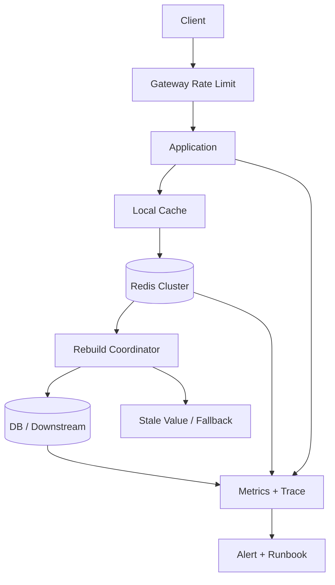

# Redis 热 key、击穿、穿透与雪崩治理

## 面试定位

Redis 稳定性题的核心不是背四个名词，而是把故障模式区分清楚，并能给出生产止血、根因定位、回滚、降级、隔离和回归方案。面试官问“缓存击穿怎么办”，通常会继续追问热 key 怎么发现、分布式锁有什么坑、穿透和下游错误怎么区分、雪崩时如何保护 DB。

高质量回答要先分类：热 key 是访问集中；击穿是热点 key 失效后并发回源；穿透是不存在的数据持续打到 DB；雪崩是大量 key 同时失效或缓存整体不可用造成大面积回源。四类问题的机制不同，解决方案也不同。

## 一句话定义

热 key 治理解决的是访问分布和单点压力；击穿治理解决的是热点 key 重建并发；穿透治理解决的是无效请求绕过缓存；雪崩治理解决的是大范围缓存同时失效或 Redis 故障后的系统保护。

反例是所有问题都回答“加分布式锁”。锁最多控制同一 key 的重建并发，不能过滤不存在的 id，不能解决大量 key 同时过期，也不能处理 Redis 整体不可用。误用锁还可能制造死锁、尾延迟和旧值覆盖。

## 架构与运行机制

图 1 展示的是高并发读链路的保护层次：网关限流先保护入口，本地缓存吸收热点，Redis 承担共享缓存，重建协调器控制回源，DB 是最后事实源。图中 Metrics 和 Trace 不是装饰，而是用来定位 hot key、cache miss、backend fallback QPS、Redis p95、DB p95 和降级次数。核心数据流是 request -> filter -> local cache -> Redis -> rebuild lock -> DB -> stale/fallback。

这张图用于说明官方 Redis 文档给的是存储能力，生产系统还要把限流、降级、观测、回源控制和事故剧本组合起来。没有这些层，缓存一失效，所有压力就会落到 DB。

## 四类问题对比

| 问题 | 触发机制 | 典型表现 | 主要风险 | 常用治理 |
| --- | --- | --- | --- | --- |
| 热 key | 少数 key QPS 过高 | 单分片或单接口延迟升高 | Redis 分片、网络或应用线程被打满 | 本地缓存、key 拆分、热点识别、限流 |
| 击穿 | 热点 key 过期或被删 | 大量请求同时 miss 回源 | DB p95 飙升，重试放大 | singleflight、互斥重建、stale value、预热 |
| 穿透 | 查询不存在或非法 id | 缓存 miss 且 DB 查无结果 | 随机 id 攻击或异常流量打 DB | 参数校验、Bloom filter、空值短 TTL |
| 雪崩 | 大量 key 同时失效或 Redis 故障 | miss rate 和 fallback QPS 同时升高 | DB 和下游整体过载 | TTL jitter、分批失效、限流、熔断、降级 |
| 大 key | 单个 key value 过大 | 网络传输、序列化、删除慢 | 阻塞、内存碎片、慢命令 | 拆分结构、异步删除、大小监控 |
| 慢命令 | 命令复杂度高或数据大 | Redis latency p95 升高 | 全实例受影响 | 禁用高危命令、slowlog、SCAN 分批 |

这张表要在面试里讲出来，因为它能证明你不是用一个答案套所有问题。尤其是穿透和击穿经常被混淆：穿透是数据不存在，击穿是热点数据存在但缓存失效。

## 深入技术细节

热 key 发现不能只看 Redis 平均 CPU 或总 QPS。平均值会掩盖单 key、单分片、单连接或单接口的集中压力。更稳的方式是从客户端埋点、代理层采样、Redis command stats、slowlog、网络流量和 trace 标签聚合 per-key QPS。为了保护隐私和避免高基数字段爆炸，生产上通常记录 key hash、业务前缀、实体类型和采样计数，而不是完整 key。

击穿治理的关键是“同一时刻只让少量请求回源”。同进程可以用 singleflight；跨进程可以用 Redis 锁或专门的重建队列。锁一定要有过期时间、owner token 和版本校验。否则锁持有者超时后，另一个请求完成重建，旧持有者最后写回旧值，就会覆盖新缓存。等待锁的请求也不能无限等待，应该短等待、返回 stale value、快速失败或降级。

穿透治理要区分“确认不存在”和“下游错误”。如果 DB 返回 not_found，可以写短 TTL 空值缓存；如果 DB 超时、限流或内部错误，不能缓存为空，否则会把故障结果写进缓存。Bloom filter 可以过滤明显不存在的 id，但它有误判，也需要随数据创建、删除和重建更新。对权限不可见的资源也不能简单缓存为不存在，否则可能把权限状态和数据状态混淆。

雪崩治理要从过期策略和整体故障两边处理。过期策略上，TTL 加随机抖动、热点 key 提前预热、发布时分批删除，避免同一秒大量 key 失效。整体故障上，要有回源限流、熔断、降级、stale cache、本地缓存和只读默认值。事故现场第一目标是保护 DB 和核心链路，不是立刻把所有缓存重建回来。

## 关键数据结构与协议

热点治理需要一套观测字段，而不是只看日志字符串：

| 字段 | 来源 | 作用 | 注意事项 |
| --- | --- | --- | --- |
| `cache_key_hash` | 客户端/代理 | 聚合单 key QPS | 避免暴露完整业务 key |
| `key_prefix` | 客户端 | 区分业务域 | 控制基数，避免指标爆炸 |
| `cache_status` | 应用 | hit、miss、stale、bypass | 串联 trace 与接口延迟 |
| `fallback_qps` | 应用 | 统计回源压力 | DB 保护的核心指标 |
| `rebuild_owner` | 重建协调器 | 判断谁在回源 | 排查锁等待和超时 |
| `source_version` | value schema | 防止旧值覆盖 | 和 DB version 对账 |
| `fallback_reason` | 降级层 | 解释返回旧值或默认值 | 事故复盘必备 |
| `lock_wait_ms` | 重建协调器 | 判断击穿恢复成本 | 控制 p95 和超时 |

重建锁协议至少包含 `lock_key`、`owner_token`、`expire_at`、`source_version` 和 `max_wait_ms`。如果使用 Redis 分布式锁，要理解官方分布式锁文档强调的随机 value、过期时间和释放时校验 owner。对于强一致场景，还要考虑 fencing token 或数据库版本号，避免锁过期后的旧写覆盖。

## 真实问题与排障

假设活动页突然 DB p95 从 30ms 升到 2s，Redis miss rate 和 backend_fallback_qps 同时升高。第一步看影响面：哪些接口、哪些 key 前缀、哪个活动、是否单分片、是否同一发布时间、是否伴随 Redis latency 或 slowlog。第二步止血：网关限流异常入口，返回 stale value，关闭非核心推荐模块，预热活动核心 key，暂停批量删除任务，给回源队列限速。第三步隔离：把随机 id 请求挡在参数校验和 Bloom filter 之前，把毒性流量和正常用户流量分开，必要时对热点 key 做本地缓存或临时固定值。

根因定位按链路查：是否发布脚本把 TTL 设成同一秒；是否活动开始前未预热；是否某个 key value 变成大 key；是否重建锁没有生效；是否 DB 慢查询导致锁等待过长；是否 Redis 分片迁移或网络抖动；是否穿透流量伪装成正常 miss。回滚不一定是代码回滚，可能是恢复旧 TTL 策略、撤销批量删除、切换到旧 key 版本、关闭新活动入口或把缓存读强制降级到本地静态配置。回归要压测四类故障：热点 key、击穿、穿透、雪崩，并把指标阈值写进告警。

## 系统设计案例

设计一个高并发活动页缓存系统时，架构上用 Gateway 做入口限流，应用内本地缓存吸收毫秒级热点，Redis Cluster 做共享缓存，Rebuild Coordinator 控制回源，Fallback Layer 返回旧值或默认配置，Observability Stack 汇总指标和 trace。数据流上，请求先经过参数校验和限流，再查本地缓存与 Redis；miss 后只有持有重建权的请求访问 DB，其它请求短等待或返回 stale value。

这里的取舍很典型：本地缓存降低 Redis 压力，但会增加多实例失效成本；返回旧值保护可用性，但要限制 stale 时间；互斥重建保护 DB，但会增加等待时间；Bloom filter 降低穿透，但会带来误判和重建成本。面试追问通常会问如何发现热 key、锁过期怎么办、空值缓存会不会污染结果，要把字段、指标和回归压测一起讲。

## 项目化表达

项目里可以讲一个活动页治理案例：活动配置、商品榜单和优惠规则都是热点读，应用先读本地缓存，再读 Redis，miss 后通过 singleflight 回源。value 带 `source_version` 和 `generated_at`，可以返回 30 秒内旧值。发布系统分批失效 key，TTL 加 10% 随机抖动。Prometheus 监控 `hot_key_qps`、`cache_miss_rate`、`backend_fallback_qps`、`redis_latency_p95`、`db_latency_p95`、`stale_return_count` 和 `degrade_count`。上线前做压测：模拟热点 key 同时过期、随机 id 穿透、Redis 分片高延迟和 DB 限流。

这段表达比“加缓存、加锁、加限流”更有说服力，因为它说明了指标、降级、失败案例和改进闭环。AI 项目也能迁移：模型路由配置、Agent 工具权限、热门知识库 chunk、RAG 检索结果摘要都可能成为热点缓存；如果没有 Redis 稳定性治理，模型服务和数据库会被 miss 风暴拖垮。

## 边界条件与反例

本地缓存不是万能。它能降低 Redis 压力，但会带来多实例一致性问题。权限、价格、库存这类高风险数据不能无限 stale；必须给 stale value 设置最大年龄，并在关键操作前回查事实源。

Bloom filter 也不是免费。它有误判，可能把存在的数据误判为不存在的概率虽然低但不能忽略；删除数据后 Bloom filter 不易同步删除，通常需要 counting bloom、周期重建或业务容忍。对于租户隔离场景，还要避免一个租户的 filter 状态影响另一个租户。

空值缓存要小心使用。`not_found` 可以短 TTL 缓存；`timeout`、`rate_limited`、`permission_denied` 和 `internal_error` 不能混成空值。否则事故发生后，系统会在缓存里保存错误结论。

## 生产验收清单

上线前要先定义缓存对象的风险等级。活动文案、推荐摘要、RAG 热门 chunk 这类读模型可以短时间 stale；库存、价格、权限、支付状态不能只靠旧缓存兜底。每个 key 前缀都要写清事实源、最大 stale 时间、TTL 抖动范围、是否允许本地缓存、是否允许空值缓存、失效事件来源和人工降级开关。没有这张清单，所谓“缓存治理”很容易变成事故时临时猜策略。

压测要覆盖四类故障，而不是只测命中率。热 key 场景看单 key QPS、Redis 分片 p95、应用线程池占用和本地缓存命中；击穿场景让热点 key 同时过期，观察回源并发、锁等待和 stale_return_count；穿透场景用随机 id 和非法参数验证校验、Bloom filter、空值缓存和限流；雪崩场景批量失效 key 或模拟 Redis 高延迟，确认 DB fallback QPS 被限制在安全水位内。

发布后要把指标接进同一张事故面板：`cache_hit_rate`、`cache_miss_rate`、`hot_key_qps`、`backend_fallback_qps`、`redis_latency_p95`、`slowlog_count`、`big_key_count`、`lock_wait_p95`、`stale_return_count`、`degrade_count` 和 `db_latency_p95`。告警不能只报 Redis CPU 高，而要能回答“是热 key、击穿、穿透、雪崩、大 key 还是慢命令”。这样面试回答才从概念分类上升到可运行的稳定性方案。

## 深问准备

1. 如何发现热 key？答客户端采样、代理聚合、Redis slowlog、trace 标签和 per-key QPS。
2. 击穿时为什么不能所有请求等锁？答会拖高 p95 和线程占用，要短等待、旧值、降级或快速失败。
3. 穿透和击穿怎么区分？答穿透是数据不存在或非法请求，击穿是热点数据存在但缓存失效。
4. 雪崩如何提前预防？答 TTL jitter、分批失效、预热、回源限流、多级缓存和降级开关。
5. 大 key 怎么治理？答拆分结构、控制 value 大小、避免大范围删除阻塞、监控 big key count。
6. 分布式锁如何避免旧值覆盖？答 owner token、过期时间、版本校验、fencing token 或 DB source_version。

## 来源与延伸阅读

- [Redis Documentation](https://redis.io/docs/latest/)：用于确认 key、TTL、数据结构、过期语义和运行边界。
- [Redis SLOWLOG](https://redis.io/docs/latest/commands/slowlog/)：用于说明慢命令观测、热点排查和命令级延迟证据。
- [Redis: Distributed Locks with Redis](https://redis.io/docs/latest/develop/use/patterns/distributed-locks/)：用于说明锁 value、过期时间、释放校验和互斥重建的语义边界。
- [Prometheus Documentation](https://prometheus.io/docs/introduction/overview/)：用于支持缓存命中率、回源 QPS、Redis p95 和 DB p95 的指标采集、告警和事故看板设计。
- [OpenTelemetry Documentation](https://opentelemetry.io/docs/)：用于支持 trace 中记录 cache_status、fallback_reason、source_version 和降级路径。
