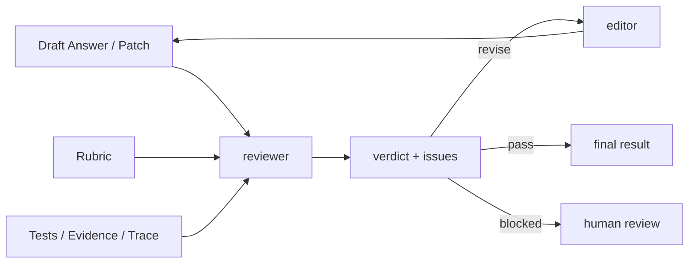
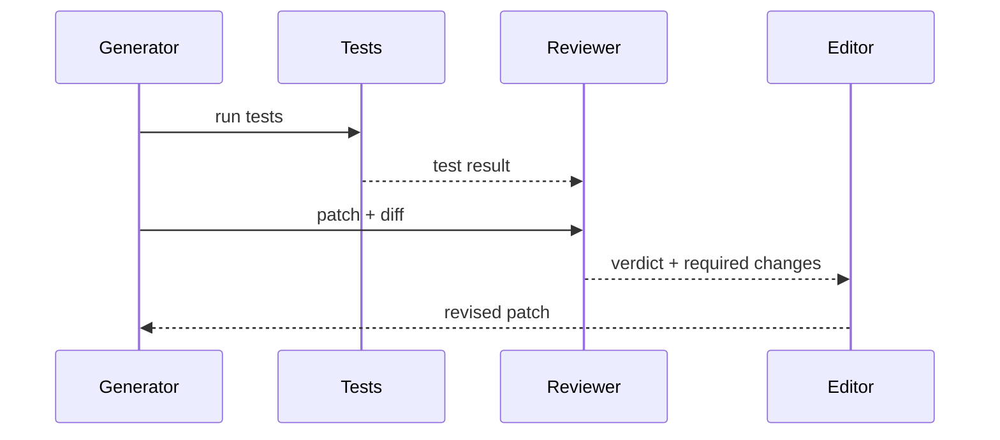

# Reflection 与自我审查

## 面试定位

Reflection 题目不能答成“让模型自己检查自己”。面试官想看你是否理解 reviewer、rubric、verdict、retry、停止条件和外部验证。没有外部证据的自我反思，很容易把错误强化得更有说服力。

## 一句话定义

Reflection 是让 Agent 对中间结果或最终结果进行批判、修订和验证的机制。生产系统里它应该输出结构化 verdict，而不是泛泛一句“再检查一下”。

它适合写作、代码修复、研究总结和复杂答案打磨，但不能替代工具验证、测试、引用检查和人工评审。

## 为什么需要它

开放任务往往第一版结果不够完整。Reflection 可以让系统发现遗漏、约束不满足、证据不足和安全风险。但如果 reviewer 没有 rubric，或者 retry 没有上限，Agent 会在同一错误上循环。

## 核心架构

图里 reviewer 不是凭感觉打分，它必须读取 rubric 和外部证据。verdict 要能驱动修订、停止或人工接管。

## 架构与运行机制

数据流是：生成器产出 draft，reviewer 按 rubric 检查 correctness、completeness、grounding、safety 和 constraint satisfaction，输出结构化 verdict。Editor 根据 issues 修订，Verifier 再用测试、引用或规则确认。

## 运行机制

Reflection 的输出建议包含 `verdict`、`score`、`issues`、`evidence`、`required_changes` 和 `stop_reason`。retry 要有最大次数和差异记录。连续两次没有实质改进，应停止或转人工。

## 关键设计取舍

| 设计点 | 推荐做法 | 收益 | 风险 |
| :--- | :--- | :--- | :--- |
| Rubric | 明确评分维度 | 评审稳定 | 维护成本 |
| Reviewer | 与 generator 分离 | 减少盲点 | 成本增加 |
| 外部证据 | 测试、引用、trace | 防自嗨 | 依赖工具质量 |
| Retry 上限 | 限次数和预算 | 防循环 | 可能提前停止 |
| Human review | 高风险或僵局接管 | 安全 | 人力成本 |

## 生产落地细节

代码任务要以测试和 diff 为证据；RAG 任务要以 citation 和 claim-to-evidence 为证据；Web Agent 要以 DOM/screenshot 状态为证据。不要只让模型评价自己的自然语言。

指标包括 `reviewer_agreement_rate`、`revision_success_rate`、`false_pass_rate`、`retry_count`、`human_escalation_rate` 和 `regression_pass_rate`。

## 系统设计案例

Coding Agent 生成 patch 后，reviewer 检查是否满足用户约束、是否改了无关文件、测试是否通过、是否引入风险。Reviewer 不直接说“好/坏”，而是输出可执行修改清单。

## 真实问题与排障

如果 reflection 后结果更差，先看 rubric 是否模糊，再看 reviewer 是否拿到了真实证据，最后看 retry 是否无上限。要记录每次 revision diff 和 verdict，否则无法知道改坏从哪一步开始。

## 常见误区与排障

常见误区是“让模型再想想”就叫 reflection。另一个误区是用模型自评替代测试和引用验证。排障要看 verdict 是否结构化、是否引用 evidence、是否有停止条件。

## 面试追问

1. Reflection 什么时候有效？
2. 如何避免错误自我强化？
3. reviewer 的 rubric 怎么设计？
4. retry 什么时候停止？

## 项目化表达

Paper Agent 可以用 reflection 检查 unsupported claims。Coding Agent 可以用 reviewer 检查 patch 和测试。Travel Agent 可以用 policy reviewer 检查预算、时间和风险。

## 深入技术细节

Reflection 真正落地时通常不是“模型自己再想一遍”，而是一个有输入契约的 reviewer pipeline。输入包括 draft、rubric、task constraints、evidence refs、tool results、trace span 和 risk policy。Reviewer 输出结构化 `verdict`，例如 pass、revise、blocked、needs_human。每条 issue 要有 `issue_id`、`severity`、`category`、`evidence_ref`、`required_change` 和 `owner`，否则 Editor 无法稳定修复。

生产中要把 reviewer 与 generator 解耦。可以是同模型不同 prompt，也可以是不同模型、规则 verifier 或人工 reviewer。关键是 reviewer 必须看到外部证据：代码任务看 diff 和测试，RAG 任务看 claim-to-evidence，Web Agent 看 before/after observation，Travel Agent 看 constraints verifier。没有证据的 reflection 容易把错误说得更自信。

Retry 需要停止条件。常见 stop policy 包括 max_revision_count、no_improvement_count、new_issue_count、cost_budget、human_escalation_threshold。连续两轮修改没有减少严重问题，应停止或转人工。指标包括 `revision_success_rate`、`false_pass_rate`、`false_block_rate`、`retry_count_p95`、`human_escalation_rate`、`reviewer_agreement_rate`。

## 关键数据结构与协议

| 对象 | 关键字段 | 用途 | 边界 |
| --- | --- | --- | --- |
| ReviewRequest | draft_ref、rubric_id、evidence_refs、constraints | 给 reviewer 明确输入 | 不传无关完整历史 |
| ReviewVerdict | verdict、score、issues、stop_reason | 驱动修订或停止 | 不能只有自然语言 |
| Issue | severity、category、evidence_ref、required_change | 可执行修复单元 | 必须可追踪 |
| RevisionTrace | revision_id、diff_ref、old_score、new_score | 对比是否改善 | 防循环修改 |
| Escalation | reason、risk_level、human_owner | 转人工 | 高风险必留审计 |

典型协议是 Generator 产出 draft，Reviewer 读取 rubric 和 evidence，Editor 按 issues 修订，Verifier 用测试或规则确认。高风险任务中 reviewer 只能建议，最终 release gate 由 verifier 或人工确认。这个边界能防止 reviewer 过度自信。

## 深问准备

- Reflection 什么时候有效？当任务有明确 rubric、外部证据和可修订产物时有效。
- 如何避免错误自我强化？让 reviewer 读取测试、citation、trace 或人工标注，不只读模型草稿。
- reviewer 的 rubric 怎么设计？按 correctness、grounding、constraint、safety、maintainability、coverage 分维度。
- retry 什么时候停止？超过预算、严重问题不下降、新问题增加或触发高风险策略时。
- Reflection 和 Eval 的区别？Reflection 是运行时修订机制，Eval 是离线或门禁评测；二者可以共用 rubric。

## 来源与延伸阅读

- [Anthropic Building effective agents](https://www.anthropic.com/engineering/building-effective-agents)
- [AgentGuide Agent 学习地图](https://github.com/adongwanai/AgentGuide/blob/main/docs/00-getting-started/01-agent-map.md)
