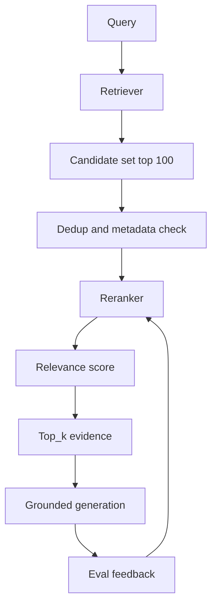

# Rerank 与证据筛选

## 一句话定义

Rerank 是在检索产生 candidate set 后，用 cross-encoder、专门 reranker 或 LLM judge 重新计算 relevance score，把更能回答问题的 top_k 证据送入上下文，同时控制 latency 与 cost。

## 面试定位

面试官问 rerank，通常不是问“有没有用重排模型”。真正考察的是你是否理解召回与精排的职责边界，以及如何证明精排提升了答案质量。

回答要覆盖架构、数据流、指标、取舍和追问。你需要说明候选集大小、排序目标、证据质量、延迟预算和失败归因。

## 为什么需要它

初始检索追求 recall，宁愿多召回一些可能相关的片段。生成阶段需要 precision，因为上下文窗口有限，错误证据会直接导致幻觉。

Rerank 处在二者之间。它接收来自 BM25、vector search 或 hybrid search 的候选，按 query-candidate 的相关性、answerability、时效性和权限重新排序，最后输出 evidence pack。

## 核心架构

图 1：Rerank 在召回候选、证据筛选和生成反馈之间的位置。

这张图的重点是边界：Retriever 负责尽量把可能相关的材料放进 candidate set，Dedup and metadata check 负责去重、权限和版本过滤，Reranker 负责重算 query-candidate 的证据价值。Top_k evidence 进入生成前必须保留 evidence_id，Eval feedback 回到 reranker 的 hard negative 和样本集，而不是让生成模型独自承担所有错答责任。

| Rerank 类型 | 优点 | 代价 | 适用场景 |
| :--- | :--- | :--- | :--- |
| cross-encoder | 相关性强、稳定 | 推理成本高 | top 50 到 top 200 |
| 专门 reranker API | 工程接入快 | 供应商和费用依赖 | 快速上线 |
| LLM-as-reranker | 可加入复杂 rubric | 延迟和 judge bias | 高价值问答 |
| 规则 rerank | 可解释、便宜 | 覆盖有限 | 时间、权限、来源加权 |

## 架构与运行机制

Rerank 前要先去重和过滤。重复 chunk 会浪费精排预算，无权限或过期文档不能进入模型判断。Reranker 的输入应包含 query、候选文本、metadata、source 和可能的 section title。

排序目标必须和业务一致。技术文档问答看 answerability 和版本正确性，论文综述看权威性和覆盖度，客服知识库看时效和政策匹配。不要把“语义相似”误当成“能回答”。

## 运行机制

1. Retriever 召回较宽 candidate set。
2. 系统做去重、权限过滤和 chunk 合并。
3. Reranker 为 query-candidate 对打 relevance score。
4. 根据 score、metadata 和业务规则选 top_k。
5. 生成阶段只使用入选证据，并保留 evidence_id。
6. 离线评测比较 rerank 前后的 precision、answer success、latency 和 cost。

## 关键设计取舍

| 取舍点 | 更高质量 | 更低成本 | 建议 |
| --- | --- | --- | --- |
| candidate set | top 100 或更多 | top 20 | 从召回消融确定 |
| 模型选择 | cross-encoder/LLM | 规则或轻量模型 | 分层 rerank |
| top_k 输出 | 少而准 | 多而全 | 问答场景偏少 |
| 缓存 | 省成本 | 需要失效策略 | 对热门 query 开启 |

## 生产落地细节

- 记录每条候选的 retriever_type、original_rank、relevance score、rerank_model 和 selected_reason。
- top_k 不是固定魔法数，要按答案长度、chunk 粒度和任务类型调。
- latency 预算要拆开看 retrieval、rerank、generation。
- 对 reranker 做 golden set，包含相似但不能回答的 hard negative。
- 指标包括 precision@k、nDCG、answerability_rate、citation_precision、latency_p95 和 cost_per_success。

更细一点，生产排障要保存“未入选但高分”的候选。很多线上问题不是 top_k 选错，而是正确证据排在第 k+1 或被 metadata filter 提前过滤。保存 rejected candidates、filter_reason、rerank_score 和 selected_reason，可以在错答后快速判断是召回池、元数据过滤、重排目标还是上下文拼接出了问题。

## 系统设计案例

在企业 RAG 中，hybrid search 召回 80 条候选。很多候选只提到关键词，却不能回答用户问题。Rerank 使用 query 和 chunk 做成 pair，优先选择含具体步骤、版本匹配、权限正确的片段。

数据流是：候选进入 reranker，模型输出 relevance score，系统选 top_k 并生成 evidence pack。生成后 verifier 发现 unsupported claim 时，把对应查询加入 hard negative 集合，改善下一轮评测。

## 真实问题与排障

如果 rerank 后答案变差，先看候选集中是否本来就没有正确证据。若没有，是 retrieval 问题；若有但被降权，是 reranker 目标或样本问题。不要把所有问题都归因给生成模型。

如果延迟超标，先缩小 candidate set，或者采用两阶段 rerank：轻量规则先筛，再用 cross-encoder 精排。

## 常见误区与排障

- 认为 rerank 可以弥补召回完全漏掉的证据。
- 排序目标只看语义相似，不看 answerability。
- top_k 固定不调，忽略 chunk 粒度。
- 没有 hard negative，线上相似噪声很多。
- 只报准确率提升，不报 latency 和 cost。

## 面试追问

- rerank 与 retrieve 的边界是什么？
- candidate set 多大合适？
- 如何构造 rerank 的评测集？
- rerank 带来的延迟如何控制？
- LLM-as-reranker 有哪些风险？

## 项目化表达

项目里可以说：“我把检索分成召回和证据筛选两层。召回保证不漏，rerank 保证进入上下文的证据能回答问题。每条证据都有 relevance score 和 selected_reason，并用 precision@k 与 citation_precision 验证。”

## 深入技术细节

Rerank 的输入不应该只是 query 和文本片段，还应包含 metadata：`source_type`、`doc_version`、`section_path`、`timestamp`、`permission_scope`、`retriever_type`、`original_rank` 和 `chunk_parent_id`。这些字段让排序目标从“语义相似”升级为“能回答、可信、未过期、可引用”。例如政策问答要优先最新版本，论文综述要考虑出处和实验段落，客服知识库要先过滤权限。

Rerank 失败要按候选链路归因。如果正确证据不在 candidate set，问题在 retrieval；如果在候选里但被降权，问题在 reranker 目标或训练/评测样本；如果被选中但答案仍错，问题可能在 context builder、generator 或 citation verifier。这个拆分能避免把所有错答都甩给生成模型。

## 关键数据结构与协议

| 字段 | 作用 | 诊断价值 |
| --- | --- | --- |
| `candidate_id` | 候选证据编号 | 连接召回和精排 |
| `original_rank` | 召回排序 | 判断 rerank 是否改善 |
| `rerank_score` | 精排得分 | 控制 top_k |
| `selected_reason` | 入选原因 | 支持可解释性 |
| `answerability_label` | 能否回答 | 构造 hard negative |
| `rerank_model` | 模型版本 | 归因灰度回归 |

协议上要把 rerank eval 和最终 answer eval 分开。Rerank 先看 precision@k、nDCG、answerability_rate；生成后再看 citation_precision、unsupported_claim_rate 和 answer_success_rate。否则无法知道质量提升来自证据变好还是生成偶然变好。

## 深问准备

被问“candidate set 多大合适”时，可以回答从召回消融确定：先保证正确证据进入候选，再在延迟预算下选择 top50/top100 等规模。候选越大 recall 越好，但 rerank 成本和 p95 latency 增加。

被问“LLM-as-reranker 风险”时，要讲延迟、成本、judge bias 和不可重复性。高价值复杂任务可以用 LLM judge，但应记录 judge prompt、model version 和 verdict reason，并用 hard negative 校准。

## 来源与延伸阅读

- [Cohere Rerank 文档](https://docs.cohere.com/docs/rerank-overview)：支撑 query-document 相关性重算、reranker 接口和候选重排的基础概念。
- [Elasticsearch RRF 文档](https://www.elastic.co/docs/reference/elasticsearch/rest-apis/reciprocal-rank-fusion)：支撑 hybrid search 多路召回融合与排序策略的工程实现背景。
- [OpenAI Cookbook: Search and RAG examples](https://cookbook.openai.com/)：支撑“检索、证据选择、生成与评测要分层设计”的 RAG 工程实践。
- [Anthropic: Building effective agents](https://www.anthropic.com/engineering/building-effective-agents)：支撑把 RAG、工具调用、评测和人工反馈放在可观测 workflow 中治理。
