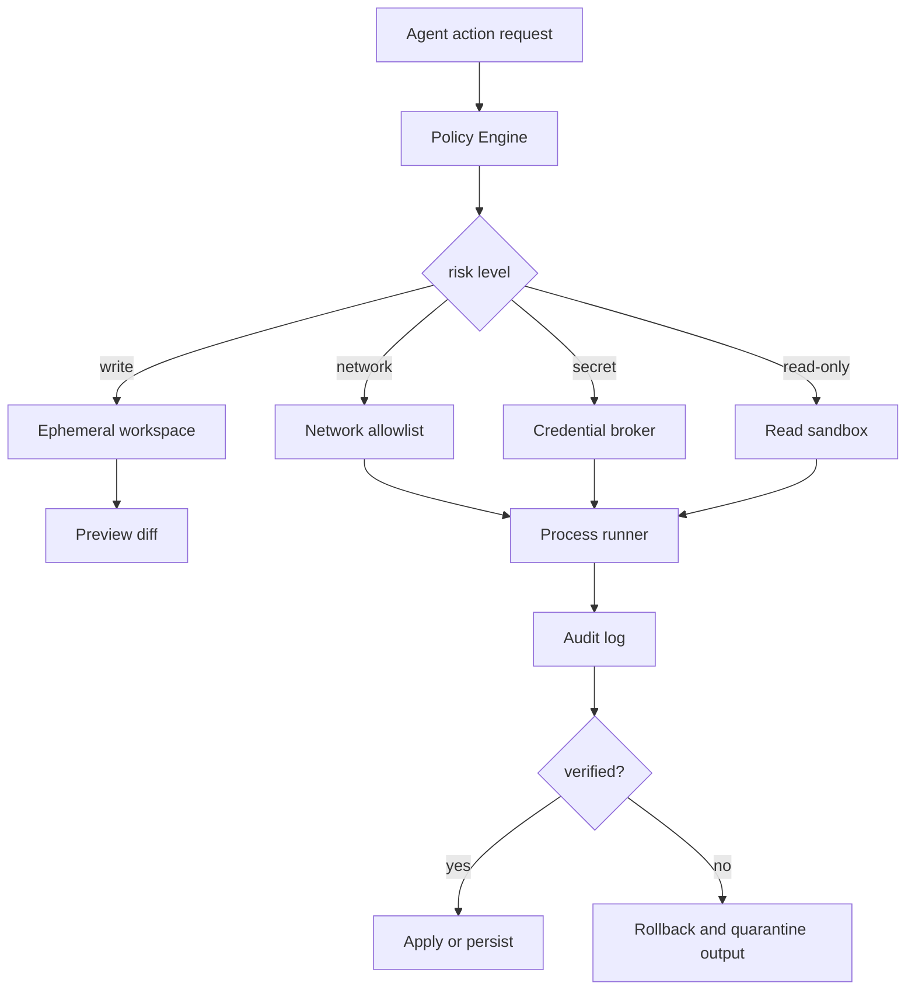

# Sandbox 与执行隔离

## 一句话定义

Sandbox 是给 Agent 执行代码、浏览器动作或文件操作时建立 filesystem、network、process、credential 和 policy 隔离，并通过 audit、preview、rollback 控制副作用。

## 面试定位

这道题考的是“模型动作如何落到安全运行时”。面试官不只关心你知道 Docker 或 VM，而是看你能否把工具权限、文件系统隔离、网络白名单、凭据管理、审计和恢复设计成一条完整数据流。

Agent 有写文件、跑测试、打开浏览器或调用命令的能力后，sandbox 就不是可选项。没有隔离的执行环境，会把模型错误、恶意输入和依赖供应链风险直接带到用户机器或生产系统。

## 为什么需要它

模型可能误删文件、执行不可信脚本、访问外部网络、读取敏感凭据或把数据上传到未知服务。即使模型本身没有恶意，RAG 文档、网页或用户上传代码也可能诱导它执行危险命令。

Sandbox 的目标不是让所有操作都无法失败，而是让失败的影响被限制、可观察、可回滚。

## 核心架构

图 1：Sandbox 将 Agent 动作请求转换为受策略约束的执行环境。

图中 Policy Engine 是控制面，负责根据路径、网络、凭据和风险选择只读、临时工作区、网络白名单或凭据代理。Process runner 是执行面，所有 stdout、stderr、exit code、文件 diff、网络请求和资源用量都进入 Audit log。Verified 之后才能 apply 或 persist；验证失败时要 rollback，并把不可信输出隔离成 artifact，而不是继续塞回模型上下文。

| 隔离面 | 控制方式 | 典型指标 |
| --- | --- | --- |
| filesystem | 只读挂载、临时目录、diff preview | unauthorized_write_block |
| network | 默认关闭、域名白名单、代理审计 | egress_denial_rate |
| process | 超时、资源限额、子进程隔离 | timeout_rate、cpu_limit_hit |
| credential | 短期 token、最小权限、按需注入 | secret_access_denial |
| policy | riskLevel、approval、allowlist | approval_required_rate |
| recovery | snapshot、rollback、artifact quarantine | rollback_success_rate |

## 架构与运行机制

Sandbox 的核心是把“模型想做什么”转成“宿主允许什么”。Policy Engine 根据动作类型、路径、网络目标、凭据需求和风险等级决定执行环境。低风险读操作可以直接在只读 sandbox 里运行；写操作先进入 ephemeral workspace，产生 diff preview；高风险网络和凭据访问必须显式授权。

运行结果不能直接信任。系统要记录 stdout、stderr、exit code、文件 diff、网络请求、耗时和资源用量。只有通过 verifier 或用户确认的结果，才可以持久化到真实 workspace。

## 运行机制

1. Agent 生成结构化 action request，声明命令、路径、网络和凭据需求。
2. Policy Engine 判断 riskLevel，并选择 read-only、ephemeral、container 或 VM。
3. Credential broker 只注入最小必要 secret，并限制生命周期。
4. Process runner 设置 timeout、CPU、内存、文件和网络限制。
5. 写操作输出 diff preview，验证通过后才 apply。
6. Audit log 保存 command、policy verdict、artifact、资源用量和 rollback 结果。

## 关键设计取舍

| 取舍 | 好处 | 代价 | 建议 |
| --- | --- | --- | --- |
| 本机执行 | 快速、兼容好 | 风险高 | 只用于低风险读操作 |
| Container | 隔离较好 | 启动和挂载复杂 | 常规 coding agent 可用 |
| MicroVM | 边界更硬 | 成本和工程复杂 | 不可信代码更适合 |
| 全禁网络 | 安全 | 依赖下载困难 | 默认关闭，按域名放行 |

## 生产落地细节

- filesystem 默认读写分离，写操作先生成 preview，再由 verifier 或用户确认。
- network 默认关闭或白名单，所有 egress 进入 audit。
- process 必须有 timeout、资源限额、工作目录限制和输出大小限制。
- credential 通过 broker 按需注入，不能把长期 secret 写入环境或日志。
- policy 要版本化，并支持风险等级、审批、拒绝原因和 rollback。

还要把 sandbox 失败当成一等状态返回给 Agent。比如 network denied、credential denied、timeout、resource limit hit 和 policy confirm required，应该以结构化 error envelope 返回，让上层决定改参数、请求授权、走缓存还是停止。不能把所有失败都压成“命令执行失败”，否则模型会倾向于盲目重试或请求更大权限。

## 系统设计案例

本地 coding agent 的最小权限环境可以这样设计：读取 repo 用只读权限，修改代码发生在临时工作区，测试在受限子进程或 container 里跑。Agent 只能提交 patch，不能直接修改用户主目录或访问任意网络。

数据流是：模型提出编辑或命令，Policy Engine 检查路径和风险，sandbox 执行后生成 diff、测试结果和 audit。若测试失败或策略拒绝，系统 rollback 临时文件；若验证通过，才把 patch apply 到真实工作区。

## 真实问题与排障

如果 Agent 误删文件，先查看 audit log 里 policy verdict、执行路径和是否绕过 preview。止血是冻结写权限、从 snapshot 或备份恢复，并把该动作加入 forbidden regression case。

如果测试频繁超时，要区分是资源限额太低、命令本身挂起，还是网络被禁止导致依赖下载卡住。排障不能直接放开所有权限，而应根据 trace 精确调整 allowlist 或缓存依赖。

## 常见误区与排障

- 以为 Docker 就自动解决所有安全问题。
- 把长期 credential 放进环境变量，并让所有命令可读。
- 写操作没有 preview 和 rollback。
- 网络默认全开，无法解释数据去了哪里。
- audit 只记最终状态，不记命令、策略和资源使用。

## 面试追问

- coding agent 的最小权限模型怎么设计？
- 文件写入如何做到可预览、可回滚？
- 网络白名单应该按域名、IP 还是能力划分？
- sandbox 与 Tool Permission Gate 的边界是什么？
- 如何处理依赖安装和构建缓存？

## 项目化表达

项目里可以说：“我把 Agent 执行层拆成 Policy Engine、Ephemeral Workspace、Process Runner、Credential Broker、Audit Log 和 Rollback。每个动作都有 riskLevel 和 policy verdict，高风险动作走审批，所有副作用可追踪。”

## 深入技术细节

Sandbox 要围绕 action request 建模，而不是只选 Docker 还是 VM。Action request 应声明 `command`、`working_dir`、`paths`、`network_targets`、`credential_scopes`、`expected_artifacts`、`risk_level` 和 `timeout_ms`。Policy Engine 根据这些字段决定只读、临时工作区、container、microVM 或拒绝执行。

凭据不能作为普通环境变量长期暴露。Credential Broker 应按工具和资源签发短期 token，限制 scope、TTL 和可用命令，并在 audit 中记录访问。输出也要经过脱敏，防止 stdout/stderr 把 secret、路径或个人信息写进模型上下文。

## 关键数据结构与协议

| 字段 | 作用 | 安全意义 |
| :--- | :--- | :--- |
| `policy_verdict` | allow/deny/confirm | 明确执行依据 |
| `workspace_id` | 隔离环境 | 防止写入真实路径 |
| `network_policy` | 出站控制 | 防数据外传 |
| `credential_scope` | 最小凭据 | 限制 secret 使用 |
| `artifact_ref` | 输出引用 | 支持审计和脱敏 |
| `rollback_ref` | 恢复点 | 控制副作用 |

协议上写操作默认在 ephemeral workspace 产生 diff preview，通过 verifier 或用户确认后才 apply。测试失败、策略拒绝或超时都不能直接把临时改动持久化。

## 深问准备

被问“Docker 是否足够”时，可以回答 Docker 是常见隔离手段，但还需要文件挂载策略、网络白名单、凭据代理、资源限制、审计和回滚。对不可信代码或强隔离需求，microVM 更合适。

被问“依赖安装怎么办”时，要用缓存、镜像、域名 allowlist 和包源审计，而不是放开全网。网络放行应按能力和域名最小化，并记录 egress。

## 公开阅读校验

公开读者看 sandbox，最容易误以为“用了容器就安全”。这篇文章要强调 sandbox 是一套运行时治理链路：动作声明、策略判定、隔离执行、凭据代理、审计、验证和回滚缺一环都会留下风险。容器、microVM、只读挂载只是实现手段，不等于权限、凭据和副作用都被治理。

可上线的 sandbox 设计至少要能回答三类问题。第一，模型想做的动作有哪些资源需求：路径、网络、进程、凭据、预期 artifact 和风险等级。第二，宿主实际允许了什么：policy verdict、workspace id、network policy、credential scope 和 timeout。第三，失败后如何恢复：rollback ref、artifact quarantine、structured error 和用户可见说明。如果这些字段没有进入 trace，出事后只能凭日志片段猜测责任边界。

还要把 sandbox 和工具权限分开讲。Sandbox 负责“动作在什么隔离环境里执行”，Permission Gate 负责“当前用户、租户和任务是否允许这个动作”。一个工具即使在 sandbox 里运行，也不意味着它可以读取敏感文件或访问任意网络；反过来，一个权限允许的读操作也应被 sandbox 约束路径和输出大小。这个边界讲清楚，文章才不会停在安全名词堆叠。

最后要说明不同任务的隔离强度。阅读代码、生成 diff、运行单测、安装依赖、执行用户上传脚本、连接生产 API，这些动作的风险不同，不应共用同一 sandbox profile。成熟设计会把 profile 写成策略：read-only、workspace-write、network-limited、secret-required、untrusted-code、production-touch。每个 profile 都有默认拒绝项、资源限制和审计字段，避免临时为某个 Agent 放开一整类权限。

## 来源与延伸阅读

- [Anthropic: Claude Code security](https://code.claude.com/docs/en/security)：支撑本地 coding agent 需要权限、目录和执行风险治理的讨论。
- [OpenAI Agents SDK Guardrails](https://openai.github.io/openai-agents-python/guardrails/)：支撑把输入输出检查、策略门禁和运行时保护放在模型之外。
- [Vercel Sandbox 文档](https://vercel.com/docs/sandbox)：支撑隔离执行环境、临时运行时和受控代码执行的工程方案。
- [OWASP LLM01 Prompt Injection](https://genai.owasp.org/llmrisk/llm01-prompt-injection/)：支撑“网页、文档和工具观察可能诱导危险动作”的安全威胁模型。
